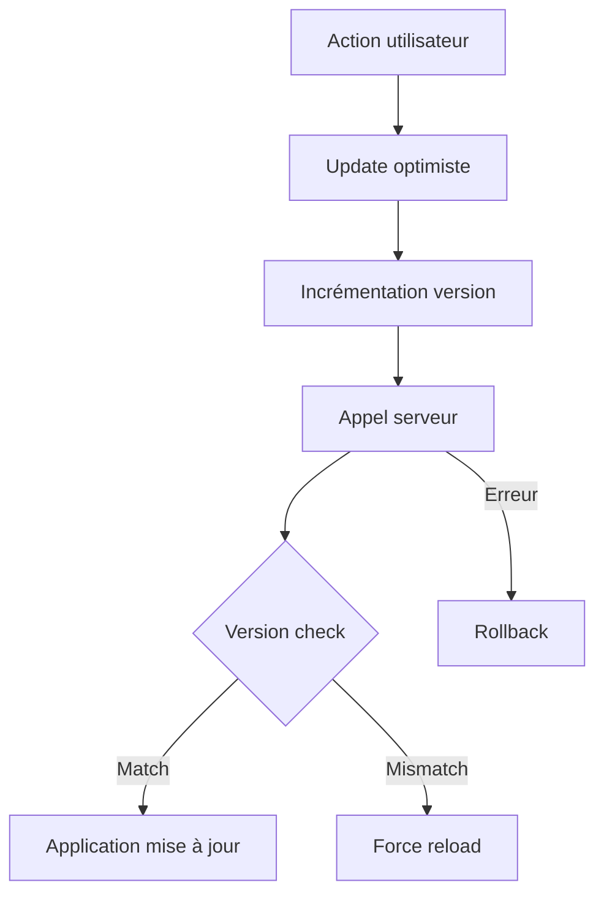

# Solution de synchronisation du panier avec système de versioning

## Vue d'ensemble

Cette documentation décrit la solution implémentée pour résoudre les problèmes de synchronisation du panier dans l'application e-commerce Herbis Veritas.

## Problèmes résolus

### 1. Compteur du panier ne se mettant pas à jour

**Symptôme** : Lors de l'ajout de produits, le toast de succès apparaissait mais le badge du panier ne s'incrémentait pas.

**Cause** : Les mises à jour d'état n'étaient pas correctement synchronisées entre les différents composants React.

### 2. Items réapparaissant après suppression

**Symptôme** : Après suppression d'un item du panier, celui-ci disparaissait brièvement puis réapparaissait.

**Cause** : Race condition - plusieurs composants ProductCard restauraient leur état obsolète après une suppression.

## Architecture de la solution

### Système de versioning

Le store Zustand a été enrichi avec un système de versioning :

```typescript
// État du store
{
  items: CartItem[],
  isLoading: boolean,
  error: string | null,
  updateVersion: number,        // Version incrémentée à chaque mise à jour
  lastUpdateTimestamp: number   // Timestamp de la dernière mise à jour
}
```

### Mécanisme de mise à jour

1. **Incrémentation de version** : Chaque mise à jour du panier incrémente `updateVersion`
2. **Tracking de source** : Le paramètre `updateSource` identifie l'origine de chaque mise à jour
3. **Vérification de cohérence** : Avant d'appliquer les résultats serveur, on vérifie que la version correspond
4. **Force reload** : En cas de mismatch de version, rechargement complet depuis le serveur

## Composants modifiés

### `src/stores/cartStore.ts`

- Ajout des champs `updateVersion` et `lastUpdateTimestamp`
- Méthode `_setItems` enrichie avec tracking de source et gestion de version
- Nouveaux getters : `getUpdateVersion()` et `getLastUpdateTimestamp()`

### `src/components/features/shop/cart-display.tsx`

- Gestion optimiste avec sauvegarde de version
- Vérification de cohérence avant application des mises à jour serveur
- Rollback intelligent en cas d'erreur

### `src/components/features/shop/product-card.tsx`

- Passage du paramètre `updateSource: 'product-card-add'`

### `src/hooks/use-auth-cart-sync.ts`

- Tracking des synchronisations auth avec source identifiée

### `src/types/cart.ts`

- Mise à jour des interfaces TypeScript

## Flux de données



## Logging amélioré

Les logs incluent maintenant :

- **Version** : `v1`, `v2`, etc.
- **Source** : `product-card-add`, `cart-display-remove`, etc.
- **Timestamp** : Pour tracer la chronologie
- **Détection de conflits** : Alertes en cas de version mismatch

Exemple de log :

```
[CartStore _setItems 2024-01-20T10:30:45.123Z] Successfully updated cart (v5, source: product-card-add) with 3 items (total quantity: 7).
```

## Avantages de cette approche

1. **Prévention des race conditions** : Les mises à jour obsolètes sont détectées et rejetées
2. **Traçabilité complète** : Chaque modification est tracée avec source et version
3. **Performances optimisées** : Pas de rechargements inutiles si les versions correspondent
4. **Debugging facilité** : Les logs détaillés permettent de suivre le flux exact
5. **Rollback intelligent** : Retour à l'état précédent en cas d'erreur
6. **Cohérence garantie** : Le serveur reste la source de vérité

## Tests recommandés

### Test de concurrence

1. Ouvrir l'application dans deux onglets
2. Modifier le panier dans les deux
3. Vérifier la cohérence finale

### Test de performance

1. Ajouter/supprimer rapidement plusieurs items
2. Vérifier l'absence de clignotements ou états incohérents

### Test de résilience

1. Simuler des erreurs réseau
2. Vérifier les rollbacks appropriés

## Configuration et maintenance

### Variables d'environnement

Aucune nouvelle variable requise.

### Monitoring

Surveiller les logs pour :

- Fréquence des version mismatch (indique des problèmes de concurrence)
- Sources de mise à jour les plus fréquentes
- Temps entre updates (performance)

### Évolutions futures possibles

1. **Debouncing** : Regrouper les mises à jour rapides
2. **Optimistic locking** : Version côté serveur pour validation
3. **WebSocket sync** : Synchronisation temps réel multi-onglets
4. **Persistence améliorée** : Sauvegarde de version dans localStorage

## Conclusion

Cette solution résout efficacement les problèmes de synchronisation tout en maintenant une excellente UX avec des mises à jour optimistes. Le système de versioning garantit la cohérence des données sans sacrifier les performances.
