# Documentation du Schéma de Base de Données Supabase - HerbisVeritas

## Vue d'ensemble

Cette documentation décrit le schéma complet de la base de données PostgreSQL utilisée par l'application HerbisVeritas via Supabase. Le système est conçu pour supporter un e-commerce de produits cosmétiques naturels avec système de magazine intégré.

## Architecture Générale

Le schéma est organisé autour des domaines métier suivants :

- **Gestion des utilisateurs** : Authentification, profils, rôles
- **Catalogue produits** : Produits, traductions, catégories
- **Commerce** : Paniers, commandes, paiements, livraison
- **Contenu éditorial** : Articles de magazine, tags, catégories
- **Géolocalisation** : Marchés, partenaires, points de retrait
- **Système** : Logs d'audit, événements, monitoring

## Diagramme ERD Principal

```mermaid
erDiagram
    %% Domaine Utilisateurs
    profiles {
        uuid id PK
        text first_name
        text last_name
        text email
        text phone_number
        app_role role
        text salutation
        boolean newsletter_subscribed
        text shipping_address_line1
        text shipping_address_line2
        text shipping_postal_code
        text shipping_city
        text shipping_country
        text billing_address_line1
        text billing_address_line2
        text billing_postal_code
        text billing_city
        text billing_country_code
        text billing_state_province_region
        text billing_phone_number
        boolean use_shipping_for_billing
        boolean billing_address_is_different
        timestamp terms_accepted_at
        timestamp created_at
        timestamp updated_at
    }

    addresses {
        uuid id PK
        uuid user_id FK
        text type
        text first_name
        text last_name
        text company
        text address_line1
        text address_line2
        text postal_code
        text city
        text state_province_region
        text country
        text country_code
        text phone_number
        boolean is_default
        timestamp created_at
        timestamp updated_at
    }

    %% Domaine Produits
    products {
        uuid id PK
        text name
        text description_short
        text description_long
        numeric price
        text currency
        text image_url
        integer stock
        text unit
        text category
        boolean is_active
        boolean is_new
        boolean is_on_promotion
        text[] labels
        text slug UK
        text[] inci_list
        text status
        timestamp created_at
        timestamp updated_at
    }

    product_translations {
        uuid id PK
        uuid product_id FK
        text locale
        text name
        text short_description
        text description_long
        text usage_instructions
        text properties
        text composition_text
        timestamp created_at
        timestamp updated_at
    }

    %% Domaine Commerce
    carts {
        uuid id PK
        text user_id
        uuid guest_id
        jsonb metadata
        text status
        timestamp created_at
        timestamp updated_at
    }

    cart_items {
        uuid id PK
        uuid cart_id FK
        uuid product_id FK
        integer quantity
        timestamp added_at
        timestamp created_at
        timestamp updated_at
    }

    cart_product_details {
        uuid id
        text name
        numeric price
        integer stock
        text slug
        text image_url
        boolean is_active
        text description_short
        text description_long
        jsonb product_translations
        timestamp created_at
        timestamp updated_at
    }

    orders {
        uuid id PK
        uuid user_id FK
        text order_number
        order_status_type status
        numeric total_amount
        char currency
        uuid shipping_address_id FK
        uuid billing_address_id FK
        numeric shipping_fee
        text notes
        text payment_method
        text payment_intent_id
        payment_status_type payment_status
        text stripe_checkout_session_id
        text stripe_checkout_id
        uuid pickup_point_id FK
        timestamp created_at
        timestamp updated_at
    }

    order_items {
        uuid id PK
        uuid order_id FK
        uuid product_id FK
        integer quantity
        numeric price_at_purchase
        text product_sku_at_purchase
        text product_name_at_purchase
        text product_image_url_at_purchase
        timestamp created_at
        timestamp updated_at
    }

    %% Domaine Magazine
    articles {
        uuid id PK
        text title
        text slug UK
        text excerpt
        text content
        text status
        uuid author_id FK
        uuid featured_image_id
        text meta_title
        text meta_description
        text[] keywords
        timestamp published_at
        integer reading_time
        integer view_count
        boolean is_featured
        timestamp created_at
        timestamp updated_at
    }

    categories {
        uuid id PK
        text name UK
        text slug UK
        text description
        text color
        integer sort_order
        timestamp created_at
        timestamp updated_at
    }

    tags {
        uuid id PK
        text name UK
        text slug UK
        timestamp created_at
        timestamp updated_at
    }

    article_tags {
        uuid article_id FK
        uuid tag_id FK
    }

    %% Domaine Géolocalisation
    markets {
        uuid id PK
        text name
        text slug UK
        text description
        text address_line1
        text address_line2
        text postal_code
        text city
        text country
        text country_code
        text phone_number
        text email
        text website_url
        jsonb opening_hours
        boolean is_active
        timestamp created_at
        timestamp updated_at
    }

    partners {
        uuid id PK
        text name
        text slug UK
        text description
        text logo_url
        text website_url
        text contact_email
        text contact_phone
        boolean is_active
        timestamp created_at
        timestamp updated_at
    }

    pickup_points {
        uuid id PK
        text name
        text address_line1
        text address_line2
        text postal_code
        text city
        text country_code
        text phone_number
        jsonb opening_hours
        uuid order_id FK
        timestamp created_at
        timestamp updated_at
    }

    shipping_methods {
        uuid id PK
        text name
        text description
        numeric price
        text currency
        boolean is_active
        timestamp created_at
        timestamp updated_at
    }

    %% Domaine Système
    audit_logs {
        uuid id PK
        uuid user_id FK
        text action
        text resource_type
        jsonb details
        timestamp created_at
    }

    events {
        uuid id PK
        text event_type
        jsonb payload
        timestamp created_at
    }

    %% Relations principales
    profiles ||--o{ addresses : "has"
    profiles ||--o{ orders : "places"
    profiles ||--o{ articles : "writes"
    profiles ||--o{ audit_logs : "generates"

    products ||--o{ product_translations : "has"
    products ||--o{ cart_items : "contains"
    products ||--o{ order_items : "ordered"

    carts ||--o{ cart_items : "contains"

    orders ||--o{ order_items : "contains"
    orders ||--o{ addresses : "ships_to"
    orders ||--o{ addresses : "bills_to"
    orders ||--o{ pickup_points : "delivered_to"

    articles ||--o{ article_tags : "tagged_with"
    tags ||--o{ article_tags : "tags"

    featured_hero_items {
        uuid id PK
        text title
        text subtitle
        text description
        text image_url
        text cta_text
        text cta_url
        integer sort_order
        boolean is_active
        timestamp created_at
        timestamp updated_at
    }

    legal_documents {
        uuid id PK
        text type
        text title
        text content
        text version
        timestamp effective_date
        timestamp created_at
        timestamp updated_at
    }

    login_attempts {
        uuid id PK
        text identifier
        text ip_address
        text user_agent
        boolean success
        text error_message
        timestamp created_at
    }

    cleanup_monitoring {
        uuid id PK
        text cleanup_type
        integer records_cleaned
        timestamp cleanup_date
        text status
        text error_message
        timestamp created_at
    }
```



## Schémas Détaillés par Domaine

### 1. Domaine Utilisateurs

#### Table `profiles`

Table principale des utilisateurs, liée à Supabase Auth.

```sql
-- Colonnes principales
id                              UUID PRIMARY KEY REFERENCES auth.users(id)
email                          TEXT
first_name                     TEXT
last_name                      TEXT
phone_number                   TEXT
role                           app_role NOT NULL DEFAULT 'user'
salutation                     TEXT
newsletter_subscribed          BOOLEAN DEFAULT false
terms_accepted_at              TIMESTAMPTZ

-- Adresse de livraison intégrée
shipping_address_line1         TEXT
shipping_address_line2         TEXT
shipping_postal_code           TEXT
shipping_city                  TEXT
shipping_country               TEXT

-- Adresse de facturation intégrée
billing_address_line1          TEXT
billing_address_line2          TEXT
billing_postal_code            TEXT
billing_city                   TEXT
billing_country_code           CHAR(2)
billing_state_province_region  TEXT
billing_phone_number           TEXT
billing_country                TEXT

-- Options d'adresse
use_shipping_for_billing       BOOLEAN DEFAULT true
billing_address_is_different   BOOLEAN DEFAULT false

-- Métadonnées
created_at                     TIMESTAMPTZ NOT NULL DEFAULT timezone('utc', now())
updated_at                     TIMESTAMPTZ
```

**Énumération `app_role`** :

- `user` : Utilisateur standard
- `editor` : Éditeur de contenu
- `admin` : Administrateur
- `dev` : Développeur

**Contraintes** :

- `profiles_id_fkey` : FK vers `auth.users(id)`
- `profiles_salutation_check` : Validation de la civilité

#### Table `addresses`

Système d'adresses multiples pour les utilisateurs.

```sql
id                          UUID PRIMARY KEY DEFAULT gen_random_uuid()
user_id                     UUID NOT NULL REFERENCES profiles(id)
type                        TEXT NOT NULL -- 'shipping' | 'billing'
first_name                  TEXT NOT NULL
last_name                   TEXT NOT NULL
company                     TEXT
address_line1               TEXT NOT NULL
address_line2               TEXT
postal_code                 TEXT NOT NULL
city                        TEXT NOT NULL
state_province_region       TEXT
country                     TEXT NOT NULL
country_code                CHAR(2) NOT NULL
phone_number                TEXT
is_default                  BOOLEAN DEFAULT false
created_at                  TIMESTAMPTZ NOT NULL DEFAULT timezone('utc', now())
updated_at                  TIMESTAMPTZ NOT NULL DEFAULT timezone('utc', now())
```

### 2. Domaine Produits

#### Table `products`

Catalogue principal des produits.

```sql
id                   UUID PRIMARY KEY DEFAULT gen_random_uuid()
name                 TEXT NOT NULL
description_short    TEXT
description_long     TEXT
price               NUMERIC NOT NULL
currency            TEXT NOT NULL DEFAULT 'EUR'
image_url           TEXT
stock               INTEGER NOT NULL DEFAULT 0
unit                TEXT
category            TEXT
is_active           BOOLEAN NOT NULL DEFAULT true
is_new              BOOLEAN NOT NULL DEFAULT false
is_on_promotion     BOOLEAN NOT NULL DEFAULT false
labels              TEXT[] -- Certifications bio, etc.
slug                TEXT NOT NULL UNIQUE
inci_list           TEXT[] -- Liste des ingrédients
status              TEXT DEFAULT 'active'
created_at          TIMESTAMPTZ NOT NULL DEFAULT now()
updated_at          TIMESTAMPTZ NOT NULL DEFAULT now()
```

#### Table `product_translations`

Traductions internationalisées des produits.

```sql
id                   UUID PRIMARY KEY DEFAULT gen_random_uuid()
product_id           UUID NOT NULL REFERENCES products(id) ON DELETE CASCADE
locale               TEXT NOT NULL -- 'fr', 'en', 'de', 'es'
name                 TEXT NOT NULL
short_description    TEXT
description_long     TEXT
usage_instructions   TEXT
properties           TEXT
composition_text     TEXT
created_at           TIMESTAMPTZ NOT NULL DEFAULT timezone('utc', now())
updated_at           TIMESTAMPTZ NOT NULL DEFAULT timezone('utc', now())
```

**Index unique** : `(product_id, locale)`

### 3. Domaine Commerce

#### Table `carts`

Gestion des paniers utilisateurs et invités.

```sql
id           UUID PRIMARY KEY DEFAULT gen_random_uuid()
user_id      TEXT -- Référence vers auth.users ou format 'guest_xxx'
guest_id     UUID -- UUID temporaire pour invités
metadata     JSONB -- Configuration panier, préférences
status       TEXT NOT NULL DEFAULT 'active' -- 'active' | 'abandoned' | 'converted'
created_at   TIMESTAMPTZ NOT NULL DEFAULT timezone('utc', now())
updated_at   TIMESTAMPTZ NOT NULL DEFAULT timezone('utc', now())
```

#### Table `cart_items`

Articles dans les paniers.

```sql
id           UUID PRIMARY KEY DEFAULT gen_random_uuid()
cart_id      UUID NOT NULL REFERENCES carts(id) ON DELETE CASCADE
product_id   UUID NOT NULL REFERENCES products(id) ON DELETE CASCADE
quantity     INTEGER NOT NULL CHECK (quantity > 0)
added_at     TIMESTAMPTZ NOT NULL DEFAULT timezone('utc', now())
created_at   TIMESTAMPTZ NOT NULL DEFAULT timezone('utc', now())
updated_at   TIMESTAMPTZ NOT NULL DEFAULT timezone('utc', now())
```

#### Table `cart_product_details`

Vue matérialisée des détails produit pour les paniers (optimisation performance).

```sql
id                    UUID
name                  TEXT
price                 NUMERIC
stock                 INTEGER
slug                  TEXT
image_url             TEXT
is_active             BOOLEAN
description_short     TEXT
description_long      TEXT
product_translations  JSONB -- Traductions pré-calculées
created_at            TIMESTAMPTZ
updated_at            TIMESTAMPTZ
```

#### Table `orders`

Commandes passées.

```sql
id                          UUID PRIMARY KEY DEFAULT gen_random_uuid()
user_id                     UUID NOT NULL REFERENCES profiles(id)
order_number                TEXT -- Numéro de commande généré
status                      order_status_type NOT NULL DEFAULT 'pending_payment'
total_amount                NUMERIC NOT NULL
currency                    CHAR(3) NOT NULL DEFAULT 'EUR'
shipping_address_id         UUID REFERENCES addresses(id)
billing_address_id          UUID REFERENCES addresses(id)
shipping_fee                NUMERIC DEFAULT 0.00
notes                       TEXT
payment_method              TEXT
payment_intent_id           TEXT -- Stripe Payment Intent
payment_status              payment_status_type NOT NULL DEFAULT 'pending'
stripe_checkout_session_id  TEXT
stripe_checkout_id          TEXT
pickup_point_id             UUID REFERENCES pickup_points(id)
created_at                  TIMESTAMPTZ NOT NULL DEFAULT timezone('utc', now())
updated_at                  TIMESTAMPTZ NOT NULL DEFAULT timezone('utc', now())
```

**Énumération `order_status_type`** :

- `pending_payment` : En attente de paiement
- `processing` : En cours de traitement
- `shipped` : Expédiée
- `delivered` : Livrée
- `cancelled` : Annulée
- `refunded` : Remboursée

**Énumération `payment_status_type`** :

- `pending` : En attente
- `succeeded` : Réussi
- `failed` : Échoué
- `refunded` : Remboursé

#### Table `order_items`

Articles dans les commandes (snapshot à l'achat).

```sql
id                           UUID PRIMARY KEY DEFAULT gen_random_uuid()
order_id                     UUID NOT NULL REFERENCES orders(id) ON DELETE CASCADE
product_id                   UUID NOT NULL REFERENCES products(id)
quantity                     INTEGER NOT NULL
price_at_purchase            NUMERIC NOT NULL -- Prix au moment de l'achat
product_sku_at_purchase      TEXT
product_name_at_purchase     TEXT
product_image_url_at_purchase TEXT
created_at                   TIMESTAMPTZ NOT NULL DEFAULT timezone('utc', now())
updated_at                   TIMESTAMPTZ NOT NULL DEFAULT timezone('utc', now())
```

### 4. Domaine Magazine

#### Table `articles`

Articles du magazine intégré.

```sql
id                  UUID PRIMARY KEY DEFAULT gen_random_uuid()
title               TEXT NOT NULL
slug                TEXT NOT NULL UNIQUE
excerpt             TEXT
content             TEXT
status              TEXT NOT NULL DEFAULT 'draft' -- 'draft' | 'published' | 'archived'
author_id           UUID NOT NULL REFERENCES profiles(id)
featured_image_id   UUID
meta_title          TEXT
meta_description    TEXT
keywords            TEXT[]
published_at        TIMESTAMPTZ
reading_time        INTEGER -- Temps de lecture estimé en minutes
view_count          INTEGER DEFAULT 0
is_featured         BOOLEAN DEFAULT false
created_at          TIMESTAMPTZ NOT NULL DEFAULT timezone('utc', now())
updated_at          TIMESTAMPTZ NOT NULL DEFAULT timezone('utc', now())
```

#### Table `categories`

Catégories d'articles.

```sql
id           UUID PRIMARY KEY DEFAULT gen_random_uuid()
name         TEXT NOT NULL UNIQUE
slug         TEXT NOT NULL UNIQUE
description  TEXT
color        TEXT -- Code couleur HEX pour l'interface
sort_order   INTEGER DEFAULT 0
created_at   TIMESTAMPTZ NOT NULL DEFAULT timezone('utc', now())
updated_at   TIMESTAMPTZ NOT NULL DEFAULT timezone('utc', now())
```

#### Table `tags`

Tags pour les articles.

```sql
id          UUID PRIMARY KEY DEFAULT gen_random_uuid()
name        TEXT NOT NULL UNIQUE
slug        TEXT NOT NULL UNIQUE
created_at  TIMESTAMPTZ NOT NULL DEFAULT timezone('utc', now())
updated_at  TIMESTAMPTZ NOT NULL DEFAULT timezone('utc', now())
```

#### Table `article_tags`

Relation many-to-many articles ↔ tags.

```sql
article_id  UUID NOT NULL REFERENCES articles(id) ON DELETE CASCADE
tag_id      UUID NOT NULL REFERENCES tags(id) ON DELETE CASCADE
PRIMARY KEY (article_id, tag_id)
```

### 5. Domaine Géolocalisation

#### Table `markets`

Marchés et événements où les produits sont vendus.

```sql
id             UUID PRIMARY KEY DEFAULT gen_random_uuid()
name           TEXT NOT NULL
slug           TEXT NOT NULL UNIQUE
description    TEXT
address_line1  TEXT NOT NULL
address_line2  TEXT
postal_code    TEXT NOT NULL
city           TEXT NOT NULL
country        TEXT NOT NULL
country_code   CHAR(2) NOT NULL
phone_number   TEXT
email          TEXT
website_url    TEXT
opening_hours  JSONB -- Structure JSON des heures d'ouverture
is_active      BOOLEAN DEFAULT true
created_at     TIMESTAMPTZ NOT NULL DEFAULT timezone('utc', now())
updated_at     TIMESTAMPTZ NOT NULL DEFAULT timezone('utc', now())
```

#### Table `partners`

Partenaires commerciaux.

```sql
id             UUID PRIMARY KEY DEFAULT gen_random_uuid()
name           TEXT NOT NULL
slug           TEXT NOT NULL UNIQUE
description    TEXT
logo_url       TEXT
website_url    TEXT
contact_email  TEXT
contact_phone  TEXT
is_active      BOOLEAN DEFAULT true
created_at     TIMESTAMPTZ NOT NULL DEFAULT timezone('utc', now())
updated_at     TIMESTAMPTZ NOT NULL DEFAULT timezone('utc', now())
```

#### Table `pickup_points`

Points de retrait pour les commandes.

```sql
id             UUID PRIMARY KEY DEFAULT gen_random_uuid()
name           TEXT NOT NULL
address_line1  TEXT NOT NULL
address_line2  TEXT
postal_code    TEXT NOT NULL
city           TEXT NOT NULL
country_code   CHAR(2) NOT NULL
phone_number   TEXT
opening_hours  JSONB
order_id       UUID REFERENCES orders(id) -- Référence optionnelle à une commande
created_at     TIMESTAMPTZ NOT NULL DEFAULT timezone('utc', now())
updated_at     TIMESTAMPTZ NOT NULL DEFAULT timezone('utc', now())
```

#### Table `shipping_methods`

Méthodes de livraison disponibles.

```sql
id           UUID PRIMARY KEY DEFAULT gen_random_uuid()
name         TEXT NOT NULL
description  TEXT
price        NUMERIC NOT NULL
currency     TEXT NOT NULL DEFAULT 'EUR'
is_active    BOOLEAN DEFAULT true
created_at   TIMESTAMPTZ NOT NULL DEFAULT timezone('utc', now())
updated_at   TIMESTAMPTZ NOT NULL DEFAULT timezone('utc', now())
```

### 6. Domaine Système

#### Table `audit_logs`

Journalisation des actions sensibles.

```sql
id            UUID PRIMARY KEY DEFAULT gen_random_uuid()
user_id       UUID REFERENCES profiles(id)
action        TEXT NOT NULL -- 'CREATE' | 'UPDATE' | 'DELETE' | 'LOGIN' | etc.
resource_type TEXT NOT NULL -- 'product' | 'order' | 'user' | etc.
details       JSONB -- Détails de l'action en JSON
created_at    TIMESTAMPTZ NOT NULL DEFAULT timezone('utc', now())
```

#### Table `events`

Système d'événements pour l'architecture événementielle.

```sql
id          UUID PRIMARY KEY DEFAULT gen_random_uuid()
event_type  TEXT NOT NULL -- 'cart.item_added' | 'order.created' | etc.
payload     JSONB NOT NULL -- Données de l'événement
created_at  TIMESTAMPTZ NOT NULL DEFAULT timezone('utc', now())
```

#### Table `cleanup_monitoring`

Monitoring des tâches de nettoyage automatique.

```sql
id              UUID PRIMARY KEY DEFAULT gen_random_uuid()
cleanup_type    TEXT NOT NULL -- 'abandoned_carts' | 'expired_sessions' | etc.
records_cleaned INTEGER NOT NULL
cleanup_date    TIMESTAMPTZ NOT NULL
status          TEXT NOT NULL -- 'success' | 'error'
error_message   TEXT
created_at      TIMESTAMPTZ NOT NULL DEFAULT timezone('utc', now())
```

### 7. Tables Utilitaires

#### Table `featured_hero_items`

Éléments mis en avant sur la page d'accueil.

```sql
id           UUID PRIMARY KEY DEFAULT gen_random_uuid()
title        TEXT NOT NULL
subtitle     TEXT
description  TEXT
image_url    TEXT
cta_text     TEXT -- Call-to-action text
cta_url      TEXT -- Call-to-action URL
sort_order   INTEGER DEFAULT 0
is_active    BOOLEAN DEFAULT true
created_at   TIMESTAMPTZ NOT NULL DEFAULT timezone('utc', now())
updated_at   TIMESTAMPTZ NOT NULL DEFAULT timezone('utc', now())
```

#### Table `legal_documents`

Documents légaux (CGV, politique de confidentialité, etc.).

```sql
id             UUID PRIMARY KEY DEFAULT gen_random_uuid()
type           TEXT NOT NULL -- 'terms' | 'privacy' | 'cookies' | etc.
title          TEXT NOT NULL
content        TEXT NOT NULL
version        TEXT NOT NULL
effective_date TIMESTAMPTZ NOT NULL
created_at     TIMESTAMPTZ NOT NULL DEFAULT timezone('utc', now())
updated_at     TIMESTAMPTZ NOT NULL DEFAULT timezone('utc', now())
```

#### Table `login_attempts`

Tentatives de connexion pour la sécurité.

```sql
id            UUID PRIMARY KEY DEFAULT gen_random_uuid()
identifier    TEXT NOT NULL -- Email ou nom d'utilisateur
ip_address    TEXT NOT NULL
user_agent    TEXT
success       BOOLEAN NOT NULL
error_message TEXT
created_at    TIMESTAMPTZ NOT NULL DEFAULT timezone('utc', now())
```

## Politiques RLS (Row Level Security)

### Principe Général

Toutes les tables utilisent RLS avec des politiques basées sur :

- **Authentification** : `auth.uid()` pour identifier l'utilisateur
- **Rôles** : Fonction `is_current_user_admin()`, `is_current_user_dev()`
- **Propriété** : Accès aux données propres à l'utilisateur

### Fonctions Utilitaires RLS

```sql
-- Vérifier si l'utilisateur est administrateur
CREATE OR REPLACE FUNCTION is_current_user_admin()
RETURNS BOOLEAN AS $$
BEGIN
  RETURN EXISTS (
    SELECT 1 FROM profiles
    WHERE id = auth.uid() AND role = 'admin'::app_role
  );
END;
$$ LANGUAGE plpgsql SECURITY DEFINER;

-- Vérifier si l'utilisateur est développeur
CREATE OR REPLACE FUNCTION is_current_user_dev()
RETURNS BOOLEAN AS $$
BEGIN
  RETURN EXISTS (
    SELECT 1 FROM profiles
    WHERE id = auth.uid() AND role = 'dev'::app_role
  );
END;
$$ LANGUAGE plpgsql SECURITY DEFINER;

-- Récupérer l'ID utilisateur actuel
CREATE OR REPLACE FUNCTION current_user_id()
RETURNS UUID AS $$
BEGIN
  RETURN auth.uid();
END;
$$ LANGUAGE plpgsql SECURITY DEFINER;
```

### Politiques par Domaine

#### Utilisateurs (`profiles`)

```sql
-- Lecture : Utilisateurs voient leur profil, admins voient tout
CREATE POLICY "Users can view own profile" ON profiles
FOR SELECT TO authenticated
USING (id = auth.uid());

CREATE POLICY "Admins can view all profiles" ON profiles
FOR SELECT TO authenticated
USING (is_current_user_admin());

-- Écriture : Utilisateurs modifient leur profil, admins modifient tout
CREATE POLICY "Users can update own profile" ON profiles
FOR UPDATE TO authenticated
USING (id = auth.uid())
WITH CHECK (id = auth.uid());

CREATE POLICY "Admins can update any profile" ON profiles
FOR UPDATE TO authenticated
USING (is_current_user_admin())
WITH CHECK (is_current_user_admin());
```

#### Produits (`products`)

```sql
-- Lecture publique pour produits actifs
CREATE POLICY "Public can read active products" ON products
FOR SELECT TO public
USING (is_active = true);

-- CRUD complet pour admins
CREATE POLICY "Admins have full access" ON products
FOR ALL TO authenticated
USING (is_current_user_admin())
WITH CHECK (is_current_user_admin());
```

#### Paniers (`carts`, `cart_items`)

```sql
-- Accès aux paniers propres (authentifiés + invités)
CREATE POLICY "Users can manage own carts" ON carts
FOR ALL TO public
USING (
  user_id = auth.uid()::text OR
  user_id LIKE 'guest_%'
);

-- Articles du panier : basé sur la propriété du panier
CREATE POLICY "Users can manage items in own carts" ON cart_items
FOR ALL TO public
USING (
  cart_id IN (
    SELECT id FROM carts
    WHERE user_id = auth.uid()::text OR user_id LIKE 'guest_%'
  )
);
```

#### Commandes (`orders`, `order_items`)

```sql
-- Commandes : utilisateurs voient leurs commandes
CREATE POLICY "Users can view own orders" ON orders
FOR SELECT TO authenticated
USING (user_id = auth.uid());

-- Service role pour traitement paiements
CREATE POLICY "Service role full access" ON orders
FOR ALL TO service_role
USING (true)
WITH CHECK (true);
```

#### Magazine (`articles`, `categories`, `tags`)

```sql
-- Articles publiés visibles par tous
CREATE POLICY "Published articles viewable by everyone" ON articles
FOR SELECT TO public
USING (
  status = 'published' OR
  author_id = auth.uid() OR
  is_current_user_admin()
);

-- Création par éditeurs/admins uniquement
CREATE POLICY "Editors can create articles" ON articles
FOR INSERT TO public
WITH CHECK (
  EXISTS (
    SELECT 1 FROM profiles
    WHERE id = auth.uid() AND role IN ('editor', 'admin')
  ) AND author_id = auth.uid()
);
```

## Index et Optimisation des Performances

### Index Principaux

```sql
-- Recherche et filtrage produits
CREATE INDEX idx_products_active ON products(is_active);
CREATE INDEX idx_products_category ON products(category);
CREATE INDEX idx_products_price ON products(price);
CREATE INDEX idx_products_slug ON products(slug);
CREATE INDEX idx_products_labels_gin ON products USING gin(labels);

-- Optimisation paniers
CREATE INDEX idx_cart_items_cart_id ON cart_items(cart_id);
CREATE INDEX idx_cart_items_product_id ON cart_items(product_id);
CREATE INDEX idx_carts_user_id ON carts(user_id);
CREATE INDEX idx_carts_status ON carts(status);

-- Optimisation commandes
CREATE INDEX idx_orders_user_id ON orders(user_id);
CREATE INDEX idx_orders_status ON orders(status);
CREATE INDEX idx_orders_created_at ON orders(created_at DESC);
CREATE INDEX idx_order_items_order_id ON order_items(order_id);

-- Recherche magazine
CREATE INDEX idx_articles_status ON articles(status);
CREATE INDEX idx_articles_author_id ON articles(author_id);
CREATE INDEX idx_articles_published_at ON articles(published_at DESC);
CREATE INDEX idx_articles_slug ON articles(slug);
CREATE INDEX idx_article_tags_article_id ON article_tags(article_id);
CREATE INDEX idx_article_tags_tag_id ON article_tags(tag_id);

-- Audit et monitoring
CREATE INDEX idx_audit_logs_user_id ON audit_logs(user_id);
CREATE INDEX idx_audit_logs_resource_type ON audit_logs(resource_type);
CREATE INDEX idx_audit_logs_created_at ON audit_logs(created_at DESC);
```

### Index Composites

```sql
-- Recherche produits multi-critères
CREATE INDEX idx_products_active_category ON products(is_active, category);
CREATE INDEX idx_products_active_price ON products(is_active, price);

-- Traductions produits
CREATE INDEX idx_product_translations_product_locale ON product_translations(product_id, locale);

-- Articles par statut et date
CREATE INDEX idx_articles_status_published ON articles(status, published_at DESC)
WHERE status = 'published';
```

## Triggers et Fonctions

### Timestamps Automatiques

```sql
-- Fonction de mise à jour timestamp
CREATE OR REPLACE FUNCTION update_updated_at_column()
RETURNS TRIGGER AS $$
BEGIN
  NEW.updated_at = timezone('utc', now());
  RETURN NEW;
END;
$$ LANGUAGE plpgsql;

-- Application sur toutes les tables avec updated_at
CREATE TRIGGER update_products_updated_at
  BEFORE UPDATE ON products
  FOR EACH ROW EXECUTE FUNCTION update_updated_at_column();

CREATE TRIGGER update_profiles_updated_at
  BEFORE UPDATE ON profiles
  FOR EACH ROW EXECUTE FUNCTION update_updated_at_column();

-- (Répéter pour chaque table avec updated_at)
```

### Audit Automatique

```sql
-- Fonction d'audit pour actions sensibles
CREATE OR REPLACE FUNCTION log_sensitive_action()
RETURNS TRIGGER AS $$
BEGIN
  INSERT INTO audit_logs (user_id, action, resource_type, details)
  VALUES (
    auth.uid(),
    TG_OP,
    TG_TABLE_NAME,
    CASE
      WHEN TG_OP = 'DELETE' THEN row_to_json(OLD)
      ELSE row_to_json(NEW)
    END
  );

  RETURN COALESCE(NEW, OLD);
END;
$$ LANGUAGE plpgsql SECURITY DEFINER;

-- Application sur tables sensibles
CREATE TRIGGER audit_profiles_changes
  AFTER INSERT OR UPDATE OR DELETE ON profiles
  FOR EACH ROW EXECUTE FUNCTION log_sensitive_action();

CREATE TRIGGER audit_orders_changes
  AFTER INSERT OR UPDATE OR DELETE ON orders
  FOR EACH ROW EXECUTE FUNCTION log_sensitive_action();
```

### Génération Numéros de Commande

```sql
-- Fonction de génération de numéro de commande
CREATE OR REPLACE FUNCTION generate_order_number()
RETURNS TRIGGER AS $$
BEGIN
  IF NEW.order_number IS NULL THEN
    NEW.order_number := 'HV-' ||
      to_char(NEW.created_at, 'YYYY') || '-' ||
      LPAD(nextval('order_number_seq')::text, 6, '0');
  END IF;
  RETURN NEW;
END;
$$ LANGUAGE plpgsql;

-- Séquence pour numéros
CREATE SEQUENCE IF NOT EXISTS order_number_seq START 1;

-- Trigger
CREATE TRIGGER set_order_number
  BEFORE INSERT ON orders
  FOR EACH ROW EXECUTE FUNCTION generate_order_number();
```

## Stratégies de Sauvegarde et Récupération

### Sauvegarde Automatisée

```sql
-- Script de sauvegarde complète (à exécuter via cron)
#!/bin/bash
BACKUP_DIR="/var/backups/herbisveritas"
DATE=$(date +"%Y%m%d_%H%M%S")
DB_NAME="herbisveritas_prod"

# Sauvegarde complète
pg_dump -h localhost -U postgres -d $DB_NAME \
  --format=custom \
  --compress=9 \
  --verbose \
  --file="$BACKUP_DIR/full_backup_$DATE.dump"

# Sauvegarde des données critiques uniquement
pg_dump -h localhost -U postgres -d $DB_NAME \
  --format=custom \
  --data-only \
  --table=profiles \
  --table=orders \
  --table=order_items \
  --table=audit_logs \
  --file="$BACKUP_DIR/critical_data_$DATE.dump"

# Rotation des sauvegardes (garder 30 jours)
find $BACKUP_DIR -name "*.dump" -mtime +30 -delete
```

### Point-in-Time Recovery

```sql
-- Configuration PostgreSQL pour PITR
-- Dans postgresql.conf :
wal_level = replica
archive_mode = on
archive_command = 'test ! -f /var/lib/postgresql/archive/%f && cp %p /var/lib/postgresql/archive/%f'
max_wal_senders = 3
checkpoint_segments = 32
```

### Scripts de Récupération

```sql
-- Récupération complète
#!/bin/bash
BACKUP_FILE="/var/backups/herbisveritas/full_backup_20241201_140000.dump"

# Restauration
pg_restore -h localhost -U postgres \
  --dbname=herbisveritas_restored \
  --clean \
  --create \
  --verbose \
  $BACKUP_FILE

-- Récupération sélective (ex: produits uniquement)
pg_restore -h localhost -U postgres \
  --dbname=herbisveritas_prod \
  --table=products \
  --table=product_translations \
  --clean \
  --verbose \
  $BACKUP_FILE
```

## Monitoring et Alertes

### Requêtes de Monitoring

```sql
-- Surveillance des performances
SELECT
  schemaname,
  tablename,
  n_tup_ins as inserts,
  n_tup_upd as updates,
  n_tup_del as deletes,
  n_live_tup as live_tuples,
  n_dead_tup as dead_tuples
FROM pg_stat_user_tables
ORDER BY n_live_tup DESC;

-- Connexions actives
SELECT
  datname,
  usename,
  state,
  COUNT(*) as connection_count
FROM pg_stat_activity
WHERE state IS NOT NULL
GROUP BY datname, usename, state
ORDER BY connection_count DESC;

-- Taille des tables
SELECT
  schemaname,
  tablename,
  pg_size_pretty(pg_total_relation_size(schemaname||'.'||tablename)) as size
FROM pg_tables
WHERE schemaname = 'public'
ORDER BY pg_total_relation_size(schemaname||'.'||tablename) DESC;

-- Requêtes lentes
SELECT
  query,
  mean_time,
  calls,
  total_time,
  (total_time/calls) as avg_time_per_call
FROM pg_stat_statements
WHERE mean_time > 1000  -- Plus de 1 seconde
ORDER BY mean_time DESC
LIMIT 10;
```

### Alertes Critiques

```sql
-- Surveillance stock produits
CREATE OR REPLACE FUNCTION check_low_stock()
RETURNS TABLE(product_name TEXT, current_stock INTEGER) AS $$
BEGIN
  RETURN QUERY
  SELECT name, stock
  FROM products
  WHERE is_active = true AND stock <= 5;
END;
$$ LANGUAGE plpgsql;

-- Surveillance commandes en anomalie
CREATE OR REPLACE FUNCTION check_stuck_orders()
RETURNS TABLE(order_id UUID, days_stuck INTEGER) AS $$
BEGIN
  RETURN QUERY
  SELECT id, EXTRACT(days FROM now() - created_at)::INTEGER
  FROM orders
  WHERE status = 'processing'
    AND created_at < now() - interval '7 days';
END;
$$ LANGUAGE plpgsql;
```

### Configuration Connection Pooling

```ini
# pgbouncer.ini
[databases]
herbisveritas_prod = host=localhost port=5432 dbname=herbisveritas_prod

[pgbouncer]
pool_mode = transaction
max_client_conn = 200
default_pool_size = 25
reserve_pool_size = 5
reserve_pool_timeout = 5

# Logs
log_connections = 1
log_disconnections = 1
log_pooler_errors = 1

# Auth
auth_type = md5
auth_file = /etc/pgbouncer/userlist.txt
```

## Procédures de Maintenance

### Nettoyage Automatique

```sql
-- Nettoyage paniers abandonnés (> 30 jours)
CREATE OR REPLACE FUNCTION cleanup_abandoned_carts()
RETURNS INTEGER AS $$
DECLARE
  cleaned_count INTEGER;
BEGIN
  -- Supprimer les items des paniers abandonnés
  DELETE FROM cart_items
  WHERE cart_id IN (
    SELECT id FROM carts
    WHERE status = 'abandoned'
      AND updated_at < now() - interval '30 days'
  );

  -- Supprimer les paniers abandonnés
  DELETE FROM carts
  WHERE status = 'abandoned'
    AND updated_at < now() - interval '30 days';

  GET DIAGNOSTICS cleaned_count = ROW_COUNT;

  -- Logger l'action
  INSERT INTO cleanup_monitoring (cleanup_type, records_cleaned, cleanup_date, status)
  VALUES ('abandoned_carts', cleaned_count, now(), 'success');

  RETURN cleaned_count;
END;
$$ LANGUAGE plpgsql;

-- Archivage logs anciens (> 1 an)
CREATE OR REPLACE FUNCTION archive_old_audit_logs()
RETURNS INTEGER AS $$
DECLARE
  archived_count INTEGER;
BEGIN
  -- Archiver dans table séparée
  INSERT INTO audit_logs_archive
  SELECT * FROM audit_logs
  WHERE created_at < now() - interval '1 year';

  GET DIAGNOSTICS archived_count = ROW_COUNT;

  -- Supprimer les originaux
  DELETE FROM audit_logs
  WHERE created_at < now() - interval '1 year';

  INSERT INTO cleanup_monitoring (cleanup_type, records_cleaned, cleanup_date, status)
  VALUES ('audit_logs_archive', archived_count, now(), 'success');

  RETURN archived_count;
END;
$$ LANGUAGE plpgsql;
```

### VACUUM et Analyse

```sql
-- Script de maintenance hebdomadaire
DO $$
BEGIN
  -- VACUUM complet des tables principales
  PERFORM pg_background_launch('VACUUM ANALYZE products;');
  PERFORM pg_background_launch('VACUUM ANALYZE orders;');
  PERFORM pg_background_launch('VACUUM ANALYZE profiles;');
  PERFORM pg_background_launch('VACUUM ANALYZE carts;');
  PERFORM pg_background_launch('VACUUM ANALYZE cart_items;');

  -- Réindexation des index critiques
  PERFORM pg_background_launch('REINDEX INDEX CONCURRENTLY idx_products_slug;');
  PERFORM pg_background_launch('REINDEX INDEX CONCURRENTLY idx_orders_user_id;');
END;
$$;
```

## Sécurité et Conformité

### Chiffrement au Repos

```sql
-- Champs sensibles chiffrés
CREATE EXTENSION IF NOT EXISTS pgcrypto;

-- Fonction de chiffrement pour données sensibles
CREATE OR REPLACE FUNCTION encrypt_sensitive_data(data TEXT, key TEXT)
RETURNS TEXT AS $$
BEGIN
  RETURN encode(
    encrypt(data::bytea, key::bytea, 'aes'),
    'hex'
  );
END;
$$ LANGUAGE plpgsql SECURITY DEFINER;
```

### Audit RGPD

```sql
-- Fonction d'export données utilisateur (RGPD)
CREATE OR REPLACE FUNCTION export_user_data(user_uuid UUID)
RETURNS JSON AS $$
DECLARE
  user_data JSON;
BEGIN
  SELECT json_build_object(
    'profile', (SELECT row_to_json(p) FROM profiles p WHERE id = user_uuid),
    'addresses', (SELECT json_agg(a) FROM addresses a WHERE user_id = user_uuid),
    'orders', (SELECT json_agg(o) FROM orders o WHERE user_id = user_uuid),
    'audit_logs', (SELECT json_agg(al) FROM audit_logs al WHERE user_id = user_uuid)
  ) INTO user_data;

  RETURN user_data;
END;
$$ LANGUAGE plpgsql SECURITY DEFINER;

-- Fonction de suppression données utilisateur (droit à l'oubli)
CREATE OR REPLACE FUNCTION anonymize_user_data(user_uuid UUID)
RETURNS BOOLEAN AS $$
BEGIN
  -- Anonymiser le profil
  UPDATE profiles SET
    first_name = 'ANONYMIZED',
    last_name = 'USER',
    email = 'deleted-user-' || user_uuid || '@example.com',
    phone_number = NULL
  WHERE id = user_uuid;

  -- Supprimer adresses
  DELETE FROM addresses WHERE user_id = user_uuid;

  -- Garder commandes pour comptabilité mais anonymiser
  UPDATE orders SET
    shipping_address_id = NULL,
    billing_address_id = NULL,
    notes = 'ANONYMIZED'
  WHERE user_id = user_uuid;

  RETURN TRUE;
END;
$$ LANGUAGE plpgsql SECURITY DEFINER;
```

## Exemples d'Utilisation

### Requêtes Métier Courantes

```sql
-- Recherche produits avec filtres
SELECT
  p.*,
  pt.name as localized_name,
  pt.short_description as localized_description
FROM products p
LEFT JOIN product_translations pt ON p.id = pt.product_id AND pt.locale = 'fr'
WHERE p.is_active = true
  AND p.category = 'soins-visage'
  AND p.price BETWEEN 10 AND 50
  AND p.stock > 0
ORDER BY p.is_on_promotion DESC, p.price ASC;

-- Panier utilisateur avec détails produits
SELECT
  ci.id,
  ci.quantity,
  p.name,
  p.price,
  p.image_url,
  (ci.quantity * p.price) as line_total
FROM cart_items ci
JOIN carts c ON ci.cart_id = c.id
JOIN products p ON ci.product_id = p.id
WHERE c.user_id = $1
  AND c.status = 'active';

-- Commandes utilisateur avec détails
SELECT
  o.id,
  o.order_number,
  o.status,
  o.total_amount,
  o.created_at,
  json_agg(
    json_build_object(
      'product_name', oi.product_name_at_purchase,
      'quantity', oi.quantity,
      'price', oi.price_at_purchase
    )
  ) as items
FROM orders o
JOIN order_items oi ON o.id = oi.order_id
WHERE o.user_id = $1
GROUP BY o.id
ORDER BY o.created_at DESC;

-- Articles magazine avec tags
SELECT
  a.*,
  p.first_name || ' ' || p.last_name as author_name,
  json_agg(t.name) as tags
FROM articles a
JOIN profiles p ON a.author_id = p.id
LEFT JOIN article_tags at ON a.id = at.article_id
LEFT JOIN tags t ON at.tag_id = t.id
WHERE a.status = 'published'
GROUP BY a.id, p.first_name, p.last_name
ORDER BY a.published_at DESC;
```

### Statistiques et Rapports

```sql
-- Chiffre d'affaires mensuel
SELECT
  DATE_TRUNC('month', created_at) as month,
  COUNT(*) as order_count,
  SUM(total_amount) as revenue,
  AVG(total_amount) as avg_order_value
FROM orders
WHERE payment_status = 'succeeded'
  AND created_at >= '2024-01-01'
GROUP BY DATE_TRUNC('month', created_at)
ORDER BY month DESC;

-- Produits les plus vendus
SELECT
  p.name,
  SUM(oi.quantity) as total_sold,
  SUM(oi.quantity * oi.price_at_purchase) as total_revenue
FROM order_items oi
JOIN products p ON oi.product_id = p.id
JOIN orders o ON oi.order_id = o.id
WHERE o.payment_status = 'succeeded'
  AND o.created_at >= '2024-01-01'
GROUP BY p.id, p.name
ORDER BY total_sold DESC
LIMIT 10;

-- Taux de conversion panier
WITH cart_stats AS (
  SELECT
    COUNT(DISTINCT c.id) as total_carts,
    COUNT(DISTINCT o.id) as converted_orders
  FROM carts c
  LEFT JOIN orders o ON c.user_id = o.user_id::text
  WHERE c.created_at >= '2024-01-01'
)
SELECT
  total_carts,
  converted_orders,
  ROUND(
    (converted_orders::DECIMAL / total_carts) * 100, 2
  ) as conversion_rate_percent
FROM cart_stats;
```

Cette documentation fournit une vue complète du schéma de base de données HerbisVeritas, incluant les aspects opérationnels critiques pour maintenir la performance, la sécurité et la fiabilité du système en production.

<function_calls>
<invoke name="TodoWrite">
<parameter name="todos">[{"id": "10", "content": "Créer la documentation avec schémas, relations, RLS et diagrammes ERD", "status": "completed"}]
