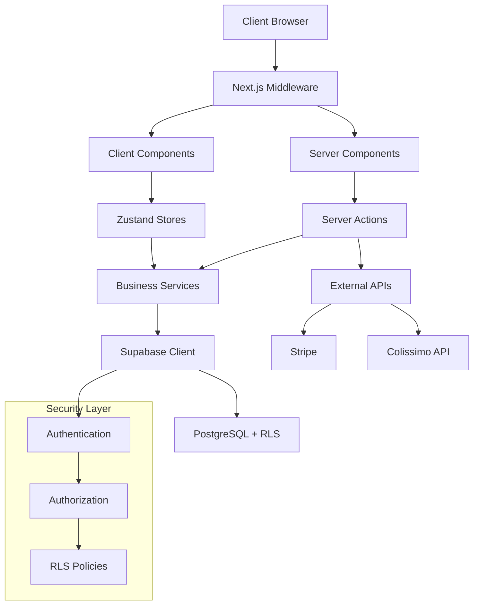

# HerbisVeritas - Plateforme E-commerce Next.js

[](https://nextjs.org/)
[](https://www.typescriptlang.org/)
[](https://supabase.com/)
[](https://stripe.com/)
[](https://reactjs.org/)

Plateforme e-commerce moderne spécialisée dans les cosmétiques naturels et produits à base de plantes, construite avec les dernières technologies web et axée sur la performance, la sécurité et l'expérience utilisateur.

## Table des Matières

- [Démarrage Rapide](#démarrage-rapide)
- [Architecture](#architecture)
- [Documentation](#documentation)
- [Stack Technologique](#stack-technologique)
- [Fonctionnalités](#fonctionnalités)
- [Structure du Projet](#structure-du-projet)
- [Scripts Disponibles](#scripts-disponibles)
- [Configuration](#configuration)
- [Déploiement](#déploiement)
- [Contribution](#contribution)

## Démarrage Rapide

### Prérequis

- Node.js 20+ et npm
- Compte Supabase
- Compte Stripe (pour les paiements)

### Installation

```bash
# Cloner le repository
git clone https://github.com/inherbver/herbisveritas.git
cd herbisveritas

# Installer les dépendances
npm install

# Configuration environnement
cp .env.example .env.local
# Éditer .env.local avec vos credentials

# Démarrer le serveur de développement
npm run dev
```

Ouvrir [http://localhost:3000](http://localhost:3000) dans votre navigateur.

## Architecture

HerbisVeritas utilise une architecture moderne **server-first** avec Next.js 15 App Router :



### Principes Architecturaux

- **Server Components par défaut** : Optimisation SEO et performance
- **State Management Hybride** : Server state + Zustand pour état client
- **Security by Design** : RLS, middleware de protection, audit logging
- **Type Safety Complète** : TypeScript strict, validation Zod runtime
- **Progressive Enhancement** : Fonctionne sans JavaScript

## Documentation

### Documentation Technique

- 📋 [Guide d'Architecture](./docs/ARCHITECTURE.md) - Conception système détaillée
- 🚀 [Guide de Développement](./docs/DEVELOPMENT.md) - Workflow et conventions
- 🔌 [Référence API](./docs/API.md) - Server Actions et endpoints
- 🗃️ [Schéma Base de Données](./docs/DATABASE.md) - Structure et relations
- 🔒 [Guide Sécurité](./docs/SECURITY.md) - Authentification et autorisations
- 🌐 [Internationalisation](./docs/I18N.md) - Configuration multilingue
- 🎨 [Guide UI/UX](./docs/COMPONENTS.md) - Système de design et composants

### Guides Opérationnels

- ⚙️ [Configuration](./docs/CONFIGURATION.md) - Variables d'environnement
- 📦 [Déploiement](./docs/DEPLOYMENT.md) - Production et CI/CD
- 🧪 [Tests](./docs/TESTING.md) - Stratégie de test
- 📊 [Monitoring](./docs/MONITORING.md) - Observabilité et métriques

## Stack Technologique

### Frontend

- **Next.js 15** - Framework React avec App Router
- **React 19** - Bibliothèque UI avec Server Components
- **TypeScript 5** - Typage statique et sécurité
- **Tailwind CSS** - Framework CSS utilitaire
- **shadcn/ui** - Composants UI accessibles
- **Framer Motion** - Animations fluides
- **next-intl** - Internationalisation (FR, EN, DE, ES)

### Backend & Services

- **Supabase** - Base de données PostgreSQL et authentification
- **Stripe** - Traitement des paiements
- **Colissimo API** - Gestion des livraisons en France
- **Vercel** - Hébergement et déploiement

### Outils de Développement

- **Zustand** - Gestion d'état client
- **React Hook Form** - Gestion de formulaires
- **Zod** - Validation et typage runtime
- **Jest & Testing Library** - Tests unitaires
- **Playwright** - Tests end-to-end
- **ESLint & Prettier** - Qualité de code
- **Husky** - Git hooks

## Fonctionnalités

### 🛍️ E-commerce

- Catalogue produits avec catégories et filtres
- Panier persistant avec synchronisation multi-appareils
- Processus de commande optimisé
- Gestion des stocks en temps réel
- Support multi-devises (EUR prioritaire)

### 👤 Gestion Utilisateurs

- Authentification Supabase (email/mot de passe)
- Profils utilisateurs personnalisables
- Historique des commandes
- Gestion des adresses multiples
- Préférences et favoris

### 🔧 Administration

- Dashboard administrateur complet
- Gestion des produits et stocks
- Traitement des commandes
- Analytics et rapports
- Système de permissions granulaire

### 🚚 Livraison

- Intégration API Colissimo
- Points de retrait automatiques
- Calcul des frais de port
- Suivi des expéditions
- Support Chronopost et transporteurs

### 🌍 International

- Support multilingue complet
- Adaptation culturelle (formats dates, devises)
- SEO optimisé par langue
- Routing internationalisé

### 🔒 Sécurité

- Row Level Security (RLS) sur toutes les tables
- Audit automatique des actions sensibles
- Protection CSRF et XSS
- Chiffrement des données sensibles
- Conformité RGPD

## Structure du Projet

```
├── src/
│   ├── app/[locale]/          # Routes avec internationalisation
│   │   ├── (auth)/           # Routes d'authentification
│   │   ├── admin/            # Interface d'administration
│   │   ├── checkout/         # Processus de commande
│   │   └── shop/             # Pages e-commerce
│   ├── components/            # Composants React
│   │   ├── admin/            # Composants administration
│   │   ├── auth/             # Authentification
│   │   ├── common/           # Composants partagés
│   │   ├── features/         # Fonctionnalités métier
│   │   ├── forms/            # Formulaires
│   │   ├── layout/           # Mise en page
│   │   └── ui/               # Design system
│   ├── actions/              # Server Actions
│   ├── lib/                  # Utilitaires et services
│   │   ├── auth/             # Services d'authentification
│   │   ├── supabase/         # Clients de base de données
│   │   ├── stripe/           # Intégration paiements
│   │   └── storage/          # Gestion fichiers
│   ├── services/             # Logique métier
│   ├── stores/               # Stores Zustand
│   ├── types/                # Définitions TypeScript
│   └── i18n/                 # Fichiers de traduction
├── supabase/                 # Configuration Supabase
│   ├── migrations/           # Migrations de base de données
│   └── functions/            # Edge Functions
├── docs/                     # Documentation
├── scripts/                  # Scripts utilitaires
└── __tests__/                # Tests
```

## Scripts Disponibles

### Développement

```bash
npm run dev              # Serveur de développement
npm run build            # Build de production
npm run start            # Serveur de production
npm run typecheck        # Vérification TypeScript
```

### Qualité

```bash
npm run lint             # Analyse ESLint
npm run test             # Tests unitaires
npm run test:watch       # Tests en mode watch
npm run test:coverage    # Couverture de tests
```

### Utilitaires

```bash
npm run audit-roles      # Audit des rôles admin
npm run fix-admin-role   # Correction rôles admin
npm run analyze          # Analyse du bundle
```

## Configuration

### Variables d'Environnement

Créer un fichier `.env.local` :

```bash
# Supabase
NEXT_PUBLIC_SUPABASE_URL=your_supabase_url
NEXT_PUBLIC_SUPABASE_ANON_KEY=your_supabase_anon_key
SUPABASE_SERVICE_ROLE_KEY=your_service_role_key

# Stripe
NEXT_PUBLIC_STRIPE_PUBLISHABLE_KEY=your_stripe_publishable_key
STRIPE_SECRET_KEY=your_stripe_secret_key
STRIPE_WEBHOOK_SECRET=your_webhook_secret

# Application
NEXT_PUBLIC_APP_URL=http://localhost:3000
NODE_ENV=development
```

Pour plus de détails, consulter [Configuration](./docs/CONFIGURATION.md).

## Déploiement

### Déploiement Vercel (Recommandé)

```bash
# Installation Vercel CLI
npm i -g vercel

# Déploiement
vercel --prod
```

### Variables d'Environnement Production

Configurer les mêmes variables que le développement dans l'interface Vercel.

Pour plus de détails, consulter [Guide de Déploiement](./docs/DEPLOYMENT.md).

## Contribution

### Standards de Code

- TypeScript strict mode
- ESLint + Prettier configurés
- Tests requis pour nouvelles fonctionnalités
- Commits conventionnels (format français)
- Revue de code obligatoire

### Workflow

1. Fork du projet
2. Création branche feature (`git checkout -b feature/nouvelle-fonctionnalite`)
3. Commits avec messages clairs
4. Tests et validation qualité
5. Pull Request vers `main`

### Guidelines

- Suivre les patterns existants
- Utiliser Server Components par défaut
- Validation Zod obligatoire
- Documentation mise à jour
- Performance et accessibilité prioritaires

## Support

- **Issues** : [GitHub Issues](https://github.com/inherbver/herbisveritas/issues)
- **Documentation** : [Wiki du projet](./docs/)
- **Contact** : contact@herbisveritas.fr

## Licence

Logiciel propriétaire. Tous droits réservés.

---

**Construit avec passion par l'équipe HerbisVeritas** 🌱
