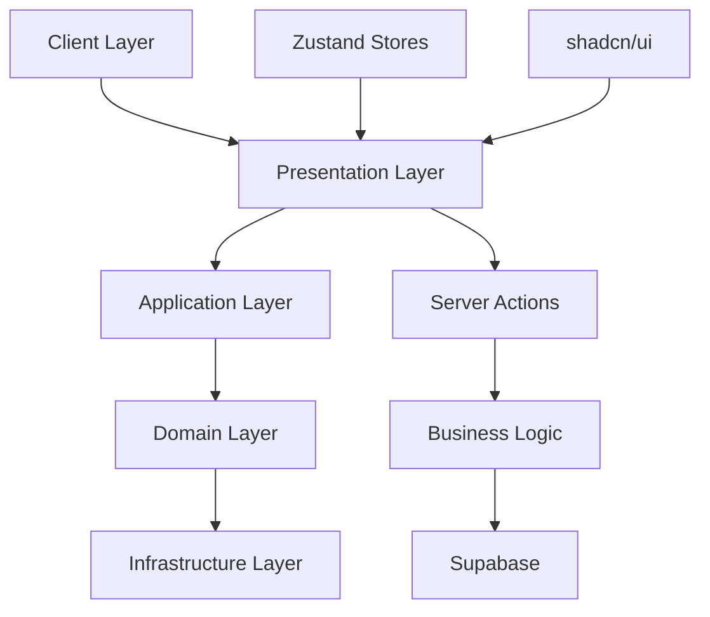

# In Herbis Veritas

> **Plateforme e-commerce moderne** construite avec Next.js 15, Supabase et Clean Architecture. Production-ready avec sécurité multicouche et système de panier hybride.

[](./docs/development/testing.md)
[](./docs/architecture/overview.md)
[](./docs/architecture/security.md)
[](./docs/architecture/database.md)
[](./docs/features/e-commerce.md)

---

## 🚀 Démarrage Express (15 minutes)

> **[📖 Guide Complet](./docs/getting-started/quick-start.md)** - Installation détaillée et configuration

### Installation Rapide

```bash
# 1. Cloner et installer
git clone https://github.com/votre-org/herbis-veritas.git
cd herbis-veritas && npm install

# 2. Configurer l'environnement
cp .env.example .env.local
# Éditer .env.local avec vos clés Supabase/Stripe

# 3. Lancer le développement
npm run dev
```

**Application disponible** → [http://localhost:3000](http://localhost:3000)

### Commandes Essentielles

```bash
npm run dev          # Serveur développement avec Turbo
npm run build        # Build optimisé production
npm test             # Suite de tests complète (374/463)
npm run lint         # ESLint + auto-fix
npm run db:types     # Générer types Supabase
```

---

## Architecture & Stack Technique

### Technologies Principales

| Couche | Technologie | Version | Description |
|--------|-------------|---------|-------------|
| **Frontend** | Next.js | 15+ | App Router, Server Components, Server Actions |
| **Backend** | Supabase | Latest | PostgreSQL, Auth, Storage, RLS |
| **Styling** | Tailwind CSS + shadcn/ui | Latest | Système de design |
| **État** | Zustand | Latest | Gestion d'état globale |
| **Validation** | Zod + React Hook Form | Latest | Validation type-safe |
| **i18n** | next-intl | Latest | fr, en, de, es |
| **Paiements** | Stripe | Latest | Traitement des paiements |

### Architecture Clean



**Principes implémentés :**
- Result Pattern pour la gestion d'erreurs type-safe
- Row Level Security au niveau base de données
- Domain-Driven Design pour l'organisation du code
- Optimistic Updates pour l'expérience utilisateur

---

## 📚 Documentation Consolidée

> **[📖 Documentation Complète](./docs/README.md)** - Centre de documentation technique

### 🎯 **Démarrage Rapide**
- **[⚡ Quick Start](./docs/getting-started/quick-start.md)** - Opérationnel en 15 minutes
- **[🏗️ Architecture](./docs/architecture/overview.md)** - Vue d'ensemble technique
- **[🔐 Sécurité](./docs/architecture/security.md)** - Architecture sécurisée (Score: 9.25/10)

### 💻 **Développement**
- **[⚙️ Server Actions](./docs/development/server-actions.md)** - API de référence (9 fichiers actifs)
- **[💾 Base de Données](./docs/architecture/database.md)** - Schéma complet (15 tables + RLS)
- **[🛒 E-commerce](./docs/features/e-commerce.md)** - Système commercial complet

### 🔧 **Références Techniques**
- **Stack** : Next.js 15 + Supabase + TypeScript + Clean Architecture
- **E-commerce** : Panier hybride + Stripe + RLS + Optimistic Updates
- **Sécurité** : Multicouche + Audit + RGPD + Rate Limiting
- **Tests** : 80.8% coverage (374/463 tests) + Jest + MSW

---

## 📊 État du Projet (Août 2025)

### ✅ **Production Ready - Version 2.1.0**

**🛒 E-commerce Complet**
- Catalogue produits multilingue avec stock temps réel
- Panier persistant hybride (auth + invités) avec optimistic updates
- Checkout complet avec adresses et validation Stripe
- Gestion commandes avec états et tracking

**🔐 Sécurité Multicouche**
- Score sécurité : **9.25/10**
- Row Level Security sur 15 tables PostgreSQL
- Audit automatique des actions sensibles
- Protection CSRF, XSS, Rate Limiting

**🧪 Qualité & Tests**
- Coverage : **80.8%** (374/463 tests passing)
- Infrastructure critique stabilisée
- Server Actions : 9 fichiers avec Result Pattern
- Jest + MSW + Integration tests

### 🔄 **Améliorations Continues**

**Tests & Qualité**
- ✅ Environment variables (Stripe configs) - Fixed
- ✅ Import paths migration (absolute paths @/) - Fixed
- ✅ Service Registry (Jest fake timers) - Fixed
- ✅ Product Actions (ActionResult pattern) - Fixed
- 🔄 Event Container (dependency injection) - En cours
- 🔄 Auth Actions (Next.js redirections) - En cours

**Documentation & Architecture**
- ✅ Consolidation documentation (21 → 6 fichiers)
- ✅ Architecture analysis basée sur le code réel
- ✅ Database schema complet avec migrations
- ✅ Security audit et best practices

---

## Contribution

### Processus de Contribution

```bash
# Fork et clone
git clone https://github.com/votre-username/herbisveritas.git
cd herbisveritas

# Créer une branche feature
git checkout -b feature/ma-nouvelle-fonctionnalite

# Vérifications avant soumission
npm run lint        # Vérifier le code
npm run test        # Lancer les tests
npm run build       # Vérifier le build

# Soumettre les changements
git push origin feature/ma-nouvelle-fonctionnalite
```

### Standards Requis

- Tests obligatoires pour toute nouvelle fonctionnalité
- Code sans erreurs ESLint
- TypeScript strict sans utilisation de `any`
- Documentation mise à jour si nécessaire
- Aucune régression de performance

**[Guide Complet de Contribution](./docs/development/contributing.md)**

---

## Support

### Ressources d'Aide

1. **[Documentation](./docs/)** - Guide complet du projet
2. **[Troubleshooting](./docs/development/troubleshooting.md)** - Solutions aux problèmes courants
3. **[Issues GitHub](https://github.com/votre-repo/issues)** - Signalement de bugs
4. **[Discussions](https://github.com/votre-repo/discussions)** - Questions et échanges

### Versions

- **Version Actuelle** : v2.1.0
- **[Changelog](./CHANGELOG.md)** - Historique des versions
- **[Roadmap](./docs/ROADMAP.md)** - Développements prévus

---

## Licence

Ce projet est distribué sous licence [MIT](./LICENSE).

---

**In Herbis Veritas**  
Plateforme e-commerce moderne avec architecture Clean

[Documentation](./docs/) • [Contribution](./docs/development/contributing.md) • [Architecture](./docs/architecture/overview.md)