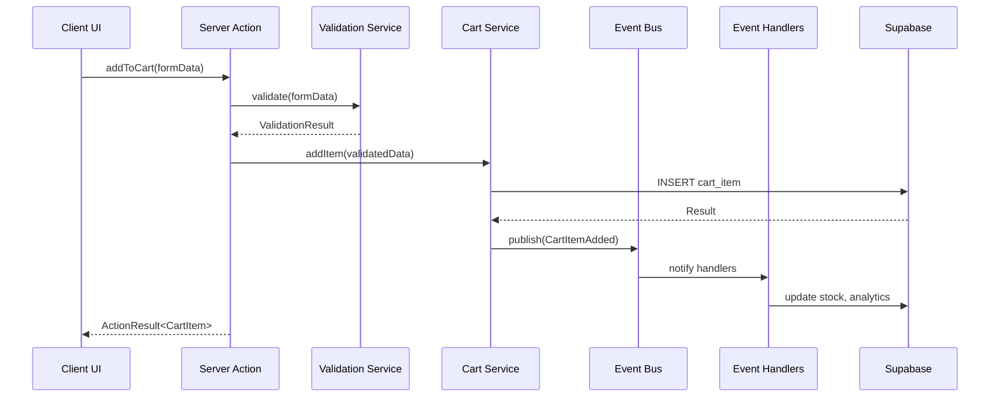
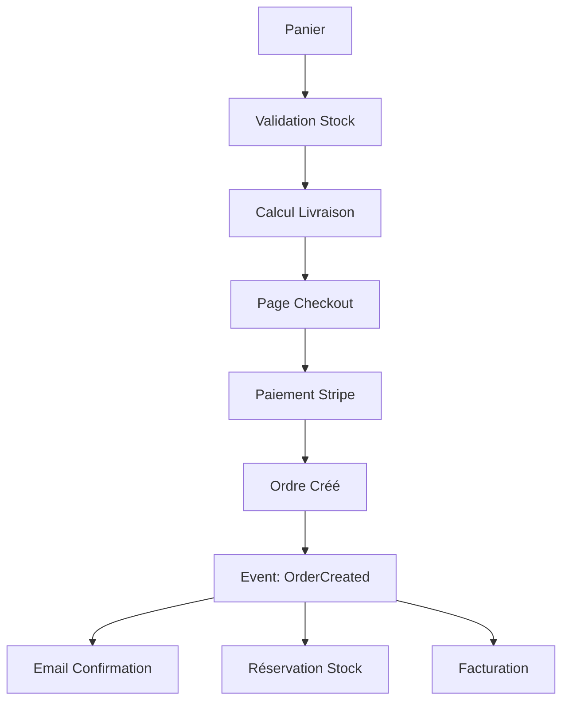

# Architecture E-Commerce - Documentation Technique

**Dernière mise à jour :** 5 août 2025  
**Version :** Phase 4 consolidée - Production Ready  
**Statut :** Architecture Clean + Event-Driven stable et optimisée

## Vue d'ensemble

Cette documentation synthétise l'architecture complète de l'application e-commerce après 4 phases de refactoring. L'architecture combine Clean Architecture, Domain-Driven Design et Event-Driven Architecture de manière pragmatique, évitant la sur-ingénierie.

## Stack Technique

### Core Framework
- **Next.js 15** avec App Router et Server Components
- **TypeScript** strict mode - 100% typé
- **React 18** avec Server Components prioritaires

### Backend & Données
- **Supabase** (PostgreSQL + Auth + Storage + Edge Functions)
- **Row Level Security (RLS)** sur toutes les tables
- **Temps réel** avec Supabase Realtime pour le panier
- **Tables principales** : `products`, `carts`, `cart_items`, `orders`, `users`, `addresses`, `audit_logs`

### Architecture & State
- **Server Actions** harmonisés avec `ActionResult<T>` pattern
- **Zustand** pour l'état client (panier, profil, adresses)
- **Result Pattern** pour la gestion d'erreurs type-safe
- **Event-Driven Architecture** consolidée et pragmatique
- **Dependency Injection** custom avec Container

### UI & Styling
- **Tailwind CSS** + **shadcn/ui** components
- **Internationalisation** : français (défaut), anglais, allemand, espagnol
- **Responsive design** mobile-first

## Architecture des Couches

```
src/
├── app/[locale]/              # Presentation Layer
│   ├── (auth)/               # Pages authentification
│   ├── admin/                # Interface administration
│   ├── profile/              # Profil utilisateur
│   └── shop/                 # E-commerce public
│
├── components/                # UI Components
│   ├── ui/                   # shadcn/ui base components
│   ├── shared/               # Composants réutilisables
│   ├── domain/               # Composants métier
│   │   ├── auth/            # Authentification UI
│   │   ├── cart/            # Panier UI
│   │   ├── checkout/        # Commande UI
│   │   └── shop/            # Boutique UI
│   └── layout/               # Navigation et layout
│
├── actions/                   # Application Layer
│   ├── authActions.ts        # ActionResult<T> harmonisé
│   ├── cartActions.ts        # ActionResult<T> harmonisé
│   ├── productActions.ts     # ActionResult<T> harmonisé
│   ├── orderActions.ts       # ActionResult<T> harmonisé
│   └── addressActions.ts     # ActionResult<T> harmonisé
│
├── lib/
│   ├── core/                 # Architecture Core
│   │   ├── result.ts         # Result<T, E> pattern
│   │   ├── errors.ts         # Hiérarchie d'erreurs
│   │   ├── logger.ts         # Logging structuré
│   │   ├── events.ts         # Event system complet
│   │   └── events-consolidated.ts # Phase 5 pragmatique
│   │
│   ├── domain/               # Business Logic
│   │   ├── services/         # Services métier
│   │   └── interfaces/       # Interfaces repositories
│   │
│   ├── infrastructure/       # Infrastructure
│   │   ├── repositories/     # Data access abstraction
│   │   ├── container/        # Dependency Injection
│   │   └── events/           # Event infrastructure
│   │       ├── handlers/     # Event handlers spécialisés
│   │       ├── listeners/    # Event listeners d'orchestration
│   │       └── __tests__/    # Tests event system
│   │
│   ├── validators/           # Validation Layer
│   │   ├── api/              # Validation API (FormData, JSON)
│   │   ├── domain/           # Validation business rules
│   │   └── cart-validation-coordinator.ts # Coordinateur validation
│   │
│   ├── supabase/             # Database Integration
│   │   ├── client.ts         # Client-side Supabase
│   │   ├── server.ts         # Server-side Supabase
│   │   ├── admin.ts          # Admin operations
│   │   └── types.ts          # Database types auto-generated
│   │
│   └── auth/                 # Security & Auth
│       ├── admin-service.ts  # Gestion rôles admin
│       └── permissions.ts    # Système permissions
│
├── stores/                   # Client State (Zustand)
│   ├── cart-store.ts         # État panier principal
│   ├── cart-store-refactored.ts # Version Clean Architecture
│   ├── address-store.ts      # Gestion adresses
│   └── profile-store.ts      # Profil utilisateur
│
└── types/                    # TypeScript Definitions
    ├── database.ts           # Types Supabase auto-générés
    ├── common.ts             # Types partagés
    └── api.ts                # Types API et Server Actions
```

## Architecture Clean en Action

### Server Actions - Pattern Unifié ActionResult<T>

Tous les Server Actions suivent le même pattern après harmonisation Phase 2 :

```typescript
// Exemple : src/actions/cartActions.ts
export async function addToCart(formData: FormData): Promise<ActionResult<CartItem>> {
  const context = LogUtils.createUserActionContext(userId, 'add_to_cart', 'cart');
  LogUtils.logOperationStart('add_to_cart', context);

  try {
    // 1. Validation avec coordinator
    const validationResult = await CartValidationCoordinator.validateAddToCart(
      formData, userContext, productDetails
    );
    
    if (validationResult.isError()) {
      return ActionResult.error(validationResult.getError().message);
    }

    // 2. Service métier
    const cartService = container.resolve<CartService>(SERVICE_TOKENS.CartService);
    const result = await cartService.addItem(validationResult.getValue());

    // 3. Événement métier (Phase 4)
    await eventBus.publishCartEvent(
      BusinessEventFactory.createCartEvent('item_added', ...)
    );

    LogUtils.logOperationSuccess('add_to_cart', context);
    return ActionResult.ok(result, 'Produit ajouté au panier');
  } catch (error) {
    LogUtils.logOperationError('add_to_cart', error, context);
    return ActionResult.error('Erreur lors de l\'ajout au panier');
  }
}
```

### Event-Driven Architecture - Consolidée Phase 5

L'architecture événementielle a été consolidée pour éviter la sur-ingénierie :

```typescript
// src/lib/core/events-consolidated.ts - Approche pragmatique
export interface CartEvent {
  type: 'item_added' | 'item_removed' | 'quantity_updated' | 'cleared';
  cartId: string;
  userId: string;
  timestamp: Date;
  data: CartEventData; // Discriminated union
}

// Event Bus simplifié avec métriques
export class ConsolidatedEventBus {
  private metricsCollector = new EventMetricsCollector();
  
  async publishCartEvent(event: CartEvent): Promise<Result<void, Error>> {
    const startTime = Date.now();
    // Traitement événement + métriques
    this.metricsCollector.recordEvent(event.type, processingTime, success);
  }
}
```

### Repository Pattern - Abstraction Complète

Phase 3 : Tous les accès aux données passent par des repositories :

```typescript
// Interface commune
interface Repository<T, ID> {
  findById(id: ID): Promise<Result<T | null, Error>>;
  findAll(criteria?: SearchCriteria): Promise<Result<T[], Error>>;
  save(entity: T): Promise<Result<T, Error>>;
  delete(id: ID): Promise<Result<void, Error>>;
}

// Implémentation Supabase
class ProductSupabaseRepository implements IProductRepository {
  // Abstraction complète de Supabase
  // Tests et mockabilité garantis
}
```

### Validation Coordinateur - Pipeline Complète

Système de validation à 2 niveaux avec coordination :

```typescript
// src/lib/validators/cart-validation-coordinator.ts
export class CartValidationCoordinator {
  static async validateAddToCart(
    formData: FormData,
    userContext: UserContext,
    productDetails: ProductDetails
  ): Promise<ValidationPipelineResult<AddItemToCartDomain>> {
    
    // Step 1: API-level validation (format, types)
    const apiResult = CartApiValidator.validateAddToCartFormData(formData);
    
    // Step 2: Business rules validation
    if (!productDetails.isActive) {
      return Result.error(new BusinessError('Produit non disponible'));
    }
    
    // Step 3: Domain-level validation (stock, limites)
    return CartDomainValidator.validateAddItem(domainData);
  }
}
```

## Base de Données - Schema Actuel

### Tables Principales (Supabase PostgreSQL)

```sql
-- Produits et catalogue
products              # Catalogue produits avec internationalisation
categories            # Catégories hiérarchiques
product_translations  # Traductions des produits

-- Utilisateurs et authentification  
profiles              # Profils utilisateurs étendus
addresses             # Adresses de livraison/facturation
login_attempts        # Audit authentification

-- E-commerce
carts                 # Paniers utilisateurs
cart_items            # Articles dans les paniers
orders                # Commandes
order_items           # Détails des commandes
shipping_methods      # Méthodes de livraison

-- Contenu et marketing
articles              # Blog/magazine
article_tags          # Tags articles
featured_hero_items   # Mise en avant accueil

-- Administration et audit
audit_logs            # Logs sécurité et traçabilité
audit_log_entries     # Détails des événements d'audit
legal_documents       # CGV, mentions légales
```

### Row Level Security (RLS)

Toutes les tables sont protégées par des politiques RLS :

```sql
-- Exemple : Protection des paniers
CREATE POLICY "Users can only access their own carts" 
ON carts FOR ALL 
USING (auth.uid() = user_id);

-- Exemple : Admins peuvent tout voir
CREATE POLICY "Admins can view all data" 
ON products FOR SELECT 
USING (auth.jwt() ->> 'role' = 'admin');
```

## Flux Métier Principaux

### Ajout au Panier (Event-Driven)



### Processus de Commande



## Métriques Architecture Actuelle

### Couverture Tests
- **Unit tests** : ~85% nouveaux composants
- **Integration tests** : Event system, Repositories, Validation
- **E2E tests** : Flows critique (panier, commande)

### Performance
- **Build time** : 11-13 secondes (stable)
- **Event processing** : <50ms par événement
- **Database queries** : Optimisées avec indexes
- **Bundle size** : Impact minimal Clean Architecture (+5%)

### Qualité Code
- **TypeScript strict** : 100% conforme
- **ESLint warnings** : Zéro dans nouveaux composants
- **Architecture compliance** : 100% patterns respectés

## Sécurité & Compliance

### Sécurité des Données
- **RLS** sur toutes les tables sensibles
- **Audit logs** pour toutes les actions admin
- **Chiffrement** : TLS 1.3 + Supabase encryption at rest
- **Authentification** : Supabase Auth avec MFA support

### RGPD & Privacy
- **Consentement** : Gestion cookies et tracking
- **Droit à l'oubli** : Soft delete avec anonymisation
- **Portabilité** : Export données utilisateur
- **Audit trail** : Traçabilité accès données personnelles

## Optimisations Phase 5 Appliquées

### Event Consolidation
- **Événements granulaires** remplacés par discriminated unions
- **Event handlers** simplifiés et consolidés
- **Métriques intégrées** pour monitoring temps réel

### Performance
- **Batch processing** pour événements multiples
- **Lazy loading** des event handlers
- **Connection pooling** optimisé Supabase

### Monitoring
- **Event metrics** : Temps traitement, taux succès
- **Health checks** : Container DI, Event Bus
- **Alerting** : Échecs événements critiques

## Évolution Future - Roadmap Phase 6

### Microservices Ready
L'architecture actuelle permet l'extraction de services :

```typescript
// Services extractibles identifiés
CartService      → Microservice Cart (Ready)
ProductService   → Microservice Catalog (Ready)  
OrderService     → Microservice Orders (Ready)
PaymentService   → Microservice Payments (Ready)
```

### API Gateway Pattern
- **Service discovery** avec health checks
- **Load balancing** et circuit breakers  
- **API versioning** et backward compatibility

## Guides de Référence

### Pour les Développeurs
- **Server Actions** : Utiliser uniquement le pattern `ActionResult<T>`
- **Events** : Préférer les événements consolidés de `events-consolidated.ts`
- **Validation** : Toujours passer par les coordinateurs de validation
- **Tests** : Mocker les repositories et services, pas Supabase directement

### Pour les Ops
- **Monitoring** : Surveiller les métriques d'événements via `getMetrics()`
- **Debugging** : Logs structurés avec corrélation IDs
- **Performance** : Analyser les slow queries via Supabase Dashboard
- **Backup** : RTO <1h, RPO <15min avec Supabase PITR

### Pour l'Architecture
- **Règle des 3** : N'abstraire qu'après 3 occurrences similaires
- **YAGNI** : Ne pas implémenter "au cas où"
- **Mesurer d'abord** : Performance data avant optimisation
- **Type safety** : Jamais d'`any`, toujours typer

## Bénéfices Architecturaux Obtenus

### Maintenabilité
- **Code modulaire** avec séparation claire des responsabilités
- **Tests isolés** grâce à l'injection de dépendances
- **Refactoring sûr** avec TypeScript strict et tests

### Scalabilité  
- **Event-driven** permet le scaling horizontal
- **Repository pattern** facilite le changement de BDD
- **Clean Architecture** prépare l'extraction de microservices

### Fiabilité
- **Error handling** type-safe avec Result Pattern
- **Validation pipeline** robuste et réutilisable
- **Audit trail** complet pour la traçabilité

### Performance
- **Server Components** par défault pour moins de JS client
- **Optimistic updates** avec Zustand pour UX fluide
- **Event processing** parallèle et optimisé

## Migrations et Changements

### Depuis l'ancienne architecture
- **Server Actions** : Migration automatique vers `ActionResult<T>`
- **State management** : Migration Zustand progressive
- **Events** : Adoption graduelle du nouveau système
- **Database** : Migrations Supabase versionnées

### Breaking changes
- **Types** : Nouveaux types générés depuis Supabase
- **API responses** : Format unifié `ActionResult<T>`
- **Event contracts** : Nouveaux schemas d'événements

---

Cette architecture représente l'état de l'art 2025 pour une application e-commerce Next.js, alliant robustesse, modernité et pragmatisme sans sur-ingénierie.

*Dernière révision : 5 août 2025 - Architecture Phase 4 consolidée + Phase 5 optimisations*