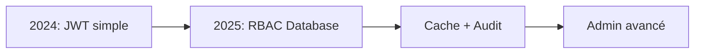

# Documentation du Système d'Authentification

**Version :** 3.0 (Consolidée et mise à jour - Juillet 2025)  
**Dernière mise à jour :** 2025-07-21

Cette documentation décrit le système d'authentification complet de HerbisVeritas dans son état actuel, incluant les flux d'auth, la gestion des sessions, le système RBAC et la sécurité multi-couches.

---

## 📋 Vue d'Ensemble

### Architecture Générale

Le système d'authentification de HerbisVeritas est basé sur **Supabase Auth** avec une architecture de sécurité multi-couches implémentant le principe de **défense en profondeur**.

#### **Composants Principaux**

- **Source de vérité unique** : Supabase Auth pour l'identité et les sessions
- **RBAC complet** : Système de rôles et permissions basé base de données
- **Sessions anonymes** : Support complet des utilisateurs invités
- **Audit immutable** : Journalisation sécurisée de tous les événements
- **Cache intelligent** : Optimisation des performances avec TTL

#### **Évolution du Système**



- **2024** : Système JWT basique avec `app_metadata.role`
- **2025** : Migration vers RBAC database-driven avec cache
- **Actuel** : Système complet avec monitoring et audit avancé

---

## 🔐 Flux d'Authentification

### 1. Inscription (Sign Up)

**Fichier principal :** `src/actions/authActions.ts`

#### Processus Complet

```typescript
// 1. Validation Zod centralisée
const validatedData = signUpSchema.parse(formData);

// 2. Création utilisateur avec confirmation email
const { data, error } = await supabase.auth.signUp({
  email: validatedData.email,
  password: validatedData.password,
  options: {
    emailRedirectTo: `${NEXT_PUBLIC_BASE_URL}/auth/callback`,
    data: {
      first_name: validatedData.firstName,
      last_name: validatedData.lastName,
    },
  },
});

// 3. Audit automatique
await logSecurityEvent({
  type: "USER_REGISTERED",
  userId: data.user?.id,
  severity: "INFO",
});
```

#### Étapes Détaillées

1. **Validation** : Schéma Zod avec messages internationalisés
2. **Création** : `supabase.auth.signUp()` avec métadonnées utilisateur
3. **Email** : Envoi automatique du lien de confirmation
4. **Trigger DB** : Création automatique du profil via `handle_new_user()`
5. **Audit** : Événement `USER_REGISTERED` dans `audit_logs`

### 2. Connexion (Login)

#### Fonctionnalités Avancées

- **Migration de session** : Transition transparente anonymous → authenticated
- **Fusion de panier** : Préservation des données invité
- **Audit de connexion** : Logging avec IP et User-Agent

```typescript
export async function loginAction(prevState: any, formData: FormData) {
  // 1. Capture session anonyme actuelle
  const anonymous_user_id = await getCurrentUserId();

  // 2. Authentification
  const { data, error } = await supabase.auth.signInWithPassword({
    email: validatedData.email,
    password: validatedData.password,
  });

  // 3. Migration automatique du panier
  if (data.user) {
    const cartResult = await migrateAndGetCart(anonymous_user_id);
    return { success: true, cart: cartResult.data };
  }
}
```

### 3. Gestion des Mots de Passe

#### Réinitialisation Sécurisée

**Phase 1: Demande**

- Formulaire sur `/forgot-password`
- `supabase.auth.resetPasswordForEmail()`
- **Anti-énumération** : Succès retourné même si email inexistant

**Phase 2: Mise à jour**

- Redirection via `/update-password`
- Session temporaire créée par Supabase
- Validation force du nouveau mot de passe
- Déconnexion forcée pour sécurité

#### Validation Avancée des Mots de Passe

**Composant :** `src/components/domain/auth/password-strength.tsx`

```typescript
// Critères de sécurité
const passwordRequirements = {
  minLength: 8,
  requireUppercase: true,
  requireNumbers: true,
  requireSpecialChars: true
};

// Indicateur visuel en temps réel
<PasswordStrengthIndicator
  password={password}
  requirements={passwordRequirements}
  showRequirements={true}
/>
```

---

## 👥 Gestion des Sessions

### Sessions Anonymes (Invités)

**Innovation clé :** Utilisation native des sessions anonymes Supabase

#### Avantages Techniques

- **Simplicité** : Pas de `guestId` manuel dans localStorage
- **Sécurité unifiée** : RLS identique pour tous via `auth.uid()`
- **Pas de service_role** : Operations panier avec permissions normales
- **Transition fluide** : Migration transparente vers authentifié

#### Gestion Automatique

```sql
-- Trigger automatique pour tous les nouveaux users
CREATE TRIGGER on_auth_user_created
  AFTER INSERT ON auth.users
  FOR EACH ROW EXECUTE FUNCTION handle_new_user();

-- Profils minimaux pour anonymes
INSERT INTO profiles (id, role) VALUES (NEW.id, 'user'::app_role);
```

#### Système de Purge Automatique

**Fonctionnalités :**

- **Purge hebdomadaire** : Suppression auto des anonymes > 30 jours
- **Préservation intelligente** : Conservation si activité récente (paniers/commandes)
- **Monitoring intégré** : Logging dans `audit_logs`
- **Statistiques temps réel** : Fonctions de surveillance

```sql
-- Purge manuelle (mode test)
SELECT * FROM cleanup_old_anonymous_users(30, true);

-- Statistiques en temps réel
SELECT * FROM get_cleanup_stats();
```

### Sessions Authentifiées

#### Synchronisation Client-Serveur

**Composant :** `src/components/layout/client-layout.tsx`

```typescript
useEffect(() => {
  const {
    data: { subscription },
  } = supabase.auth.onAuthStateChange((event, session) => {
    switch (event) {
      case "INITIAL_SESSION":
        // Charge panier initial (anonymous ou auth)
        loadInitialCart(session?.user?.id);
        break;

      case "SIGNED_IN":
        // Déjà géré par loginAction, refresh si nécessaire
        refreshUserData();
        break;

      case "SIGNED_OUT":
        // Vide données utilisateur, recharge panier anonyme
        clearUserData();
        loadAnonymousCart();
        break;
    }
  });

  return () => subscription.unsubscription();
}, []);
```

---

## 🛡️ Sécurité Multi-Couches

### Couche 1: Protection Middleware

**Fichier :** `src/middleware.ts`

```typescript
// Protection automatique des routes sensibles
if (pathToCheck.startsWith("/admin")) {
  const { isAuthorized, user } = await checkUserPermission("admin:access");

  if (!isAuthorized) {
    // Audit de tentative non autorisée
    await logSecurityEvent({
      type: "UNAUTHORIZED_ADMIN_ACCESS",
      severity: "WARNING",
      data: {
        path: pathToCheck,
        ip: request.ip,
        userAgent: request.headers.get("user-agent"),
      },
    });

    return NextResponse.redirect("/unauthorized");
  }
}
```

### Couche 2: Layouts Sécurisés

**Admin Layout :** `src/app/[locale]/admin/layout.tsx`

```typescript
export default async function AdminLayout({ children }) {
  const { isAuthorized, error } = await checkUserPermission("admin:access");

  if (!isAuthorized) {
    return (
      <Alert variant="destructive">
        <AlertTitle>Accès Refusé</AlertTitle>
        <AlertDescription>
          {error || "Privilèges insuffisants"}
        </AlertDescription>
      </Alert>
    );
  }

  return (
    <div className="admin-layout">
      <AdminSidebar />
      <DashboardShell>{children}</DashboardShell>
    </div>
  );
}
```

### Couche 3: Server Actions Sécurisées

**Pattern de sécurisation :**

```typescript
// src/actions/secureAction.ts
"use server";

export async function secureAction(data: FormData) {
  return withPermissionSafe("specific:permission", async (user) => {
    // 1. Validation Zod
    const validatedData = schema.parse(data);

    // 2. Logique métier sécurisée
    const result = await businessLogic(validatedData);

    // 3. Audit automatique
    await logSecurityEvent({
      type: "SECURE_ACTION_COMPLETED",
      userId: user.id,
      data: { action: "secureAction", result },
    });

    return result;
  });
}
```

### Couche 4: Row Level Security (RLS)

**Politiques PostgreSQL avancées :**

```sql
-- Admins voient tous les profils
CREATE POLICY "Admins can read all profiles" ON profiles FOR SELECT
USING (
  auth.uid() = id OR
  is_admin()
);

-- Utilisateurs voient leur propre profil
CREATE POLICY "Users can read own profile" ON profiles FOR SELECT
USING (auth.uid() = id);

-- Audit logs immutables et protégées
CREATE POLICY "Admin read audit logs" ON audit_logs FOR SELECT
USING (has_permission('admin:read'));

-- Aucune modification d'audit logs autorisée
CREATE POLICY "No audit log modifications" ON audit_logs FOR UPDATE
USING (false);
```

---

## 🔑 Système RBAC (Role-Based Access Control)

### Architecture des Rôles

**Fichier central :** `src/lib/auth/types.ts`

```typescript
export type UserRole = "user" | "editor" | "admin" | "dev";

// Permissions granulaires (25+ permissions)
export const PERMISSIONS = {
  // Utilisateur de base
  ORDERS_READ_OWN: "orders:read:own",
  PROFILE_READ_OWN: "profile:read:own",
  PROFILE_UPDATE_OWN: "profile:update:own",

  // Éditeur
  ADMIN_ACCESS: "admin:access",
  PRODUCTS_CREATE: "products:create",
  PRODUCTS_UPDATE: "products:update",

  // Administrateur
  ADMIN_READ: "admin:read",
  ADMIN_WRITE: "admin:write",
  USERS_MANAGE: "users:manage",
  PRODUCTS_DELETE: "products:delete",

  // Développeur
  WILDCARD: "*", // Accès complet
} as const;
```

### Mapping Rôles → Permissions

```typescript
export const getPermissionsForRole = (role: UserRole): string[] => {
  const rolePermissions: Record<UserRole, string[]> = {
    user: [
      PERMISSIONS.ORDERS_READ_OWN,
      PERMISSIONS.PROFILE_READ_OWN,
      PERMISSIONS.PROFILE_UPDATE_OWN,
      PERMISSIONS.CONTENT_READ,
    ],

    editor: [
      // Inclut toutes les permissions user +
      ...rolePermissions.user,
      PERMISSIONS.ADMIN_ACCESS,
      PERMISSIONS.PRODUCTS_CREATE,
      PERMISSIONS.PRODUCTS_UPDATE,
      PERMISSIONS.CONTENT_MANAGE,
    ],

    admin: [
      // Inclut toutes les permissions editor +
      ...rolePermissions.editor,
      PERMISSIONS.ADMIN_READ,
      PERMISSIONS.ADMIN_WRITE,
      PERMISSIONS.USERS_MANAGE,
      PERMISSIONS.PRODUCTS_DELETE,
      PERMISSIONS.ORDERS_READ_ALL,
    ],

    dev: [PERMISSIONS.WILDCARD], // Accès total
  };

  return rolePermissions[role] || [];
};
```

### Service Admin Avancé

**Fichier :** `src/lib/auth/admin-service.ts`

#### Cache Intelligent

```typescript
// Cache en mémoire avec TTL
const roleCache = new Map<string, CachedRoleData>();

interface CachedRoleData {
  role: UserRole;
  permissions: string[];
  timestamp: number;
  ttl: number; // 5 minutes par défaut
}

// Vérification avec cache
export async function checkAdminRole(userId: string): Promise<AdminCheckResult> {
  // 1. Vérifier cache d'abord
  const cached = getCachedRoleData(userId);
  if (cached) {
    return {
      isAdmin: isAdminRole(cached.role),
      role: cached.role,
      permissions: cached.permissions,
    };
  }

  // 2. Query base de données si cache miss
  const { data: profile } = await supabase
    .from("profiles")
    .select("role, permissions")
    .eq("id", userId)
    .single();

  if (profile) {
    // 3. Mettre en cache pour prochaines requêtes
    setCachedRoleData(userId, profile.role, profile.permissions);
    return {
      isAdmin: isAdminRole(profile.role),
      role: profile.role,
      permissions: profile.permissions,
    };
  }

  return { isAdmin: false, role: null, permissions: [] };
}
```

---

## 📊 Base de Données

### Tables Principales

#### **`profiles`** - Profils utilisateurs avec RBAC

```sql
CREATE TABLE profiles (
  id uuid REFERENCES auth.users(id) PRIMARY KEY,
  role app_role NOT NULL DEFAULT 'user',
  permissions text[], -- Permissions custom additionnelles
  first_name text,
  last_name text,
  phone_number text,
  -- Adresses intégrées
  shipping_address_line1 text,
  shipping_postal_code text,
  shipping_city text,
  shipping_country text,
  billing_address_line1 text,
  billing_postal_code text,
  billing_city text,
  billing_country_code char(2),
  use_shipping_for_billing boolean DEFAULT true,
  -- Audit
  created_at timestamptz DEFAULT now(),
  updated_at timestamptz DEFAULT now()
);
```

#### **`audit_logs`** - Journal d'audit immutable

```sql
CREATE TABLE audit_logs (
  id uuid DEFAULT gen_random_uuid() PRIMARY KEY,
  event_type text NOT NULL,
  user_id uuid REFERENCES auth.users(id),
  data jsonb, -- Métadonnées flexibles
  severity event_severity DEFAULT 'INFO',
  created_at timestamptz DEFAULT timezone('utc', now())
);

CREATE TYPE event_severity AS ENUM ('INFO', 'WARNING', 'ERROR', 'CRITICAL');

-- RLS: Admins uniquement peuvent lire
CREATE POLICY "Admin read audit logs" ON audit_logs FOR SELECT
USING (has_permission('admin:read'));

-- Aucune modification possible (immutable)
CREATE POLICY "No audit modifications" ON audit_logs
FOR UPDATE USING (false);
```

### Fonctions Helper SQL

```sql
-- Vérification admin simple
CREATE OR REPLACE FUNCTION is_admin()
RETURNS boolean AS $$
BEGIN
  RETURN (
    SELECT role FROM profiles
    WHERE id = auth.uid()
  ) = 'admin';
END;
$$ LANGUAGE plpgsql SECURITY DEFINER;

-- Vérification permission spécifique
CREATE OR REPLACE FUNCTION has_permission(required_permission text)
RETURNS boolean AS $$
DECLARE
  user_permissions text[];
  user_role app_role;
BEGIN
  SELECT role, permissions INTO user_role, user_permissions
  FROM profiles WHERE id = auth.uid();

  -- Admin/dev complet
  IF user_role IN ('admin', 'dev') OR '*' = ANY(user_permissions) THEN
    RETURN true;
  END IF;

  -- Permission dans rôle ou custom
  RETURN required_permission = ANY(
    get_permissions_for_role(user_role) || COALESCE(user_permissions, '{}')
  );
END;
$$ LANGUAGE plpgsql SECURITY DEFINER;
```

### Triggers Automatiques

```sql
-- Création automatique profil pour nouveaux users
CREATE OR REPLACE FUNCTION handle_new_user()
RETURNS trigger AS $$
BEGIN
  BEGIN
    -- Crée profil avec données metadata
    INSERT INTO profiles (
      id,
      role,
      first_name,
      last_name
    ) VALUES (
      NEW.id,
      'user'::app_role,
      NEW.raw_user_meta_data->>'first_name',
      NEW.raw_user_meta_data->>'last_name'
    );

    -- Log événement si pas anonyme
    IF NOT NEW.is_anonymous THEN
      INSERT INTO audit_logs (event_type, user_id, severity)
      VALUES ('USER_REGISTERED', NEW.id, 'INFO');
    END IF;

    RETURN NEW;
  EXCEPTION WHEN OTHERS THEN
    -- Log erreur mais ne bloque pas la création
    INSERT INTO audit_logs (event_type, severity, data)
    VALUES ('USER_CREATION_ERROR', 'ERROR',
           jsonb_build_object('error', SQLERRM));
    RETURN NEW;
  END;
END;
$$ LANGUAGE plpgsql SECURITY DEFINER;

CREATE TRIGGER on_auth_user_created
  AFTER INSERT ON auth.users
  FOR EACH ROW EXECUTE FUNCTION handle_new_user();
```

---

## 🎛️ Composants d'Interface

### Composants d'Authentification

#### **Formulaires avec Validation Temps Réel**

```typescript
// src/components/domain/auth/register-form.tsx
export function RegisterForm() {
  const [state, formAction] = useFormState(signUpAction, null);
  const [password, setPassword] = useState("");

  return (
    <form action={formAction}>
      <div className="space-y-4">
        <Input
          name="email"
          type="email"
          placeholder={t("email")}
          required
        />

        <div>
          <Input
            name="password"
            type="password"
            placeholder={t("password")}
            value={password}
            onChange={(e) => setPassword(e.target.value)}
          />
          <PasswordStrengthIndicator
            password={password}
            requirements={passwordRequirements}
          />
        </div>

        <Button type="submit" disabled={state?.isLoading}>
          {state?.isLoading ? t("loading") : t("signUp")}
        </Button>
      </div>
    </form>
  );
}
```

#### **Protection Côté Client**

```typescript
// src/components/auth/Can.tsx
interface CanProps {
  permission: string;
  fallback?: ReactNode;
  children: ReactNode;
}

export function Can({ permission, fallback, children }: CanProps) {
  const { user } = useUser();
  const hasAccess = hasPermissionClient(user, permission);

  if (!hasAccess) {
    return fallback ? <>{fallback}</> : null;
  }

  return <>{children}</>;
}

// Usage
<Can permission="products:delete" fallback={<p>Accès refusé</p>}>
  <Button variant="destructive">Supprimer</Button>
</Can>
```

### Composants Admin Avancés

#### **Monitoring de Sécurité**

```typescript
// src/components/admin/AdminStatus.tsx
export function AdminStatus() {
  const [status, setStatus] = useState<SecurityStatus>('checking');
  const [unauthorizedAdmins, setUnauthorizedAdmins] = useState([]);

  const checkAdminStatus = async () => {
    setStatus('checking');
    try {
      const response = await fetch('/api/admin/check-security');
      const data = await response.json();

      setUnauthorizedAdmins(data.unauthorizedAdmins);
      setStatus(data.unauthorizedAdmins.length > 0 ? 'warning' : 'secure');
    } catch (error) {
      setStatus('error');
    }
  };

  const statusColor = {
    checking: 'bg-yellow-500',
    secure: 'bg-green-500',
    warning: 'bg-red-500',
    error: 'bg-gray-500'
  }[status];

  return (
    <Card>
      <CardHeader>
        <div className="flex items-center justify-between">
          <CardTitle>Statut Sécurité</CardTitle>
          <Button
            onClick={checkAdminStatus}
            variant="outline"
            size="sm"
          >
            Actualiser
          </Button>
        </div>
      </CardHeader>
      <CardContent>
        <div className="flex items-center gap-2">
          <div className={`h-2 w-2 rounded-full ${statusColor}`} />
          <span>
            {unauthorizedAdmins.length === 0
              ? "Système sécurisé"
              : `${unauthorizedAdmins.length} admin(s) non autorisé(s)`
            }
          </span>
        </div>

        {unauthorizedAdmins.length > 0 && (
          <Alert variant="destructive" className="mt-4">
            <AlertTitle>Admins Non Autorisés Détectés</AlertTitle>
            <AlertDescription>
              <ul className="list-disc ml-4">
                {unauthorizedAdmins.map(admin => (
                  <li key={admin.id}>
                    {admin.first_name} {admin.last_name} ({admin.id})
                  </li>
                ))}
              </ul>
            </AlertDescription>
          </Alert>
        )}
      </CardContent>
    </Card>
  );
}
```

---

## 📈 Audit et Monitoring

### Événements Loggés Automatiquement

**Types d'événements dans `audit_logs` :**

```typescript
// Événements d'authentification
"USER_REGISTERED"; // Nouvelle inscription
"USER_LOGIN"; // Connexion réussie
"USER_LOGOUT"; // Déconnexion
"PASSWORD_RESET_REQUESTED"; // Demande reset mot de passe
"PASSWORD_RESET_COMPLETED"; // Reset confirmé

// Événements d'accès
"UNAUTHORIZED_ADMIN_ACCESS"; // Tentative accès admin non autorisé
"PERMISSION_DENIED"; // Permission refusée
"SESSION_EXPIRED"; // Session expirée

// Événements système
"ROLE_CHANGE"; // Modification de rôle utilisateur
"ADMIN_PROMOTION"; // Promotion à admin
"DATABASE_CLEANUP"; // Purge utilisateurs anonymes
"SECURITY_SCAN"; // Scan sécurité automatique
```

### Dashboard Admin en Temps Réel

**Interface :** `/admin` - Composant `ActivityLog`

```typescript
// src/components/admin/ActivityLog.tsx
export function ActivityLog({ logs }: { logs: AuditLog[] }) {
  const [filteredLogs, setFilteredLogs] = useState(logs);
  const [filters, setFilters] = useState({
    severity: 'all',
    type: 'all',
    dateRange: '7d'
  });

  return (
    <Card>
      <CardHeader>
        <CardTitle>Journal d'Activité</CardTitle>
        <EventLogFilters
          filters={filters}
          onFiltersChange={setFilters}
        />
      </CardHeader>
      <CardContent>
        <div className="space-y-2">
          {filteredLogs.map(log => (
            <div
              key={log.id}
              className={`p-3 rounded border-l-4 ${getSeverityColor(log.severity)}`}
            >
              <div className="flex items-center justify-between">
                <span className="font-medium">
                  {getEventDescription(log.event_type)}
                </span>
                <Badge variant={getSeverityVariant(log.severity)}>
                  {log.severity}
                </Badge>
              </div>
              <p className="text-sm text-muted-foreground">
                {format(log.created_at, "PPpp", { locale: fr })}
              </p>
              {log.data && (
                <pre className="text-xs mt-2 bg-gray-50 p-2 rounded">
                  {JSON.stringify(log.data, null, 2)}
                </pre>
              )}
            </div>
          ))}
        </div>
      </CardContent>
    </Card>
  );
}
```

### API de Monitoring

```typescript
// src/app/api/admin/security/route.ts
export async function GET(request: Request) {
  try {
    // Vérification admin
    const { isAuthorized } = await checkUserPermission("admin:read");
    if (!isAuthorized) {
      return NextResponse.json({ error: "Unauthorized" }, { status: 403 });
    }

    // Scan sécurité
    const unauthorizedAdmins = await checkForUnauthorizedAdmins();
    const recentEvents = await getRecentSecurityEvents();

    // Log du scan
    await logSecurityEvent({
      type: "SECURITY_SCAN",
      severity: "INFO",
      data: {
        unauthorizedCount: unauthorizedAdmins.length,
        timestamp: new Date().toISOString(),
      },
    });

    return NextResponse.json({
      status: unauthorizedAdmins.length === 0 ? "secure" : "warning",
      unauthorizedAdmins,
      recentEvents,
      lastScan: new Date().toISOString(),
    });
  } catch (error) {
    return NextResponse.json({ error: "Internal error" }, { status: 500 });
  }
}
```

---

## ⚙️ Configuration et Déploiement

### Variables d'Environnement

```bash
# .env.local - Configuration authentification
# Supabase Auth
NEXT_PUBLIC_SUPABASE_URL=https://votre-projet.supabase.co
NEXT_PUBLIC_SUPABASE_ANON_KEY=votre-cle-anon
SUPABASE_SERVICE_ROLE_KEY=votre-cle-service-role

# Base URL pour redirections
NEXT_PUBLIC_BASE_URL=https://votre-domaine.com

# Admin principal (pour fallback d'urgence)
ADMIN_PRINCIPAL_ID=uuid-admin-principal
ADMIN_EMAIL=admin@votre-domaine.com

# Sécurité (optionnel)
AUTH_SECRET=secret-jwt-super-securise
NEXTAUTH_URL=https://votre-domaine.com
```

### Migrations Critiques à Appliquer

```bash
# 1. Migration système RBAC
supabase migration up 20250119120000_add_role_based_admin_system

# 2. Migration audit logs
supabase migration up 20250704101800_create_audit_logs_table

# 3. Migration triggers auth
supabase migration up 20250719091423_fix_handle_new_user_function

# 4. Migration purge automatique
supabase migration up 20250719093940_create_automated_cleanup_scheduler
```

### Configuration Next.js Sécurisée

```typescript
// next.config.mjs
const nextConfig = {
  // Headers de sécurité
  async headers() {
    return [
      {
        source: "/(.*)",
        headers: [
          {
            key: "X-Frame-Options",
            value: "DENY",
          },
          {
            key: "X-Content-Type-Options",
            value: "nosniff",
          },
          {
            key: "Referrer-Policy",
            value: "origin-when-cross-origin",
          },
          {
            key: "Content-Security-Policy",
            value:
              "default-src 'self'; script-src 'self' 'unsafe-eval'; style-src 'self' 'unsafe-inline'",
          },
        ],
      },
    ];
  },

  // Configuration expérimentale
  experimental: {
    serverActions: true,
    serverComponentsExternalPackages: ["@supabase/supabase-js"],
  },
};
```

---

## 🧪 Tests et Validation

### Tests Unitaires

```bash
# Tests du système auth
npm test src/lib/auth/__tests__/

# Tests des composants auth
npm test src/components/auth/__tests__/

# Tests d'intégration
npm test src/__tests__/integration/auth.test.ts
```

### Validation Manuelle

#### **Script de Diagnostic Complet**

```bash
# Test général du système auth
npm run test:auth

# Audit des rôles admin
npm run audit-roles

# Test des politiques RLS
npm run test:rls

# Validation des migrations
supabase db diff --schema public
```

#### **Page de Test Sécurité** (`/admin/security-test`)

Tests automatiques disponibles :

- ✅ **Configuration env** : Variables requises présentes
- ✅ **Connexion Supabase** : Auth et database opérationnels
- ✅ **Fonctions RLS** : `is_admin()`, `has_permission()` fonctionnelles
- ✅ **Cache système** : TTL et invalidation fonctionnels
- ✅ **Audit logging** : Écriture dans `audit_logs` opérationnelle
- ✅ **Triggers DB** : `handle_new_user()` fonctionnel
- ✅ **Purge system** : Cleanup automatique configuré

### Tests de Charge et Sécurité

```typescript
// Tests de performance cache
describe("Role Cache Performance", () => {
  it("should handle 1000 concurrent role checks", async () => {
    const promises = Array.from({ length: 1000 }, () => checkAdminRole("test-user-id"));

    const start = Date.now();
    const results = await Promise.all(promises);
    const duration = Date.now() - start;

    expect(duration).toBeLessThan(500); // < 500ms pour 1000 vérifications
    expect(results.every((r) => r.isAdmin === false)).toBe(true);
  });
});

// Tests de sécurité
describe("Security Tests", () => {
  it("should prevent SQL injection in role checks", async () => {
    const maliciousId = "'; DROP TABLE profiles; --";
    const result = await checkAdminRole(maliciousId);

    expect(result.isAdmin).toBe(false);
    // Vérifier que la table existe encore
    const { data } = await supabase.from("profiles").select("count");
    expect(data).toBeDefined();
  });
});
```

---

## 🚨 Procédures d'Urgence

### Compromission de Session

1. **IMMÉDIAT** : Forcer déconnexion globale

   ```sql
   -- Via Supabase Dashboard SQL Editor
   SELECT auth.sign_out_all_users();
   ```

2. **ANALYSER** : Consulter audit logs pour identifier l'origine

   ```sql
   SELECT * FROM audit_logs
   WHERE severity IN ('WARNING', 'ERROR', 'CRITICAL')
   AND created_at > NOW() - INTERVAL '1 hour'
   ORDER BY created_at DESC;
   ```

3. **SÉCURISER** : Changer les clés d'API si nécessaire
4. **NOTIFIER** : Alerter utilisateurs par email

### Perte d'Accès Admin

1. **FALLBACK ENV** : Utiliser `ADMIN_PRINCIPAL_ID`

   ```typescript
   // Accès d'urgence temporaire
   if (userId === process.env.ADMIN_PRINCIPAL_ID) {
     return { isAdmin: true, role: "admin" };
   }
   ```

2. **SQL DIRECT** : Via Supabase Dashboard

   ```sql
   -- Promouvoir utilisateur de confiance
   UPDATE profiles SET role = 'admin'
   WHERE id = 'uuid-utilisateur-confiance';
   ```

3. **AUDIT POST-INCIDENT** : Analyser les logs et documenter

### Purge d'Urgence Utilisateurs Anonymes

```sql
-- Purge immédiate (en cas d'abus)
SELECT cleanup_old_anonymous_users(1, false); -- Supprime > 1 jour

-- Statistiques avant purge
SELECT * FROM get_cleanup_stats();

-- Vérification post-purge
SELECT COUNT(*) FROM profiles WHERE role = 'user'
AND id IN (SELECT id FROM auth.users WHERE is_anonymous = true);
```

---

## 🔄 Évolutions Futures

### Prochaines Fonctionnalités

1. **Multi-Factor Authentication (MFA)**
   - TOTP avec authenticator apps
   - SMS de secours
   - Recovery codes

2. **Social Login Avancé**
   - Google, GitHub, LinkedIn
   - Fusion automatique de comptes
   - Mapping des rôles depuis providers

3. **Sessions Avancées**
   - Gestion multi-device
   - Session timeout intelligent
   - Géolocalisation des connexions

4. **Audit Avancé**
   - Export compliance (GDPR)
   - Retention policies automatiques
   - Alertes temps réel par webhook

### Améliorations Techniques

1. **Performance**
   - Cache Redis distribué
   - Lazy loading des permissions
   - Optimisation RLS queries

2. **Sécurité**
   - Rate limiting avancé
   - Détection d'anomalies ML
   - Honeypot pour attaques

3. **DevEx**
   - CLI outils admin
   - Tests E2E automatisés
   - Documentation interactive

---

## 📞 Support et Références

### Documentation Technique

- **Ce document** : Guide complet authentification
- **Types centraux** : `src/lib/auth/types.ts`
- **Validations** : `src/lib/validators/auth.validator.ts`
- **Tests sécurité** : `/admin/security-test`

### Commandes de Développement

```bash
# Développement
npm run dev                    # Dev server
npm run test:auth             # Tests auth uniquement
npm run audit-roles          # Scan sécurité admins
supabase start               # Base locale

# Débogage
npm run logs:auth            # Logs auth en temps réel
npm run debug:permissions    # Debug permissions utilisateur
supabase logs --db-level=info # Logs PostgreSQL
```

### Ressources Externes

- **Supabase Auth Docs** : https://supabase.com/docs/guides/auth
- **Next.js Security** : https://nextjs.org/docs/advanced-features/security-headers
- **OWASP Auth Cheat Sheet** : https://cheatsheetseries.owasp.org/cheatsheets/Authentication_Cheat_Sheet.html

---

**✅ Système opérationnel depuis** : Janvier 2025  
**🔄 Dernière mise à jour majeure** : Juillet 2025  
**📊 Prochaine révision** : Octobre 2025

**Architecture mature** avec défense en profondeur, audit complet et monitoring avancé. Système prêt pour production à grande échelle.
