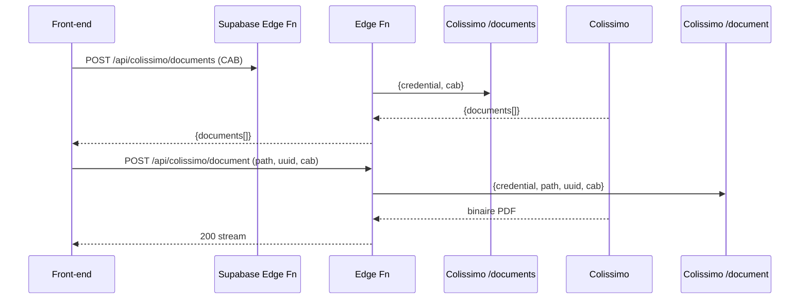
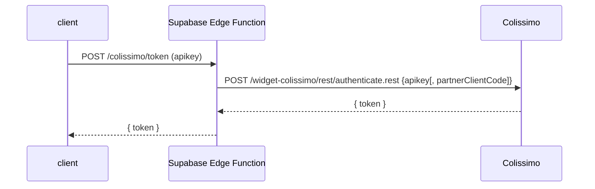

# Guide d'intégration Colissimo - Écosystème complet

> **Version :** 1.0.0 – Juillet 2025 | **Contexte :** Next.js 15 • TypeScript 5 • Supabase Edge Functions | **Source** : Documentation technique Colissimo + analyse terrain

---

## Vue d'ensemble de l'écosystème Colissimo

Ce guide couvre l'intégration complète des services Colissimo pour un e-commerce :

1. **Widget Point Retrait V2** - Sélection de points de retrait
2. **API Documents** - Gestion des documents de livraison
3. **Tracking API** - Suivi de colis
4. **Affranchissement API** - Génération d'étiquettes

---

# 1. API Documents

## 1.1 Objectif

L'**API Documents** permet :

1. **La consultation** des documents associés à un colis (CN23, preuve de livraison, attestation, etc.).
2. **Le stockage** (upload) de nouveaux documents (douane Outre‑Mer, option FTD/DDP) et **la mise à jour** d'un document existant.

Elle complète l'écosystème Widget Point Retrait / Label / Tracking pour offrir un flux e‑commerce "cross‑border compliant".

## 1.2 Vue d'ensemble technique

| Élément              | Valeur                                                                           |
| -------------------- | -------------------------------------------------------------------------------- |
| **Base URL**         | `https://ws.colissimo.fr/api-document/`                                          |
| **Format**           | REST JSON (POST) / fichiers binaires en réponse                                  |
| **Authentification** | Bloc `credential` (login+password **ou** apiKey), ou headers pour _store/update_ |
| **Limite fichier**   | 500 Ko max (code 413)                                                            |
| **Encodage**         | UTF‑8                                                                            |
| **Dates**            | ISO 8601 millisecondes `YYYY‑MM‑DDThh:mm:ss.SSSZ`                                |

## 1.3 Flux d'intégration (Next.js / Supabase)



_Le même principe s'applique pour `storedocument` et `updatedocument` avec un `multipart/form-data`._

## 1.4 Credentials

```ts
export interface CredentialLogin {
  login: string;
  password: string;
}
export interface CredentialApiKey {
  apiKey: string;
}
// Un seul des deux blocs doit être présent
```

> Pour les endpoints **store** / **update**, les credentials sont passés dans les **headers** `login`, `password` ou `apiKey` ; le corps (`multipart/form-data`) contient les autres champs.

## 1.5 Endpoints

| Ressource              | Description                    | Body / Headers                                                                                              | Réponse                |
| ---------------------- | ------------------------------ | ----------------------------------------------------------------------------------------------------------- | ---------------------- |
| `/rest/documents`      | Liste les documents d'un colis | `{ credential, cab? , uuid?, lang? }`                                                                       | `documents[]` (200)    |
| `/rest/document`       | Télécharge un document         | `{ credential, path, uuid, cab }`                                                                           | Flux binaire PDF (200) |
| `/rest/storedocument`  | Stocke un document             | Headers `credential` + `multipart/form-data` (accountNumber, parcelNumber, documentType, file, filename, …) | `{ documentId }`       |
| `/rest/updatedocument` | Remplace un document existant  | Identique à _store_                                                                                         | `{ documentId }`       |

Codes HTTP standard : **200** succès, **400/401/403/404/503** erreurs client/serveur ; **413** si > 500 Ko.

---

# 2. Widget Point Retrait V2

## 2.1 Vue d'ensemble

Le **Widget Point Retrait** est un plugin JavaScript hébergé par Colissimo qui permet à l'acheteur de sélectionner un point de retrait directement depuis la page de checkout. Son intégration se fait en deux volets :

1. **Front‑end** : embarquer la librairie, afficher le widget, récupérer l'objet `PointRetrait` retourné.
2. **Back‑end** : générer un **token d'authentification** valable 30 minutes via l'API Colissimo, et le transmettre au front.

## 2.2 Prérequis techniques

| Élément                 | Version minimale | Notes                            |
| ----------------------- | ---------------- | -------------------------------- |
| Node.js                 | 18 LTS           | nécessaire pour Next.js 15       |
| Next.js                 | 15.x             | App Router recommandé            |
| TypeScript              | 5.x              | typings custom ci‑dessous        |
| jQuery                  | 3.6.0            | exigé par le widget              |
| Mapbox GL JS            | 2.6.1            | rendu cartographique             |
| Supabase Edge Functions | GA               | appel sécurisé à l'API Colissimo |

## 2.3 Flux d'authentification



- **Endpoint Colissimo :** `https://ws.colissimo.fr/widget-colissimo/rest/authenticate.rest` (POST)
- **Payload :** `{ "apikey": "...", "partnerClientCode": "..." }` (2ᵉ champ optionnel)
- **Réponse :** `{ "token": "JWT" }` – durée de vie : **30 min**.

> **Sécurité :** l'appel doit se faire côté serveur ; le widget refuse un token expiré ou généré côté front (HTTP 401).

## 2.4 Installation et composant React

```bash
npm i jquery mapbox-gl@^2.6.1
```

```tsx
// app/components/ColissimoWidget.tsx
"use client";
import { useEffect, useRef } from "react";
import $ from "jquery";
import "mapbox-gl/dist/mapbox-gl.css";

type PointRetrait = {
  id: string;
  name: string;
  address: string;
  zipCode: string;
  city: string;
  latitude: number;
  longitude: number;
  distance: number; // en mètres
};

export default function ColissimoWidget({
  token,
  defaultAddress,
  onSelect,
}: {
  token: string;
  defaultAddress?: {
    address?: string;
    zipCode?: string;
    city?: string;
  };
  onSelect: (p: PointRetrait) => void;
}) {
  const container = useRef<HTMLDivElement>(null);

  useEffect(() => {
    (async () => {
      await loadScript(
        "https://ws.colissimo.fr/widget-colissimo/js/jquery.plugin.colissimo.min.js"
      );

      // @ts-ignore librairie non typée
      $(container.current!).frameColissimoOpen({
        URLColissimo: "https://ws.colissimo.fr",
        callBackFrame: "handleColissimoSelect",
        ceCountry: "FR",
        ceAddress: defaultAddress?.address ?? "",
        ceZipCode: defaultAddress?.zipCode ?? "",
        ceTown: defaultAddress?.city ?? "",
        origin: "WIDGET",
        filterRelay: "1", // tous les points
        token,
      });

      (window as any).handleColissimoSelect = (point: PointRetrait) => {
        onSelect(point);
        $(container.current!).frameColissimoClose();
      };
    })();
  }, [token]);

  return <div ref={container} id="colissimo-widget" />;
}
```

## 2.5 Paramètres clés du widget

| Nom (JSON)                         | Type              | Obligatoire | Description                                         |
| ---------------------------------- | ----------------- | ----------- | --------------------------------------------------- |
| `URLColissimo`                     | `string`          | ✔️          | Toujours `"https://ws.colissimo.fr"`                |
| `token`                            | `string`          | ✔️          | JWT d'authentification (30 min)                     |
| `callBackFrame`                    | `string`          | ✔️          | Nom global de la fonction appelée après sélection   |
| `ceCountryList`                    | `string`          | ➖          | Liste de codes ISO séparés par `,` (pays éligibles) |
| `ceCountry`                        | `string` (2 car.) | ✔️          | Pays sélectionné par défaut                         |
| `filterRelay`                      | `string`          | ➖          | Filtre des types de points (voir valeurs)           |
| `origin`                           | `string`          | ➖          | `CMS`, `WIDGET` ou vide                             |
| `dyPreparationTime`                | `number`          | ➖          | Jours ouvrables avant expédition                    |
| `ceAddress`, `ceZipCode`, `ceTown` | `string`          | ➖          | Adresse par défaut affichée                         |

### 2.5.1 Valeurs `filterRelay`

| Valeur | Contenu                                                           |
| ------ | ----------------------------------------------------------------- |
| `0`    | Bureaux de Poste seulement                                        |
| `1`    | **Tous** les points (commerçants Pickup, consignes, Pickme, etc.) |
| `2`    | Points Pickup uniquement                                          |
| `3`    | Relais commerçants Pickup                                         |
| `5`    | Bureaux + relais Pickup                                           |
| `10`   | Tous sauf consignes Pickup                                        |
| `11`   | Tous sauf voisins‑relais Pickme                                   |

---

# 3. Tracking API

## 3.1 Vue d'ensemble

L'API de suivi permet aux clients de suivre leurs colis directement depuis votre site e-commerce.

## 3.2 Endpoint principal

- **Base URL :** `https://ws.colissimo.fr/tracking/`
- **Authentification :** API Key dans les headers
- **Format :** REST JSON

---

# 4. API Affranchissement

## 4.1 Vue d'ensemble

Génération automatisée d'étiquettes de livraison avec export des adresses destinataires.

## 4.2 Services disponibles

- Génération d'étiquettes France/International
- Calcul de tarifs en temps réel
- Gestion des options de livraison (signature, assurance, etc.)

---

# 5. Architecture recommandée (Next.js 15 + Supabase)

## 5.1 Structure des Edge Functions

```
supabase/functions/
├── colissimo-token/          # Génération token widget
├── colissimo-documents/      # API Documents
├── colissimo-tracking/       # Suivi de colis
└── colissimo-labels/         # Génération étiquettes
```

## 5.2 Schema base de données

```sql
-- Points de retrait sélectionnés
CREATE TABLE pickup_points (
  id uuid PRIMARY KEY DEFAULT gen_random_uuid(),
  order_id uuid REFERENCES orders(id),
  point_id text NOT NULL,
  name text NOT NULL,
  address text NOT NULL,
  zip_code text NOT NULL,
  city text NOT NULL,
  latitude numeric,
  longitude numeric,
  created_at timestamptz DEFAULT now()
);

-- Suivi des colis
CREATE TABLE shipments (
  id uuid PRIMARY KEY DEFAULT gen_random_uuid(),
  order_id uuid REFERENCES orders(id),
  tracking_number text UNIQUE NOT NULL,
  carrier text DEFAULT 'colissimo',
  status text DEFAULT 'pending',
  pickup_point_id uuid REFERENCES pickup_points(id),
  created_at timestamptz DEFAULT now(),
  updated_at timestamptz DEFAULT now()
);

-- Documents de livraison
CREATE TABLE shipment_documents (
  id uuid PRIMARY KEY DEFAULT gen_random_uuid(),
  shipment_id uuid REFERENCES shipments(id),
  document_type text NOT NULL,
  document_path text NOT NULL,
  document_uuid text,
  created_at timestamptz DEFAULT now()
);
```

## 5.3 Variables d'environnement requises

```env
# Colissimo API
COLISSIMO_API_KEY=your_api_key
COLISSIMO_LOGIN=your_login
COLISSIMO_PASSWORD=your_password
COLISSIMO_PARTNER_CLIENT_CODE=optional_partner_code

# Pour l'environnement de test
COLISSIMO_TEST_MODE=true
COLISSIMO_TEST_API_KEY=test_api_key
```

## 5.4 Personnalisation UI

Le widget expose trois classes CSS personnalisables :

```css
/* globals.css */
.couleur1 {
  color: var(--brand-primary);
}
.couleur2 {
  color: var(--brand-secondary);
}
.police {
  font-family: var(--font-body);
}
```

---

# 6. Bonnes pratiques & Sécurité

1. **Tokeniser les credentials** dans le Vault Supabase
2. **Limiter la taille** des uploads côté front (500 Ko max)
3. **Retenter** sur erreurs 5XX avec back-off exponentiel
4. **Tracer** tous les appels API dans votre observabilité
5. **Forcer HTTPS** sur tous les environnements
6. **Valider** les données côté serveur avant appel Colissimo

---

# 7. Gestion des erreurs

## 7.1 Codes d'erreur fréquents

| HTTP                    | Signification                    | Action recommandée         |
| ----------------------- | -------------------------------- | -------------------------- |
| `401 Unauthorized`      | Token absent, invalide ou expiré | Regénérer côté serveur     |
| `403 Forbidden`         | Appel non‑HTTPS                  | Forcer HTTPS               |
| `413 Payload Too Large` | Document > 500 Ko                | Valider taille côté client |

## 7.2 Codes métier API Documents

| Code | Message               |
| ---- | --------------------- |
| 000  | OK                    |
| 001  | CAB NOT FOUND         |
| 002  | CAB OR UUID NOT FOUND |
| 003  | DOCUMENT NOT FOUND    |
| 004  | CREDENTIAL INVALID    |
| 413  | Document > 500 Ko     |

---

# 8. Migration et compatibilité

## 8.1 Depuis Widget V1

- Changer l'URL du plugin vers `…/jquery.plugin.colissimo.min.js`
- Mettre à jour l'endpoint d'authentification
- Ajouter **Mapbox GL JS ≥ 2.3.1** et jQuery ≥ 3.6.0
- Aucune modification des appels `frameColissimoOpen` existants

---

# 9. Liens utiles

- Documentation Colissimo: [https://www.laposte.fr/colissimo-entreprise](https://www.laposte.fr/colissimo-entreprise)
- Offre internationale: [https://www.colissimo.entreprise.laposte.fr/offres-et-tarifs/offre-international](https://www.colissimo.entreprise.laposte.fr/offres-et-tarifs/offre-international)
- Mapbox GL JS: [https://docs.mapbox.com/mapbox-gl-js/](https://docs.mapbox.com/mapbox-gl-js/)
- Supabase Edge Functions: [https://supabase.com/docs/guides/functions](https://supabase.com/docs/guides/functions)

---

> **Support Colissimo**: contactez votre chargé de compte si vous n'obtenez aucun point de retrait ou si vous avez besoin d'activer l'option Widget sur votre contrat.
