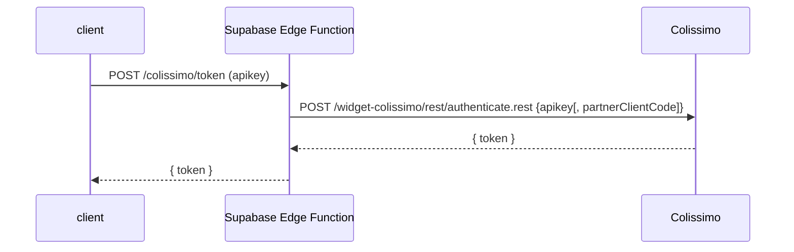

# Guide d’intégration du Widget Point Retrait Colissimo (V2)

> **Version:** Juin 2025 | **Scope:** intégration front-end (Next.js 14, React 18, TypeScript 5) et back-end (Supabase Edge Functions) | **Source:** Document technique – Widget Point Retrait V2

---

## 1. Vue d’ensemble

Le **Widget Point Retrait** est un plugin JavaScript hébergé par Colissimo qui permet à l’acheteur de sélectionner un point de retrait directement depuis la page de checkout. Son intégration se fait en deux volets :

1. **Front‑end** : embarquer la librairie, afficher le widget, récupérer l’objet `PointRetrait` retourné.
2. **Back‑end** : générer un **token d’authentification** valable 30 minutes via l’API Colissimo, et le transmettre au front.fileciteturn0file0

## 2. Prérequis techniques

| Élément                 | Version minimale | Notes                                     |
| ----------------------- | ---------------- | ----------------------------------------- |
| Node.js                 | 18 LTS           | nécessaire pour Next.js 14                |
| Next.js                 | 14.x             | App Router ou Pages Router                |
| TypeScript              | 5.x              | typings custom ci‑dessous                 |
| jQuery                  | 3.6.0            | exigé par le widgetfileciteturn0file0  |
| Mapbox GL JS            | 2.6.1            | rendu cartographiquefileciteturn0file0 |
| Supabase Edge Functions | GA               | appel sécurisé à l’API Colissimo          |

## 3. Flux d’authentification



- **Endpoint Colissimo :** `https://ws.colissimo.fr/widget-colissimo/rest/authenticate.rest` (POST)fileciteturn0file0
- **Payload :** `{ "apikey": "...", "partnerClientCode": "..." }` (2ᵉ champ optionnel)
- **Réponse :** `{ "token": "JWT" }` – durée de vie : **30 min**.

> **Sécurité :** l’appel doit se faire côté serveur ; le widget refuse un token expiré ou généré côté front (HTTP 401).fileciteturn0file0

### 3.1 Exemple d’Edge Function (TypeScript)

```ts
// supabase/functions/colissimo-token/index.ts
import { serve } from "https://deno.land/std@0.224.0/http/server.ts";

serve(async (req) => {
  const { apikey, partnerClientCode } = await req.json();
  const body = JSON.stringify({ apikey, partnerClientCode });
  const colissimoRes = await fetch(
    "https://ws.colissimo.fr/widget-colissimo/rest/authenticate.rest",
    { method: "POST", headers: { "Content-Type": "application/json" }, body }
  );
  if (!colissimoRes.ok) {
    return new Response(null, { status: colissimoRes.status });
  }
  return new Response(await colissimoRes.text(), {
    headers: { "Content-Type": "application/json" },
  });
});
```

## 4. Installation des librairies externes (Next.js)

Ajoutez les dépendances via **npm** :

```bash
npm i jquery mapbox-gl@^2.6.1
```

Créez ensuite un composant React dynamique (CSR only) :

```tsx
// app/components/ColissimoWidget.tsx
"use client";
import { useEffect, useRef } from "react";
import $ from "jquery";
import "mapbox-gl/dist/mapbox-gl.css";

// charge la librairie jQuery du widget côté client uniquement
const loadScript = (src: string) =>
  new Promise<void>((resolve) => {
    const s = document.createElement("script");
    s.src = src;
    s.onload = () => resolve();
    document.body.appendChild(s);
  });

type PointRetrait = {
  // champs principaux retournés par Colissimo (extrait)
  id: string;
  name: string;
  address: string;
  zipCode: string;
  city: string;
  latitude: number;
  longitude: number;
  distance: number; // en mètres
};

export default function ColissimoWidget({
  token,
  defaultAddress,
  onSelect,
}: {
  token: string;
  defaultAddress?: {
    address?: string;
    zipCode?: string;
    city?: string;
  };
  onSelect: (p: PointRetrait) => void;
}) {
  const container = useRef<HTMLDivElement>(null);

  useEffect(() => {
    (async () => {
      await loadScript(
        "https://ws.colissimo.fr/widget-colissimo/js/jquery.plugin.colissimo.min.js"
      );

      // @ts-ignore librairie non typée
      $(container.current!).frameColissimoOpen({
        URLColissimo: "https://ws.colissimo.fr",
        callBackFrame: "handleColissimoSelect",
        ceCountry: "FR",
        ceAddress: defaultAddress?.address ?? "",
        ceZipCode: defaultAddress?.zipCode ?? "",
        ceTown: defaultAddress?.city ?? "",
        origin: "WIDGET",
        filterRelay: "1", // tous les points
        token,
      });

      // expose la callback au scope global requis par le widget
      (window as any).handleColissimoSelect = (point: PointRetrait) => {
        onSelect(point);
        $(container.current!).frameColissimoClose();
      };
    })();
  }, [token]);

  return <div ref={container} id="colissimo-widget" />;
}
```

## 5. Paramètres clés du widget

| Nom (JSON)                         | Type              | Obligatoire | Description                                         |
| ---------------------------------- | ----------------- | ----------- | --------------------------------------------------- |
| `URLColissimo`                     | `string`          | ✔️          | Toujours `"https://ws.colissimo.fr"`                |
| `token`                            | `string`          | ✔️          | JWT d’authentification (30 min)                     |
| `callBackFrame`                    | `string`          | ✔️          | Nom global de la fonction appelée après sélection   |
| `ceCountryList`                    | `string`          | ➖          | Liste de codes ISO séparés par `,` (pays éligibles) |
| `ceCountry`                        | `string` (2 car.) | ✔️          | Pays sélectionné par défaut                         |
| `filterRelay`                      | `string`          | ➖          | Filtre des types de points (voir valeurs)           |
| `origin`                           | `string`          | ➖          | `CMS`, `WIDGET` ou vide                             |
| `dyPreparationTime`                | `number`          | ➖          | Jours ouvrables avant expédition                    |
| `ceAddress`, `ceZipCode`, `ceTown` | `string`          | ➖          | Adresse par défaut affichée                         |

> Liste complète et règles RG1–RG11 : voir documentation officielle.fileciteturn0file0

### 5.1 Valeurs `filterRelay`

| Valeur | Contenu                                                           |
| ------ | ----------------------------------------------------------------- |
| `0`    | Bureaux de Poste seulement                                        |
| `1`    | **Tous** les points (commerçants Pickup, consignes, Pickme, etc.) |
| `2`    | Points Pickup uniquement                                          |
| `3`    | Relais commerçants Pickup                                         |
| `5`    | Bureaux + relais Pickup                                           |
| `10`   | Tous sauf consignes Pickup                                        |
| `11`   | Tous sauf voisins‑relais Pickme                                   |

## 6. Personnalisation UI

Le widget expose trois classes CSS que vous pouvez surcharger :

| Classe      | Effet                                                          |
| ----------- | -------------------------------------------------------------- |
| `.couleur1` | Couleur des marqueurs, bouton de validation et bandeau latéral |
| `.couleur2` | Couleur des filtres │                                          |
| `.police`   | Police d’ensemble                                              |

```css
/* /app/globals.css */
.couleur1 {
  color: var(--brand-primary);
}
.couleur2 {
  color: var(--brand-secondary);
}
.police {
  font-family: var(--font-body);
}
```

## 7. Gestion des erreurs

| HTTP               | Signification                    | Action recommandée                       |
| ------------------ | -------------------------------- | ---------------------------------------- |
| `401 Unauthorized` | Token absent, invalide ou expiré | Regénérer côté serveur                   |
| `403 Forbidden`    | Appel non‑HTTPS                  | Forcer HTTPS sur tous les environnements |

## 8. Migration depuis l’ancienne version

- Changer l’URL du plugin vers `…/jquery.plugin.colissimo.min.js`.
- Mettre à jour l’endpoint d’authentification.
- Ajouter **Mapbox GL JS ≥ 2.3.1** et jQuery ≥ 3.6.0.fileciteturn0file0
- Aucune modification des appels `frameColiposteOpen` existants.

## 9. Stockage dans Supabase

Après la sélection :

```ts
onSelect={(point) =>
  supabase.from("pickup_points").insert({
    order_id: cart.id,
    point_id: point.id,
    name: point.name,
    address: point.address,
    zip_code: point.zipCode,
    city: point.city,
    latitude: point.latitude,
    longitude: point.longitude,
  })
}
```

## 10. Liens utiles

- Documentation Colissimo: [https://www.laposte.fr/colissimo-entreprise](https://www.laposte.fr/colissimo-entreprise)
- Offre internationale (pays éligibles): [https://www.colissimo.entreprise.laposte.fr/offres-et-tarifs/offre-international](https://www.colissimo.entreprise.laposte.fr/offres-et-tarifs/offre-international)
- Mapbox GL JS: [https://docs.mapbox.com/mapbox-gl-js/](https://docs.mapbox.com/mapbox-gl-js/)
- Supabase Edge Functions: [https://supabase.com/docs/guides/functions](https://supabase.com/docs/guides/functions)

---

> **Support Colissimo**: contactez votre chargé de compte si vous n’obtenez aucun point de retrait ou si vous avez besoin d’activer l’option Widget sur votre contrat.
