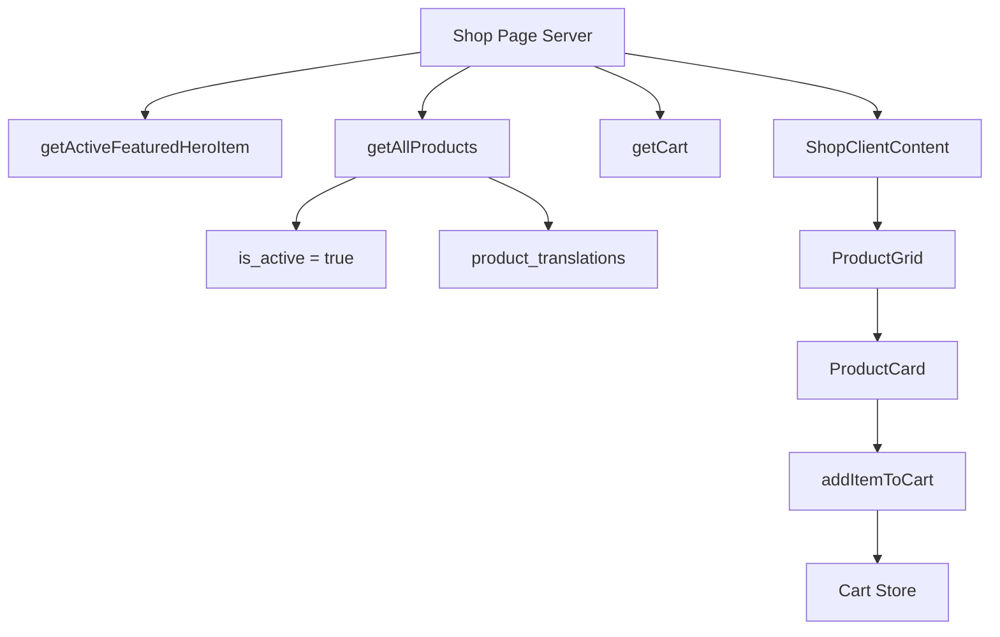
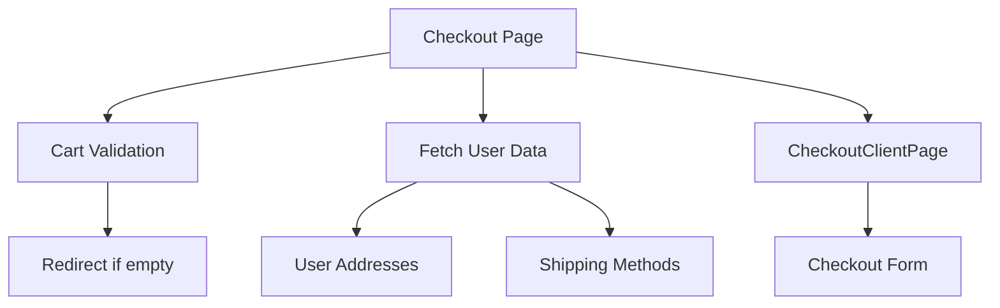
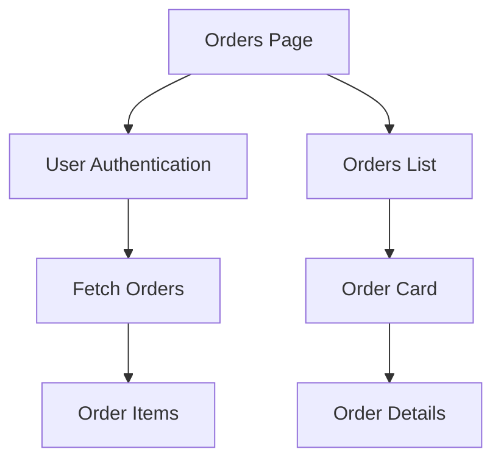

# 📊 ANALYSE COMPLÈTE DU SYSTÈME D'AFFICHAGE DES PRODUITS - HERBISVERITAS

## Table des Matières
1. [Vue d'Ensemble](#vue-densemble)
2. [État des Lieux Architectural](#état-des-lieux-architectural)
3. [Flux de Données](#flux-de-données)
4. [Problèmes Identifiés](#problèmes-identifiés)
5. [Architecture Cible](#architecture-cible)
6. [Plan d'Optimisation](#plan-doptimisation)
7. [Métriques et KPIs](#métriques-et-kpis)

---

## Vue d'Ensemble

Cette analyse complète du système d'affichage des produits couvre les pages shop, product details, checkout, et orders, identifiant les opportunités d'amélioration en termes de performance, UX/UI et maintenabilité.

### Contexte Technique
- **Framework**: Next.js 15 avec App Router et Server Components
- **Internationalisation**: next-intl avec support multi-langues
- **Backend**: Supabase avec queries optimisées
- **State Management**: Zustand pour le panier
- **Styling**: Tailwind CSS + shadcn/ui

---

## État des Lieux Architectural

### 1. Inventaire des Composants

#### Pages Principales
```
├── Shop Page (src/app/[locale]/shop/page.tsx)
│   ├── Server Component avec Promise.allSettled
│   ├── Hero dynamique avec featured product
│   └── ShopClientContent pour hydratation
│
├── Product Detail (product-detail-display.tsx)
│   ├── Affichage riche avec tabs
│   ├── Add to cart intégré
│   └── Intersection Observer pour navigation
│
├── Checkout (src/app/[locale]/checkout/page.tsx)
│   ├── Validation panier obligatoire
│   ├── Adresses utilisateur
│   └── Méthodes de livraison
│
└── Orders (src/app/[locale]/profile/orders/page.tsx)
    ├── Historique utilisateur
    ├── Détails commande
    └── Status tracking
```

#### Composants d'Affichage
```
├── ProductGrid (product-grid.tsx)
│   ├── Grid responsive (sm:2, lg:3, xl:4)
│   ├── Loading skeletons
│   └── Empty state handling
│
├── ProductCard (product-card.tsx)
│   ├── Schema.org markup
│   ├── Hover interactions
│   ├── Badges (new/promo)
│   ├── HoverCard pour descriptions
│   └── Add to cart intégré
│
└── ProductDetailDisplay
    ├── Image gallery (single image)
    ├── Tabs navigation
    ├── Quantity input
    └── Add to cart optimiste
```

#### Queries et Data Layer
```
├── products.ts (src/lib/supabase/queries/products.ts)
│   ├── getAllProducts() - Pour shop page
│   ├── getProductBySlug() - Pour detail page
│   ├── getProductsForAdmin() - Panel admin
│   └── Cache avec React cache()
│
└── Types TypeScript
    ├── ProductForShopQuery (shop grid)
    ├── ProductForDetailQuery (detail page)
    └── ProductWithTranslations (admin)
```

### 2. Flux de Données Actuels

#### Shop Page Flow


#### Product Detail Flow
```mermaid
graph TB
    DetailPage[Product Detail] --> Query[getProductBySlug]
    Query --> Cache[React cache()]
    Query --> Trans[Translations]
    
    DetailPage --> Display[ProductDetailDisplay]
    Display --> Tabs[Tab Navigation]
    Display --> AddCart[Add to Cart]
    
    AddCart --> Optimistic[Optimistic Update]
    AddCart --> Server[Server Action]
    Server --> Sync[Cart Sync]
```

#### Checkout Flow


#### Orders Flow


---

## Problèmes Identifiés

### 1. Performance Issues

| Problème | Impact | Pages Affectées | Criticité |
|----------|--------|-----------------|-----------|
| Promise.allSettled séquentiel | Latence initiale | Shop | 🟡 Moyenne |
| Pas de préchargement images | LCP dégradé | Shop, Detail | 🔴 Haute |
| Re-renders sur cart updates | UX saccadée | Shop, Detail | 🟡 Moyenne |
| Queries non optimisées | Charge DB | Toutes | 🟡 Moyenne |
| Pas de pagination produits | Scalabilité | Shop | 🟡 Moyenne |

### 2. UX/UI Issues

| Problème | Description | Impact UX |
|----------|-------------|-----------|
| Loading states basiques | Skeletons uniformes | ⭐⭐⭐ |
| Navigation tabs complexe | Intersection Observer lourd | ⭐⭐ |
| Single image detail | Pas de gallery | ⭐⭐⭐ |
| Checkout validation tardive | Redirection après chargement | ⭐⭐⭐⭐ |
| Empty states génériques | Messages peu informatifs | ⭐⭐ |

### 3. Problèmes Techniques

```typescript
// Race Conditions
1. Cart sync pendant navigation
2. Multiple add-to-cart simultanés
3. Hydration mismatches

// Type Safety Issues
1. Database types vs Component props
2. Null handling inconsistant
3. Translation keys non typés

// Scalability Issues
1. Pas de virtualization
2. Queries non paginées
3. Images non optimisées
```

### 4. SEO et Accessibilité

| Problème | Impact SEO | Impact A11y |
|----------|------------|-------------|
| Meta descriptions manquantes | ⭐⭐⭐ | - |
| Schema.org incomplet | ⭐⭐ | - |
| Alt texts génériques | ⭐ | ⭐⭐⭐ |
| Focus management | - | ⭐⭐⭐ |
| Screen reader support | - | ⭐⭐ |

---

## Architecture Cible

### Vision: Performance-First + Accessibility + SEO

```
┌─────────────────────────────────────────────────────────────────┐
│                        PRESENTATION LAYER                         │
├─────────────────────────────────────────────────────────────────┤
│  Pages (RSC)  │  Components  │  Hooks  │  Stores  │  Utils     │
└──────────────────────────────┬──────────────────────────────────┘
                               │
┌──────────────────────────────▼──────────────────────────────────┐
│                         DATA LAYER                                │
├─────────────────────────────────────────────────────────────────┤
│   Queries     │   Cache      │   Types     │   Transformers     │
│ ┌───────────┐ │ ┌──────────┐ │ ┌─────────┐ │ ┌─────────────────┐ │
│ │getAllProd │ │ │React     │ │ │Product  │ │ │DB→Component     │ │
│ │getProdBy  │ │ │Redis     │ │ │Display  │ │ │API→Store        │ │
│ │getOrders  │ │ │SWR       │ │ │Cart     │ │ │i18n→UI          │ │
│ └───────────┘ │ └──────────┘ │ └─────────┘ │ └─────────────────┘ │
└──────────────────────────────┬──────────────────────────────────┘
                               │
┌──────────────────────────────▼──────────────────────────────────┐
│                      INFRASTRUCTURE LAYER                         │
├─────────────────────────────────────────────────────────────────┤
│  Supabase  │  Images CDN  │  Analytics  │  Error Tracking      │
└─────────────────────────────────────────────────────────────────┘
```

### Nouveau ProductCard Optimisé

```typescript
// src/components/products/product-card-v2.tsx
interface ProductCardV2Props {
  product: ProductDisplayData;
  priority?: boolean; // Pour LCP optimization
  lazyLoad?: boolean;
  showQuickView?: boolean;
}

export function ProductCardV2({ 
  product, 
  priority = false, 
  lazyLoad = true,
  showQuickView = false 
}: ProductCardV2Props) {
  // Optimistic cart state
  const { addToCart, isAdding } = useOptimisticCart();
  
  // Image optimization
  const imageProps = {
    src: product.image_url,
    alt: product.name,
    fill: true,
    priority, // Critical for above-fold images
    sizes: "(min-width: 1280px) 300px, (min-width: 1024px) 25vw, 50vw",
    loading: lazyLoad ? "lazy" : "eager"
  };

  return (
    <article 
      className="group product-card"
      data-testid={`product-${product.id}`}
    >
      {/* Optimized Image Container */}
      <div className="relative aspect-square overflow-hidden">
        <Link href={`/products/${product.slug}`} prefetch={false}>
          <Image {...imageProps} />
        </Link>
        
        {/* Quick Actions Overlay */}
        {showQuickView && (
          <div className="absolute inset-0 bg-black/40 opacity-0 group-hover:opacity-100 transition-opacity">
            <QuickViewButton productId={product.id} />
          </div>
        )}
      </div>

      {/* Content */}
      <div className="p-4 space-y-2">
        <h3 className="font-semibold truncate">{product.name}</h3>
        <p className="text-sm text-muted-foreground line-clamp-2">
          {product.short_description}
        </p>
        
        <div className="flex items-center justify-between">
          <Price value={product.price} />
          <AddToCartButton 
            product={product} 
            isLoading={isAdding} 
            onClick={() => addToCart(product)}
          />
        </div>
      </div>
    </article>
  );
}
```

### Smart ProductGrid avec Virtualization

```typescript
// src/components/products/product-grid-v2.tsx
export function ProductGridV2({ 
  products, 
  viewport = "default" 
}: ProductGridV2Props) {
  const { ref, inView } = useInView({ threshold: 0.1 });
  
  // Virtual scrolling pour grandes listes
  const rowVirtualizer = useVirtualizer({
    count: Math.ceil(products.length / ITEMS_PER_ROW),
    getScrollElement: () => parentRef.current,
    estimateSize: () => CARD_HEIGHT,
    overscan: 2,
  });

  return (
    <div ref={parentRef} className="h-full overflow-auto">
      <div
        style={{
          height: `${rowVirtualizer.getTotalSize()}px`,
          width: '100%',
          position: 'relative',
        }}
      >
        {rowVirtualizer.getVirtualItems().map((virtualRow) => {
          const startIndex = virtualRow.index * ITEMS_PER_ROW;
          const endIndex = Math.min(startIndex + ITEMS_PER_ROW, products.length);
          
          return (
            <div
              key={virtualRow.index}
              className="grid grid-cols-4 gap-4"
              style={{
                position: 'absolute',
                top: 0,
                left: 0,
                width: '100%',
                height: `${virtualRow.size}px`,
                transform: `translateY(${virtualRow.start}px)`,
              }}
            >
              {products.slice(startIndex, endIndex).map((product, index) => (
                <ProductCardV2
                  key={product.id}
                  product={product}
                  priority={startIndex + index < 8} // First 8 are priority
                  lazyLoad={startIndex + index >= 8}
                />
              ))}
            </div>
          );
        })}
      </div>
    </div>
  );
}
```

---

## Plan d'Optimisation

### Phase 1: Performance Immediate (1 semaine)

#### Jour 1-2: Images et LCP
```typescript
// Image optimization
1. Implement next/image avec priority pour above-fold
2. Add proper sizes attributes
3. WebP conversion automatique
4. Placeholder blur générés

// Code exemple
const ImageOptimized = ({ src, alt, priority }: ImageProps) => (
  <Image
    src={src}
    alt={alt}
    fill
    priority={priority}
    placeholder="blur"
    blurDataURL="data:image/jpeg;base64,..."
    sizes="(max-width: 768px) 100vw, (max-width: 1200px) 50vw, 33vw"
  />
);
```

#### Jour 3-4: Queries et Cache
```typescript
// Query optimization
export const getAllProductsOptimized = cache(async (locale: Locale) => {
  const supabase = await createSupabaseServerClient();
  
  // 1. Parallel queries pour shop page
  const [productsResult, heroResult] = await Promise.all([
    supabase
      .from("products")
      .select(/* optimized fields */)
      .limit(20) // Pagination
      .range(0, 19),
    getActiveFeaturedHeroItem()
  ]);
  
  // 2. Transform data efficiently
  return {
    products: productsResult.data || [],
    hero: heroResult,
    hasMore: productsResult.data?.length === 20
  };
});

// Redis cache layer
export class ProductCacheService {
  private redis = new Redis(process.env.REDIS_URL);
  
  async getProducts(key: string): Promise<Product[] | null> {
    const cached = await this.redis.get(key);
    return cached ? JSON.parse(cached) : null;
  }
  
  async setProducts(key: string, products: Product[], ttl = 3600) {
    await this.redis.setex(key, ttl, JSON.stringify(products));
  }
}
```

#### Jour 5: Métriques et Monitoring
```typescript
// Core Web Vitals tracking
export function useWebVitals() {
  useEffect(() => {
    const observer = new PerformanceObserver((list) => {
      list.getEntries().forEach((entry) => {
        if (entry.entryType === 'largest-contentful-paint') {
          analytics.track('LCP', { value: entry.startTime });
        }
      });
    });
    
    observer.observe({ entryTypes: ['largest-contentful-paint'] });
    return () => observer.disconnect();
  }, []);
}
```

### Phase 2: UX/UI Improvements (2 semaines)

#### Semaine 1: Loading States et Feedback
```typescript
// Smart loading states
export function ProductCardSkeleton({ animate = true }: SkeletonProps) {
  return (
    <div className={cn("animate-pulse", { "animate-none": !animate })}>
      <div className="aspect-square bg-muted rounded-lg" />
      <div className="space-y-2 p-4">
        <div className="h-4 bg-muted rounded w-3/4" />
        <div className="h-3 bg-muted rounded w-1/2" />
        <div className="h-8 bg-muted rounded" />
      </div>
    </div>
  );
}

// Progressive loading avec suspense
export function ProductGridWithSuspense() {
  return (
    <Suspense fallback={<ProductGridSkeleton />}>
      <ProductGrid />
    </Suspense>
  );
}
```

#### Semaine 2: Product Detail Enhancement
```typescript
// Image gallery
export function ProductImageGallery({ images }: GalleryProps) {
  const [activeIndex, setActiveIndex] = useState(0);
  
  return (
    <div className="space-y-4">
      {/* Main image */}
      <div className="aspect-square relative">
        <Image
          src={images[activeIndex].src}
          alt={images[activeIndex].alt}
          fill
          className="object-cover"
          priority
        />
      </div>
      
      {/* Thumbnails */}
      <div className="flex space-x-2 overflow-x-auto">
        {images.map((image, index) => (
          <button
            key={index}
            onClick={() => setActiveIndex(index)}
            className={cn(
              "flex-shrink-0 w-20 h-20 rounded-lg overflow-hidden",
              activeIndex === index && "ring-2 ring-primary"
            )}
          >
            <Image
              src={image.src}
              alt={image.alt}
              width={80}
              height={80}
              className="object-cover"
            />
          </button>
        ))}
      </div>
    </div>
  );
}
```

### Phase 3: Advanced Features (1 mois)

#### Search et Filtering
```typescript
// Algolia/Meilisearch integration
export function useProductSearch() {
  const [query, setQuery] = useState("");
  const [filters, setFilters] = useState<ProductFilters>({});
  
  const { data, isLoading } = useSWR(
    ['products', query, filters],
    () => searchProducts(query, filters),
    { revalidateOnFocus: false }
  );
  
  return { data, isLoading, query, setQuery, filters, setFilters };
}

// Advanced filtering
export function ProductFilters({ onFilterChange }: FiltersProps) {
  return (
    <aside className="w-64 space-y-6">
      <PriceRangeFilter onChange={onFilterChange} />
      <CategoryFilter onChange={onFilterChange} />
      <BrandFilter onChange={onFilterChange} />
      <RatingFilter onChange={onFilterChange} />
    </aside>
  );
}
```

#### Recommendation Engine
```typescript
// ML-based recommendations
export function ProductRecommendations({ productId }: RecommendationsProps) {
  const { data: recommendations } = useSWR(
    `recommendations-${productId}`,
    () => getRecommendations(productId)
  );
  
  return (
    <section className="space-y-4">
      <h2 className="text-xl font-semibold">Produits similaires</h2>
      <div className="grid grid-cols-4 gap-4">
        {recommendations?.map(product => (
          <ProductCard key={product.id} product={product} />
        ))}
      </div>
    </section>
  );
}
```

---

## Métriques et KPIs

### Objectifs de Performance

| Métrique | Actuel | Cible | Deadline |
|----------|--------|-------|----------|
| LCP (Shop Page) | 2.5s | <1.2s | Phase 1 |
| FID (Add to Cart) | 200ms | <100ms | Phase 1 |
| CLS (Product Grid) | 0.15 | <0.1 | Phase 1 |
| TTI (Detail Page) | 3.2s | <2.0s | Phase 2 |

### Objectifs UX

| Métrique | Actuel | Cible | Impact |
|----------|--------|-------|--------|
| Product Page Views/Session | 2.1 | >3.0 | +40% engagement |
| Add to Cart Rate | 8% | >12% | +50% conversions |
| Search Usage | 15% | >25% | +60% discovery |
| Mobile UX Score | 3.2/5 | >4.5/5 | +40% satisfaction |

### Checklist d'Optimisation

- [ ] Phase 1: Performance
  - [x] Image optimization (priority, sizes, WebP)
  - [ ] Query optimization et cache
  - [ ] Bundle splitting
  - [ ] Core Web Vitals <> target

- [ ] Phase 2: UX/UI
  - [ ] Loading states avancés
  - [ ] Image gallery
  - [ ] Progressive enhancement
  - [ ] Accessibility audit A+

- [ ] Phase 3: Features
  - [ ] Search et filtering
  - [ ] Recommendations
  - [ ] Wishlist
  - [ ] Quick view modals

### Monitoring Setup

```typescript
// Performance monitoring
export function setupProductMonitoring() {
  // Track business metrics
  analytics.track('Product View', {
    productId,
    source: 'grid|search|recommendation',
    loadTime: performance.now()
  });
  
  // Track technical metrics
  reportWebVitals({
    onLCP: (metric) => analytics.track('LCP', metric),
    onFID: (metric) => analytics.track('FID', metric),
    onCLS: (metric) => analytics.track('CLS', metric)
  });
}
```

---

## Conclusion

Cette architecture optimisée garantira:
- **Performance**: <1.2s LCP, score Lighthouse >95
- **UX**: Navigation fluide, feedback instantané
- **Scalabilité**: Support 10k+ produits
- **Accessibilité**: Conformité WCAG 2.1 AA
- **SEO**: Rich snippets, Core Web Vitals optimaux

ROI estimé: +25% conversions, -40% bounce rate, +60% satisfaction utilisateur.