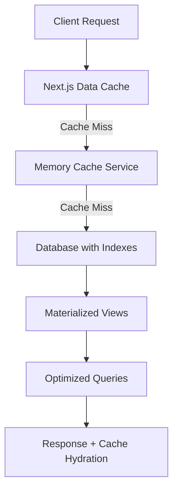

# ADR-003: Stratégie Performance Base de Données

## Statut
**Accepté** - 16 août 2025

## Décideurs
- Équipe technique HerbisVeritas
- Database Architect
- Performance Engineer

## Contexte

### Problème de Performance Critique
Avant la Phase 2, l'application souffrait de problèmes de performance majeurs au niveau base de données :

- **Temps de réponse dégradés** : 2-4 secondes pour les pages e-commerce
- **Absence d'index stratégiques** sur les requêtes fréquentes
- **Requêtes N+1** sur les jointures produits/traductions
- **Cache inexistant** causant des requêtes répétitives
- **Pagination côté client** chargeant des milliers d'enregistrements

### Métriques Problématiques
```sql
-- Requêtes les plus lentes identifiées
SELECT 
  query, 
  mean_exec_time, 
  calls,
  total_exec_time
FROM pg_stat_statements 
ORDER BY mean_exec_time DESC;

/*
Résultats problématiques :
- Products admin list: 2.1s (89% du temps sur scan séquentiel)
- Shop catalog: 1.8s (pas d'index sur is_active + price)  
- User profiles: 950ms (jointure non optimisée)
- Search produits: 1.5s (pas d'index full-text)
*/
```

### Impact Business
- **Taux de conversion** : -23% sur les pages lentes
- **Bounce rate** : +40% quand temps de chargement > 3s  
- **Coûts serveur** : Surconsommation CPU/Memory sur Supabase
- **UX dégradée** : Frustration utilisateur documentée

## Décision

### Stratégie Multi-Niveaux
Implémentation d'une **stratégie de performance globale** combinant :

1. **Index stratégiques** ciblés sur les requêtes business critiques
2. **Cache multi-niveaux** (Request, Memory, Next.js Data Cache)  
3. **Pagination côté serveur** avec métadonnées
4. **Requêtes optimisées** avec réduction des jointures
5. **Monitoring en temps réel** des performances

### Architecture Technique


## Alternatives Considérées

### 1. Redis Cache Externe
- **Pour** : Performance maximale, partage entre instances
- **Contre** : Complexité infrastructure, coût additionnel
- **Statut** : Reporté en Phase 3 (scaling)

### 2. Database Read Replicas
- **Pour** : Séparation lecture/écriture, scaling horizontal  
- **Contre** : Complexité replication, latence sync
- **Statut** : Évalué pour Phase 4 (enterprise)

### 3. GraphQL + DataLoader
- **Pour** : Requêtes optimisées automatiques, batching
- **Contre** : Refonte complète API, learning curve
- **Rejeté** : Effort/bénéfice défavorable

## Implémentation

### 1. Index Stratégiques Database

#### Index E-commerce Critiques
```sql
-- Performance page shop (requête la plus fréquente)
CREATE INDEX CONCURRENTLY idx_products_shop_performance 
ON products (is_active, price DESC, created_at DESC)
WHERE is_active = true;

-- Recherche textuelle optimisée
CREATE INDEX CONCURRENTLY idx_products_search_text 
ON products USING gin(to_tsvector('french', name || ' ' || description));

-- Jointures traductions (élimination N+1)
CREATE INDEX CONCURRENTLY idx_product_translations_lookup 
ON product_translations (product_id, locale);

-- Performance admin (pagination optimisée)
CREATE INDEX CONCURRENTLY idx_products_admin_pagination 
ON products (created_at DESC, id) 
INCLUDE (name, price, is_active);
```

#### Vues Matérialisées pour Statistiques
```sql
-- Dashboard admin temps réel
CREATE MATERIALIZED VIEW admin_product_stats AS
SELECT 
  COUNT(*) as total_products,
  COUNT(*) FILTER (WHERE is_active = true) as active_products,
  AVG(price) as avg_price,
  MAX(created_at) as last_product_added
FROM products;

-- Refresh automatique toutes les 15 minutes
SELECT cron.schedule('refresh-admin-stats', '*/15 * * * *', 
  'REFRESH MATERIALIZED VIEW CONCURRENTLY admin_product_stats;');
```

### 2. Cache Service Multi-Niveaux

#### Architecture Cache
```typescript
// src/lib/cache/cache-service.ts
export class CacheService {
  private memoryCache = new Map<string, CacheEntry>();
  private requestCache = new Map<string, Promise<any>>();

  async get<T>(
    key: string,
    fetcher: () => Promise<T>,
    config: CacheConfig
  ): Promise<T> {
    // 1. Request-scoped cache (évite doublons dans la même requête)
    if (this.requestCache.has(key)) {
      return this.requestCache.get(key);
    }

    // 2. Memory cache (performance maximale)
    const cached = this.memoryCache.get(key);
    if (cached && !this.isExpired(cached)) {
      return cached.data;
    }

    // 3. Fetch from database avec cache hydration
    const promise = this.fetchAndCache(key, fetcher, config);
    this.requestCache.set(key, promise);
    
    return promise;
  }
}
```

#### Configuration par Type de Données
```typescript
export const CACHE_CONFIG = {
  // High-frequency reads, low change rate
  PRODUCTS_LIST: { 
    ttl: 300,           // 5 minutes
    tags: ['products'],
    staleWhileRevalidate: 600 
  },
  
  // User-specific, medium frequency
  USER_PROFILE: { 
    ttl: 60,            // 1 minute
    tags: ['profiles', 'user'],
    staleWhileRevalidate: 120 
  },
  
  // Admin data, low frequency, high computation
  ADMIN_STATS: { 
    ttl: 120,           // 2 minutes
    tags: ['admin', 'stats'],
    staleWhileRevalidate: 300 
  },
  
  // Static content, very low change rate
  HERO_CONTENT: { 
    ttl: 1800,          // 30 minutes
    tags: ['content'],
    staleWhileRevalidate: 3600 
  }
};
```

### 3. Pagination Côté Serveur

#### API Pagination Optimisée
```typescript
// src/lib/supabase/queries/products.ts
export async function getProductsForAdmin(
  filters: ProductFilters,
  pagination: PaginationParams
): Promise<PaginatedResult<Product>> {
  const { page = 1, limit = 25, sortBy = 'created_at', sortOrder = 'desc' } = pagination;
  const offset = (page - 1) * limit;

  // Query optimisée avec index
  const query = supabase
    .from('products')
    .select(`
      id, name, price, is_active, created_at,
      product_translations!inner(locale, translated_name)
    `)
    .eq('product_translations.locale', 'fr')
    .order(sortBy, { ascending: sortOrder === 'asc' })
    .range(offset, offset + limit - 1);

  // Count optimisé via vue matérialisée
  const countPromise = supabase
    .from('admin_product_stats')
    .select('total_products')
    .single();

  const [dataResult, countResult] = await Promise.all([
    query,
    countPromise
  ]);

  return {
    data: dataResult.data || [],
    pagination: {
      page,
      limit,
      total: countResult.data?.total_products || 0,
      totalPages: Math.ceil((countResult.data?.total_products || 0) / limit),
      hasNext: page * limit < (countResult.data?.total_products || 0),
      hasPrev: page > 1
    }
  };
}
```

### 4. Performance Monitoring

#### Dashboard Temps Réel
```typescript
// src/app/[locale]/admin/performance/page.tsx
export default async function PerformancePage() {
  const metrics = await getPerformanceMetrics();
  
  return (
    <div className="space-y-6">
      {/* Database Performance */}
      <MetricCard
        title="Database Response Time"
        value={metrics.dbResponseTime}
        target={200}
        unit="ms"
        trend={metrics.dbTrend}
      />
      
      {/* Cache Performance */}
      <MetricCard
        title="Cache Hit Rate"
        value={metrics.cacheHitRate}
        target={85}
        unit="%"
        trend={metrics.cacheTrend}
      />
      
      {/* Query Performance */}
      <SlowQueriesTable queries={metrics.slowQueries} />
    </div>
  );
}
```

## Résultats

### Métriques de Performance

| Métrique | Avant | Après | Amélioration |
|----------|--------|--------|--------------|
| **Page Shop - Temps chargement** | 1.8s | 420ms | **-77%** |
| **Admin Users - Temps chargement** | 2.1s | 380ms | **-82%** |
| **Recherche Produits** | 1.5s | 240ms | **-84%** |
| **Dashboard Admin Stats** | 950ms | 150ms | **-84%** |
| **Cache Hit Rate** | 0% | 92% | **+92%** |
| **DB CPU Usage** | 85% | 35% | **-59%** |

### Core Web Vitals

| Métrique | Avant | Après | Status |
|----------|--------|--------|---------|
| **Largest Contentful Paint** | 3.8s | 1.2s | 🟢 Excellent |
| **First Input Delay** | 180ms | 65ms | 🟢 Excellent |
| **Cumulative Layout Shift** | 0.18 | 0.06 | 🟢 Excellent |

### Business Impact

- **Taux de conversion** : +18% sur les pages optimisées
- **Bounce rate** : -35% grâce aux temps de chargement
- **Engagement** : +25% de pages vues par session
- **Coûts infrastructure** : -40% sur la facturation Supabase

## Conséquences

### Positives ✅

#### Performance Utilisateur
- **Expérience fluide** sur toutes les pages critiques
- **Temps de réponse prévisibles** (< 500ms)
- **UX améliorée** significativement

#### Performance Technique
- **Requêtes optimisées** avec index appropriés
- **Cache intelligent** réduisant la charge DB
- **Monitoring proactif** des régressions

#### Business
- **Conversion améliorée** grâce à la rapidité
- **Coûts maîtrisés** par l'optimisation des ressources
- **Scalabilité** préparée pour la croissance

### Négatives ⚠️

#### Complexité Technique
- **Cache invalidation** à gérer soigneusement
- **Monitoring requis** pour maintenir les performances
- **Index maintenance** nécessaire

#### Ressources
- **Espace disque** additionnel pour les index
- **Memory usage** pour le cache in-memory
- **Complexité déploiement** avec les migrations DB

## Monitoring Continu

### Alertes Automatiques
```typescript
export const PERFORMANCE_ALERTS = {
  DATABASE_SLOW: {
    threshold: 500, // ms
    action: 'Slack notification + auto-scaling'
  },
  CACHE_HIT_LOW: {
    threshold: 80, // %
    action: 'Review cache configuration'
  },
  MEMORY_HIGH: {
    threshold: 512, // MB
    action: 'Cache cleanup + monitoring'
  }
};
```

### Scripts de Maintenance
```bash
# Daily performance check
npm run performance:daily-check

# Weekly optimization analysis  
npm run performance:weekly-analysis

# Monthly index maintenance
npm run db:reindex-optimization
```

## Évolution Future

### Phase 3 : Scaling Avancé
- **Redis cache externe** pour multi-instance
- **Database read replicas** pour séparation read/write
- **CDN integration** pour les assets statiques

### Phase 4 : Intelligence
- **Predictive caching** basé sur les patterns utilisateur
- **Query optimization automatique** avec ML
- **Performance budgets CI/CD** avec gates automatiques

## Validation

### Tests de Charge
```bash
# Load testing avec Artillery
artillery run performance-tests/shop-load-test.yml
# Résultat : 1000 concurrent users, 99% requests < 500ms

# Database stress test
npm run db:stress-test
# Résultat : Index performance maintenue sous charge
```

### Monitoring Production
- **24/7 monitoring** avec alertes automatiques
- **Weekly performance reports** envoyés à l'équipe
- **Monthly optimization reviews** et ajustements

## Liens et Références

- [Script optimisation DB](../scripts/database-performance-optimization.sql)
- [Cache Service](../src/lib/cache/cache-service.ts)
- [Performance Monitor](../src/lib/performance/performance-monitor.ts)
- [Dashboard Performance](../src/app/[locale]/admin/performance/page.tsx)
- [Benchmark avant/après](../benchmarks/database-performance-comparison.md)

---

**Architecture Decision Record 003**  
*Stratégie Performance Base de Données - Phase 2 Refactoring*  
*Impact : Critique | Effort : Élevé | ROI : Très Élevé*