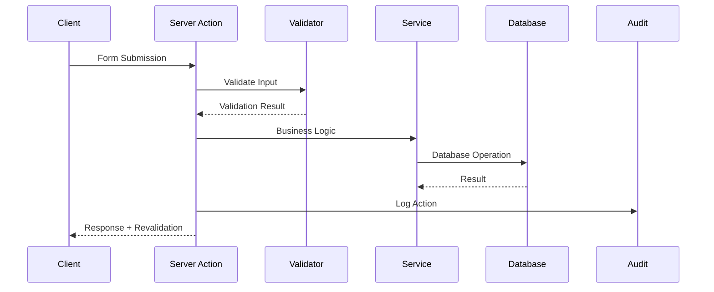

# Référence API - HerbisVeritas

## Vue d'Ensemble

Cette documentation détaille l'ensemble des Server Actions, endpoints et services API utilisés dans HerbisVeritas. L'architecture privilégie les Server Actions Next.js pour les mutations de données et les Server Components pour la lecture.

## Table des Matières

- [Architecture API](#architecture-api)
- [Authentication & Authorization](#authentication--authorization)
- [Server Actions](#server-actions)
- [Types et Schémas](#types-et-schémas)
- [Services Externes](#services-externes)
- [Error Handling](#error-handling)
- [Rate Limiting](#rate-limiting)

## Architecture API

### Pattern Server Actions



### Types de Retour Standard

```typescript
// Type de retour uniforme pour toutes les actions
type ActionResult<T = unknown> = {
  success: boolean;
  data?: T;
  error?: string;
  fieldErrors?: Record<string, string[]>;
  timestamp: string;
};

// Helpers pour création de réponses
export function createSuccessResult<T>(
  data: T, 
  message?: string
): ActionResult<T> {
  return {
    success: true,
    data,
    message,
    timestamp: new Date().toISOString()
  };
}

export function createErrorResult(
  error: string,
  fieldErrors?: Record<string, string[]>
): ActionResult {
  return {
    success: false,
    error,
    fieldErrors,
    timestamp: new Date().toISOString()
  };
}
```

## Authentication & Authorization

### Middleware de Protection

```typescript
// src/middleware.ts
export async function middleware(request: NextRequest) {
  const { pathname } = request.nextUrl;
  
  // Routes protégées
  const protectedRoutes = ['/admin', '/profile', '/checkout'];
  const publicRoutes = ['/', '/shop', '/login', '/register'];
  
  if (protectedRoutes.some(route => pathname.startsWith(route))) {
    const { data: { user } } = await supabase.auth.getUser();
    
    if (!user) {
      return NextResponse.redirect(new URL('/login', request.url));
    }
    
    // Vérification rôle admin pour /admin
    if (pathname.startsWith('/admin')) {
      const { isAdmin } = await checkAdminRole(user.id);
      if (!isAdmin) {
        return NextResponse.redirect(new URL('/unauthorized', request.url));
      }
    }
  }
  
  return NextResponse.next();
}
```

### Service d'Autorisation

```typescript
// src/lib/auth/admin-service.ts
export interface AdminCheckResult {
  isAdmin: boolean;
  role: string | null;
  permissions: string[];
  userId: string;
}

export async function checkAdminRole(userId: string): Promise<AdminCheckResult> {
  const supabase = createSupabaseServerClient();
  
  const { data: profile } = await supabase
    .from('profiles')
    .select('role')
    .eq('id', userId)
    .single();
    
  const role = profile?.role || 'user';
  const isAdmin = ['admin', 'dev'].includes(role);
  const permissions = getPermissionsForRole(role);
  
  return { isAdmin, role, permissions, userId };
}

function getPermissionsForRole(role: string): string[] {
  const rolePermissions = {
    user: ['profile:read', 'profile:update', 'orders:read'],
    editor: ['products:*', 'orders:read'],
    admin: ['*'],
    dev: ['*']
  };
  
  return rolePermissions[role] || [];
}
```

## Server Actions

### Actions Authentification

#### registerAction

```typescript
// src/actions/authActions.ts
export async function registerAction(
  prevState: unknown,
  formData: FormData
): Promise<ActionResult<{ user: User }>> {
  try {
    const validatedFields = RegisterSchema.safeParse({
      email: formData.get('email'),
      password: formData.get('password'),
      firstName: formData.get('firstName'),
      lastName: formData.get('lastName')
    });

    if (!validatedFields.success) {
      return createValidationErrorResult(
        validatedFields.error.flatten().fieldErrors
      );
    }

    const supabase = createSupabaseServerClient();
    const { email, password, firstName, lastName } = validatedFields.data;

    const { data, error } = await supabase.auth.signUp({
      email,
      password,
      options: {
        data: { first_name: firstName, last_name: lastName }
      }
    });

    if (error) {
      return createErrorResult("Erreur lors de l'inscription", error.message);
    }

    await logEvent('USER_REGISTERED', data.user?.id, { email });

    return createSuccessResult(
      { user: data.user }, 
      "Inscription réussie. Vérifiez votre email."
    );
  } catch (error) {
    return createGeneralErrorResult("Erreur lors de l'inscription");
  }
}
```

#### loginAction

```typescript
export async function loginAction(
  prevState: unknown,
  formData: FormData
): Promise<ActionResult<{ user: User }>> {
  try {
    const validatedFields = LoginSchema.safeParse({
      email: formData.get('email'),
      password: formData.get('password')
    });

    if (!validatedFields.success) {
      return createValidationErrorResult(
        validatedFields.error.flatten().fieldErrors
      );
    }

    const supabase = createSupabaseServerClient();
    const { email, password } = validatedFields.data;

    const { data, error } = await supabase.auth.signInWithPassword({
      email,
      password
    });

    if (error) {
      return createErrorResult("Erreur de connexion", "Email ou mot de passe incorrect");
    }

    await logEvent('USER_LOGIN', data.user.id, { email });

    redirect('/');
  } catch (error) {
    return createGeneralErrorResult("Erreur de connexion");
  }
}
```

### Actions Panier

#### addToCartAction

```typescript
// src/actions/cartActions.ts
export async function addToCartAction(
  prevState: unknown,
  formData: FormData
): Promise<ActionResult<CartData>> {
  try {
    const validatedFields = AddToCartInputSchema.safeParse({
      productId: formData.get('productId'),
      quantity: formData.get('quantity')
    });

    if (!validatedFields.success) {
      return createValidationErrorResult(
        validatedFields.error.flatten().fieldErrors
      );
    }

    const { productId, quantity } = validatedFields.data;
    const supabase = createSupabaseServerClient();
    
    // Vérification stock
    const { data: product } = await supabase
      .from('products')
      .select('stock_quantity')
      .eq('id', productId)
      .single();

    if (!product || product.stock_quantity < quantity) {
      return createErrorResult("Stock insuffisant");
    }

    // Ajout au panier via RPC
    const activeUserId = await getActiveUserId(supabase);
    const cartId = await getOrCreateCartId(activeUserId, supabase);

    const { error } = await supabase.rpc('add_or_update_cart_item', {
      p_cart_id: cartId,
      p_product_id: productId,
      p_quantity_to_add: quantity
    });

    if (error) {
      return createErrorResult("Erreur lors de l'ajout au panier");
    }

    // Récupération panier mis à jour
    const updatedCart = await getCartData(cartId, supabase);
    
    revalidateTag('cart');
    await logEvent('CART_ITEM_ADDED', activeUserId, { productId, quantity });

    return createSuccessResult(updatedCart, "Article ajouté au panier");
  } catch (error) {
    return createGeneralErrorResult("Erreur inattendue");
  }
}
```

#### updateCartItemQuantityAction

```typescript
export async function updateCartItemQuantityAction({
  cartItemId,
  quantity
}: {
  cartItemId: string;
  quantity: number;
}): Promise<ActionResult<CartData>> {
  try {
    const supabase = createSupabaseServerClient();
    const activeUserId = await getActiveUserId(supabase);

    if (quantity === 0) {
      const { error } = await supabase
        .from('cart_items')
        .delete()
        .eq('id', cartItemId);

      if (error) {
        return createErrorResult("Erreur lors de la suppression");
      }
    } else {
      const { error } = await supabase
        .from('cart_items')
        .update({ quantity })
        .eq('id', cartItemId);

      if (error) {
        return createErrorResult("Erreur lors de la mise à jour");
      }
    }

    const cartId = await getCartIdForUser(activeUserId, supabase);
    const updatedCart = await getCartData(cartId, supabase);

    revalidateTag('cart');
    await logEvent('CART_ITEM_UPDATED', activeUserId, { cartItemId, quantity });

    return createSuccessResult(updatedCart, "Panier mis à jour");
  } catch (error) {
    return createGeneralErrorResult("Erreur lors de la mise à jour");
  }
}
```

### Actions Commandes

#### createOrderAction

```typescript
// src/actions/orderActions.ts
export async function createOrderAction(
  prevState: unknown,
  formData: FormData
): Promise<ActionResult<{ orderId: string; sessionUrl: string }>> {
  try {
    const validatedFields = CreateOrderSchema.safeParse({
      shippingAddressId: formData.get('shippingAddressId'),
      billingAddressId: formData.get('billingAddressId'),
      paymentMethod: formData.get('paymentMethod')
    });

    if (!validatedFields.success) {
      return createValidationErrorResult(
        validatedFields.error.flatten().fieldErrors
      );
    }

    const supabase = createSupabaseServerClient();
    const activeUserId = await getActiveUserId(supabase);
    const cartId = await getCartIdForUser(activeUserId, supabase);

    // Vérification panier non vide
    const cartData = await getCartData(cartId, supabase);
    if (!cartData?.items.length) {
      return createErrorResult("Le panier est vide");
    }

    const { shippingAddressId, billingAddressId } = validatedFields.data;

    // Création commande via RPC
    const { data: orderId, error } = await supabase.rpc('create_order_from_cart', {
      p_cart_id: cartId,
      p_shipping_address_id: shippingAddressId,
      p_billing_address_id: billingAddressId || shippingAddressId
    });

    if (error || !orderId) {
      return createErrorResult("Erreur lors de la création de la commande");
    }

    // Création session Stripe
    const order = await getOrderById(orderId, supabase);
    const stripeSession = await createStripeCheckoutSession(order);

    // Mise à jour commande avec session Stripe
    await supabase
      .from('orders')
      .update({ stripe_session_id: stripeSession.id })
      .eq('id', orderId);

    revalidateTag('orders');
    revalidateTag('cart');
    
    await logEvent('ORDER_CREATED', activeUserId, { orderId });

    return createSuccessResult(
      { orderId, sessionUrl: stripeSession.url },
      "Commande créée avec succès"
    );
  } catch (error) {
    return createGeneralErrorResult("Erreur lors de la création de la commande");
  }
}
```

#### updateOrderStatusAction

```typescript
export async function updateOrderStatusAction(
  orderId: string,
  newStatus: OrderStatus
): Promise<ActionResult<Order>> {
  try {
    const supabase = createSupabaseServerClient();
    const activeUserId = await getActiveUserId(supabase);
    
    // Vérification permissions
    await verifyPermission(activeUserId, 'orders:update');

    const { data: order, error } = await supabase
      .from('orders')
      .update({ status: newStatus })
      .eq('id', orderId)
      .select()
      .single();

    if (error) {
      return createErrorResult("Erreur lors de la mise à jour du statut");
    }

    revalidateTag('orders');
    await logEvent('ORDER_STATUS_UPDATED', activeUserId, { 
      orderId, 
      newStatus 
    });

    return createSuccessResult(order, "Statut mis à jour avec succès");
  } catch (error) {
    return createGeneralErrorResult("Erreur lors de la mise à jour");
  }
}
```

### Actions Produits

#### createProductAction

```typescript
// src/actions/productActions.ts
export async function createProductAction(
  prevState: unknown,
  formData: FormData
): Promise<ActionResult<Product>> {
  try {
    const validatedFields = ProductSchema.safeParse({
      name: formData.get('name'),
      description: formData.get('description'),
      price: formData.get('price'),
      stockQuantity: formData.get('stockQuantity'),
      category: formData.get('category')
    });

    if (!validatedFields.success) {
      return createValidationErrorResult(
        validatedFields.error.flatten().fieldErrors
      );
    }

    const supabase = createSupabaseServerClient();
    const activeUserId = await getActiveUserId(supabase);
    
    await verifyPermission(activeUserId, 'products:create');

    const { data: product, error } = await supabase
      .from('products')
      .insert([validatedFields.data])
      .select()
      .single();

    if (error) {
      return createErrorResult("Erreur lors de la création du produit");
    }

    // Upload image si fournie
    const imageFile = formData.get('image') as File;
    if (imageFile && imageFile.size > 0) {
      const uploadResult = await uploadProductImageCore(
        imageFile,
        product.id,
        activeUserId
      );

      if (uploadResult.success) {
        await supabase
          .from('products')
          .update({ image_url: uploadResult.url })
          .eq('id', product.id);
          
        product.image_url = uploadResult.url;
      }
    }

    revalidateTag('products');
    await logEvent('PRODUCT_CREATED', activeUserId, { productId: product.id });

    return createSuccessResult(product, "Produit créé avec succès");
  } catch (error) {
    return createGeneralErrorResult("Erreur lors de la création du produit");
  }
}
```

## Types et Schémas

### Schémas de Validation Zod

```typescript
// src/lib/validators/auth.validator.ts
export const RegisterSchema = z.object({
  email: z.string().email("Email invalide"),
  password: z.string().min(8, "Le mot de passe doit contenir au moins 8 caractères"),
  firstName: z.string().min(2, "Le prénom doit contenir au moins 2 caractères"),
  lastName: z.string().min(2, "Le nom doit contenir au moins 2 caractères")
});

export const LoginSchema = z.object({
  email: z.string().email("Email invalide"),
  password: z.string().min(1, "Le mot de passe est requis")
});

// src/lib/validators/cart.validator.ts
export const AddToCartInputSchema = z.object({
  productId: z.string().uuid("ID produit invalide"),
  quantity: z.coerce
    .number()
    .int("La quantité doit être un nombre entier")
    .min(1, "La quantité doit être au moins 1")
    .max(99, "La quantité ne peut pas dépasser 99")
});

// src/lib/validators/product.validator.ts
export const ProductSchema = z.object({
  name: z.string().min(2, "Le nom doit contenir au moins 2 caractères"),
  description: z.string().optional(),
  price: z.coerce
    .number()
    .positive("Le prix doit être positif")
    .multipleOf(0.01, "Le prix doit avoir au maximum 2 décimales"),
  stockQuantity: z.coerce
    .number()
    .int("La quantité doit être un nombre entier")
    .min(0, "La quantité ne peut pas être négative"),
  category: z.string().min(1, "La catégorie est requise")
});
```

### Types TypeScript

```typescript
// src/types/auth.ts
export interface User {
  id: string;
  email: string;
  firstName?: string;
  lastName?: string;
  role: 'user' | 'editor' | 'admin' | 'dev';
  avatarUrl?: string;
  phone?: string;
  dateOfBirth?: string;
  preferences: Record<string, any>;
  createdAt: string;
  updatedAt: string;
}

// src/types/cart.ts
export interface CartItem {
  id: string;
  cartId: string;
  productId: string;
  quantity: number;
  product: {
    id: string;
    name: string;
    price: number;
    imageUrl?: string;
  };
  addedAt: string;
}

export interface CartData {
  id: string;
  userId?: string;
  sessionId?: string;
  items: CartItem[];
  totalItems: number;
  totalAmount: number;
  expiresAt: string;
}

// src/types/orders.ts
export type OrderStatus = 
  | 'pending_payment'
  | 'paid'
  | 'processing'
  | 'shipped'
  | 'delivered'
  | 'cancelled'
  | 'refunded';

export interface Order {
  id: string;
  userId: string;
  orderNumber: string;
  status: OrderStatus;
  totalAmount: number;
  taxAmount: number;
  shippingAmount: number;
  currency: string;
  shippingAddressId: string;
  billingAddressId: string;
  stripeSessionId?: string;
  stripePaymentIntentId?: string;
  shippingProvider?: string;
  trackingNumber?: string;
  pickupPointId?: string;
  items: OrderItem[];
  createdAt: string;
  updatedAt: string;
}

export interface OrderItem {
  id: string;
  orderId: string;
  productId: string;
  quantity: number;
  unitPrice: number;
  totalPrice: number;
  productSnapshot: Record<string, any>;
}
```

## Services Externes

### Intégration Stripe

```typescript
// src/lib/stripe/checkout.ts
export async function createStripeCheckoutSession(order: Order): Promise<Stripe.Checkout.Session> {
  const stripe = new Stripe(process.env.STRIPE_SECRET_KEY!);
  
  const lineItems = order.items.map(item => ({
    price_data: {
      currency: 'eur',
      product_data: {
        name: item.productSnapshot.name,
        description: item.productSnapshot.description,
        images: item.productSnapshot.imageUrl ? [item.productSnapshot.imageUrl] : []
      },
      unit_amount: Math.round(item.unitPrice * 100)
    },
    quantity: item.quantity
  }));

  const session = await stripe.checkout.sessions.create({
    payment_method_types: ['card'],
    line_items: lineItems,
    mode: 'payment',
    success_url: `${process.env.NEXT_PUBLIC_APP_URL}/checkout/success?session_id={CHECKOUT_SESSION_ID}`,
    cancel_url: `${process.env.NEXT_PUBLIC_APP_URL}/checkout/canceled`,
    metadata: {
      orderId: order.id
    }
  });

  return session;
}
```

### Webhooks Stripe

```typescript
// src/app/api/webhooks/stripe/route.ts
export async function POST(request: Request) {
  const body = await request.text();
  const sig = request.headers.get('stripe-signature')!;
  
  let event: Stripe.Event;
  
  try {
    event = stripe.webhooks.constructEvent(body, sig, process.env.STRIPE_WEBHOOK_SECRET!);
  } catch (err) {
    return new Response('Webhook signature verification failed', { status: 400 });
  }

  switch (event.type) {
    case 'checkout.session.completed': {
      const session = event.data.object as Stripe.Checkout.Session;
      await handleSuccessfulPayment(session);
      break;
    }
    case 'payment_intent.payment_failed': {
      const paymentIntent = event.data.object as Stripe.PaymentIntent;
      await handleFailedPayment(paymentIntent);
      break;
    }
  }

  return new Response('Webhook received', { status: 200 });
}

async function handleSuccessfulPayment(session: Stripe.Checkout.Session) {
  const orderId = session.metadata?.orderId;
  if (!orderId) return;

  const supabase = createSupabaseServerClient();
  
  await supabase
    .from('orders')
    .update({
      status: 'paid',
      stripe_payment_intent_id: session.payment_intent
    })
    .eq('id', orderId);

  revalidateTag('orders');
}
```

## Error Handling

### Types d'Erreurs

```typescript
// src/lib/core/errors.ts
export class ValidationError extends Error {
  constructor(
    public fieldErrors: Record<string, string[]>,
    message = "Erreurs de validation"
  ) {
    super(message);
    this.name = 'ValidationError';
  }
}

export class AuthenticationError extends Error {
  constructor(message = "Authentification requise") {
    super(message);
    this.name = 'AuthenticationError';
  }
}

export class AuthorizationError extends Error {
  constructor(message = "Permissions insuffisantes") {
    super(message);
    this.name = 'AuthorizationError';
  }
}

export class BusinessError extends Error {
  constructor(message: string) {
    super(message);
    this.name = 'BusinessError';
  }
}
```

### Gestionnaire d'Erreurs Global

```typescript
// src/lib/core/error-handler.ts
export function handleActionError(error: unknown): ActionResult {
  console.error('Action error:', error);

  if (error instanceof ValidationError) {
    return createValidationErrorResult(error.fieldErrors);
  }

  if (error instanceof AuthenticationError) {
    return createErrorResult(error.message, "AUTHENTICATION_ERROR");
  }

  if (error instanceof AuthorizationError) {
    return createErrorResult(error.message, "AUTHORIZATION_ERROR");
  }

  if (error instanceof BusinessError) {
    return createErrorResult(error.message, "BUSINESS_ERROR");
  }

  return createGeneralErrorResult(
    "Une erreur inattendue s'est produite",
    "INTERNAL_ERROR"
  );
}
```

## Rate Limiting

```typescript
// src/lib/rate-limit.ts
import { LRUCache } from 'lru-cache';

type Options = {
  uniqueTokenPerInterval?: number;
  interval?: number;
};

export default function rateLimit(options: Options = {}) {
  const tokenCache = new LRUCache({
    max: options.uniqueTokenPerInterval || 500,
    ttl: options.interval || 60000,
  });

  return {
    check: (limit: number, token: string) =>
      new Promise<void>((resolve, reject) => {
        const tokenCount = (tokenCache.get(token) as number[]) || [0];
        if (tokenCount[0] === 0) {
          tokenCache.set(token, tokenCount);
        }
        tokenCount[0] += 1;

        const currentUsage = tokenCount[0];
        const isRateLimited = currentUsage >= limit;
        
        if (isRateLimited) {
          reject(new Error('Rate limit exceeded'));
        } else {
          resolve();
        }
      }),
  };
}

// Usage dans API route
const limiter = rateLimit({
  interval: 60 * 1000, // 1 minute
  uniqueTokenPerInterval: 500,
});

export async function POST(request: Request) {
  try {
    await limiter.check(10, getClientIP(request)); // 10 requests per minute
    // Process request
  } catch {
    return new Response('Rate limit exceeded', { status: 429 });
  }
}
```

## Conclusion

Cette API REST basée sur les Server Actions Next.js offre :

- **Type safety complète** avec TypeScript et Zod
- **Validation robuste** côté serveur
- **Authentification/autorisation** granulaire
- **Audit logging** automatique
- **Error handling** structuré
- **Cache invalidation** intelligente

L'architecture garantit la sécurité, la performance et la maintenabilité pour toutes les opérations de données de la plateforme HerbisVeritas.