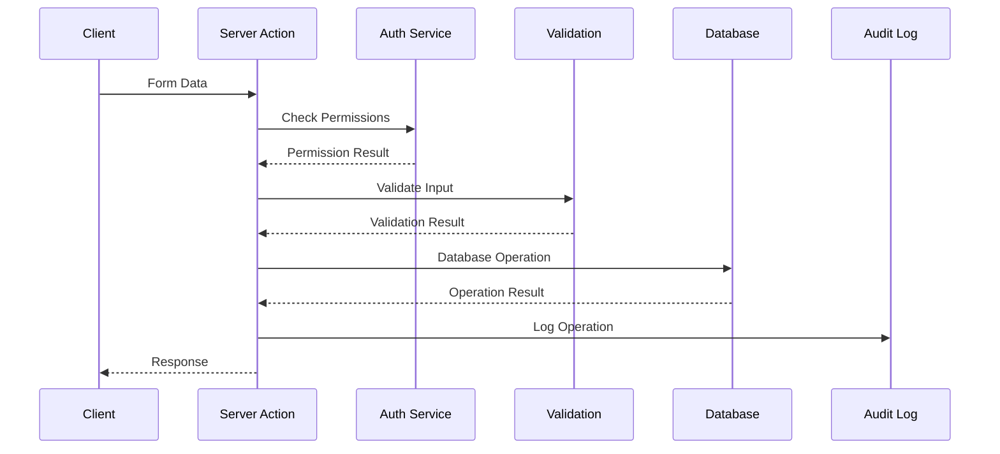

# API Reference - HerbisVeritas

## Vue d'Ensemble

L'API HerbisVeritas utilise les **Next.js Server Actions** pour une architecture server-first type-safe avec validation automatique et gestion d'erreurs robuste.

## Table des Matières

- [Architecture](#architecture)
- [Authentification et Autorisation](#authentification-et-autorisation)
- [Server Actions](#server-actions)
- [Schémas de Validation](#schemas-de-validation)
- [Types TypeScript](#types-typescript)
- [Services Externes](#services-externes)
- [Gestion d'Erreurs](#gestion-derreurs)
- [Rate Limiting](#rate-limiting)

## Architecture

### Diagramme de Flux


```mermaid
sequenceDiagram
    participant Client
    participant Action as Server Action
    participant Auth as Auth Service
    participant Valid as Validation
    participant DB as Database
    participant Audit as Audit Log

    Client->>Action: Form Data
    Action->>Auth: Check Permissions
    Auth-->>Action: Permission Result
    Action->>Valid: Validate Input
    Valid-->>Action: Validation Result
    Action->>DB: Database Operation
    DB-->>Action: Operation Result
    Action->>Audit: Log Operation
    Action-->>Client: Response
```

### Principes Architecturaux

1. **Type Safety** : TypeScript strict avec validation Zod
2. **Security First** : Authentification et autorisation granulaire
3. **Validation Robuste** : Validation côté serveur systématique
4. **Audit Trail** : Logging complet des opérations
5. **Error Handling** : Gestion d'erreurs structurée

## Authentification et Autorisation

### Types de Rôles

```typescript
export type UserRole = "user" | "editor" | "admin" | "dev";

export interface User {
  id: string;
  email: string;
  role: UserRole;
  full_name?: string;
  created_at: string;
}
```

### Vérification Permissions

```typescript
// Vérification rôle admin
export async function checkAdminRole(
  userId: string,
): Promise<AdminCheckResult> {
  const cacheKey = `admin_check_${userId}`;

  // 1. Vérification cache
  if (adminCache.has(cacheKey)) {
    return adminCache.get(cacheKey)!;
  }

  // 2. Vérification base de données
  const { data: profile, error } = await supabase
    .from("profiles")
    .select("role")
    .eq("id", userId)
    .single();

  const result: AdminCheckResult = {
    isAdmin: profile?.role === "admin" || profile?.role === "dev",
    role: profile?.role || "user",
    timestamp: Date.now(),
  };

  // 3. Mise en cache
  adminCache.set(cacheKey, result);

  return result;
}
```

### Middleware Protection

```typescript
export async function middleware(request: NextRequest) {
  const { pathname } = request.nextUrl;

  // Routes protégées admin
  if (pathname.startsWith("/admin")) {
    const { user } = await supabase.auth.getUser();

    if (!user) {
      return NextResponse.redirect("/login");
    }

    const adminCheck = await checkAdminRole(user.id);
    if (!adminCheck.isAdmin) {
      return NextResponse.json(
        { error: "Accès non autorisé" },
        { status: 403 },
      );
    }
  }

  return NextResponse.next();
}
```

## Server Actions

### Actions d'Authentification

#### Login Action

```typescript
export async function loginAction(
  prevState: unknown,
  formData: FormData,
): Promise<ActionResult<User>> {
  try {
    // 1. Validation des données
    const validatedData = LoginSchema.parse({
      email: formData.get("email"),
      password: formData.get("password"),
    });

    // 2. Tentative de connexion
    const { data, error } = await supabase.auth.signInWithPassword({
      email: validatedData.email,
      password: validatedData.password,
    });

    if (error) {
      await logSecurityEvent({
        type: "auth_failure",
        details: { email: validatedData.email },
        severity: "WARNING",
      });

      return {
        success: false,
        error: "Identifiants invalides",
      };
    }

    // 3. Migration panier invité
    const cookies = getCookies();
    const guestUserId = cookies.get("guest_user_id")?.value;

    if (guestUserId && data.user) {
      await migrateAndGetCart({ guestUserId });
    }

    // 4. Audit logging
    await logSecurityEvent({
      type: "auth_success",
      userId: data.user!.id,
      details: { email: validatedData.email },
    });

    revalidatePath("/", "layout");
    redirect("/");

    return {
      success: true,
      data: data.user as User,
    };
  } catch (error) {
    return {
      success: false,
      error: "Erreur de connexion",
    };
  }
}
```

#### Register Action

```typescript
export async function registerAction(
  prevState: unknown,
  formData: FormData,
): Promise<ActionResult<User>> {
  try {
    // 1. Validation
    const validatedData = RegisterSchema.parse({
      email: formData.get("email"),
      password: formData.get("password"),
      confirmPassword: formData.get("confirmPassword"),
      fullName: formData.get("fullName"),
    });

    // 2. Vérification email unique
    const { data: existingUser } = await supabase
      .from("profiles")
      .select("id")
      .eq("email", validatedData.email)
      .single();

    if (existingUser) {
      return {
        success: false,
        error: "Un compte existe déjà avec cet email",
      };
    }

    // 3. Création compte Supabase
    const { data: authData, error: authError } = await supabase.auth.signUp({
      email: validatedData.email,
      password: validatedData.password,
      options: {
        data: {
          full_name: validatedData.fullName,
        },
      },
    });

    if (authError) {
      return {
        success: false,
        error: "Erreur création compte",
      };
    }

    // 4. Création profil
    if (authData.user) {
      const { error: profileError } = await supabase.from("profiles").insert({
        id: authData.user.id,
        email: validatedData.email,
        full_name: validatedData.fullName,
        role: "user",
      });

      if (profileError) {
        logger.error("Erreur création profil", { error: profileError });
      }
    }

    return {
      success: true,
      data: authData.user as User,
      message: "Compte créé avec succès. Vérifiez votre email.",
    };
  } catch (error) {
    if (error instanceof z.ZodError) {
      return {
        success: false,
        error: error.errors[0].message,
      };
    }

    return {
      success: false,
      error: "Erreur création compte",
    };
  }
}
```

### Actions de Panier

#### Add Item to Cart

```typescript
export async function addItemToCart(
  prevState: unknown,
  formData: FormData,
): Promise<ActionResult<CartItem>> {
  try {
    // 1. Validation
    const validatedData = AddToCartSchema.parse({
      productId: formData.get("productId"),
      quantity: parseInt(formData.get("quantity") as string),
    });

    // 2. Récupération utilisateur
    const { user } = await createSupabaseServerClient().auth.getUser();

    // 3. Gestion panier (user ou guest)
    let cartId: string;

    if (user) {
      // Utilisateur authentifié
      const { data: cart } = await supabase
        .from("carts")
        .select("id")
        .eq("user_id", user.id)
        .eq("status", "active")
        .single();

      if (!cart) {
        const { data: newCart } = await supabase
          .from("carts")
          .insert({ user_id: user.id, status: "active" })
          .select("id")
          .single();
        cartId = newCart!.id;
      } else {
        cartId = cart.id;
      }
    } else {
      // Utilisateur invité
      const cookies = getCookies();
      let guestId = cookies.get("guest_user_id")?.value;

      if (!guestId) {
        guestId = crypto.randomUUID();
        cookies.set("guest_user_id", guestId, {
          maxAge: 30 * 24 * 60 * 60, // 30 jours
          httpOnly: false,
          secure: process.env.NODE_ENV === "production",
        });
      }

      const { data: cart } = await supabase
        .from("carts")
        .select("id")
        .eq("guest_id", guestId)
        .eq("status", "active")
        .single();

      if (!cart) {
        const { data: newCart } = await supabase
          .from("carts")
          .insert({ guest_id: guestId, status: "active" })
          .select("id")
          .single();
        cartId = newCart!.id;
      } else {
        cartId = cart.id;
      }
    }

    // 4. Vérification stock
    const { data: product } = await supabase
      .from("products")
      .select("stock_quantity, name, price")
      .eq("id", validatedData.productId)
      .eq("is_active", true)
      .single();

    if (!product) {
      return {
        success: false,
        error: "Produit non trouvé",
      };
    }

    if (product.stock_quantity < validatedData.quantity) {
      return {
        success: false,
        error: "Stock insuffisant",
      };
    }

    // 5. Ajout/mise à jour article
    const { data: cartItem, error } = await supabase.rpc(
      "add_or_update_cart_item",
      {
        p_cart_id: cartId,
        p_product_id: validatedData.productId,
        p_quantity: validatedData.quantity,
      },
    );

    if (error) {
      return {
        success: false,
        error: "Erreur ajout au panier",
      };
    }

    // 6. Revalidation
    revalidatePath("/cart");
    revalidatePath("/shop");

    return {
      success: true,
      data: cartItem,
      message: "Produit ajouté au panier",
    };
  } catch (error) {
    if (error instanceof z.ZodError) {
      return {
        success: false,
        error: error.errors[0].message,
      };
    }

    return {
      success: false,
      error: "Erreur ajout au panier",
    };
  }
}
```

#### Remove Item from Cart

```typescript
export async function removeItemFromCart(
  prevState: unknown,
  formData: FormData,
): Promise<ActionResult<void>> {
  try {
    const cartItemId = formData.get("cartItemId") as string;

    if (!cartItemId) {
      return {
        success: false,
        error: "ID article requis",
      };
    }

    // Suppression avec vérification RLS automatique
    const { error } = await supabase
      .from("cart_items")
      .delete()
      .eq("id", cartItemId);

    if (error) {
      return {
        success: false,
        error: "Erreur suppression article",
      };
    }

    revalidatePath("/cart");

    return {
      success: true,
      message: "Article supprimé du panier",
    };
  } catch (error) {
    return {
      success: false,
      error: "Erreur suppression article",
    };
  }
}
```

### Actions Commandes

#### Create Order

```typescript
export async function createOrderAction(
  prevState: unknown,
  formData: FormData,
): Promise<ActionResult<Order>> {
  try {
    // 1. Authentification requise
    const { user } = await createSupabaseServerClient().auth.getUser();

    if (!user) {
      return {
        success: false,
        error: "Authentification requise",
      };
    }

    // 2. Validation
    const validatedData = CreateOrderSchema.parse({
      cartId: formData.get("cartId"),
      shippingAddressId: formData.get("shippingAddressId"),
      billingAddressId: formData.get("billingAddressId"),
    });

    // 3. Vérification panier non vide
    const { data: cartItems } = await supabase
      .from("cart_items")
      .select("*, products(*)")
      .eq("cart_id", validatedData.cartId);

    if (!cartItems?.length) {
      return {
        success: false,
        error: "Panier vide",
      };
    }

    // 4. Vérification stock
    for (const item of cartItems) {
      if (item.products.stock_quantity < item.quantity) {
        return {
          success: false,
          error: `Stock insuffisant pour ${item.products.name}`,
        };
      }
    }

    // 5. Calcul total
    const totalAmount = cartItems.reduce(
      (sum, item) => sum + item.quantity * item.products.price,
      0,
    );

    // 6. Création commande
    const { data: order, error: orderError } = await supabase
      .from("orders")
      .insert({
        user_id: user.id,
        total_amount: totalAmount,
        shipping_address_id: validatedData.shippingAddressId,
        billing_address_id: validatedData.billingAddressId,
        status: "pending_payment",
      })
      .select()
      .single();

    if (orderError) {
      return {
        success: false,
        error: "Erreur création commande",
      };
    }

    // 7. Création articles commande
    const orderItems = cartItems.map((item) => ({
      order_id: order.id,
      product_id: item.product_id,
      quantity: item.quantity,
      unit_price: item.products.price,
      total_price: item.quantity * item.products.price,
      product_snapshot: {
        name: item.products.name,
        description: item.products.description_short,
      },
    }));

    const { error: itemsError } = await supabase
      .from("order_items")
      .insert(orderItems);

    if (itemsError) {
      // Rollback commande
      await supabase.from("orders").delete().eq("id", order.id);

      return {
        success: false,
        error: "Erreur création articles commande",
      };
    }

    // 8. Mise à jour stock
    for (const item of cartItems) {
      await supabase
        .from("products")
        .update({
          stock_quantity: item.products.stock_quantity - item.quantity,
        })
        .eq("id", item.product_id);
    }

    // 9. Vider panier
    await supabase
      .from("cart_items")
      .delete()
      .eq("cart_id", validatedData.cartId);

    // 10. Audit logging
    await logAuditEvent({
      event_type: "order_created",
      user_id: user.id,
      details: {
        order_id: order.id,
        total_amount: totalAmount,
        items_count: cartItems.length,
      },
    });

    revalidatePath("/orders");
    revalidatePath("/cart");

    return {
      success: true,
      data: order,
      message: "Commande créée avec succès",
    };
  } catch (error) {
    if (error instanceof z.ZodError) {
      return {
        success: false,
        error: error.errors[0].message,
      };
    }

    return {
      success: false,
      error: "Erreur création commande",
    };
  }
}
```

### Actions Produits (Admin)

#### Create Product

```typescript
export async function createProductAction(
  prevState: unknown,
  formData: FormData,
): Promise<ActionResult<Product>> {
  try {
    // 1. Vérification admin
    const { user } = await createSupabaseServerClient().auth.getUser();

    if (!user) {
      return {
        success: false,
        error: "Authentification requise",
      };
    }

    const adminCheck = await checkAdminRole(user.id);
    if (!adminCheck.isAdmin) {
      await logSecurityEvent({
        type: "admin_access_denied",
        userId: user.id,
        details: { action: "create_product" },
        severity: "ERROR",
      });

      return {
        success: false,
        error: "Accès non autorisé",
      };
    }

    // 2. Validation
    const validatedData = CreateProductSchema.parse({
      name: formData.get("name"),
      description_short: formData.get("description_short"),
      description_long: formData.get("description_long"),
      price: parseFloat(formData.get("price") as string),
      stock_quantity: parseInt(formData.get("stock_quantity") as string),
      weight_grams: parseInt(formData.get("weight_grams") as string),
      is_featured: formData.get("is_featured") === "true",
    });

    // 3. Upload image si fournie
    let imageUrl = null;
    const imageFile = formData.get("image") as File;

    if (imageFile && imageFile.size > 0) {
      const uploadResult = await uploadProductImageCore(formData);

      if (!uploadResult.success) {
        return {
          success: false,
          error: uploadResult.error,
        };
      }

      imageUrl = uploadResult.publicUrl;
    }

    // 4. Création produit
    const { data: product, error } = await supabase
      .from("products")
      .insert({
        ...validatedData,
        image_url: imageUrl,
      })
      .select()
      .single();

    if (error) {
      return {
        success: false,
        error: "Erreur création produit",
      };
    }

    // 5. Audit logging
    await logAuditEvent({
      event_type: "product_created",
      user_id: user.id,
      details: {
        product_id: product.id,
        product_name: product.name,
      },
    });

    revalidatePath("/admin/products");
    revalidatePath("/shop");

    return {
      success: true,
      data: product,
      message: "Produit créé avec succès",
    };
  } catch (error) {
    if (error instanceof z.ZodError) {
      return {
        success: false,
        error: error.errors[0].message,
      };
    }

    return {
      success: false,
      error: "Erreur création produit",
    };
  }
}
```

## Schémas de Validation

### Authentification

```typescript
export const LoginSchema = z.object({
  email: z.string().email("Email invalide"),
  password: z.string().min(8, "Mot de passe trop court"),
});

export const RegisterSchema = z
  .object({
    email: z.string().email("Email invalide"),
    password: createPasswordSchema(),
    confirmPassword: z.string(),
    fullName: z.string().min(2, "Nom requis"),
  })
  .refine((data) => data.password === data.confirmPassword, {
    message: "Les mots de passe ne correspondent pas",
    path: ["confirmPassword"],
  });

const createPasswordSchema = () =>
  z
    .string()
    .min(8, "Au moins 8 caractères")
    .regex(/[A-Z]/, "Au moins une majuscule")
    .regex(/[a-z]/, "Au moins une minuscule")
    .regex(/[0-9]/, "Au moins un chiffre")
    .regex(/[^A-Za-z0-9]/, "Au moins un caractère spécial");
```

### Panier

```typescript
export const AddToCartSchema = z.object({
  productId: z.string().uuid("ID produit invalide"),
  quantity: z
    .number()
    .min(1, "Quantité minimum 1")
    .max(10, "Quantité maximum 10"),
});

export const UpdateCartItemSchema = z.object({
  cartItemId: z.string().uuid("ID article invalide"),
  quantity: z
    .number()
    .min(1, "Quantité minimum 1")
    .max(10, "Quantité maximum 10"),
});
```

### Commandes

```typescript
export const CreateOrderSchema = z.object({
  cartId: z.string().uuid("ID panier invalide"),
  shippingAddressId: z.string().uuid("Adresse livraison requise"),
  billingAddressId: z.string().uuid("Adresse facturation requise"),
});

export const UpdateOrderStatusSchema = z.object({
  orderId: z.string().uuid("ID commande invalide"),
  status: z.enum([
    "pending_payment",
    "processing",
    "shipped",
    "delivered",
    "cancelled",
    "refunded",
  ]),
});
```

### Produits

```typescript
export const CreateProductSchema = z.object({
  name: z.string().min(1, "Nom requis").max(100, "Nom trop long"),
  description_short: z.string().max(200, "Description courte trop longue"),
  description_long: z.string().optional(),
  price: z.number().min(0, "Prix invalide"),
  stock_quantity: z.number().min(0, "Stock invalide"),
  weight_grams: z.number().min(0, "Poids invalide").optional(),
  is_featured: z.boolean().default(false),
});

export const UpdateProductSchema = CreateProductSchema.partial();
```

### Adresses

```typescript
export const CreateAddressSchema = z.object({
  address_type: z.enum(["shipping", "billing"]),
  first_name: z.string().min(1, "Prénom requis"),
  last_name: z.string().min(1, "Nom requis"),
  address_line1: z.string().min(1, "Adresse requise"),
  address_line2: z.string().optional(),
  city: z.string().min(1, "Ville requise"),
  postal_code: z.string().min(1, "Code postal requis"),
  country_code: z.string().length(2, "Code pays invalide"),
  phone: z.string().optional(),
});
```

## Types TypeScript

### Core Types

```typescript
export interface ActionResult<T = unknown> {
  success: boolean;
  data?: T;
  error?: string;
  message?: string;
}

export interface User {
  id: string;
  email: string;
  full_name?: string;
  role: UserRole;
  created_at: string;
}

export interface Product {
  id: string;
  name: string;
  description_short?: string;
  description_long?: string;
  price: number;
  stock_quantity: number;
  is_active: boolean;
  is_featured: boolean;
  image_url?: string;
  weight_grams?: number;
  created_at: string;
  updated_at: string;
}

export interface CartItem {
  id: string;
  cart_id: string;
  product_id: string;
  quantity: number;
  added_at: string;
  products?: Product;
}

export interface Cart {
  id: string;
  user_id?: string;
  guest_id?: string;
  status: string;
  created_at: string;
  cart_items?: CartItem[];
}

export interface Order {
  id: string;
  user_id?: string;
  total_amount: number;
  status: OrderStatus;
  payment_status: PaymentStatus;
  stripe_checkout_id?: string;
  shipping_address_id?: string;
  billing_address_id?: string;
  guest_email?: string;
  guest_phone?: string;
  created_at: string;
}

export interface OrderItem {
  id: string;
  order_id: string;
  product_id: string;
  quantity: number;
  unit_price: number;
  total_price: number;
  product_snapshot?: any;
  created_at: string;
}

export interface Address {
  id: string;
  user_id: string;
  address_type: "shipping" | "billing";
  first_name: string;
  last_name: string;
  address_line1: string;
  address_line2?: string;
  city: string;
  postal_code: string;
  country_code: string;
  phone?: string;
  is_default: boolean;
  created_at: string;
}
```

### Enums

```typescript
export type UserRole = "user" | "editor" | "admin" | "dev";

export type OrderStatus =
  | "pending_payment"
  | "processing"
  | "shipped"
  | "delivered"
  | "cancelled"
  | "refunded";

export type PaymentStatus = "pending" | "succeeded" | "failed" | "refunded";

export type EventSeverity = "INFO" | "WARNING" | "ERROR" | "CRITICAL";
```

## Services Externes

### Stripe Integration

#### Create Checkout Session

```typescript
export async function createCheckoutSession(
  orderId: string,
  items: CartItem[],
  addresses: {
    shipping: Address;
    billing: Address;
  },
): Promise<ActionResult<{ sessionUrl: string }>> {
  try {
    const lineItems = items.map((item) => ({
      price_data: {
        currency: "eur",
        product_data: {
          name: item.products!.name,
          description: item.products!.description_short,
          images: item.products!.image_url ? [item.products!.image_url] : [],
        },
        unit_amount: Math.round(item.products!.price * 100),
      },
      quantity: item.quantity,
    }));

    const session = await stripe.checkout.sessions.create({
      payment_method_types: ["card"],
      line_items: lineItems,
      mode: "payment",
      success_url: `${process.env.NEXT_PUBLIC_BASE_URL}/orders/${orderId}/success`,
      cancel_url: `${process.env.NEXT_PUBLIC_BASE_URL}/cart`,
      metadata: {
        order_id: orderId,
      },
      shipping_address_collection: {
        allowed_countries: ["FR", "BE", "CH", "LU"],
      },
      billing_address_collection: "required",
    });

    // Mise à jour commande avec session ID
    await supabase
      .from("orders")
      .update({ stripe_checkout_id: session.id })
      .eq("id", orderId);

    return {
      success: true,
      data: { sessionUrl: session.url! },
    };
  } catch (error) {
    logger.error("Erreur création session Stripe", { error, orderId });

    return {
      success: false,
      error: "Erreur traitement paiement",
    };
  }
}
```

#### Stripe Webhooks

```typescript
export async function POST(request: Request) {
  const signature = request.headers.get("stripe-signature");

  if (!signature) {
    return new Response("No signature", { status: 401 });
  }

  try {
    const payload = await request.text();
    const event = stripe.webhooks.constructEvent(
      payload,
      signature,
      process.env.STRIPE_WEBHOOK_SECRET!,
    );

    switch (event.type) {
      case "checkout.session.completed":
        await handleCheckoutCompleted(
          event.data.object as Stripe.Checkout.Session,
        );
        break;

      case "payment_intent.succeeded":
        await handlePaymentSucceeded(event.data.object as Stripe.PaymentIntent);
        break;

      case "payment_intent.payment_failed":
        await handlePaymentFailed(event.data.object as Stripe.PaymentIntent);
        break;

      default:
        logger.info("Événement Stripe non géré", { type: event.type });
    }

    return new Response("OK", { status: 200 });
  } catch (error) {
    logger.error("Erreur webhook Stripe", { error });
    return new Response("Webhook error", { status: 400 });
  }
}

async function handleCheckoutCompleted(session: Stripe.Checkout.Session) {
  const orderId = session.metadata?.order_id;

  if (!orderId) {
    logger.error("Order ID manquant dans session Stripe", {
      sessionId: session.id,
    });
    return;
  }

  // Mise à jour statut commande
  const { error } = await supabase
    .from("orders")
    .update({
      status: "processing",
      payment_status: "succeeded",
      stripe_payment_intent_id: session.payment_intent as string,
    })
    .eq("id", orderId);

  if (error) {
    logger.error("Erreur mise à jour commande", { error, orderId });
  }

  // Audit logging
  await logAuditEvent({
    event_type: "payment_succeeded",
    details: {
      order_id: orderId,
      session_id: session.id,
      amount: session.amount_total,
    },
  });
}
```

## Gestion d'Erreurs

### Error Handling Pattern

```typescript
export class AppError extends Error {
  constructor(
    message: string,
    public code: string,
    public statusCode: number = 500,
    public details?: any,
  ) {
    super(message);
    this.name = "AppError";
  }
}

export function handleActionError(error: unknown): ActionResult<never> {
  if (error instanceof AppError) {
    logger.error("Application error", {
      message: error.message,
      code: error.code,
      details: error.details,
    });

    return {
      success: false,
      error: error.message,
    };
  }

  if (error instanceof z.ZodError) {
    const firstError = error.errors[0];

    return {
      success: false,
      error: `${firstError.path.join(".")}: ${firstError.message}`,
    };
  }

  logger.error("Unexpected error", { error });

  return {
    success: false,
    error: "Une erreur inattendue s'est produite",
  };
}
```

### Database Error Handling

```typescript
export function handleSupabaseError(error: any): string {
  if (!error) return "Erreur inconnue";

  // Contraintes d'unicité
  if (error.code === "23505") {
    if (error.constraint?.includes("email")) {
      return "Cet email est déjà utilisé";
    }
    return "Cette valeur existe déjà";
  }

  // Contraintes de clé étrangère
  if (error.code === "23503") {
    return "Référence invalide";
  }

  // Contraintes de validation
  if (error.code === "23514") {
    return "Données invalides";
  }

  // RLS violation
  if (error.code === "42501") {
    return "Accès non autorisé";
  }

  return error.message || "Erreur base de données";
}
```

## Rate Limiting

### Implementation

```typescript
interface RateLimitConfig {
  windowMs: number;
  maxRequests: number;
  keyGenerator: (request: NextRequest) => string;
}

const rateLimitStore = new Map<string, { count: number; resetTime: number }>();

export function createRateLimit(config: RateLimitConfig) {
  return async function rateLimit(request: NextRequest): Promise<boolean> {
    const key = config.keyGenerator(request);
    const now = Date.now();

    const record = rateLimitStore.get(key);

    if (!record || now > record.resetTime) {
      rateLimitStore.set(key, {
        count: 1,
        resetTime: now + config.windowMs,
      });
      return true;
    }

    if (record.count >= config.maxRequests) {
      return false;
    }

    record.count++;
    return true;
  };
}

// Rate limiters par type
export const authRateLimit = createRateLimit({
  windowMs: 15 * 60 * 1000, // 15 minutes
  maxRequests: 5,
  keyGenerator: (req) => req.ip || "unknown",
});

export const apiRateLimit = createRateLimit({
  windowMs: 60 * 1000, // 1 minute
  maxRequests: 100,
  keyGenerator: (req) => req.ip || "unknown",
});

export const adminRateLimit = createRateLimit({
  windowMs: 60 * 1000, // 1 minute
  maxRequests: 30,
  keyGenerator: (req) => req.headers.get("user-id") || req.ip || "unknown",
});
```

### Usage in Actions

```typescript
export async function loginAction(
  prevState: unknown,
  formData: FormData,
): Promise<ActionResult<User>> {
  // Rate limiting check
  const request = getCurrentRequest(); // Utility function
  const isAllowed = await authRateLimit(request);

  if (!isAllowed) {
    await logSecurityEvent({
      type: "rate_limit_exceeded",
      details: { action: "login", ip: request.ip },
      severity: "WARNING",
    });

    return {
      success: false,
      error: "Trop de tentatives. Réessayez plus tard.",
    };
  }

  // Continue with login logic...
}
```

## Audit et Monitoring

### Audit Events

```typescript
export interface AuditEvent {
  event_type: string;
  user_id?: string;
  table_name?: string;
  record_id?: string;
  old_values?: any;
  new_values?: any;
  details?: any;
  ip_address?: string;
  user_agent?: string;
  severity?: EventSeverity;
}

export async function logAuditEvent(event: AuditEvent): Promise<void> {
  try {
    await supabase.from("audit_logs").insert({
      ...event,
      created_at: new Date().toISOString(),
    });
  } catch (error) {
    logger.error("Failed to log audit event", { error, event });
  }
}

export async function logSecurityEvent(event: {
  type: string;
  userId?: string;
  details?: any;
  severity?: EventSeverity;
}): Promise<void> {
  await logAuditEvent({
    event_type: event.type,
    user_id: event.userId,
    details: event.details,
    severity: event.severity || "INFO",
  });
}
```

### Performance Monitoring

```typescript
export function withPerformanceMonitoring<T extends any[], R>(
  fn: (...args: T) => Promise<R>,
  actionName: string,
) {
  return async (...args: T): Promise<R> => {
    const startTime = performance.now();

    try {
      const result = await fn(...args);
      const duration = performance.now() - startTime;

      logger.info("Action completed", {
        action: actionName,
        duration: Math.round(duration),
        success: true,
      });

      return result;
    } catch (error) {
      const duration = performance.now() - startTime;

      logger.error("Action failed", {
        action: actionName,
        duration: Math.round(duration),
        error,
      });

      throw error;
    }
  };
}

// Usage
export const monitoredLoginAction = withPerformanceMonitoring(
  loginAction,
  "login",
);
```

## Cache Invalidation

### Revalidation Strategy

```typescript
export const revalidationPaths = {
  // User actions
  login: ["/", "/profile"],
  logout: ["/", "/cart"],
  register: ["/"],

  // Cart actions
  addToCart: ["/cart", "/shop"],
  removeFromCart: ["/cart"],
  updateCart: ["/cart"],

  // Order actions
  createOrder: ["/orders", "/cart"],
  updateOrder: ["/orders", "/admin/orders"],

  // Product actions (admin)
  createProduct: ["/shop", "/admin/products", "/"],
  updateProduct: ["/shop", "/admin/products", "/products/[id]"],
  deleteProduct: ["/shop", "/admin/products"],

  // Address actions
  createAddress: ["/profile/addresses", "/checkout"],
  updateAddress: ["/profile/addresses", "/checkout"],
  deleteAddress: ["/profile/addresses"],
};

export function revalidateAfterAction(
  action: keyof typeof revalidationPaths,
): void {
  const paths = revalidationPaths[action];

  paths.forEach((path) => {
    revalidatePath(path);
  });
}
```

## API Routes (REST Endpoints)

### Health Check

```typescript
// app/api/health/route.ts
export async function GET() {
  try {
    // Test database connection
    const { error } = await supabase.from("profiles").select("id").limit(1);

    if (error) {
      return Response.json(
        {
          status: "unhealthy",
          error: "Database connection failed",
        },
        { status: 503 },
      );
    }

    return Response.json({
      status: "healthy",
      timestamp: new Date().toISOString(),
      version: process.env.npm_package_version || "1.0.0",
    });
  } catch (error) {
    return Response.json(
      {
        status: "unhealthy",
        error: "Health check failed",
      },
      { status: 503 },
    );
  }
}
```

### Admin Statistics

```typescript
// app/api/admin/stats/route.ts
export async function GET(request: NextRequest) {
  try {
    // Admin authentication
    const { user } = await createSupabaseServerClient().auth.getUser();

    if (!user) {
      return Response.json({ error: "Unauthorized" }, { status: 401 });
    }

    const adminCheck = await checkAdminRole(user.id);
    if (!adminCheck.isAdmin) {
      return Response.json({ error: "Forbidden" }, { status: 403 });
    }

    // Gather statistics
    const [
      { count: totalUsers },
      { count: totalProducts },
      { count: totalOrders },
      { data: recentOrders },
    ] = await Promise.all([
      supabase.from("profiles").select("*", { count: "exact", head: true }),
      supabase.from("products").select("*", { count: "exact", head: true }),
      supabase.from("orders").select("*", { count: "exact", head: true }),
      supabase
        .from("orders")
        .select("*, profiles(full_name)")
        .order("created_at", { ascending: false })
        .limit(10),
    ]);

    const stats = {
      users: totalUsers || 0,
      products: totalProducts || 0,
      orders: totalOrders || 0,
      recentOrders: recentOrders || [],
      generatedAt: new Date().toISOString(),
    };

    return Response.json(stats);
  } catch (error) {
    logger.error("Error fetching admin stats", { error });

    return Response.json({ error: "Internal server error" }, { status: 500 });
  }
}
```

## Conclusion

L'API HerbisVeritas offre une architecture robuste et type-safe basée sur les Server Actions de Next.js, avec :

- **Type Safety** : Validation Zod complète côté serveur
- **Security** : Authentification granulaire et audit trail complet
- **Performance** : Gestion optimisée du cache et des revalidations
- **Reliability** : Gestion d'erreurs structurée et rate limiting
- **Maintainability** : Code modulaire avec patterns cohérents

Cette approche garantit une API évolutive, sécurisée et performante pour une application e-commerce moderne.

---

_Documentation maintenue par l'équipe technique HerbisVeritas_
