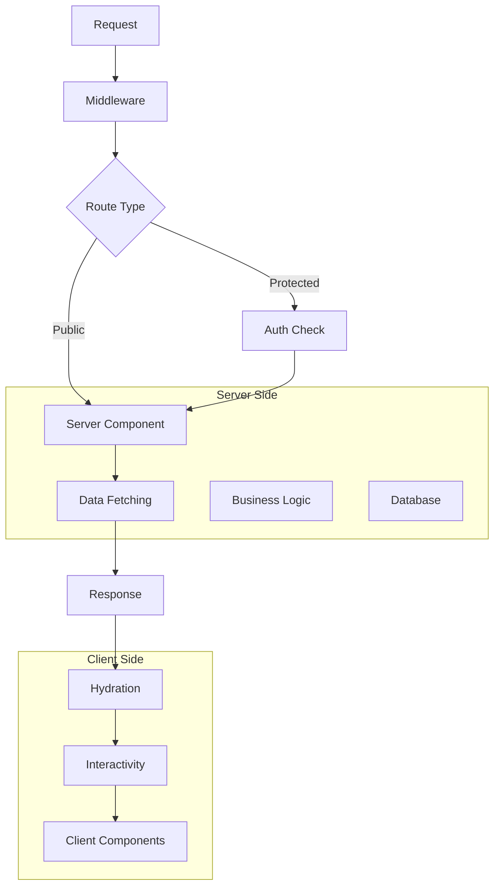
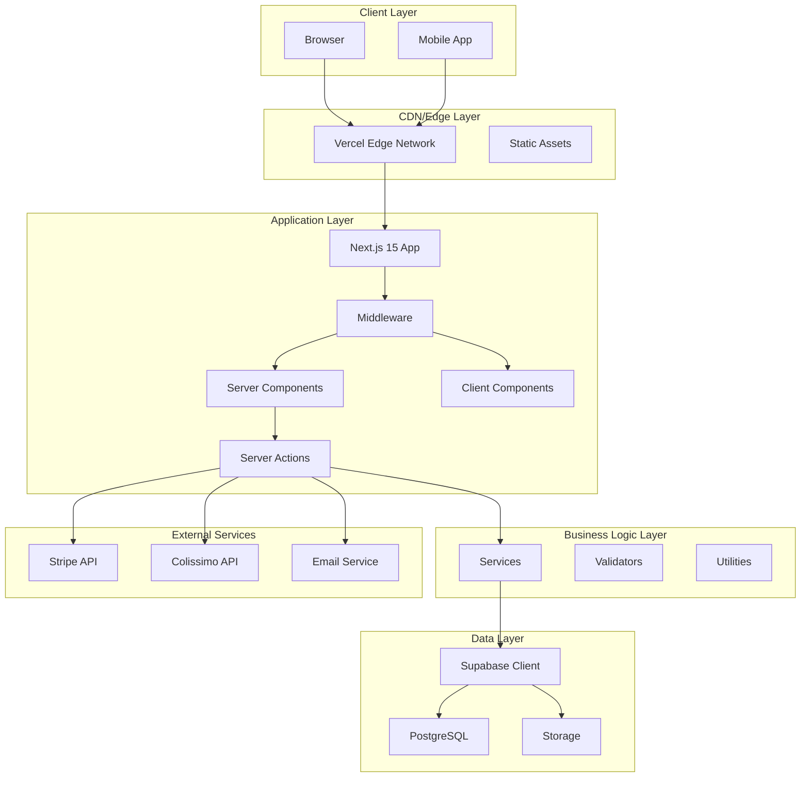
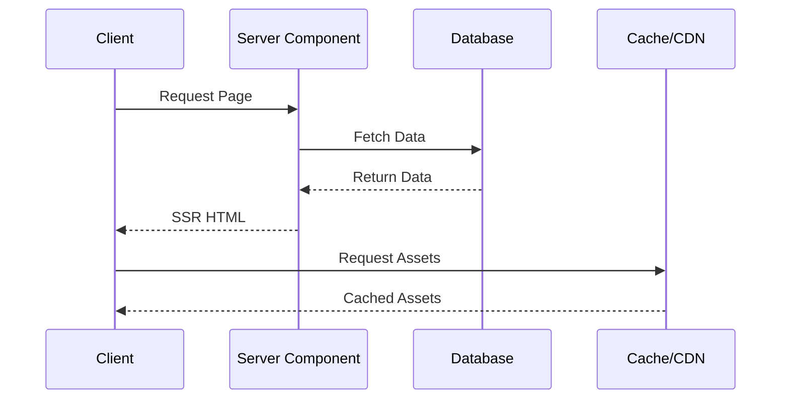
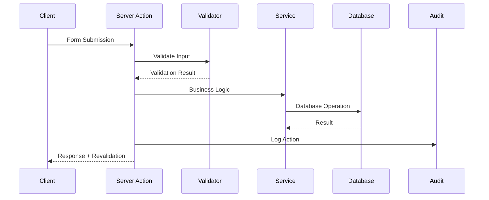
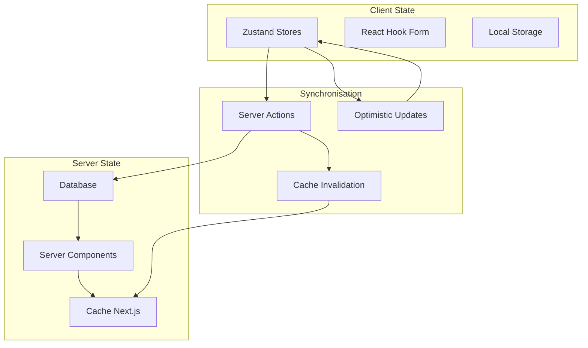
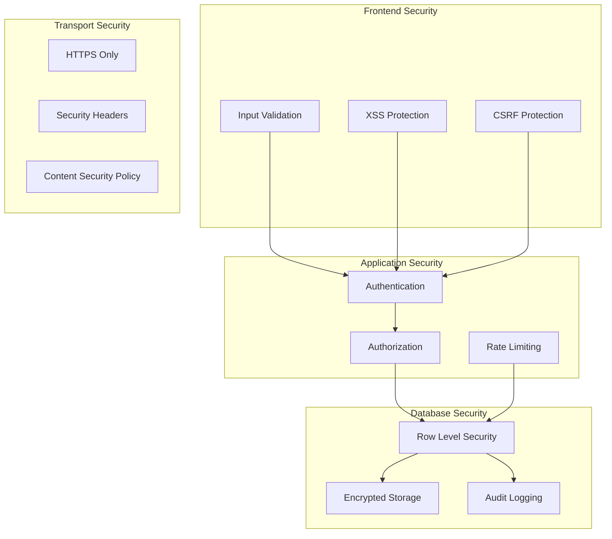

# Guide d'Architecture - HerbisVeritas

## Vue d'Ensemble

HerbisVeritas est une plateforme e-commerce moderne construite selon une architecture **server-first** avec Next.js 15 App Router. L'architecture privilégie la performance, la sécurité et la maintenabilité à travers une approche progressive et modulaire.

## Table des Matières

- [Principes Architecturaux](#principes-architecturaux)
- [Architecture Globale](#architecture-globale)
- [Couches Applicatives](#couches-applicatives)
- [Patterns de Conception](#patterns-de-conception)
- [Flux de Données](#flux-de-données)
- [Gestion des États](#gestion-des-états)
- [Sécurité](#sécurité)
- [Performance](#performance)

## Principes Architecturaux

### 1. Server-First Architecture



**Avantages :**
- SEO optimisé par défaut
- Temps de chargement initial réduit
- Sécurité renforcée (logique serveur)
- Résilience aux pannes réseau

### 2. Progressive Enhancement

L'application fonctionne même sans JavaScript activé, avec amélioration progressive des fonctionnalités.

### 3. Type Safety Complète

- TypeScript strict mode
- Validation runtime avec Zod
- Types générés depuis Supabase
- Zero `any` policy

### 4. Security by Design

- Row Level Security (RLS) par défaut
- Middleware de protection des routes
- Audit automatique des actions sensibles
- Validation double (client/serveur)

## Architecture Globale

### Diagramme de l'Architecture



### Technologies par Couche

| Couche | Technologies | Responsabilités |
|--------|-------------|----------------|
| **Présentation** | Next.js 15, React 19, Tailwind | UI/UX, Routing, SSR/SSG |
| **Application** | Server Components, Server Actions | Logique applicative, State |
| **Business** | TypeScript, Zod | Règles métier, Validation |
| **Données** | Supabase, PostgreSQL | Persistance, RLS |
| **Infrastructure** | Vercel, Edge Functions | Déploiement, Performance |

## Couches Applicatives

### 1. Couche Présentation

```typescript
// Structure des composants
src/components/
├── ui/              # Design system (shadcn/ui)
├── common/          # Composants réutilisables
├── features/        # Composants métier
├── forms/           # Formulaires avec validation
├── layout/          # Structure de page
└── admin/           # Interface administration
```

**Responsabilités :**
- Rendu de l'interface utilisateur
- Gestion des interactions
- Validation côté client
- Accessibilité et responsive design

### 2. Couche Application

```typescript
// Server Actions pattern
export async function createOrderAction(
  prevState: unknown,
  formData: FormData
): Promise<ActionResult> {
  try {
    // 1. Validation
    const validation = orderSchema.safeParse(data);
    
    // 2. Authentication
    const user = await getCurrentUser();
    
    // 3. Authorization
    await checkPermissions(user, 'orders:create');
    
    // 4. Business Logic
    const result = await orderService.create(validation.data);
    
    // 5. Audit
    await auditService.log('ORDER_CREATED', user.id, result);
    
    return { success: true, data: result };
  } catch (error) {
    return { success: false, error: error.message };
  }
}
```

### 3. Couche Services

```typescript
// Service pattern
export class OrderService {
  private supabase: SupabaseClient;
  
  async create(orderData: CreateOrderInput): Promise<Order> {
    // Transaction avec rollback automatique
    return await this.supabase.rpc('create_order_from_cart', {
      cart_id: orderData.cartId,
      shipping_address_id: orderData.shippingAddressId,
      billing_address_id: orderData.billingAddressId
    });
  }
  
  async updateStatus(orderId: string, status: OrderStatus): Promise<void> {
    // Mise à jour avec validation métier
  }
}
```

## Patterns de Conception

### 1. Server Actions Pattern

**Usage :** Mutations de données avec validation et audit automatique.

```typescript
// Pattern standard pour toutes les actions
export async function actionTemplate(
  prevState: unknown,
  formData: FormData
): Promise<ActionResult<T>> {
  try {
    // Validation Zod
    const validation = schema.safeParse(data);
    if (!validation.success) {
      return createValidationError(validation.error);
    }
    
    // Authentification
    const user = await getAuthenticatedUser();
    
    // Autorisation
    await verifyPermissions(user, requiredPermission);
    
    // Logique métier
    const result = await businessService.execute(validation.data);
    
    // Cache invalidation
    revalidateTag(cacheTag);
    
    // Audit logging
    await logAction(actionType, user.id, result);
    
    return createSuccessResult(result);
  } catch (error) {
    return createErrorResult(error);
  }
}
```

### 2. Component Composition Pattern

```typescript
// Composition over inheritance
export function ProductCard({ product }: ProductCardProps) {
  return (
    <Card>
      <CardHeader>
        <ProductImage src={product.image} alt={product.name} />
        <ProductTitle>{product.name}</ProductTitle>
      </CardHeader>
      <CardContent>
        <ProductPrice price={product.price} />
        <ProductDescription>{product.description}</ProductDescription>
      </CardContent>
      <CardFooter>
        <AddToCartButton productId={product.id} />
      </CardFooter>
    </Card>
  );
}
```

### 3. Custom Hooks Pattern

```typescript
// Encapsulation de la logique réutilisable
export function useOptimisticCart() {
  const [optimisticItems, setOptimisticItems] = useOptimistic(
    cartItems,
    (state, action) => {
      switch (action.type) {
        case 'ADD_ITEM':
          return [...state, action.item];
        case 'REMOVE_ITEM':
          return state.filter(item => item.id !== action.itemId);
        default:
          return state;
      }
    }
  );
  
  return {
    items: optimisticItems,
    addItem: (item) => setOptimisticItems({ type: 'ADD_ITEM', item }),
    removeItem: (itemId) => setOptimisticItems({ type: 'REMOVE_ITEM', itemId })
  };
}
```

## Flux de Données

### 1. Lecture de Données (Server Components)



### 2. Mutations (Server Actions)



### 3. État Client (Zustand + Server State)

```typescript
// Hybride client/server state
export const useCartStore = create<CartStore>()(
  persist(
    (set, get) => ({
      // État optimiste
      items: [],
      
      // Actions avec synchronisation serveur
      addItem: async (product, quantity) => {
        // 1. Mise à jour optimiste
        set(state => ({
          items: [...state.items, { ...product, quantity }]
        }));
        
        try {
          // 2. Synchronisation serveur
          const result = await addToCartAction(product.id, quantity);
          
          if (!result.success) {
            // 3. Rollback en cas d'erreur
            set(state => ({
              items: state.items.filter(item => item.id !== product.id)
            }));
            throw new Error(result.error);
          }
        } catch (error) {
          // Gestion d'erreur avec rollback
        }
      }
    }),
    {
      name: 'cart-storage',
      version: 1
    }
  )
);
```

## Gestion des États

### Architecture Hybride



### Stratégies par Type de Données

| Type de Données | Stratégie | Outil |
|-----------------|-----------|-------|
| **Données utilisateur** | Server State | Server Components |
| **Panier** | Hybride | Zustand + Server Actions |
| **Formulaires** | Client State | React Hook Form |
| **Préférences UI** | Client State | localStorage |
| **Cache API** | Server State | Next.js Cache |

## Sécurité

### Architecture de Sécurité Multi-Couches



### Implémentation RLS

```sql
-- Politique de sécurité granulaire
CREATE POLICY "users_own_profile" ON profiles
  FOR ALL USING (auth.uid() = id);

CREATE POLICY "admins_read_all_profiles" ON profiles
  FOR SELECT USING (
    auth.uid() = id OR 
    (SELECT role FROM profiles WHERE id = auth.uid()) = 'admin'
  );
```

## Performance

### Stratégies d'Optimisation

#### 1. Rendu Côté Serveur

- Server Components par défaut
- Streaming avec Suspense
- Génération statique quand possible

#### 2. Cache Multi-Niveaux

```typescript
// Cache strategies
export async function getProducts() {
  return await fetch('/api/products', {
    next: {
      revalidate: 3600,  // ISR avec revalidation
      tags: ['products'] // Cache invalidation ciblée
    }
  });
}

// Invalidation ciblée
export async function updateProduct(id: string) {
  await updateProductInDB(id);
  revalidateTag('products'); // Invalide seulement les produits
}
```

#### 3. Optimisation des Images

```typescript
// Configuration Next.js
const nextConfig = {
  images: {
    remotePatterns: [
      {
        protocol: 'https',
        hostname: 'supabase-storage.com',
        pathname: '/storage/v1/object/public/**'
      }
    ],
    formats: ['image/webp', 'image/avif'],
    deviceSizes: [640, 750, 828, 1080, 1200, 1920]
  }
};
```

#### 4. Code Splitting Automatique

- Route-based splitting (App Router)
- Dynamic imports pour composants lourds
- Lazy loading avec Suspense

### Métriques de Performance

| Métrique | Cible | Mesure |
|----------|-------|--------|
| **First Contentful Paint** | < 1.5s | Lighthouse |
| **Largest Contentful Paint** | < 2.5s | Web Vitals |
| **Cumulative Layout Shift** | < 0.1 | Core Web Vitals |
| **Time to Interactive** | < 3s | Lighthouse |

## Évolutivité

### Architecture Modulaire

```
src/
├── modules/           # Modules métier isolés
│   ├── auth/         # Authentification
│   ├── cart/         # Panier
│   ├── orders/       # Commandes
│   └── products/     # Catalogue
├── shared/           # Code partagé
│   ├── ui/           # Composants UI
│   ├── utils/        # Utilitaires
│   └── types/        # Types globaux
└── app/              # Configuration routes
```

### Stratégie de Montée en Charge

1. **Vertical Scaling** : Augmentation des ressources Vercel
2. **Edge Functions** : Distribution géographique
3. **Database Scaling** : Read replicas Supabase
4. **CDN Optimization** : Cache agressif des assets

### Migration Strategy

Pour une croissance future, l'architecture permet :

- **Microservices** : Extraction graduelle de modules
- **Database Sharding** : Partition par tenant/région
- **API Gateway** : Centralisation des accès
- **Event Sourcing** : Traçabilité complète des actions

## Conclusion

L'architecture HerbisVeritas privilégie :

- **Simplicité** : Patterns cohérents et prévisibles
- **Performance** : Server-first avec optimisations ciblées
- **Sécurité** : Protection multi-couches et audit complet
- **Maintenabilité** : Type safety et modularité
- **Évolutivité** : Architecture préparée pour la croissance

Cette approche garantit une base solide pour le développement et la maintenance à long terme de la plateforme.