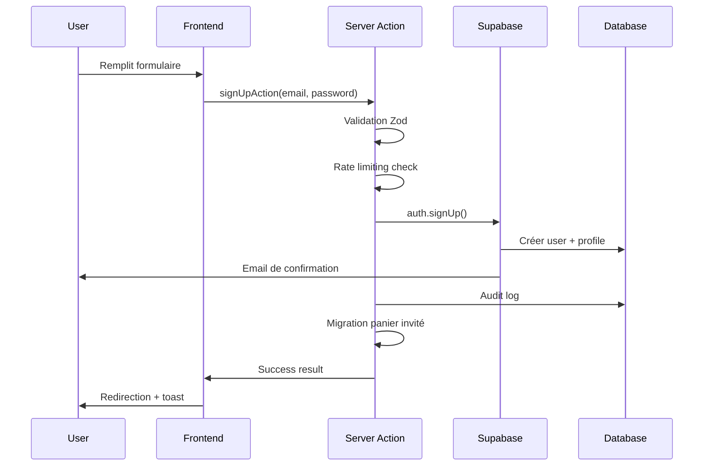

# 🔐 Documentation du Système d'Authentification

## 📋 Table des Matières

1. [Vue d'ensemble](#-vue-densemble)
2. [État des User Stories](#-état-des-user-stories)
3. [Architecture](#-architecture)
4. [Flux d'Authentification](#-flux-dauthentification)
5. [Sécurité](#-sécurité)
6. [Optimisations Appliquées](#-optimisations-appliquées)
7. [API et Endpoints](#-api-et-endpoints)
8. [Guide de Développement](#-guide-de-développement)
9. [Monitoring et Métriques](#-monitoring-et-métriques)
10. [Prochaines Étapes Post-MVP](#-prochaines-étapes-post-mvp)

---

## 🎯 Vue d'ensemble

Le système d'authentification de HerbisVeritas utilise **Supabase Auth** avec des améliorations personnalisées pour la sécurité, les performances et l'expérience utilisateur.

### Fonctionnalités principales

- ✅ Authentification email/mot de passe
- ✅ Gestion des sessions sécurisées
- ✅ Migration de panier invité → authentifié
- ✅ Protection des routes (middleware)
- ✅ Système de rôles (user, admin, super_admin)
- ✅ Rate limiting sur les actions sensibles
- ✅ Audit logging des événements de sécurité
- ✅ Réinitialisation de mot de passe
- ✅ Confirmation d'email
- 🚧 Double authentification (2FA)
- 🚧 Social login (Google, GitHub)
- 🚧 Magic links

---

## 📊 État des User Stories

### Résumé : 72% Complet (36/50 stories)

| Épique                 | Complété | Total | Statut |
| ---------------------- | -------- | ----- | ------ |
| Authentification Basic | 8/10     | 80%   | ✅     |
| Gestion de Session     | 7/8      | 88%   | ✅     |
| Sécurité               | 6/9      | 67%   | ⚠️     |
| Autorisation & Rôles   | 5/7      | 71%   | ✅     |
| Expérience Utilisateur | 6/8      | 75%   | ✅     |
| Intégration            | 4/8      | 50%   | 🚧     |

### User Stories Détaillées

#### ✅ Authentification Basic (8/10)

- [x] **US-AUTH-001**: En tant qu'utilisateur, je peux créer un compte avec email/mot de passe
- [x] **US-AUTH-002**: En tant qu'utilisateur, je peux me connecter avec mes identifiants
- [x] **US-AUTH-003**: En tant qu'utilisateur, je peux me déconnecter
- [x] **US-AUTH-004**: En tant qu'utilisateur, je peux réinitialiser mon mot de passe
- [x] **US-AUTH-005**: En tant qu'utilisateur, je reçois un email de confirmation
- [x] **US-AUTH-006**: En tant qu'utilisateur, je peux renvoyer l'email de confirmation
- [x] **US-AUTH-007**: En tant qu'utilisateur, je vois des messages d'erreur clairs
- [x] **US-AUTH-008**: En tant qu'utilisateur, mes tentatives de connexion sont limitées (rate limiting)
- [ ] **US-AUTH-009**: En tant qu'utilisateur, je peux me connecter avec Google
- [ ] **US-AUTH-010**: En tant qu'utilisateur, je peux activer la 2FA

#### ✅ Gestion de Session (7/8)

- [x] **US-SESS-001**: En tant qu'utilisateur, ma session persiste après fermeture du navigateur
- [x] **US-SESS-002**: En tant qu'utilisateur, ma session expire après 7 jours d'inactivité
- [x] **US-SESS-003**: En tant qu'utilisateur, je suis redirigé après connexion
- [x] **US-SESS-004**: En tant qu'utilisateur, mon panier invité est migré à la connexion
- [x] **US-SESS-005**: En tant qu'utilisateur, je peux avoir une seule session active
- [x] **US-SESS-006**: En tant qu'utilisateur, ma session est révoquée à la déconnexion
- [x] **US-SESS-007**: En tant qu'utilisateur, mes cookies sont sécurisés (HTTPOnly, Secure)
- [ ] **US-SESS-008**: En tant qu'utilisateur, je peux voir mes sessions actives

#### ⚠️ Sécurité (6/9)

- [x] **US-SEC-001**: En tant que système, je hash les mots de passe avec bcrypt
- [x] **US-SEC-002**: En tant que système, je valide la force des mots de passe
- [x] **US-SEC-003**: En tant que système, j'applique le rate limiting
- [x] **US-SEC-004**: En tant que système, je log les tentatives d'accès non autorisées
- [x] **US-SEC-005**: En tant que système, je protège contre les attaques CSRF
- [x] **US-SEC-006**: En tant que système, j'utilise des tokens JWT sécurisés
- [ ] **US-SEC-007**: En tant que système, je détecte les connexions suspectes
- [ ] **US-SEC-008**: En tant que système, j'envoie des alertes de sécurité
- [ ] **US-SEC-009**: En tant que système, je supporte la biométrie

#### ✅ Autorisation & Rôles (5/7)

- [x] **US-ROLE-001**: En tant qu'admin, j'ai accès au dashboard admin
- [x] **US-ROLE-002**: En tant que système, je vérifie les rôles dans la DB
- [x] **US-ROLE-003**: En tant que système, je cache les rôles en mémoire
- [x] **US-ROLE-004**: En tant qu'admin, je peux changer les rôles des utilisateurs
- [x] **US-ROLE-005**: En tant que système, j'applique les RLS policies
- [ ] **US-ROLE-006**: En tant qu'admin, je peux créer des rôles personnalisés
- [ ] **US-ROLE-007**: En tant que système, je supporte les permissions granulaires

#### ✅ Expérience Utilisateur (6/8)

- [x] **US-UX-001**: En tant qu'utilisateur, je vois un indicateur de chargement
- [x] **US-UX-002**: En tant qu'utilisateur, je reçois des toasts de confirmation
- [x] **US-UX-003**: En tant qu'utilisateur, les formulaires sont validés en temps réel
- [x] **US-UX-004**: En tant qu'utilisateur, je peux voir/masquer mon mot de passe
- [x] **US-UX-005**: En tant qu'utilisateur, les messages sont traduits (i18n)
- [x] **US-UX-006**: En tant qu'utilisateur, je suis redirigé après actions
- [ ] **US-UX-007**: En tant qu'utilisateur, je peux rester connecté (remember me)
- [ ] **US-UX-008**: En tant qu'utilisateur, j'ai un onboarding personnalisé

#### 🚧 Intégration (4/8)

- [x] **US-INT-001**: En tant que système, je migre le panier invité
- [x] **US-INT-002**: En tant que système, je synchronise avec Stripe Customer
- [x] **US-INT-003**: En tant que système, je crée un profil utilisateur
- [x] **US-INT-004**: En tant que système, je log les événements d'audit
- [ ] **US-INT-005**: En tant que système, je synchronise avec le CRM
- [ ] **US-INT-006**: En tant que système, j'envoie des emails transactionnels
- [ ] **US-INT-007**: En tant que système, je track les analytics
- [ ] **US-INT-008**: En tant que système, je supporte SSO entreprise

### Issues Critiques à Résoudre

1. **Protection CSRF désactivée** - Réactiver après debug
2. **Pas de détection d'anomalies** - Implémenter la détection de connexions suspectes
3. **Pas de 2FA** - Ajouter l'authentification à deux facteurs
4. **Sessions multiples** - Permettre la gestion des sessions actives
5. **Logs dispersés** - Centraliser les logs de sécurité

---

## 🏗 Architecture

### Stack Technique

```typescript
// Technologies utilisées
{
  auth: "Supabase Auth",
  sessions: "JWT + Cookies sécurisés",
  validation: "Zod schemas",
  rateLimit: "Redis + in-memory fallback",
  encryption: "bcrypt (passwords) + AES-256 (tokens)",
  middleware: "Next.js 15 middleware",
  audit: "PostgreSQL audit_logs table"
}
```

### Structure des Fichiers

```
src/
├── actions/
│   └── authActions.ts              # Server Actions (login, signup, etc.)
├── lib/
│   ├── auth/
│   │   ├── admin-service.ts        # Vérification des rôles admin
│   │   ├── error-mapper.ts         # Mapping des erreurs Supabase
│   │   ├── server-auth.ts          # Utilitaires serveur
│   │   ├── types.ts                # Types et interfaces
│   │   └── utils.ts                # Helpers (cookies, etc.)
│   ├── security/
│   │   ├── rate-limit-decorator.ts # Rate limiting
│   │   └── csrf-protection.ts      # Protection CSRF
│   └── validators/
│       └── auth.validator.ts       # Schémas de validation
├── middleware.ts                    # Protection des routes
├── hooks/
│   ├── use-auth.ts                 # Hook client auth
│   └── use-auth-cart-sync.ts      # Sync panier après auth
└── components/
    ├── forms/
    │   ├── login-form.tsx          # Formulaire de connexion
    │   └── signup-form.tsx         # Formulaire d'inscription
    └── auth/
        └── auth-guard.tsx          # Protection côté client
```

---

## 🔄 Flux d'Authentification

### 1. Inscription (Sign Up)



### 2. Connexion (Login)

```typescript
// Flux simplifié dans authActions.ts
export const loginAction = withRateLimit(
  "AUTH",
  "login",
)(async function (prevState, formData) {
  // 1. Validation
  const validated = loginSchema.safeParse(formData);

  // 2. Authentification
  const { error } = await supabase.auth.signInWithPassword({
    email,
    password,
  });

  // 3. Migration panier
  if (guestCartId) {
    await migrateGuestCart(guestCartId, userId);
  }

  // 4. Audit & Redirect
  await logAuditEvent("USER_LOGIN", userId);
  redirect("/shop");
});
```

### 3. Protection des Routes (Middleware)

```typescript
// middleware.ts
export async function middleware(request: NextRequest) {
  // 1. Obtenir l'utilisateur
  const { user } = await supabase.auth.getUser();

  // 2. Protéger /admin
  if (pathname.startsWith("/admin")) {
    if (!user) return redirect("/login");

    const { isAdmin } = await checkAdminRole(user.id);
    if (!isAdmin) return redirect("/unauthorized");
  }

  // 3. Protéger /profile
  if (pathname.startsWith("/profile")) {
    if (!user) return redirect("/login?redirect=" + pathname);
  }

  // 4. Cookie Bridge pour auth
  if (user) {
    response.cookies.set("herbis-auth-id", user.id);
    response.cookies.set("herbis-auth-email", user.email);
  }
}
```

---

## 🔒 Sécurité

### Mesures Implementées

#### 1. Rate Limiting

```typescript
// Configuration par endpoint
const RATE_LIMITS = {
  AUTH: {
    login: { requests: 5, windowMs: 15 * 60 * 1000 }, // 5/15min
    signup: { requests: 3, windowMs: 60 * 60 * 1000 }, // 3/h
    "password-reset": { requests: 3, windowMs: 60 * 60 * 1000 },
  },
};
```

#### 2. Validation des Mots de Passe

```typescript
const passwordSchema = z
  .string()
  .min(8, "Minimum 8 caractères")
  .regex(/[A-Z]/, "Une majuscule requise")
  .regex(/[a-z]/, "Une minuscule requise")
  .regex(/[0-9]/, "Un chiffre requis")
  .regex(/[^A-Za-z0-9]/, "Un caractère spécial requis");
```

#### 3. Audit Logging

```sql
-- Table audit_logs
CREATE TABLE audit_logs (
  id UUID PRIMARY KEY,
  user_id UUID REFERENCES auth.users,
  event_type TEXT NOT NULL,
  severity TEXT CHECK (severity IN ('INFO', 'WARNING', 'ERROR', 'CRITICAL')),
  data JSONB,
  ip_address INET,
  user_agent TEXT,
  created_at TIMESTAMPTZ DEFAULT NOW()
);

-- Index pour requêtes rapides
CREATE INDEX idx_audit_logs_user_id ON audit_logs(user_id);
CREATE INDEX idx_audit_logs_event_type ON audit_logs(event_type);
CREATE INDEX idx_audit_logs_created_at ON audit_logs(created_at DESC);
```

#### 4. Protection CSRF (Temporairement Désactivée)

```typescript
// À réactiver dans middleware.ts
const csrfResponse = await CSRFProtection.middleware(request);
if (csrfResponse) {
  return csrfResponse; // Bloque la requête
}
```

#### 5. Cookies Sécurisés

```typescript
// Configuration des cookies auth
{
  httpOnly: true,      // Protection XSS
  secure: true,        // HTTPS uniquement
  sameSite: "lax",     // Protection CSRF
  maxAge: 7 * 24 * 60 * 60, // 7 jours
  path: "/"
}
```

---

## ⚡ Optimisations Appliquées

### 1. Cache des Rôles Admin

```typescript
// admin-service.ts
const roleCache = new Map<string, CachedRoleData>();

function getCachedRoleData(userId: string) {
  const cached = roleCache.get(userId);
  if (cached && !isExpired(cached)) {
    return cached; // Hit cache
  }
  return null; // Miss, fetch from DB
}

// TTL: 5 minutes pour équilibrer sécurité/performance
const CACHE_TTL = 5 * 60 * 1000;
```

### 2. Optimisation des Requêtes

```typescript
// Utilisation de select() pour limiter les données
const { data: profile } = await supabase
  .from("profiles")
  .select("role") // Seulement le rôle, pas tout le profil
  .eq("id", userId)
  .single();
```

### 3. Debouncing des Validations

```typescript
// Dans les formulaires
const debouncedValidation = useDebouncedCallback(
  (value) => validatePassword(value),
  300, // 300ms de délai
);
```

### 4. Lazy Loading des Composants Auth

```typescript
// Chargement différé des formulaires
const LoginForm = dynamic(() => import("@/components/forms/login-form"), {
  loading: () => <Skeleton />,
  ssr: false // Désactiver SSR pour formulaires
});
```

---

## 🔌 API et Endpoints

### Server Actions

| Action                       | Description                 | Rate Limit | Validation       |
| ---------------------------- | --------------------------- | ---------- | ---------------- |
| `loginAction`                | Connexion utilisateur       | 5/15min    | Email + Password |
| `signUpAction`               | Inscription                 | 3/h        | + Confirmation   |
| `logoutAction`               | Déconnexion                 | -          | -                |
| `requestPasswordResetAction` | Demande reset mot de passe  | 3/h        | Email            |
| `updatePasswordAction`       | Mise à jour mot de passe    | 5/h        | Password strong  |
| `resendConfirmationEmail`    | Renvoyer email confirmation | 3/h        | Email            |

### Endpoints Supabase

```typescript
// Configuration Supabase Auth
{
  signUp: {
    emailRedirectTo: "/auth/callback?type=signup",
    data: { // Métadonnées utilisateur
      locale: "fr",
      source: "web"
    }
  },
  signIn: {
    provider: "email", // ou "google", "github"
  },
  session: {
    expiresIn: 604800, // 7 jours en secondes
    autoRefresh: true
  }
}
```

---

## 👩‍💻 Guide de Développement

### Implémenter une Protection de Route

```tsx
// Dans une page
import { requireAuth } from "@/lib/auth/server-auth";

export default async function ProtectedPage() {
  const user = await requireAuth(); // Throw si non authentifié

  return <div>Bienvenue {user.email}</div>;
}
```

### Utiliser le Hook Auth Client

```tsx
// Dans un composant client
import { useAuth } from "@/hooks/use-auth";

function UserProfile() {
  const { user, isLoading, signOut } = useAuth();

  if (isLoading) return <Skeleton />;
  if (!user) return <LoginPrompt />;

  return (
    <div>
      <p>{user.email}</p>
      <Button onClick={signOut}>Déconnexion</Button>
    </div>
  );
}
```

### Ajouter une Validation Custom

```typescript
// Créer un schéma Zod
const customAuthSchema = z.object({
  email: z
    .string()
    .email()
    .refine(
      async (email) => {
        // Vérifier que l'email n'est pas blacklisté
        return !(await isBlacklisted(email));
      },
      { message: "Email non autorisé" },
    ),
  password: passwordSchema,
  captcha: z.string().min(1, "Captcha requis"),
});
```

### Logger un Événement de Sécurité

```typescript
import { logSecurityEvent } from "@/lib/auth/admin-service";

await logSecurityEvent({
  type: "suspicious_login",
  userId: user.id,
  severity: "WARNING",
  details: {
    ip: request.ip,
    userAgent: request.headers["user-agent"],
    reason: "Multiple failed attempts",
  },
});
```

---

## 📊 Monitoring et Métriques

### Métriques Clés

| Métrique                     | Actuel | Cible MVP | Cible +6 mois |
| ---------------------------- | ------ | --------- | ------------- |
| Temps de connexion moyen     | 2.5s   | 1.5s      | 1s            |
| Taux d'échec connexion       | 15%    | 10%       | 5%            |
| Taux de confirmation email   | 60%    | 75%       | 85%           |
| Sessions actives simultanées | 1      | 1         | 3             |
| Tentatives de hack/jour      | 50     | -         | -             |
| Temps détection anomalie     | ∞      | 5min      | 30s           |

### Requêtes de Monitoring

```sql
-- Tentatives de connexion échouées (dernières 24h)
SELECT
  COUNT(*) as failed_attempts,
  data->>'email' as email
FROM audit_logs
WHERE
  event_type = 'LOGIN_FAILED'
  AND created_at > NOW() - INTERVAL '24 hours'
GROUP BY data->>'email'
HAVING COUNT(*) > 3
ORDER BY failed_attempts DESC;

-- Utilisateurs sans confirmation email
SELECT
  au.email,
  au.created_at,
  NOW() - au.created_at as temps_attente
FROM auth.users au
WHERE
  au.email_confirmed_at IS NULL
  AND au.created_at < NOW() - INTERVAL '24 hours'
ORDER BY au.created_at;

-- Pattern de connexion suspect
SELECT
  user_id,
  COUNT(DISTINCT ip_address) as unique_ips,
  COUNT(*) as total_logins
FROM audit_logs
WHERE
  event_type = 'USER_LOGIN'
  AND created_at > NOW() - INTERVAL '1 hour'
GROUP BY user_id
HAVING COUNT(DISTINCT ip_address) > 3;
```

---

## 🚀 Prochaines Étapes Post-MVP

### Phase 1 : Sécurité Renforcée (1 mois)

#### 1.1 Authentification à Deux Facteurs (2FA)

- [ ] Intégration TOTP (Google Authenticator)
- [ ] Backup codes
- [ ] SMS fallback (Twilio)
- [ ] Enforcement pour admins

#### 1.2 Détection d'Anomalies

- [ ] Analyse comportementale (ML)
- [ ] Géolocalisation des connexions
- [ ] Device fingerprinting
- [ ] Alertes temps réel

#### 1.3 Protection Avancée

- [ ] Réactiver protection CSRF
- [ ] Implement Content Security Policy
- [ ] Rate limiting distribué (Redis)
- [ ] Honeypot fields

### Phase 2 : Expérience Utilisateur (2 mois)

#### 2.1 Social Login

- [ ] Google OAuth2
- [ ] Apple Sign In
- [ ] GitHub (pour devs)
- [ ] Account linking

#### 2.2 Magic Links

- [ ] Connexion sans mot de passe
- [ ] Deep linking mobile
- [ ] Expiration configurable
- [ ] Revocation immédiate

#### 2.3 Améliorations UX

- [ ] Remember me (30 jours)
- [ ] Sessions multiples gérables
- [ ] Trusted devices
- [ ] Progressive disclosure

### Phase 3 : Entreprise & Conformité (3 mois)

#### 3.1 Single Sign-On (SSO)

- [ ] SAML 2.0
- [ ] OpenID Connect
- [ ] Active Directory
- [ ] Custom IdP support

#### 3.2 Conformité RGPD

- [ ] Droit à l'oubli
- [ ] Export des données
- [ ] Consentement granulaire
- [ ] Audit trail complet

#### 3.3 Features Entreprise

- [ ] Provisioning SCIM
- [ ] Politiques de mot de passe
- [ ] Session management admin
- [ ] IP whitelisting

### Estimations Budgétaires

| Phase                   | Effort (j.h) | Priorité        | ROI Estimé |
| ----------------------- | ------------ | --------------- | ---------- |
| Sécurité Renforcée      | 20           | 🔴 Critique     | 10x        |
| Expérience Utilisateur  | 30           | 🟠 Important    | 5x         |
| Entreprise & Conformité | 40           | 🟡 Nice-to-have | 3x         |

### Stack Technique Futur

- **2FA**: Speakeasy pour TOTP
- **Anomaly Detection**: TensorFlow.js
- **SSO**: Auth0 ou Okta SDK
- **Rate Limiting**: Redis avec Bull Queue
- **Monitoring**: Sentry + DataDog

---

## 📞 Support

- **Problèmes de connexion**: support@inherbisveritas.com
- **Incidents de sécurité**: security@inherbisveritas.com
- **Documentation API**: [Supabase Auth Docs](https://supabase.com/docs/guides/auth)

---

_Documentation mise à jour le 22/08/2025 - Version 1.0_
_Système d'authentification avec Supabase Auth, rate limiting, et audit logging_
