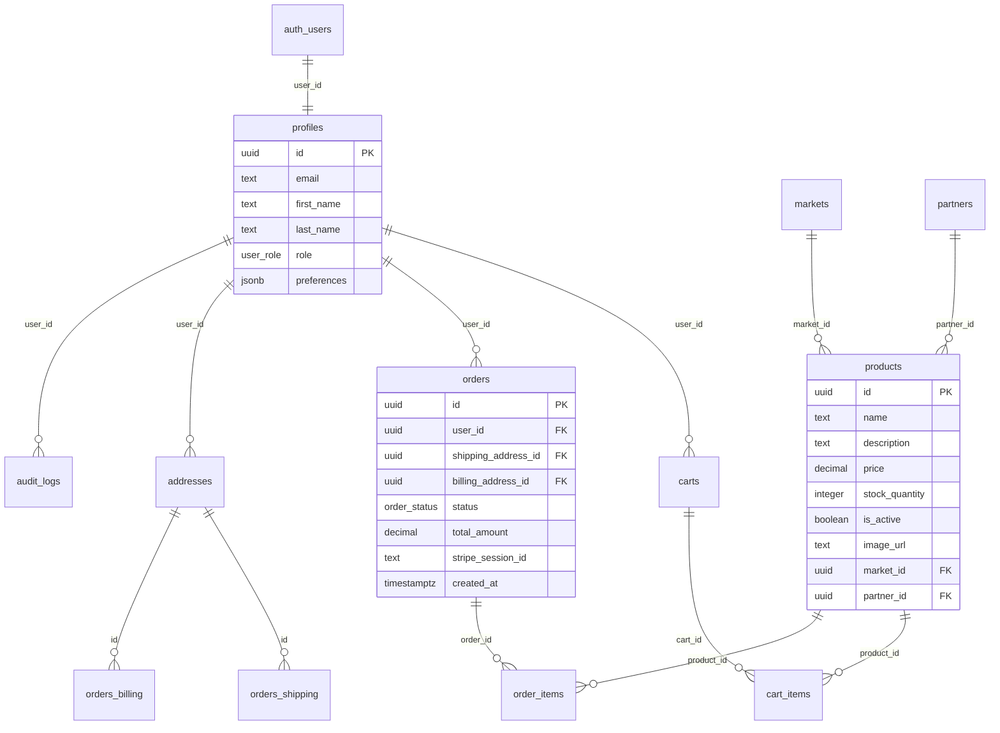

# Schéma Base de Données - HerbisVeritas

## Vue d'Ensemble

La base de données HerbisVeritas utilise PostgreSQL via Supabase avec Row Level Security (RLS) activé sur toutes les tables. L'architecture de données privilégie la sécurité, l'intégrité référentielle et la performance.

## Table des Matières

- [Architecture Générale](#architecture-générale)
- [Évolution du Schéma](#évolution-du-schéma)
- [Tables Principales](#tables-principales)
- [Relations et Contraintes](#relations-et-contraintes)
- [Row Level Security](#row-level-security)
- [Fonctions et Procédures](#fonctions-et-procédures)
- [Audit et Sécurité](#audit-et-sécurité)
- [Index et Performance](#index-et-performance)

## Architecture Générale

### Diagramme ERD Simplifié



## Évolution du Schéma

### Timeline des Migrations

#### Phase 1 - Infrastructure (Janvier 2025)
- **20250108120000** : Création table `markets`
- **20250108130000** : Création table `partners`
- **20250108140000** : Triggers `updated_at` automatiques
- **20250119120000** : Système de rôles admin complet

#### Phase 2 - Core Business (Juin 2025)
- **20250623170000** : Schéma initial `profiles`
- **20250623180000** : Catalogue produits complet
- **20250623190000** : Système de panier
- **20250623191500** : Schéma des commandes

#### Phase 3 - Debug Intensif (23-24 Juin 2025)
Séquence de 15 migrations pour résoudre les problèmes RLS :
- **Problème identifié** : `create_order_from_cart` échouait silencieusement
- **Root cause** : SECURITY DEFINER sans permissions sur `auth.users`
- **Solution** : `GRANT SELECT ON auth.users TO postgres`

#### Phase 4 - Améliorations (Juillet 2025)
- **20250704101800** : Table `audit_logs` pour traçabilité
- **20250708102000** : Système d'adresses multi-usage
- **20250710110201** : Intégration transporteurs français

### Leçons Apprises

1. **SECURITY DEFINER** nécessite des permissions explicites
2. **RLS debugging** complexe sans logs détaillés
3. **Migrations itératives** préférables aux gros changements
4. **Tests automatisés** critiques pour éviter les régressions

## Tables Principales

### Table `profiles`

Table centrale des utilisateurs avec extension du système auth Supabase.

```sql
CREATE TABLE profiles (
    id UUID PRIMARY KEY REFERENCES auth.users(id) ON DELETE CASCADE,
    email TEXT UNIQUE NOT NULL,
    first_name TEXT,
    last_name TEXT,
    role user_role DEFAULT 'user' NOT NULL,
    avatar_url TEXT,
    phone TEXT,
    date_of_birth DATE,
    preferences JSONB DEFAULT '{}',
    created_at TIMESTAMPTZ DEFAULT NOW(),
    updated_at TIMESTAMPTZ DEFAULT NOW()
);

-- Enum pour les rôles
CREATE TYPE user_role AS ENUM ('user', 'editor', 'admin', 'dev');
```

**Particularités :**
- Synchronisation automatique avec `auth.users`
- Trigger de création automatique via webhook
- JSONB pour préférences flexibles
- Système de rôles hiérarchique

### Table `products`

Catalogue produits avec support multilingue et gestion stock.

```sql
CREATE TABLE products (
    id UUID PRIMARY KEY DEFAULT gen_random_uuid(),
    name TEXT NOT NULL,
    description TEXT,
    short_description TEXT,
    price DECIMAL(10,2) NOT NULL CHECK (price >= 0),
    stock_quantity INTEGER DEFAULT 0 CHECK (stock_quantity >= 0),
    is_active BOOLEAN DEFAULT true,
    image_url TEXT,
    category TEXT,
    tags TEXT[],
    weight_grams INTEGER,
    dimensions JSONB, -- {width, height, depth} en cm
    market_id UUID REFERENCES markets(id),
    partner_id UUID REFERENCES partners(id),
    created_at TIMESTAMPTZ DEFAULT NOW(),
    updated_at TIMESTAMPTZ DEFAULT NOW()
);
```

**Index de Performance :**
```sql
CREATE INDEX idx_products_active ON products(is_active) WHERE is_active = true;
CREATE INDEX idx_products_category ON products(category);
CREATE INDEX idx_products_price ON products(price);
CREATE INDEX idx_products_stock ON products(stock_quantity) WHERE stock_quantity > 0;
```

### Table `carts` et `cart_items`

Système de panier persistant avec synchronisation multi-appareils.

```sql
CREATE TABLE carts (
    id UUID PRIMARY KEY DEFAULT gen_random_uuid(),
    user_id UUID REFERENCES auth.users(id) ON DELETE CASCADE,
    session_id TEXT, -- Pour utilisateurs anonymes
    expires_at TIMESTAMPTZ DEFAULT (NOW() + INTERVAL '30 days'),
    created_at TIMESTAMPTZ DEFAULT NOW(),
    updated_at TIMESTAMPTZ DEFAULT NOW()
);

CREATE TABLE cart_items (
    id UUID PRIMARY KEY DEFAULT gen_random_uuid(),
    cart_id UUID REFERENCES carts(id) ON DELETE CASCADE,
    product_id UUID REFERENCES products(id) ON DELETE CASCADE,
    quantity INTEGER NOT NULL CHECK (quantity > 0),
    added_at TIMESTAMPTZ DEFAULT NOW(),
    UNIQUE(cart_id, product_id)
);
```

**Fonctionnalités :**
- Panier anonyme via session_id
- Expiration automatique après 30 jours
- Contrainte unicité produit par panier
- Cascade deletion pour nettoyage automatique

### Table `orders` et `order_items`

Système de commandes avec intégration Stripe et gestion d'état.

```sql
CREATE TYPE order_status AS ENUM (
    'pending_payment',
    'paid',
    'processing', 
    'shipped',
    'delivered',
    'cancelled',
    'refunded'
);

CREATE TABLE orders (
    id UUID PRIMARY KEY DEFAULT gen_random_uuid(),
    user_id UUID REFERENCES auth.users(id),
    order_number TEXT UNIQUE NOT NULL,
    status order_status DEFAULT 'pending_payment',
    total_amount DECIMAL(10,2) NOT NULL,
    tax_amount DECIMAL(10,2) DEFAULT 0,
    shipping_amount DECIMAL(10,2) DEFAULT 0,
    currency TEXT DEFAULT 'EUR',
    
    -- Adresses de livraison/facturation
    shipping_address_id UUID REFERENCES addresses(id),
    billing_address_id UUID REFERENCES addresses(id),
    
    -- Intégration Stripe
    stripe_session_id TEXT,
    stripe_payment_intent_id TEXT,
    
    -- Livraison
    shipping_provider TEXT, -- 'colissimo', 'chronopost', etc.
    tracking_number TEXT,
    pickup_point_id TEXT, -- ID point Colissimo
    
    created_at TIMESTAMPTZ DEFAULT NOW(),
    updated_at TIMESTAMPTZ DEFAULT NOW()
);

CREATE TABLE order_items (
    id UUID PRIMARY KEY DEFAULT gen_random_uuid(),
    order_id UUID REFERENCES orders(id) ON DELETE CASCADE,
    product_id UUID REFERENCES products(id),
    quantity INTEGER NOT NULL CHECK (quantity > 0),
    unit_price DECIMAL(10,2) NOT NULL,
    total_price DECIMAL(10,2) GENERATED ALWAYS AS (quantity * unit_price) STORED,
    product_snapshot JSONB -- Snapshot du produit au moment de la commande
);
```

## Row Level Security

### Politique de Sécurité Générale

Toutes les tables utilisent RLS avec une approche **deny by default**.

```sql
-- Activation RLS sur toutes les tables
ALTER TABLE profiles ENABLE ROW LEVEL SECURITY;
ALTER TABLE products ENABLE ROW LEVEL SECURITY;
ALTER TABLE carts ENABLE ROW LEVEL SECURITY;
ALTER TABLE cart_items ENABLE ROW LEVEL SECURITY;
ALTER TABLE orders ENABLE ROW LEVEL SECURITY;
ALTER TABLE order_items ENABLE ROW LEVEL SECURITY;
ALTER TABLE addresses ENABLE ROW LEVEL SECURITY;
```

### Politiques par Table

#### Profiles
```sql
-- Les utilisateurs gèrent leur propre profil
CREATE POLICY "users_own_profile" ON profiles
    FOR ALL USING (auth.uid() = id);

-- Les admins peuvent lire tous les profils
CREATE POLICY "admins_read_all_profiles" ON profiles
    FOR SELECT USING (
        auth.uid() = id OR 
        (SELECT role FROM profiles WHERE id = auth.uid()) = 'admin'
    );
```

#### Products
```sql
-- Lecture publique des produits actifs
CREATE POLICY "public_read_active_products" ON products
    FOR SELECT USING (is_active = true);

-- Les admins gèrent tous les produits
CREATE POLICY "admins_manage_products" ON products
    FOR ALL USING (
        (SELECT role FROM profiles WHERE id = auth.uid()) IN ('admin', 'editor')
    );
```

#### Orders
```sql
-- Les utilisateurs voient leurs propres commandes
CREATE POLICY "users_own_orders" ON orders
    FOR SELECT USING (auth.uid() = user_id);

-- Les admins voient toutes les commandes
CREATE POLICY "admins_read_all_orders" ON orders
    FOR SELECT USING (
        (SELECT role FROM profiles WHERE id = auth.uid()) = 'admin'
    );
```

## Fonctions et Procédures

### Fonction de Création de Commande

Fonction atomique pour transformer un panier en commande.

```sql
CREATE OR REPLACE FUNCTION create_order_from_cart(
    p_cart_id UUID,
    p_shipping_address_id UUID,
    p_billing_address_id UUID DEFAULT NULL
) RETURNS UUID
LANGUAGE plpgsql
SECURITY DEFINER
AS $$
DECLARE
    v_order_id UUID;
    v_user_id UUID;
    v_total_amount DECIMAL(10,2) := 0;
    v_order_number TEXT;
    cart_item RECORD;
BEGIN
    -- Récupération de l'utilisateur du panier
    SELECT user_id INTO v_user_id 
    FROM carts 
    WHERE id = p_cart_id;
    
    IF v_user_id IS NULL THEN
        RAISE EXCEPTION 'Panier introuvable';
    END IF;
    
    -- Génération du numéro de commande
    v_order_number := 'HV-' || TO_CHAR(NOW(), 'YYYYMMDD') || '-' || LPAD(nextval('order_number_seq')::TEXT, 6, '0');
    
    -- Création de la commande
    INSERT INTO orders (
        user_id,
        order_number,
        shipping_address_id,
        billing_address_id,
        status,
        total_amount
    ) VALUES (
        v_user_id,
        v_order_number,
        p_shipping_address_id,
        COALESCE(p_billing_address_id, p_shipping_address_id),
        'pending_payment',
        0
    ) RETURNING id INTO v_order_id;
    
    -- Transfert des items du panier vers la commande
    FOR cart_item IN 
        SELECT ci.product_id, ci.quantity, p.price, p.*
        FROM cart_items ci
        JOIN products p ON p.id = ci.product_id
        WHERE ci.cart_id = p_cart_id
    LOOP
        -- Vérification du stock
        IF cart_item.quantity > cart_item.stock_quantity THEN
            RAISE EXCEPTION 'Stock insuffisant pour le produit %', cart_item.name;
        END IF;
        
        -- Création de l'item de commande
        INSERT INTO order_items (
            order_id,
            product_id,
            quantity,
            unit_price,
            product_snapshot
        ) VALUES (
            v_order_id,
            cart_item.product_id,
            cart_item.quantity,
            cart_item.price,
            to_jsonb(cart_item.*) - 'stock_quantity'
        );
        
        -- Mise à jour du stock
        UPDATE products 
        SET stock_quantity = stock_quantity - cart_item.quantity
        WHERE id = cart_item.product_id;
        
        -- Calcul du total
        v_total_amount := v_total_amount + (cart_item.quantity * cart_item.price);
    END LOOP;
    
    -- Mise à jour du montant total
    UPDATE orders 
    SET total_amount = v_total_amount
    WHERE id = v_order_id;
    
    -- Nettoyage du panier
    DELETE FROM cart_items WHERE cart_id = p_cart_id;
    DELETE FROM carts WHERE id = p_cart_id;
    
    RETURN v_order_id;
END;
$$;

-- Permissions pour l'application
GRANT EXECUTE ON FUNCTION create_order_from_cart TO authenticated;
GRANT EXECUTE ON FUNCTION create_order_from_cart TO postgres;
```

## Audit et Sécurité

### Table `audit_logs`

Système de logging immutable pour traçabilité complète.

```sql
CREATE TYPE event_severity AS ENUM ('DEBUG', 'INFO', 'WARNING', 'ERROR', 'CRITICAL');

CREATE TABLE audit_logs (
    id UUID PRIMARY KEY DEFAULT gen_random_uuid(),
    user_id UUID REFERENCES auth.users(id),
    event_type TEXT NOT NULL,
    data JSONB NOT NULL DEFAULT '{}',
    severity event_severity DEFAULT 'INFO',
    ip_address INET,
    user_agent TEXT,
    created_at TIMESTAMPTZ DEFAULT NOW()
);

-- Index pour recherche efficace
CREATE INDEX idx_audit_logs_user_id ON audit_logs(user_id);
CREATE INDEX idx_audit_logs_event_type ON audit_logs(event_type);
CREATE INDEX idx_audit_logs_created_at ON audit_logs(created_at DESC);
CREATE INDEX idx_audit_logs_severity ON audit_logs(severity);

-- Table en append-only (pas de UPDATE/DELETE)
CREATE POLICY "audit_logs_append_only" ON audit_logs
    FOR INSERT WITH CHECK (true);

CREATE POLICY "audit_logs_read_own" ON audit_logs
    FOR SELECT USING (
        auth.uid() = user_id OR
        (SELECT role FROM profiles WHERE id = auth.uid()) = 'admin'
    );
```

## Index et Performance

### Stratégie d'Indexation

```sql
-- Index composites pour queries fréquentes
CREATE INDEX idx_orders_user_status ON orders(user_id, status);
CREATE INDEX idx_orders_created_at_desc ON orders(created_at DESC);
CREATE INDEX idx_products_active_category ON products(category, is_active) WHERE is_active = true;

-- Index partiel pour performance
CREATE INDEX idx_carts_unexpired ON carts(user_id) WHERE expires_at > NOW();
CREATE INDEX idx_products_in_stock ON products(id) WHERE stock_quantity > 0;

-- Index GIN pour recherche JSONB
CREATE INDEX idx_products_tags ON products USING GIN(tags);
CREATE INDEX idx_audit_logs_data ON audit_logs USING GIN(data);
CREATE INDEX idx_profiles_preferences ON profiles USING GIN(preferences);
```

## Conclusion

L'architecture de base de données HerbisVeritas offre :

- **Sécurité robuste** avec RLS et audit complet
- **Performance optimisée** par indexation stratégique
- **Intégrité des données** via contraintes métier
- **Évolutivité** préparée avec partitioning
- **Maintenance automatisée** pour opérations courantes

Cette conception garantit une base solide pour les opérations e-commerce tout en maintenant la sécurité et les performances à long terme.