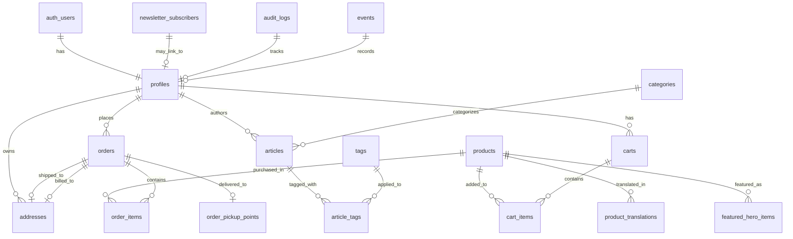

# Database Schema Documentation

## Overview

HerbisVeritas uses PostgreSQL via Supabase, designed for a comprehensive e-commerce platform with integrated magazine functionality, complete order management, and advanced admin dashboard. The schema follows domain-driven design principles with comprehensive security through Row Level Security (RLS) and advanced audit logging.

## Architecture

The database is organized around these business domains:

- **User Management**: Authentication, profiles, roles, user lifecycle management
- **Product Catalog**: Products, translations, categories, featured items
- **Commerce**: Carts, orders, payments, shipping methods, pickup points
- **Editorial Content**: Magazine articles, tags, categories
- **Newsletter System**: Subscribers, campaigns, email management
- **Geolocation**: Markets, partners, pickup points with Colissimo integration
- **Security & Compliance**: Audit logs, login attempts, event monitoring, GDPR compliance
- **Legal**: Terms, privacy policy, legal documents

## Core Tables

### User Domain

#### profiles

Main user table linked to Supabase Auth with comprehensive user management.

```sql
id                            UUID PRIMARY KEY REFERENCES auth.users(id)
email                         TEXT
first_name                    TEXT
last_name                     TEXT
salutation                    TEXT
phone_number                  TEXT
role                          app_role DEFAULT 'user' -- user|editor|admin|dev
newsletter_subscribed         BOOLEAN DEFAULT false
billing_address_is_different  BOOLEAN DEFAULT false
use_shipping_for_billing      BOOLEAN DEFAULT true
shipping_address_line1        TEXT
shipping_address_line2        TEXT
shipping_city                 TEXT
shipping_country              TEXT
shipping_postal_code          TEXT
billing_address_line1         TEXT
billing_address_line2         TEXT
billing_city                  TEXT
billing_country               TEXT
billing_country_code          TEXT
billing_postal_code           TEXT
billing_phone_number          TEXT
billing_state_province_region TEXT
status                        TEXT -- active|inactive|suspended
deactivated_at                TIMESTAMPTZ
deactivated_by                UUID
deactivation_reason           TEXT
suspended_at                  TIMESTAMPTZ
suspended_by                  UUID
suspension_reason             TEXT
terms_accepted_at             TIMESTAMPTZ
last_activity                 TIMESTAMPTZ
tags                          TEXT[] -- User classification tags
created_at                    TIMESTAMPTZ DEFAULT now()
updated_at                    TIMESTAMPTZ DEFAULT now()
```

#### addresses

Multiple addresses per user for shipping/billing with detailed international support.

```sql
id                         UUID PRIMARY KEY
user_id                    UUID REFERENCES profiles(id)
address_type               TEXT -- 'shipping'|'billing'
first_name                 TEXT
last_name                  TEXT
full_name                  TEXT -- Computed from first+last
company_name               TEXT
street_number              TEXT
address_line1              TEXT NOT NULL
address_line2              TEXT
city                       TEXT NOT NULL
postal_code                TEXT NOT NULL
state_province_region      TEXT
country_code               TEXT NOT NULL -- ISO country code
phone_number               TEXT
email                      TEXT
is_default                 BOOLEAN DEFAULT false
created_at                 TIMESTAMPTZ DEFAULT now()
updated_at                 TIMESTAMPTZ DEFAULT now()
```

#### login_attempts

Security tracking for authentication attempts.

```sql
id           UUID PRIMARY KEY
key          TEXT NOT NULL -- IP or identifier
ip_address   TEXT NOT NULL
created_at   TIMESTAMPTZ DEFAULT now()
```

### Product Domain

#### products

Product catalog with multi-language support and advanced features.

```sql
id                UUID PRIMARY KEY
name              TEXT NOT NULL
description_short TEXT
description_long  TEXT
price             NUMERIC NOT NULL
currency          TEXT DEFAULT 'EUR'
unit              TEXT -- ml, g, pièce, etc.
image_url         TEXT
stock             INTEGER DEFAULT 0
category          TEXT
status            TEXT -- draft|active|inactive|archived
is_active         BOOLEAN DEFAULT true
is_new            BOOLEAN DEFAULT false
is_on_promotion   BOOLEAN DEFAULT false
slug              TEXT UNIQUE NOT NULL
inci_list         TEXT[] -- Ingredients list (INCI names)
labels            TEXT[] -- Bio, Vegan, Cruelty-free, etc.
created_at        TIMESTAMPTZ DEFAULT now()
updated_at        TIMESTAMPTZ DEFAULT now()
```

#### product_translations

Internationalized product content with comprehensive localization.

```sql
id                 UUID PRIMARY KEY
product_id         UUID REFERENCES products(id)
locale             TEXT NOT NULL -- 'fr'|'en'|'de'|'es'
name               TEXT NOT NULL
short_description  TEXT
description_long   TEXT
usage_instructions TEXT
composition_text   TEXT -- Composition in local language
properties         TEXT -- Product properties/benefits
created_at         TIMESTAMPTZ DEFAULT now()
updated_at         TIMESTAMPTZ DEFAULT now()
UNIQUE(product_id, locale)
```

#### featured_hero_items

Products featured on homepage hero section.

```sql
id               UUID PRIMARY KEY
product_id       UUID REFERENCES products(id)
custom_subtitle  TEXT NOT NULL -- Custom marketing text
image_hero_url   TEXT -- Custom hero image (optional)
is_active        BOOLEAN DEFAULT true
created_at       TIMESTAMPTZ DEFAULT now()
updated_at       TIMESTAMPTZ DEFAULT now()
```

### Commerce Domain

#### carts

Shopping carts for authenticated users and guests with advanced tracking.

```sql
id         UUID PRIMARY KEY
user_id    TEXT -- UUID for authenticated users or null
guest_id   UUID -- Temporary ID for guest sessions
status     TEXT DEFAULT 'active' -- active|abandoned|converted
metadata   JSONB -- Additional cart data (promo codes, etc.)
created_at TIMESTAMPTZ DEFAULT now()
updated_at TIMESTAMPTZ DEFAULT now()
```

#### cart_items

Items in shopping carts with detailed tracking.

```sql
id         UUID PRIMARY KEY
cart_id    UUID REFERENCES carts(id) ON DELETE CASCADE
product_id UUID REFERENCES products(id)
quantity   INTEGER CHECK (quantity > 0)
added_at   TIMESTAMPTZ DEFAULT now()
created_at TIMESTAMPTZ DEFAULT now()
updated_at TIMESTAMPTZ DEFAULT now()
```

#### orders

Comprehensive order management with payment and shipping integration.

```sql
id                           UUID PRIMARY KEY
user_id                      UUID REFERENCES profiles(id)
order_number                 TEXT -- Auto-generated HV-YYYY-000001
status                       order_status_type DEFAULT 'pending_payment'
payment_status               payment_status_type DEFAULT 'pending'
total_amount                 NUMERIC NOT NULL
currency                     TEXT DEFAULT 'EUR'
shipping_fee                 NUMERIC DEFAULT 0
shipping_address_id          UUID REFERENCES addresses(id)
billing_address_id           UUID REFERENCES addresses(id)
payment_intent_id            TEXT -- Stripe Payment Intent
stripe_checkout_id           TEXT -- Stripe Checkout Session
stripe_checkout_session_id   TEXT -- Stripe Session ID
payment_method               TEXT -- card|paypal|bank_transfer
pickup_point_id              UUID REFERENCES pickup_points(id)
tracking_number              TEXT
tracking_url                 TEXT
shipped_at                   TIMESTAMPTZ
delivered_at                 TIMESTAMPTZ
notes                        TEXT -- Internal admin notes
created_at                   TIMESTAMPTZ DEFAULT now()
updated_at                   TIMESTAMPTZ DEFAULT now()
```

**Order Status Types** (enum: order_status_type):

- `pending_payment`: Awaiting payment confirmation
- `processing`: Payment confirmed, preparing for shipment
- `shipped`: Package dispatched, in transit
- `delivered`: Successfully delivered to customer
- `cancelled`: Order cancelled before shipping
- `refunded`: Order refunded after payment

**Payment Status Types** (enum: payment_status_type):

- `pending`: Payment not yet processed
- `succeeded`: Payment successfully completed
- `failed`: Payment failed or declined
- `refunded`: Payment refunded to customer

#### order_items

Products in orders with complete purchase-time snapshot.

```sql
id                            UUID PRIMARY KEY
order_id                      UUID REFERENCES orders(id) ON DELETE CASCADE
product_id                    UUID REFERENCES products(id)
quantity                      INTEGER NOT NULL CHECK (quantity > 0)
price_at_purchase             NUMERIC NOT NULL
product_name_at_purchase      TEXT -- Product name at time of purchase
product_image_url_at_purchase TEXT -- Product image at time of purchase
product_sku_at_purchase       TEXT -- Product SKU for inventory tracking
created_at                    TIMESTAMPTZ DEFAULT now()
updated_at                    TIMESTAMPTZ DEFAULT now()
```

#### shipping_methods

Available shipping options and pricing.

```sql
id          UUID PRIMARY KEY
name        TEXT NOT NULL -- "Livraison Standard", "Express", etc.
description TEXT
carrier     TEXT -- "Colissimo", "Chronopost", etc.
price       NUMERIC NOT NULL
is_active   BOOLEAN DEFAULT true
created_at  TIMESTAMPTZ DEFAULT now()
```

#### pickup_points

Available pickup locations for order collection.

```sql
id          UUID PRIMARY KEY
order_id    UUID REFERENCES orders(id) -- Associated order
point_id    TEXT NOT NULL -- External service ID
name        TEXT NOT NULL
address     TEXT NOT NULL
city        TEXT NOT NULL
zip_code    TEXT NOT NULL
latitude    NUMERIC
longitude   NUMERIC
distance    NUMERIC -- Distance from customer address
created_at  TIMESTAMPTZ DEFAULT now()
```

#### order_pickup_points

Detailed pickup point information for Colissimo integration.

```sql
id                   UUID PRIMARY KEY
order_id             UUID REFERENCES orders(id) UNIQUE -- One per order
pickup_id            TEXT NOT NULL -- Colissimo point ID
service_code         TEXT -- Colissimo service code
name                 TEXT NOT NULL
commercial_name      TEXT
company              TEXT
address_1            TEXT NOT NULL
address_2            TEXT
address_3            TEXT
zip_code             TEXT NOT NULL
city                 TEXT NOT NULL
country_code         TEXT DEFAULT 'FR'
phone                TEXT
latitude             NUMERIC
longitude            NUMERIC
type_de_point        TEXT -- Type of pickup location
horaires_ouverture   TEXT -- Opening hours
created_at           TIMESTAMPTZ DEFAULT now()
```

### Magazine Domain

#### articles

Blog/magazine content with rich metadata and SEO support.

```sql
id               UUID PRIMARY KEY
title            TEXT NOT NULL
slug             TEXT UNIQUE NOT NULL
excerpt          TEXT
content          JSON -- Rich content structure (EditorJS format)
content_html     TEXT -- Rendered HTML for display
status           TEXT DEFAULT 'draft' -- draft|published|archived
author_id        UUID REFERENCES profiles(id)
category_id      UUID REFERENCES categories(id)
featured_image   TEXT -- URL to featured image
seo_title        TEXT -- Custom SEO title
seo_description  TEXT -- Meta description
published_at     TIMESTAMPTZ
reading_time     INTEGER -- Estimated reading time in minutes
view_count       INTEGER DEFAULT 0
created_at       TIMESTAMPTZ DEFAULT now()
updated_at       TIMESTAMPTZ DEFAULT now()
```

#### categories

Article categories with visual customization.

```sql
id          UUID PRIMARY KEY
name        TEXT UNIQUE NOT NULL
slug        TEXT UNIQUE NOT NULL
description TEXT
color       TEXT -- HEX color for UI theming
created_at  TIMESTAMPTZ DEFAULT now()
updated_at  TIMESTAMPTZ DEFAULT now()
```

#### tags

Article tags for flexible categorization and filtering.

```sql
id         UUID PRIMARY KEY
name       TEXT UNIQUE NOT NULL
slug       TEXT UNIQUE NOT NULL
created_at TIMESTAMPTZ DEFAULT now()
```

#### article_tags

Many-to-many relationship between articles and tags.

```sql
article_id UUID REFERENCES articles(id) ON DELETE CASCADE
tag_id     UUID REFERENCES tags(id) ON DELETE CASCADE
PRIMARY KEY (article_id, tag_id)
```

### Newsletter System

#### newsletter_subscribers

Newsletter subscription management with GDPR compliance.

```sql
id             UUID PRIMARY KEY
email          TEXT UNIQUE NOT NULL
is_active      BOOLEAN DEFAULT true
source         TEXT -- 'website'|'admin'|'import'|'api'
ip_address     INET -- IP address of subscription
user_agent     TEXT -- Browser user agent
subscribed_at  TIMESTAMPTZ DEFAULT now()
created_at     TIMESTAMPTZ DEFAULT now()
updated_at     TIMESTAMPTZ DEFAULT now()
```

### Geolocation Domain

#### markets

Local markets and events where products are sold.

```sql
id               UUID PRIMARY KEY
name             TEXT NOT NULL
description      TEXT
address          TEXT NOT NULL
city             TEXT NOT NULL
day_of_week      INTEGER NOT NULL -- 0=Sunday, 1=Monday, etc.
start_time       TIME NOT NULL
end_time         TIME NOT NULL
start_date       DATE NOT NULL
end_date         DATE NOT NULL
image_url        TEXT
hero_image_url   TEXT -- Larger hero image
gps_link         TEXT -- Google Maps or GPS coordinates
is_active        BOOLEAN DEFAULT true
created_at       TIMESTAMPTZ DEFAULT now()
updated_at       TIMESTAMPTZ DEFAULT now()
```

#### partners

Business partners and retail locations.

```sql
id            UUID PRIMARY KEY
name          TEXT NOT NULL
description   TEXT NOT NULL
address       TEXT NOT NULL
image_url     TEXT NOT NULL
facebook_url  TEXT
display_order INTEGER DEFAULT 0
is_active     BOOLEAN DEFAULT true
created_at    TIMESTAMPTZ DEFAULT now()
updated_at    TIMESTAMPTZ DEFAULT now()
```

### Legal Domain

#### legal_documents

Terms of service, privacy policy, and other legal documents.

```sql
id         SERIAL PRIMARY KEY
slug       TEXT UNIQUE NOT NULL -- 'terms'|'privacy'|'cookies'
title      TEXT NOT NULL
content    TEXT -- Full legal document content
created_at TIMESTAMPTZ DEFAULT now()
updated_at TIMESTAMPTZ DEFAULT now()
```

### System Domain

#### audit_logs

Comprehensive security and compliance logging with severity levels.

```sql
id         UUID PRIMARY KEY
user_id    UUID REFERENCES profiles(id) -- NULL for system events
event_type TEXT NOT NULL -- login_success|order_update|admin_action|etc.
severity   event_severity DEFAULT 'INFO' -- INFO|WARNING|ERROR|CRITICAL
data       JSONB -- Event details and context
created_at TIMESTAMPTZ DEFAULT now()
```

**Event Severity Levels** (enum: event_severity):

- `INFO`: Normal operations (logins, purchases, updates)
- `WARNING`: Suspicious but not critical (failed login attempts, invalid data)
- `ERROR`: Application errors (failed operations, validation errors)
- `CRITICAL`: Security incidents (unauthorized access attempts, data breaches)

#### events

Advanced event sourcing system for business events.

```sql
id             UUID PRIMARY KEY
event_id       TEXT NOT NULL -- Unique event identifier
event_type     TEXT NOT NULL -- order.created|cart.updated|user.registered
aggregate_type TEXT NOT NULL -- order|cart|user|product
aggregate_id   TEXT NOT NULL -- ID of the affected entity
event_data     JSONB NOT NULL -- Event payload
metadata       JSONB -- Additional context (IP, user agent, etc.)
version        INTEGER DEFAULT 1 -- Event version for schema evolution
created_at     TIMESTAMPTZ DEFAULT now()
```

## Database Views

### cart_product_details

Optimized view combining product data with translations for cart operations.

```sql
CREATE VIEW cart_product_details AS
SELECT
  p.id,
  p.name,
  p.slug,
  p.price,
  p.image_url,
  p.stock,
  p.is_active,
  p.description_short,
  p.description_long,
  p.created_at,
  p.updated_at,
  json_agg(
    CASE WHEN pt.id IS NOT NULL THEN
      json_build_object(
        'locale', pt.locale,
        'name', pt.name,
        'short_description', pt.short_description,
        'description_long', pt.description_long,
        'usage_instructions', pt.usage_instructions,
        'composition_text', pt.composition_text,
        'properties', pt.properties
      )
    END
  ) FILTER (WHERE pt.id IS NOT NULL) as product_translations
FROM products p
LEFT JOIN product_translations pt ON p.id = pt.product_id
GROUP BY p.id, p.name, p.slug, p.price, p.image_url, p.stock,
         p.is_active, p.description_short, p.description_long,
         p.created_at, p.updated_at;
```

### cleanup_monitoring

Administrative view for monitoring user cleanup operations.

```sql
CREATE VIEW cleanup_monitoring AS
SELECT
  created_at,
  event_type,
  severity,
  CASE
    WHEN data->>'operation_type' = 'cleanup' THEN
      (data->>'users_deleted')::integer
    ELSE NULL
  END as users_deleted,
  CASE
    WHEN data->>'operation_type' = 'cleanup' THEN
      (data->>'users_preserved')::integer
    ELSE NULL
  END as users_preserved,
  CASE
    WHEN data->>'operation_type' = 'cleanup' THEN
      (data->>'threshold_days')::integer
    ELSE NULL
  END as threshold_days,
  data as full_details,
  data->>'operation_type' as operation_type
FROM audit_logs
WHERE event_type = 'user_cleanup';
```

## Database Functions

### User Management Functions

#### create_missing_profiles()

Ensures all auth.users have corresponding profiles.

```sql
CREATE OR REPLACE FUNCTION create_missing_profiles()
RETURNS TABLE(user_id UUID, email TEXT, action_taken TEXT)
SECURITY DEFINER
SET search_path = public
LANGUAGE plpgsql
AS $$
BEGIN
  RETURN QUERY
  INSERT INTO profiles (id, email)
  SELECT au.id, au.email
  FROM auth.users au
  LEFT JOIN profiles p ON au.id = p.id
  WHERE p.id IS NULL
  RETURNING id as user_id, email, 'created' as action_taken;
END;
$$;
```

#### cleanup_old_anonymous_users(days_threshold, dry_run)

GDPR-compliant cleanup of old anonymous user accounts.

```sql
CREATE OR REPLACE FUNCTION cleanup_old_anonymous_users(
  days_threshold INTEGER DEFAULT 90,
  dry_run BOOLEAN DEFAULT true
)
RETURNS TABLE(action_type TEXT, user_count INTEGER, details JSON)
SECURITY DEFINER
LANGUAGE plpgsql
AS $$
DECLARE
  deleted_count INTEGER := 0;
  preserved_count INTEGER := 0;
BEGIN
  -- Implementation handles anonymous user cleanup with audit logging
  -- Returns detailed results for monitoring and compliance
END;
$$;
```

### Cart Management Functions

#### add_or_update_cart_item(cart_id, product_id, quantity_to_add)

Atomically adds or updates items in shopping cart.

```sql
CREATE OR REPLACE FUNCTION add_or_update_cart_item(
  p_cart_id UUID,
  p_product_id UUID DEFAULT NULL,
  p_quantity_to_add INTEGER DEFAULT 1
)
RETURNS TABLE(id UUID, cart_id UUID, product_id UUID, quantity INTEGER, added_at TIMESTAMPTZ, created_at TIMESTAMPTZ, updated_at TIMESTAMPTZ)
SECURITY DEFINER
LANGUAGE plpgsql
AS $$
BEGIN
  -- Atomic upsert operation for cart items
  -- Handles inventory checks and quantity limits
END;
$$;
```

#### merge_guest_cart_to_user(user_id, guest_id)

Merges guest cart items into authenticated user's cart.

```sql
CREATE OR REPLACE FUNCTION merge_guest_cart_to_user(
  p_user_id UUID,
  p_guest_id UUID
)
RETURNS TEXT
SECURITY DEFINER
LANGUAGE plpgsql
AS $$
BEGIN
  -- Complex logic to merge carts without duplicates
  -- Returns the final cart ID
END;
$$;
```

### Product Management Functions

#### create_product_with_translations_v2(product_data, translations_data)

Creates product with localized content in a single transaction.

```sql
CREATE OR REPLACE FUNCTION create_product_with_translations_v2(
  product_data JSON,
  translations_data JSON
)
RETURNS JSON
SECURITY DEFINER
LANGUAGE plpgsql
AS $$
BEGIN
  -- Transactional product creation with translations
  -- Returns complete product data with translations
END;
$$;
```

#### update_product_with_translations(product_id, ...)

Updates product and all translations atomically.

```sql
CREATE OR REPLACE FUNCTION update_product_with_translations(
  p_id UUID,
  p_slug TEXT,
  p_price NUMERIC,
  p_stock INTEGER,
  p_unit TEXT,
  p_image_url TEXT,
  p_inci_list TEXT[],
  p_status TEXT,
  p_is_active BOOLEAN,
  p_is_new BOOLEAN,
  p_is_on_promotion BOOLEAN,
  p_translations JSON
)
RETURNS VOID
SECURITY DEFINER
LANGUAGE plpgsql
AS $$
BEGIN
  -- Comprehensive product update with translation management
END;
$$;
```

### Security & Audit Functions

#### log_event(event_type, user_id, data, severity)

Centralized event logging with severity classification.

```sql
CREATE OR REPLACE FUNCTION log_event(
  p_event_type TEXT,
  p_user_id UUID DEFAULT NULL,
  p_data JSON DEFAULT NULL,
  p_severity event_severity DEFAULT 'INFO'
)
RETURNS UUID
SECURITY DEFINER
LANGUAGE plpgsql
AS $$
BEGIN
  INSERT INTO audit_logs (user_id, event_type, severity, data)
  VALUES (p_user_id, p_event_type, p_severity, p_data)
  RETURNING id;
END;
$$;
```

#### log_auth_event(event_type, user_id, email, metadata)

Specialized logging for authentication events.

```sql
CREATE OR REPLACE FUNCTION log_auth_event(
  p_event_type TEXT,
  p_user_id UUID,
  p_email TEXT DEFAULT NULL,
  p_metadata JSON DEFAULT NULL
)
RETURNS UUID
SECURITY DEFINER
LANGUAGE plpgsql
AS $$
BEGIN
  -- Specialized auth event logging with enhanced context
END;
$$;
```

### Authorization Helper Functions

#### is_current_user_admin()

Checks if current user has admin privileges.

```sql
CREATE OR REPLACE FUNCTION is_current_user_admin()
RETURNS BOOLEAN
SECURITY DEFINER
LANGUAGE plpgsql
AS $$
BEGIN
  RETURN EXISTS (
    SELECT 1 FROM profiles
    WHERE id = auth.uid() AND role = 'admin'
  );
END;
$$;
```

#### is_current_user_dev()

Checks if current user has developer privileges.

```sql
CREATE OR REPLACE FUNCTION is_current_user_dev()
RETURNS BOOLEAN
SECURITY DEFINER
LANGUAGE plpgsql
AS $$
BEGIN
  RETURN EXISTS (
    SELECT 1 FROM profiles
    WHERE id = auth.uid() AND role = 'dev'
  );
END;
$$;
```

### Utility Functions

#### current_user_id()

Returns current authenticated user ID.

```sql
CREATE OR REPLACE FUNCTION current_user_id()
RETURNS UUID
SECURITY DEFINER
LANGUAGE plpgsql
AS $$
BEGIN
  RETURN auth.uid();
END;
$$;
```

#### safe_cast_to_jsonb(text_value)

Safely converts text to JSONB with error handling.

```sql
CREATE OR REPLACE FUNCTION safe_cast_to_jsonb(p_text TEXT)
RETURNS JSONB
LANGUAGE plpgsql
AS $$
BEGIN
  RETURN p_text::jsonb;
EXCEPTION WHEN OTHERS THEN
  RETURN NULL;
END;
$$;
```

## Enums and Custom Types

### Application Enums

```sql
-- User roles
CREATE TYPE app_role AS ENUM ('user', 'editor', 'admin', 'dev');

-- Order status progression
CREATE TYPE order_status_type AS ENUM (
  'pending_payment',
  'processing',
  'shipped',
  'delivered',
  'cancelled',
  'refunded'
);

-- Payment processing states
CREATE TYPE payment_status_type AS ENUM (
  'pending',
  'succeeded',
  'failed',
  'refunded'
);

-- Event severity levels
CREATE TYPE event_severity AS ENUM (
  'INFO',
  'WARNING',
  'ERROR',
  'CRITICAL'
);
```

### Composite Types

```sql
-- Cart operation results
CREATE TYPE cart_operation_result AS (
  success BOOLEAN,
  message TEXT,
  cart_id UUID,
  total_items INTEGER
);
```

## Row Level Security (RLS)

### Security Principles

All tables implement comprehensive Row Level Security with policies based on:

- **Authentication**: `auth.uid()` identifies the current user
- **Role-based Access**: Helper functions check user roles (user|editor|admin|dev)
- **Ownership**: Users access only their own data unless explicitly authorized
- **Public Access**: Anonymous users can view public content (products, articles)
- **Service Role**: Special permissions for system operations and payment processing

### Authorization Helper Functions

These functions are used throughout RLS policies to check permissions:

```sql
-- Check if user is admin
CREATE FUNCTION is_current_user_admin()
RETURNS BOOLEAN AS $$
  SELECT EXISTS (
    SELECT 1 FROM profiles
    WHERE id = auth.uid() AND role IN ('admin', 'dev')
  );
$$ SECURITY DEFINER;

-- Check if user is editor or higher
CREATE FUNCTION is_current_user_editor()
RETURNS BOOLEAN AS $$
  SELECT EXISTS (
    SELECT 1 FROM profiles
    WHERE id = auth.uid() AND role IN ('editor', 'admin', 'dev')
  );
$$ SECURITY DEFINER;

-- Check if user is authenticated
CREATE FUNCTION is_current_user_a_user()
RETURNS BOOLEAN AS $$
  SELECT EXISTS (
    SELECT 1 FROM profiles
    WHERE id = auth.uid()
  );
$$ SECURITY DEFINER;

-- Check if running in service context
CREATE FUNCTION is_service_context()
RETURNS BOOLEAN AS $$
  SELECT auth.jwt() ->> 'role' = 'service_role';
$$ SECURITY DEFINER;
```

### Comprehensive RLS Policies

#### User Profiles

```sql
-- Users can view their own profile
CREATE POLICY "Users view own profile" ON profiles
FOR SELECT USING (id = auth.uid());

-- Users can update their own profile
CREATE POLICY "Users update own profile" ON profiles
FOR UPDATE USING (id = auth.uid());

-- Admins can view all profiles
CREATE POLICY "Admins view all profiles" ON profiles
FOR SELECT USING (is_current_user_admin());

-- Admins can update any profile
CREATE POLICY "Admins update profiles" ON profiles
FOR UPDATE USING (is_current_user_admin());

-- Profile creation handled by triggers
CREATE POLICY "System can create profiles" ON profiles
FOR INSERT WITH CHECK (true);
```

#### Products & Catalog

```sql
-- Public can view active products
CREATE POLICY "Public views active products" ON products
FOR SELECT USING (is_active = true);

-- Editors can view all products (including drafts)
CREATE POLICY "Editors view all products" ON products
FOR SELECT USING (is_current_user_editor());

-- Admins have full product management access
CREATE POLICY "Admins manage products" ON products
FOR ALL USING (is_current_user_admin());

-- Product translations follow same pattern
CREATE POLICY "Public views product translations" ON product_translations
FOR SELECT USING (
  EXISTS (
    SELECT 1 FROM products p
    WHERE p.id = product_translations.product_id
    AND p.is_active = true
  )
);

CREATE POLICY "Editors manage translations" ON product_translations
FOR ALL USING (is_current_user_editor());
```

#### Orders & Commerce

```sql
-- Users can only view their own orders
CREATE POLICY "Users view own orders" ON orders
FOR SELECT USING (user_id = auth.uid());

-- Users can create orders (checkout process)
CREATE POLICY "Authenticated users create orders" ON orders
FOR INSERT WITH CHECK (user_id = auth.uid());

-- Admins can view and manage all orders
CREATE POLICY "Admins manage all orders" ON orders
FOR ALL USING (is_current_user_admin());

-- Service role for payment processing
CREATE POLICY "Service role order access" ON orders
FOR ALL TO service_role USING (true);

-- Order items follow order permissions
CREATE POLICY "Order items inherit order permissions" ON order_items
FOR SELECT USING (
  EXISTS (
    SELECT 1 FROM orders o
    WHERE o.id = order_items.order_id
    AND (o.user_id = auth.uid() OR is_current_user_admin())
  )
);
```

#### Shopping Carts

```sql
-- Users can access their own carts
CREATE POLICY "Users manage own carts" ON carts
FOR ALL USING (
  user_id::uuid = auth.uid() OR
  (guest_id IS NOT NULL AND user_id IS NULL)
);

-- Cart items inherit cart permissions
CREATE POLICY "Cart items follow cart access" ON cart_items
FOR ALL USING (
  EXISTS (
    SELECT 1 FROM carts c
    WHERE c.id = cart_items.cart_id
    AND (c.user_id::uuid = auth.uid() OR c.guest_id IS NOT NULL)
  )
);
```

#### Addresses

```sql
-- Users manage their own addresses
CREATE POLICY "Users manage own addresses" ON addresses
FOR ALL USING (user_id = auth.uid());

-- Admins can view addresses for order management
CREATE POLICY "Admins view addresses" ON addresses
FOR SELECT USING (is_current_user_admin());
```

#### Articles & Magazine

```sql
-- Public can view published articles
CREATE POLICY "Public views published articles" ON articles
FOR SELECT USING (status = 'published');

-- Editors can view all articles
CREATE POLICY "Editors view all articles" ON articles
FOR SELECT USING (is_current_user_editor());

-- Authors can manage their own articles
CREATE POLICY "Authors manage own articles" ON articles
FOR ALL USING (author_id = auth.uid());

-- Admins have full article access
CREATE POLICY "Admins manage articles" ON articles
FOR ALL USING (is_current_user_admin());
```

#### Newsletter

```sql
-- Public can subscribe to newsletter
CREATE POLICY "Public newsletter subscription" ON newsletter_subscribers
FOR INSERT WITH CHECK (true);

-- Users can manage their own subscription
CREATE POLICY "Users manage newsletter subscription" ON newsletter_subscribers
FOR SELECT USING (
  email IN (
    SELECT email FROM auth.users WHERE id = auth.uid()
  )
);

-- Admins can manage all subscriptions
CREATE POLICY "Admins manage newsletter" ON newsletter_subscribers
FOR ALL USING (is_current_user_admin());
```

#### Audit & Security

```sql
-- Only admins can view audit logs
CREATE POLICY "Admins view audit logs" ON audit_logs
FOR SELECT USING (is_current_user_admin());

-- System can create audit entries
CREATE POLICY "System creates audit logs" ON audit_logs
FOR INSERT WITH CHECK (true);

-- Users can view their own audit entries
CREATE POLICY "Users view own audit logs" ON audit_logs
FOR SELECT USING (user_id = auth.uid());
```

#### Public Content

```sql
-- Public access to categories, tags, markets, partners
CREATE POLICY "Public views categories" ON categories
FOR SELECT USING (true);

CREATE POLICY "Public views tags" ON tags
FOR SELECT USING (true);

CREATE POLICY "Public views active markets" ON markets
FOR SELECT USING (is_active = true);

CREATE POLICY "Public views active partners" ON partners
FOR SELECT USING (is_active = true);

-- Admins manage public content
CREATE POLICY "Admins manage public content" ON categories
FOR ALL USING (is_current_user_admin());

CREATE POLICY "Admins manage markets" ON markets
FOR ALL USING (is_current_user_admin());

CREATE POLICY "Admins manage partners" ON partners
FOR ALL USING (is_current_user_admin());
```

## Indexes & Performance Optimization

### Core Performance Indexes

```sql
-- User and authentication indexes
CREATE INDEX idx_profiles_role ON profiles(role);
CREATE INDEX idx_profiles_email ON profiles(email);
CREATE INDEX idx_profiles_created_at ON profiles(created_at DESC);

-- Product catalog indexes
CREATE INDEX idx_products_active ON products(is_active) WHERE is_active = true;
CREATE INDEX idx_products_slug ON products(slug);
CREATE INDEX idx_products_category ON products(category) WHERE category IS NOT NULL;
CREATE INDEX idx_products_status ON products(status);
CREATE INDEX idx_products_price ON products(price);
CREATE INDEX idx_products_created_at ON products(created_at DESC);
CREATE INDEX idx_products_search ON products USING GIN (to_tsvector('french', name || ' ' || COALESCE(description_short, '')));

-- Product translations indexes
CREATE INDEX idx_product_translations_product_locale ON product_translations(product_id, locale);
CREATE INDEX idx_product_translations_locale ON product_translations(locale);

-- Shopping cart indexes
CREATE INDEX idx_carts_user_id ON carts(user_id) WHERE user_id IS NOT NULL;
CREATE INDEX idx_carts_guest_id ON carts(guest_id) WHERE guest_id IS NOT NULL;
CREATE INDEX idx_carts_status ON carts(status);
CREATE INDEX idx_cart_items_cart_id ON cart_items(cart_id);
CREATE INDEX idx_cart_items_product_id ON cart_items(product_id);

-- Order management indexes
CREATE INDEX idx_orders_user_id ON orders(user_id);
CREATE INDEX idx_orders_status ON orders(status);
CREATE INDEX idx_orders_payment_status ON orders(payment_status);
CREATE INDEX idx_orders_created_at ON orders(created_at DESC);
CREATE INDEX idx_orders_order_number ON orders(order_number);
CREATE INDEX idx_orders_stripe_checkout_id ON orders(stripe_checkout_session_id);

-- Order items indexes
CREATE INDEX idx_order_items_order_id ON order_items(order_id);
CREATE INDEX idx_order_items_product_id ON order_items(product_id);

-- Address indexes
CREATE INDEX idx_addresses_user_id ON addresses(user_id);
CREATE INDEX idx_addresses_is_default ON addresses(is_default) WHERE is_default = true;

-- Article and magazine indexes
CREATE INDEX idx_articles_status ON articles(status);
CREATE INDEX idx_articles_slug ON articles(slug);
CREATE INDEX idx_articles_author_id ON articles(author_id);
CREATE INDEX idx_articles_category_id ON articles(category_id);
CREATE INDEX idx_articles_published_at ON articles(published_at DESC);
CREATE INDEX idx_articles_view_count ON articles(view_count DESC);
CREATE INDEX idx_articles_search ON articles USING GIN (to_tsvector('french', title || ' ' || COALESCE(excerpt, '')));

-- Category and tag indexes
CREATE INDEX idx_categories_slug ON categories(slug);
CREATE INDEX idx_tags_slug ON tags(slug);
CREATE INDEX idx_article_tags_article_id ON article_tags(article_id);
CREATE INDEX idx_article_tags_tag_id ON article_tags(tag_id);

-- Newsletter indexes
CREATE INDEX idx_newsletter_subscribers_email ON newsletter_subscribers(email);
CREATE INDEX idx_newsletter_subscribers_active ON newsletter_subscribers(is_active) WHERE is_active = true;
CREATE INDEX idx_newsletter_subscribers_created_at ON newsletter_subscribers(created_at DESC);

-- Security and audit indexes
CREATE INDEX idx_audit_logs_user_id ON audit_logs(user_id) WHERE user_id IS NOT NULL;
CREATE INDEX idx_audit_logs_event_type ON audit_logs(event_type);
CREATE INDEX idx_audit_logs_severity ON audit_logs(severity);
CREATE INDEX idx_audit_logs_created_at ON audit_logs(created_at DESC);

-- Event sourcing indexes
CREATE INDEX idx_events_aggregate_id ON events(aggregate_id);
CREATE INDEX idx_events_aggregate_type ON events(aggregate_type);
CREATE INDEX idx_events_event_type ON events(event_type);
CREATE INDEX idx_events_created_at ON events(created_at DESC);

-- Geolocation indexes
CREATE INDEX idx_markets_is_active ON markets(is_active) WHERE is_active = true;
CREATE INDEX idx_partners_is_active ON partners(is_active) WHERE is_active = true;
CREATE INDEX idx_partners_display_order ON partners(display_order);

-- Shipping and pickup indexes
CREATE INDEX idx_pickup_points_order_id ON pickup_points(order_id);
CREATE INDEX idx_order_pickup_points_order_id ON order_pickup_points(order_id);
```

### Composite Indexes for Complex Queries

```sql
-- Product search with filters
CREATE INDEX idx_products_active_category ON products(is_active, category) WHERE is_active = true;
CREATE INDEX idx_products_active_price ON products(is_active, price) WHERE is_active = true;

-- Order analytics
CREATE INDEX idx_orders_status_created_at ON orders(status, created_at DESC);
CREATE INDEX idx_orders_user_created_at ON orders(user_id, created_at DESC);

-- Article publishing workflow
CREATE INDEX idx_articles_status_published_at ON articles(status, published_at DESC);
CREATE INDEX idx_articles_author_status ON articles(author_id, status);

-- Audit trail analysis
CREATE INDEX idx_audit_logs_event_severity_created ON audit_logs(event_type, severity, created_at DESC);
```

## Triggers & Automation

### Automatic Timestamps

Update timestamps across all tables automatically:

```sql
-- Universal timestamp update function
CREATE OR REPLACE FUNCTION update_updated_at()
RETURNS TRIGGER
SECURITY DEFINER
LANGUAGE plpgsql
AS $$
BEGIN
  NEW.updated_at = timezone('utc', now());
  RETURN NEW;
END;
$$;

-- Apply to all timestamped tables
CREATE TRIGGER update_products_timestamp
  BEFORE UPDATE ON products
  FOR EACH ROW EXECUTE FUNCTION update_updated_at();

CREATE TRIGGER update_profiles_timestamp
  BEFORE UPDATE ON profiles
  FOR EACH ROW EXECUTE FUNCTION update_updated_at();

CREATE TRIGGER update_orders_timestamp
  BEFORE UPDATE ON orders
  FOR EACH ROW EXECUTE FUNCTION update_updated_at();

CREATE TRIGGER update_articles_timestamp
  BEFORE UPDATE ON articles
  FOR EACH ROW EXECUTE FUNCTION update_updated_at();

CREATE TRIGGER update_addresses_timestamp
  BEFORE UPDATE ON addresses
  FOR EACH ROW EXECUTE FUNCTION update_updated_at();

CREATE TRIGGER update_carts_timestamp
  BEFORE UPDATE ON carts
  FOR EACH ROW EXECUTE FUNCTION update_updated_at();

CREATE TRIGGER update_cart_items_timestamp
  BEFORE UPDATE ON cart_items
  FOR EACH ROW EXECUTE FUNCTION update_updated_at();
```

### Order Number Generation

Automatic order number generation with yearly sequence:

```sql
-- Create sequence for order numbers
CREATE SEQUENCE order_number_seq START WITH 1;

-- Generate unique order numbers
CREATE OR REPLACE FUNCTION generate_order_number()
RETURNS TRIGGER
SECURITY DEFINER
LANGUAGE plpgsql
AS $$
BEGIN
  -- Generate format: HV-YYYY-000001
  NEW.order_number := 'HV-' ||
    to_char(NEW.created_at, 'YYYY') || '-' ||
    LPAD(nextval('order_number_seq')::text, 6, '0');
  RETURN NEW;
END;
$$;

-- Apply to orders
CREATE TRIGGER set_order_number
  BEFORE INSERT ON orders
  FOR EACH ROW EXECUTE FUNCTION generate_order_number();
```

### Profile Management

Ensure all authenticated users have profiles:

```sql
-- Create profile for new auth users
CREATE OR REPLACE FUNCTION handle_new_user()
RETURNS TRIGGER
SECURITY DEFINER
LANGUAGE plpgsql
AS $$
BEGIN
  INSERT INTO public.profiles (id, email, created_at)
  VALUES (NEW.id, NEW.email, NEW.created_at);

  -- Log the user creation
  INSERT INTO audit_logs (user_id, event_type, severity, data)
  VALUES (
    NEW.id,
    'user_created',
    'INFO',
    jsonb_build_object(
      'email', NEW.email,
      'source', 'auth_trigger'
    )
  );

  RETURN NEW;
END;
$$;

-- Trigger for new auth.users
CREATE TRIGGER on_auth_user_created
  AFTER INSERT ON auth.users
  FOR EACH ROW EXECUTE FUNCTION handle_new_user();
```

### Comprehensive Audit Logging

Advanced audit system with context tracking:

```sql
-- Enhanced audit logging function
CREATE OR REPLACE FUNCTION log_table_changes()
RETURNS TRIGGER
SECURITY DEFINER
LANGUAGE plpgsql
AS $$
DECLARE
  event_data jsonb;
  current_user_id uuid;
  severity_level event_severity;
BEGIN
  -- Get current user (may be null for system operations)
  current_user_id := auth.uid();

  -- Determine severity based on operation and table
  CASE
    WHEN TG_TABLE_NAME IN ('orders', 'profiles') AND TG_OP = 'DELETE' THEN
      severity_level := 'WARNING';
    WHEN TG_TABLE_NAME = 'audit_logs' THEN
      severity_level := 'CRITICAL';
    ELSE
      severity_level := 'INFO';
  END CASE;

  -- Build event data based on operation
  CASE TG_OP
    WHEN 'INSERT' THEN
      event_data := jsonb_build_object(
        'operation', 'INSERT',
        'table', TG_TABLE_NAME,
        'new_data', to_jsonb(NEW)
      );
    WHEN 'UPDATE' THEN
      event_data := jsonb_build_object(
        'operation', 'UPDATE',
        'table', TG_TABLE_NAME,
        'old_data', to_jsonb(OLD),
        'new_data', to_jsonb(NEW),
        'changed_fields', (
          SELECT jsonb_object_agg(key, value)
          FROM jsonb_each(to_jsonb(NEW))
          WHERE to_jsonb(NEW) -> key != to_jsonb(OLD) -> key
        )
      );
    WHEN 'DELETE' THEN
      event_data := jsonb_build_object(
        'operation', 'DELETE',
        'table', TG_TABLE_NAME,
        'old_data', to_jsonb(OLD)
      );
  END CASE;

  -- Insert audit record
  INSERT INTO audit_logs (user_id, event_type, severity, data)
  VALUES (
    current_user_id,
    TG_TABLE_NAME || '_' || lower(TG_OP),
    severity_level,
    event_data
  );

  RETURN COALESCE(NEW, OLD);
END;
$$;

-- Apply audit triggers to sensitive tables
CREATE TRIGGER audit_orders_changes
  AFTER INSERT OR UPDATE OR DELETE ON orders
  FOR EACH ROW EXECUTE FUNCTION log_table_changes();

CREATE TRIGGER audit_profiles_changes
  AFTER UPDATE ON profiles
  FOR EACH ROW EXECUTE FUNCTION log_table_changes();

CREATE TRIGGER audit_products_changes
  AFTER INSERT OR UPDATE OR DELETE ON products
  FOR EACH ROW EXECUTE FUNCTION log_table_changes();
```

### Cart Management Automation

Automatic cart cleanup and optimization:

```sql
-- Clean up abandoned carts function
CREATE OR REPLACE FUNCTION cleanup_abandoned_carts()
RETURNS INTEGER
SECURITY DEFINER
LANGUAGE plpgsql
AS $$
DECLARE
  cleaned_count INTEGER;
BEGIN
  -- Mark carts as abandoned after 7 days of inactivity
  UPDATE carts
  SET status = 'abandoned'
  WHERE status = 'active'
    AND updated_at < now() - interval '7 days';

  -- Delete abandoned carts after 30 days
  DELETE FROM carts
  WHERE status = 'abandoned'
    AND updated_at < now() - interval '30 days';

  GET DIAGNOSTICS cleaned_count = ROW_COUNT;

  -- Log cleanup operation
  INSERT INTO audit_logs (event_type, severity, data)
  VALUES (
    'cart_cleanup',
    'INFO',
    jsonb_build_object(
      'carts_cleaned', cleaned_count,
      'cleanup_date', now()
    )
  );

  RETURN cleaned_count;
END;
$$;

-- Schedule automatic cart cleanup (called by cron job)
CREATE OR REPLACE FUNCTION schedule_cart_cleanup()
RETURNS void
SECURITY DEFINER
LANGUAGE plpgsql
AS $$
BEGIN
  PERFORM cleanup_abandoned_carts();
END;
$$;
```

### Newsletter Management

Email validation and duplicate prevention:

```sql
-- Email validation for newsletter
CREATE OR REPLACE FUNCTION validate_newsletter_email()
RETURNS TRIGGER
SECURITY DEFINER
LANGUAGE plpgsql
AS $$
BEGIN
  -- Basic email validation
  IF NEW.email !~ '^[A-Za-z0-9._%+-]+@[A-Za-z0-9.-]+\.[A-Z|a-z]{2,}$' THEN
    RAISE EXCEPTION 'Invalid email format: %', NEW.email;
  END IF;

  -- Prevent duplicates (case insensitive)
  IF EXISTS (
    SELECT 1 FROM newsletter_subscribers
    WHERE lower(email) = lower(NEW.email)
    AND id != COALESCE(NEW.id, '00000000-0000-0000-0000-000000000000'::uuid)
  ) THEN
    RAISE EXCEPTION 'Email already subscribed: %', NEW.email;
  END IF;

  -- Log subscription
  INSERT INTO audit_logs (event_type, severity, data)
  VALUES (
    'newsletter_subscription',
    'INFO',
    jsonb_build_object(
      'email', NEW.email,
      'source', NEW.source,
      'ip_address', NEW.ip_address::text
    )
  );

  RETURN NEW;
END;
$$;

CREATE TRIGGER validate_newsletter_subscription
  BEFORE INSERT OR UPDATE ON newsletter_subscribers
  FOR EACH ROW EXECUTE FUNCTION validate_newsletter_email();
```

## Storage & File Management

### Supabase Storage Buckets

HerbisVeritas uses Supabase Storage for file management with organized bucket structure:

```sql
-- Storage bucket configuration
-- products bucket: Product images and media
-- magazine bucket: Article images and content
-- legal bucket: Legal documents and PDFs
-- uploads bucket: Temporary user uploads
```

**Bucket Policies**:

```sql
-- Products bucket - Public read, authenticated upload
CREATE POLICY "Public can view product images" ON storage.objects
FOR SELECT USING (bucket_id = 'products');

CREATE POLICY "Authenticated users can upload to products" ON storage.objects
FOR INSERT WITH CHECK (bucket_id = 'products' AND auth.role() = 'authenticated');

-- Magazine bucket - Public read, editors can manage
CREATE POLICY "Public can view magazine content" ON storage.objects
FOR SELECT USING (bucket_id = 'magazine');

CREATE POLICY "Editors manage magazine content" ON storage.objects
FOR ALL USING (
  bucket_id = 'magazine' AND
  EXISTS (
    SELECT 1 FROM profiles
    WHERE id = auth.uid()
    AND role IN ('editor', 'admin', 'dev')
  )
);
```

## Database Maintenance & Operations

### Automated Cleanup Functions

Scheduled maintenance tasks for optimal performance:

```sql
-- Comprehensive database cleanup
CREATE OR REPLACE FUNCTION run_weekly_maintenance()
RETURNS JSON
SECURITY DEFINER
LANGUAGE plpgsql
AS $$
DECLARE
  result JSON;
  cart_cleanup_count INTEGER;
  user_cleanup_count INTEGER;
  audit_cleanup_count INTEGER;
BEGIN
  -- Clean abandoned carts
  SELECT cleanup_abandoned_carts() INTO cart_cleanup_count;

  -- Clean old anonymous users (90 days)
  SELECT count(*) INTO user_cleanup_count
  FROM cleanup_old_anonymous_users(90, false);

  -- Archive old audit logs (older than 2 years)
  DELETE FROM audit_logs
  WHERE created_at < now() - interval '2 years'
    AND severity IN ('INFO');
  GET DIAGNOSTICS audit_cleanup_count = ROW_COUNT;

  -- Update table statistics
  ANALYZE;

  -- Build result summary
  result := jsonb_build_object(
    'maintenance_date', now(),
    'carts_cleaned', cart_cleanup_count,
    'users_cleaned', user_cleanup_count,
    'audit_logs_archived', audit_cleanup_count,
    'status', 'completed'
  );

  -- Log maintenance operation
  INSERT INTO audit_logs (event_type, severity, data)
  VALUES ('weekly_maintenance', 'INFO', result);

  RETURN result;
END;
$$;

-- Vacuum and analyze for performance
CREATE OR REPLACE FUNCTION optimize_database_performance()
RETURNS void
SECURITY DEFINER
LANGUAGE plpgsql
AS $$
BEGIN
  -- Update statistics for query planner
  ANALYZE;

  -- Rebuild indexes on heavily modified tables
  REINDEX TABLE products;
  REINDEX TABLE orders;
  REINDEX TABLE cart_items;
  REINDEX TABLE audit_logs;
END;
$$;
```

### GDPR Compliance & Data Protection

Comprehensive data protection and user rights management:

```sql
-- Export complete user data for GDPR requests
CREATE OR REPLACE FUNCTION export_user_data(user_uuid UUID)
RETURNS JSON
SECURITY DEFINER
LANGUAGE plpgsql
AS $$
DECLARE
  user_data JSON;
BEGIN
  SELECT json_build_object(
    'profile', (
      SELECT row_to_json(p)
      FROM profiles p
      WHERE id = user_uuid
    ),
    'addresses', (
      SELECT COALESCE(json_agg(a), '[]'::json)
      FROM addresses a
      WHERE user_id = user_uuid
    ),
    'orders', (
      SELECT COALESCE(json_agg(
        json_build_object(
          'order_number', o.order_number,
          'created_at', o.created_at,
          'status', o.status,
          'total_amount', o.total_amount,
          'items', (
            SELECT json_agg(
              json_build_object(
                'product_name', oi.product_name_at_purchase,
                'quantity', oi.quantity,
                'price', oi.price_at_purchase
              )
            )
            FROM order_items oi
            WHERE oi.order_id = o.id
          )
        )
      ), '[]'::json)
      FROM orders o
      WHERE user_id = user_uuid
    ),
    'newsletter_subscriptions', (
      SELECT COALESCE(json_agg(ns), '[]'::json)
      FROM newsletter_subscribers ns
      WHERE email IN (
        SELECT email FROM profiles WHERE id = user_uuid
      )
    ),
    'audit_trail', (
      SELECT COALESCE(json_agg(
        json_build_object(
          'event_type', al.event_type,
          'created_at', al.created_at,
          'severity', al.severity
        )
      ), '[]'::json)
      FROM audit_logs al
      WHERE user_id = user_uuid
    ),
    'export_date', now(),
    'data_retention_policy', 'Data kept for 7 years for legal compliance'
  ) INTO user_data;

  -- Log data export request
  INSERT INTO audit_logs (user_id, event_type, severity, data)
  VALUES (
    user_uuid,
    'gdpr_data_export',
    'INFO',
    jsonb_build_object(
      'export_timestamp', now(),
      'data_size_kb', length(user_data::text) / 1024
    )
  );

  RETURN user_data;
END;
$$;

-- Safely anonymize user data while preserving business records
CREATE OR REPLACE FUNCTION anonymize_user_data(user_uuid UUID, reason TEXT DEFAULT NULL)
RETURNS BOOLEAN
SECURITY DEFINER
LANGUAGE plpgsql
AS $$
DECLARE
  anonymized_email TEXT;
  has_orders BOOLEAN;
BEGIN
  -- Check if user has order history
  SELECT EXISTS(SELECT 1 FROM orders WHERE user_id = user_uuid) INTO has_orders;

  -- Generate anonymized email
  anonymized_email := 'anonymized-' || user_uuid || '@deleted.local';

  -- Anonymize profile data
  UPDATE profiles SET
    first_name = 'Deleted',
    last_name = 'User',
    email = anonymized_email,
    phone_number = NULL,
    newsletter_subscribed = false,
    shipping_address_line1 = NULL,
    shipping_address_line2 = NULL,
    shipping_city = NULL,
    shipping_country = NULL,
    shipping_postal_code = NULL,
    billing_address_line1 = NULL,
    billing_address_line2 = NULL,
    billing_city = NULL,
    billing_country = NULL,
    billing_postal_code = NULL,
    billing_phone_number = NULL,
    deactivated_at = now(),
    deactivation_reason = COALESCE(reason, 'GDPR deletion request')
  WHERE id = user_uuid;

  -- Remove personal addresses (keep order-linked addresses anonymized)
  UPDATE addresses SET
    first_name = 'Deleted',
    last_name = 'User',
    full_name = 'Deleted User',
    company_name = NULL,
    phone_number = NULL,
    email = NULL
  WHERE user_id = user_uuid;

  -- Remove newsletter subscriptions
  DELETE FROM newsletter_subscribers
  WHERE email IN (
    SELECT email FROM auth.users WHERE id = user_uuid
  );

  -- Archive audit logs older than 1 year, keep recent for compliance
  UPDATE audit_logs SET
    data = jsonb_build_object(
      'anonymized', true,
      'original_user_id', user_uuid,
      'anonymized_at', now()
    )
  WHERE user_id = user_uuid
    AND created_at < now() - interval '1 year';

  -- Log anonymization
  INSERT INTO audit_logs (user_id, event_type, severity, data)
  VALUES (
    user_uuid,
    'gdpr_anonymization',
    'WARNING',
    jsonb_build_object(
      'anonymized_at', now(),
      'reason', reason,
      'has_orders', has_orders,
      'retention_note', 'Order data preserved for legal compliance'
    )
  );

  RETURN TRUE;
END;
$$;

-- Check data retention compliance
CREATE OR REPLACE FUNCTION check_data_retention_compliance()
RETURNS TABLE(
  category TEXT,
  records_count BIGINT,
  oldest_record TIMESTAMPTZ,
  compliance_status TEXT,
  recommendation TEXT
)
SECURITY DEFINER
LANGUAGE plpgsql
AS $$
BEGIN
  RETURN QUERY
  WITH retention_check AS (
    SELECT
      'Audit Logs' as category,
      count(*) as records_count,
      min(created_at) as oldest_record,
      CASE
        WHEN min(created_at) < now() - interval '7 years' THEN 'NON_COMPLIANT'
        WHEN min(created_at) < now() - interval '5 years' THEN 'WARNING'
        ELSE 'COMPLIANT'
      END as compliance_status,
      CASE
        WHEN min(created_at) < now() - interval '7 years' THEN 'Archive logs older than 7 years'
        WHEN min(created_at) < now() - interval '5 years' THEN 'Review retention policy'
        ELSE 'No action required'
      END as recommendation
    FROM audit_logs

    UNION ALL

    SELECT
      'User Profiles',
      count(*),
      min(created_at),
      CASE
        WHEN count(*) FILTER (WHERE deactivated_at < now() - interval '3 years') > 0 THEN 'ACTION_NEEDED'
        ELSE 'COMPLIANT'
      END,
      CASE
        WHEN count(*) FILTER (WHERE deactivated_at < now() - interval '3 years') > 0 THEN 'Review deactivated accounts'
        ELSE 'No action required'
      END
    FROM profiles
  )
  SELECT * FROM retention_check;
END;
$$;
```

## Common Queries & Examples

### Product Catalog Queries

Advanced product search with localization and filtering:

```sql
-- Multi-language product search with filters
SELECT
  p.*,
  COALESCE(pt.name, p.name) as localized_name,
  COALESCE(pt.short_description, p.description_short) as localized_description,
  pt.usage_instructions,
  pt.composition_text,
  CASE WHEN p.stock > 0 THEN 'in_stock' ELSE 'out_of_stock' END as availability
FROM products p
LEFT JOIN product_translations pt
  ON p.id = pt.product_id AND pt.locale = $1
WHERE p.is_active = true
  AND ($2 IS NULL OR p.category = $2)
  AND ($3 IS NULL OR p.price BETWEEN $3 AND $4)
  AND ($5 IS NULL OR p.labels && ARRAY[$5])
  AND ($6 IS NULL OR p.name ILIKE '%' || $6 || '%' OR pt.name ILIKE '%' || $6 || '%')
ORDER BY
  CASE WHEN $7 = 'price_asc' THEN p.price END ASC,
  CASE WHEN $7 = 'price_desc' THEN p.price END DESC,
  CASE WHEN $7 = 'newest' THEN p.created_at END DESC,
  p.name ASC;

-- Featured products for homepage
SELECT
  p.*,
  fhi.custom_subtitle,
  COALESCE(fhi.image_hero_url, p.image_url) as hero_image
FROM featured_hero_items fhi
JOIN products p ON fhi.product_id = p.id
WHERE fhi.is_active = true AND p.is_active = true
ORDER BY fhi.created_at DESC
LIMIT 3;

-- Product details with full translations
SELECT
  p.*,
  json_object_agg(
    pt.locale,
    json_build_object(
      'name', pt.name,
      'short_description', pt.short_description,
      'description_long', pt.description_long,
      'usage_instructions', pt.usage_instructions,
      'composition_text', pt.composition_text,
      'properties', pt.properties
    )
  ) FILTER (WHERE pt.locale IS NOT NULL) as translations
FROM products p
LEFT JOIN product_translations pt ON p.id = pt.product_id
WHERE p.slug = $1 AND p.is_active = true
GROUP BY p.id;
```

### Shopping Cart Operations

Comprehensive cart management queries:

```sql
-- Get user's active cart with product details
SELECT
  c.id as cart_id,
  c.status,
  c.updated_at as cart_updated_at,
  json_agg(
    json_build_object(
      'id', ci.id,
      'quantity', ci.quantity,
      'added_at', ci.added_at,
      'product', json_build_object(
        'id', p.id,
        'name', COALESCE(pt.name, p.name),
        'price', p.price,
        'currency', p.currency,
        'image_url', p.image_url,
        'stock', p.stock,
        'is_active', p.is_active,
        'slug', p.slug
      )
    )
  ) as items,
  sum(ci.quantity * p.price) as total_amount,
  sum(ci.quantity) as total_items
FROM carts c
JOIN cart_items ci ON c.id = ci.cart_id
JOIN products p ON ci.product_id = p.id
LEFT JOIN product_translations pt ON p.id = pt.product_id AND pt.locale = $2
WHERE c.user_id = $1 AND c.status = 'active'
GROUP BY c.id, c.status, c.updated_at;

-- Cart summary for checkout
SELECT
  count(*) as item_count,
  sum(ci.quantity) as total_quantity,
  sum(ci.quantity * p.price) as subtotal,
  'EUR' as currency
FROM cart_items ci
JOIN products p ON ci.product_id = p.id
WHERE ci.cart_id = $1;
```

### Order Management Queries

Complete order tracking and management:

```sql
-- User order history with full details
SELECT
  o.*,
  json_build_object(
    'first_name', sa.first_name,
    'last_name', sa.last_name,
    'address_line1', sa.address_line1,
    'address_line2', sa.address_line2,
    'city', sa.city,
    'postal_code', sa.postal_code,
    'country_code', sa.country_code
  ) as shipping_address,
  json_agg(
    json_build_object(
      'id', oi.id,
      'product_name', oi.product_name_at_purchase,
      'quantity', oi.quantity,
      'price', oi.price_at_purchase,
      'total', oi.quantity * oi.price_at_purchase,
      'image_url', oi.product_image_url_at_purchase
    )
  ) as items,
  CASE
    WHEN opp.id IS NOT NULL THEN
      json_build_object(
        'name', opp.name,
        'address', opp.address_1,
        'city', opp.city,
        'zip_code', opp.zip_code,
        'opening_hours', opp.horaires_ouverture
      )
    ELSE NULL
  END as pickup_point
FROM orders o
LEFT JOIN addresses sa ON o.shipping_address_id = sa.id
JOIN order_items oi ON o.id = oi.order_id
LEFT JOIN order_pickup_points opp ON o.id = opp.order_id
WHERE o.user_id = $1
GROUP BY o.id, sa.first_name, sa.last_name, sa.address_line1, sa.address_line2,
         sa.city, sa.postal_code, sa.country_code, opp.id, opp.name,
         opp.address_1, opp.city, opp.zip_code, opp.horaires_ouverture
ORDER BY o.created_at DESC;

-- Admin dashboard order summary
SELECT
  status,
  count(*) as order_count,
  sum(total_amount) as total_value,
  avg(total_amount) as average_value
FROM orders
WHERE created_at >= current_date - interval '30 days'
GROUP BY status
ORDER BY
  CASE status
    WHEN 'pending_payment' THEN 1
    WHEN 'processing' THEN 2
    WHEN 'shipped' THEN 3
    WHEN 'delivered' THEN 4
    WHEN 'cancelled' THEN 5
    WHEN 'refunded' THEN 6
  END;

-- Orders requiring attention
SELECT
  o.id,
  o.order_number,
  o.status,
  o.created_at,
  o.total_amount,
  p.first_name || ' ' || p.last_name as customer_name,
  p.email,
  CASE
    WHEN o.status = 'pending_payment' AND o.created_at < now() - interval '1 hour' THEN 'Payment overdue'
    WHEN o.status = 'processing' AND o.created_at < now() - interval '2 days' THEN 'Processing delayed'
    WHEN o.status = 'shipped' AND o.shipped_at < now() - interval '7 days' THEN 'Delivery overdue'
    ELSE 'OK'
  END as alert_reason
FROM orders o
JOIN profiles p ON o.user_id = p.id
WHERE
  (o.status = 'pending_payment' AND o.created_at < now() - interval '1 hour')
  OR (o.status = 'processing' AND o.created_at < now() - interval '2 days')
  OR (o.status = 'shipped' AND o.shipped_at < now() - interval '7 days')
ORDER BY o.created_at DESC;
```

### Magazine & Content Queries

Article management with SEO optimization:

```sql
-- Published articles with author and category info
SELECT
  a.*,
  p.first_name || ' ' || p.last_name as author_name,
  c.name as category_name,
  c.color as category_color,
  array_agg(t.name) FILTER (WHERE t.name IS NOT NULL) as tags
FROM articles a
JOIN profiles p ON a.author_id = p.id
LEFT JOIN categories c ON a.category_id = c.id
LEFT JOIN article_tags at ON a.id = at.article_id
LEFT JOIN tags t ON at.tag_id = t.id
WHERE a.status = 'published'
  AND a.published_at <= now()
GROUP BY a.id, p.first_name, p.last_name, c.name, c.color
ORDER BY a.published_at DESC
LIMIT 10;

-- Article search with full-text search
SELECT
  a.id,
  a.title,
  a.slug,
  a.excerpt,
  a.featured_image,
  a.published_at,
  a.reading_time,
  a.view_count,
  ts_rank(
    to_tsvector('french', a.title || ' ' || COALESCE(a.excerpt, '')),
    plainto_tsquery('french', $1)
  ) as relevance_score
FROM articles a
WHERE a.status = 'published'
  AND to_tsvector('french', a.title || ' ' || COALESCE(a.excerpt, ''))
      @@ plainto_tsquery('french', $1)
ORDER BY relevance_score DESC, a.published_at DESC;
```

### Analytics & Business Intelligence

Key metrics and reporting queries:

```sql
-- Monthly sales performance
SELECT
  DATE_TRUNC('month', o.created_at) as month,
  COUNT(*) as total_orders,
  COUNT(*) FILTER (WHERE o.status = 'delivered') as completed_orders,
  SUM(o.total_amount) FILTER (WHERE o.payment_status = 'succeeded') as revenue,
  AVG(o.total_amount) FILTER (WHERE o.payment_status = 'succeeded') as avg_order_value,
  COUNT(DISTINCT o.user_id) as unique_customers
FROM orders o
WHERE o.created_at >= current_date - interval '12 months'
GROUP BY DATE_TRUNC('month', o.created_at)
ORDER BY month DESC;

-- Product performance analysis
SELECT
  p.name,
  p.category,
  p.price,
  COALESCE(SUM(oi.quantity), 0) as total_sold,
  COALESCE(SUM(oi.quantity * oi.price_at_purchase), 0) as total_revenue,
  COUNT(DISTINCT oi.order_id) as order_count,
  p.stock as current_stock,
  p.created_at
FROM products p
LEFT JOIN order_items oi ON p.id = oi.product_id
LEFT JOIN orders o ON oi.order_id = o.id AND o.payment_status = 'succeeded'
WHERE p.is_active = true
GROUP BY p.id, p.name, p.category, p.price, p.stock, p.created_at
ORDER BY total_revenue DESC NULLS LAST;

-- Customer lifetime value analysis
SELECT
  p.id,
  p.email,
  p.first_name,
  p.last_name,
  p.created_at as registration_date,
  COUNT(o.id) as total_orders,
  SUM(o.total_amount) FILTER (WHERE o.payment_status = 'succeeded') as lifetime_value,
  AVG(o.total_amount) FILTER (WHERE o.payment_status = 'succeeded') as avg_order_value,
  MAX(o.created_at) as last_order_date,
  CASE
    WHEN MAX(o.created_at) < now() - interval '6 months' THEN 'inactive'
    WHEN MAX(o.created_at) < now() - interval '3 months' THEN 'at_risk'
    WHEN COUNT(o.id) >= 5 THEN 'loyal'
    WHEN COUNT(o.id) >= 2 THEN 'regular'
    ELSE 'new'
  END as customer_segment
FROM profiles p
LEFT JOIN orders o ON p.id = o.user_id
GROUP BY p.id, p.email, p.first_name, p.last_name, p.created_at
HAVING COUNT(o.id) > 0
ORDER BY lifetime_value DESC NULLS LAST;
```

## System Monitoring & Analytics

### Database Performance Monitoring

Real-time performance tracking and optimization:

```sql
-- Database size and table statistics
SELECT
  schemaname,
  tablename,
  attname as column_name,
  n_distinct,
  most_common_vals,
  correlation,
  pg_size_pretty(pg_total_relation_size(schemaname||'.'||tablename)) as table_size
FROM pg_stats
WHERE schemaname = 'public'
ORDER BY pg_total_relation_size(schemaname||'.'||tablename) DESC;

-- Index usage and effectiveness
SELECT
  schemaname,
  tablename,
  indexname,
  idx_tup_read,
  idx_tup_fetch,
  pg_size_pretty(pg_relation_size(indexname::regclass)) as index_size,
  CASE
    WHEN idx_tup_read = 0 THEN 'UNUSED'
    WHEN idx_tup_fetch / idx_tup_read < 0.1 THEN 'INEFFICIENT'
    ELSE 'GOOD'
  END as efficiency_status
FROM pg_stat_user_indexes
WHERE schemaname = 'public'
ORDER BY idx_tup_read DESC;

-- Slow query analysis
SELECT
  query,
  calls,
  total_exec_time,
  mean_exec_time,
  max_exec_time,
  rows,
  100.0 * shared_blks_hit / nullif(shared_blks_hit + shared_blks_read, 0) as hit_percent
FROM pg_stat_statements
WHERE mean_exec_time > 100
ORDER BY mean_exec_time DESC
LIMIT 20;

-- Active connections and locks
SELECT
  datname,
  usename,
  application_name,
  client_addr,
  state,
  query_start,
  state_change,
  wait_event,
  LEFT(query, 100) as current_query
FROM pg_stat_activity
WHERE state != 'idle'
ORDER BY query_start;

-- Table bloat estimation
SELECT
  tablename,
  pg_size_pretty(pg_total_relation_size(tablename::regclass)) as size,
  pg_size_pretty((pg_total_relation_size(tablename::regclass) - pg_relation_size(tablename::regclass))) as toast_size,
  n_dead_tup,
  n_live_tup,
  ROUND(100 * n_dead_tup::NUMERIC / NULLIF(n_live_tup + n_dead_tup, 0), 2) as dead_tuple_percent
FROM pg_stat_user_tables
WHERE schemaname = 'public'
  AND n_live_tup > 0
ORDER BY dead_tuple_percent DESC;
```

### Business Intelligence Dashboard

Comprehensive business metrics and KPIs:

```sql
-- Executive dashboard summary
WITH date_ranges AS (
  SELECT
    current_date as today,
    current_date - interval '1 day' as yesterday,
    current_date - interval '7 days' as week_ago,
    current_date - interval '30 days' as month_ago,
    current_date - interval '1 year' as year_ago
),
metrics AS (
  SELECT
    -- Revenue metrics
    SUM(o.total_amount) FILTER (
      WHERE o.payment_status = 'succeeded'
      AND o.created_at >= dr.today
    ) as revenue_today,
    SUM(o.total_amount) FILTER (
      WHERE o.payment_status = 'succeeded'
      AND o.created_at >= dr.week_ago
    ) as revenue_week,
    SUM(o.total_amount) FILTER (
      WHERE o.payment_status = 'succeeded'
      AND o.created_at >= dr.month_ago
    ) as revenue_month,

    -- Order metrics
    COUNT(*) FILTER (WHERE o.created_at >= dr.today) as orders_today,
    COUNT(*) FILTER (WHERE o.created_at >= dr.week_ago) as orders_week,
    COUNT(*) FILTER (WHERE o.created_at >= dr.month_ago) as orders_month,

    -- Customer metrics
    COUNT(DISTINCT o.user_id) FILTER (WHERE o.created_at >= dr.month_ago) as active_customers_month,

    -- Product metrics
    (SELECT COUNT(*) FROM products WHERE is_active = true) as active_products,
    (SELECT COUNT(*) FROM products WHERE stock <= 5 AND is_active = true) as low_stock_products

  FROM orders o
  CROSS JOIN date_ranges dr
),
growth_metrics AS (
  SELECT
    -- Month-over-month growth
    COALESCE(
      ROUND(
        100.0 * (
          SUM(o.total_amount) FILTER (WHERE o.created_at >= current_date - interval '30 days' AND o.payment_status = 'succeeded') -
          SUM(o.total_amount) FILTER (WHERE o.created_at >= current_date - interval '60 days' AND o.created_at < current_date - interval '30 days' AND o.payment_status = 'succeeded')
        ) / NULLIF(
          SUM(o.total_amount) FILTER (WHERE o.created_at >= current_date - interval '60 days' AND o.created_at < current_date - interval '30 days' AND o.payment_status = 'succeeded'),
          0
        ), 2
      ), 0
    ) as revenue_growth_month,

    -- Conversion rate
    ROUND(
      100.0 * COUNT(*) FILTER (WHERE o.payment_status = 'succeeded') /
      NULLIF((SELECT COUNT(*) FROM carts WHERE status IN ('active', 'abandoned')), 0), 2
    ) as conversion_rate

  FROM orders o
  WHERE o.created_at >= current_date - interval '60 days'
)
SELECT
  m.*,
  gm.revenue_growth_month,
  gm.conversion_rate,
  (SELECT COUNT(*) FROM newsletter_subscribers WHERE is_active = true) as newsletter_subscribers,
  (SELECT COUNT(*) FROM profiles WHERE created_at >= current_date - interval '30 days') as new_users_month
FROM metrics m
CROSS JOIN growth_metrics gm;

-- Sales funnel analysis
WITH funnel_data AS (
  SELECT
    'Product Views' as stage,
    1 as stage_order,
    COUNT(DISTINCT p.id) as unique_count,
    COUNT(DISTINCT p.id) as total_interactions
  FROM products p
  WHERE p.is_active = true

  UNION ALL

  SELECT
    'Cart Additions' as stage,
    2 as stage_order,
    COUNT(DISTINCT ci.product_id) as unique_count,
    SUM(ci.quantity) as total_interactions
  FROM cart_items ci
  JOIN carts c ON ci.cart_id = c.id
  WHERE c.created_at >= current_date - interval '30 days'

  UNION ALL

  SELECT
    'Checkout Initiated' as stage,
    3 as stage_order,
    COUNT(DISTINCT o.user_id) as unique_count,
    COUNT(*) as total_interactions
  FROM orders o
  WHERE o.created_at >= current_date - interval '30 days'

  UNION ALL

  SELECT
    'Payment Completed' as stage,
    4 as stage_order,
    COUNT(DISTINCT o.user_id) as unique_count,
    COUNT(*) as total_interactions
  FROM orders o
  WHERE o.payment_status = 'succeeded'
    AND o.created_at >= current_date - interval '30 days'
)
SELECT
  stage,
  unique_count,
  total_interactions,
  ROUND(
    100.0 * unique_count /
    LAG(unique_count) OVER (ORDER BY stage_order), 2
  ) as conversion_rate_percent,
  ROUND(
    100.0 * unique_count /
    FIRST_VALUE(unique_count) OVER (ORDER BY stage_order), 2
  ) as overall_conversion_percent
FROM funnel_data
ORDER BY stage_order;

-- Customer retention cohorts
WITH monthly_cohorts AS (
  SELECT
    p.id as user_id,
    DATE_TRUNC('month', p.created_at) as cohort_month,
    DATE_TRUNC('month', o.created_at) as order_month,
    ROW_NUMBER() OVER (PARTITION BY p.id ORDER BY o.created_at) as order_number
  FROM profiles p
  JOIN orders o ON p.id = o.user_id
  WHERE o.payment_status = 'succeeded'
),
cohort_table AS (
  SELECT
    cohort_month,
    order_month,
    EXTRACT(EPOCH FROM (order_month - cohort_month)) / 2592000 as month_offset, -- 30 days in seconds
    COUNT(DISTINCT user_id) as customers
  FROM monthly_cohorts
  WHERE cohort_month >= current_date - interval '12 months'
  GROUP BY cohort_month, order_month
),
cohort_sizes AS (
  SELECT
    cohort_month,
    COUNT(DISTINCT user_id) as cohort_size
  FROM monthly_cohorts
  GROUP BY cohort_month
)
SELECT
  ct.cohort_month,
  cs.cohort_size,
  ct.month_offset,
  ct.customers,
  ROUND(100.0 * ct.customers / cs.cohort_size, 2) as retention_rate
FROM cohort_table ct
JOIN cohort_sizes cs ON ct.cohort_month = cs.cohort_month
ORDER BY ct.cohort_month, ct.month_offset;
```

### Security Monitoring

Comprehensive security event tracking:

```sql
-- Security dashboard overview
SELECT
  event_type,
  severity,
  COUNT(*) as event_count,
  COUNT(*) FILTER (WHERE created_at >= current_date) as today_count,
  COUNT(*) FILTER (WHERE created_at >= current_date - interval '7 days') as week_count,
  MAX(created_at) as last_occurrence
FROM audit_logs
WHERE severity IN ('WARNING', 'ERROR', 'CRITICAL')
  AND created_at >= current_date - interval '30 days'
GROUP BY event_type, severity
ORDER BY severity DESC, event_count DESC;

-- Suspicious activity detection
SELECT
  'Failed Login Attempts' as alert_type,
  COUNT(*) as occurrence_count,
  ARRAY_AGG(DISTINCT data->>'ip_address') as ip_addresses
FROM audit_logs
WHERE event_type = 'auth_failed'
  AND created_at >= current_date - interval '1 hour'
GROUP BY alert_type
HAVING COUNT(*) > 10

UNION ALL

SELECT
  'Mass Order Cancellations' as alert_type,
  COUNT(*) as occurrence_count,
  ARRAY_AGG(DISTINCT user_id::text) as user_ids
FROM audit_logs
WHERE event_type = 'order_cancelled'
  AND created_at >= current_date - interval '1 hour'
GROUP BY alert_type
HAVING COUNT(*) > 5

UNION ALL

SELECT
  'Unusual Admin Activity' as alert_type,
  COUNT(*) as occurrence_count,
  ARRAY_AGG(DISTINCT user_id::text) as admin_user_ids
FROM audit_logs al
JOIN profiles p ON al.user_id = p.id
WHERE p.role IN ('admin', 'dev')
  AND al.created_at >= current_date - interval '1 hour'
  AND al.event_type NOT IN ('user_login', 'profile_view')
GROUP BY alert_type
HAVING COUNT(*) > 20;

-- Data integrity checks
SELECT
  'Orphaned Cart Items' as check_name,
  COUNT(*) as issue_count,
  'cart_items with non-existent cart_id' as description
FROM cart_items ci
WHERE NOT EXISTS (SELECT 1 FROM carts c WHERE c.id = ci.cart_id)

UNION ALL

SELECT
  'Orders Without Items' as check_name,
  COUNT(*) as issue_count,
  'orders with no order_items' as description
FROM orders o
WHERE NOT EXISTS (SELECT 1 FROM order_items oi WHERE oi.order_id = o.id)

UNION ALL

SELECT
  'Missing Profile Records' as check_name,
  COUNT(*) as issue_count,
  'auth.users without profiles record' as description
FROM auth.users au
WHERE NOT EXISTS (SELECT 1 FROM profiles p WHERE p.id = au.id);
```

## Database Relations Diagram



## Conclusion

The HerbisVeritas database schema provides a robust, scalable foundation for a comprehensive e-commerce platform with:

### Key Strengths

- **Comprehensive E-commerce Support**: Complete order lifecycle from cart to delivery
- **Multi-language Content**: Full internationalization support for products and content
- **Advanced Security**: Row Level Security, comprehensive audit logging, and GDPR compliance
- **Performance Optimization**: Strategic indexing, efficient queries, and database views
- **Business Intelligence**: Built-in analytics and reporting capabilities
- **Extensibility**: Event sourcing and flexible metadata storage for future enhancements

### Security & Compliance

- GDPR-compliant data export and anonymization
- Comprehensive audit trail with severity classification
- Role-based access control with granular permissions
- Secure file storage with organized bucket structure

### Operational Excellence

- Automated maintenance and cleanup procedures
- Performance monitoring and optimization tools
- Data integrity checks and validation
- Scalable architecture supporting business growth

This database schema serves as the foundation for a modern, secure, and scalable e-commerce platform that can adapt to evolving business requirements while maintaining high performance and regulatory compliance.
