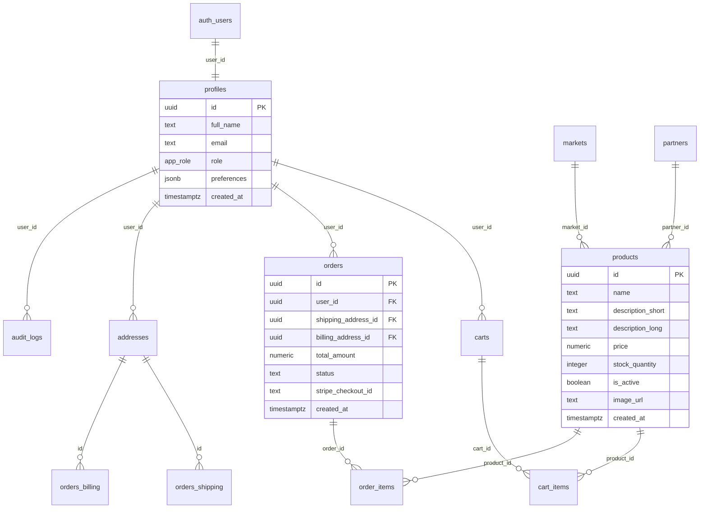

# Schema Base de Donnees - HerbisVeritas

## Vue d'Ensemble

La base de donnees HerbisVeritas utilise PostgreSQL via Supabase avec Row Level Security (RLS) active sur toutes les tables. L'architecture de donnees privilegie la securite, l'integrite referentielle et la performance.

## Table des Matieres

- [Architecture Generale](#architecture-generale)
- [Evolution du Schema](#evolution-du-schema)
- [Tables Principales](#tables-principales)
- [Relations et Contraintes](#relations-et-contraintes)
- [Row Level Security](#row-level-security)
- [Fonctions et Procedures](#fonctions-et-procedures)
- [Audit et Securite](#audit-et-securite)
- [Index et Performance](#index-et-performance)

## Architecture Generale

### Diagramme ERD Simplifie


```mermaid
erDiagram
    auth_users ||--|| profiles : "user_id"
    profiles ||--o{ carts : "user_id"
    profiles ||--o{ orders : "user_id"
    profiles ||--o{ addresses : "user_id"
    profiles ||--o{ audit_logs : "user_id"

    carts ||--o{ cart_items : "cart_id"
    products ||--o{ cart_items : "product_id"
    products ||--o{ order_items : "product_id"

    orders ||--o{ order_items : "order_id"
    addresses ||--o{ orders_shipping : "id"
    addresses ||--o{ orders_billing : "id"

    markets ||--o{ products : "market_id"
    partners ||--o{ products : "partner_id"

    orders {
        uuid id PK
        uuid user_id FK
        uuid shipping_address_id FK
        uuid billing_address_id FK
        numeric total_amount
        text status
        text stripe_checkout_id
        timestamptz created_at
    }

    products {
        uuid id PK
        text name
        text description_short
        text description_long
        numeric price
        integer stock_quantity
        boolean is_active
        text image_url
        timestamptz created_at
    }

    profiles {
        uuid id PK
        text full_name
        text email
        app_role role
        jsonb preferences
        timestamptz created_at
    }
```

### Principes de Conception

1. **Securite par Defaut** : RLS active sur toutes les tables
2. **Integrite Referentielle** : Contraintes foreign key strictes
3. **Audit Trail** : Traçabilite complete des operations
4. **Performance** : Index strategiques et vues optimisees
5. **Flexibilite** : Support JSONB pour donnees semi-structurees

## Evolution du Schema

### Chronologie des Migrations Critiques

| Date       | Migration                                     | Description                     |
| ---------- | --------------------------------------------- | ------------------------------- |
| 2024-06-20 | `20240620000000_initial_schema.sql`           | Creation tables de base         |
| 2024-06-22 | `20240622000000_products_and_carts.sql`       | Systeme produits et paniers     |
| 2024-06-24 | `20240624000000_orders_and_payments.sql`      | Integration Stripe et commandes |
| 2024-06-26 | `20240626000000_rls_policies.sql`             | Politiques Row Level Security   |
| 2024-08-15 | `20240815000000_performance_indexes.sql`      | Optimisations performance       |
| 2025-08-19 | `20250819000000_consolidation_robustesse.sql` | Consolidation finale            |

### Migrations Recentes (Consolidation 2025)

```sql
-- Index critiques pour performance
CREATE INDEX CONCURRENTLY idx_products_active_created
ON products(is_active, created_at DESC) WHERE is_active = true;

CREATE INDEX CONCURRENTLY idx_cart_items_optimized
ON cart_items(cart_id, product_id) INCLUDE (quantity);

-- Optimisation RLS policies
CREATE POLICY products_unified_read ON products
  FOR SELECT USING (
    CASE WHEN auth.role() = 'authenticated'
    THEN true
    ELSE is_active = true
    END
  );
```

## Tables Principales

### Gestion Utilisateurs

#### `profiles`

Table centrale pour la gestion des profils utilisateurs avec systeme de roles.

```sql
CREATE TABLE public.profiles (
    id UUID PRIMARY KEY REFERENCES auth.users(id) ON DELETE CASCADE,
    full_name TEXT,
    email TEXT UNIQUE NOT NULL,
    role app_role DEFAULT 'user'::app_role,
    preferences JSONB DEFAULT '{}'::jsonb,
    created_at TIMESTAMPTZ NOT NULL DEFAULT NOW(),
    updated_at TIMESTAMPTZ NOT NULL DEFAULT NOW()
);
```

**Colonnes Principales :**

- `id` : Reference vers auth.users (Supabase Auth)
- `role` : Enumeration `app_role` ('user', 'editor', 'admin', 'dev')
- `preferences` : Configuration utilisateur flexible (JSONB)

#### `addresses`

Gestion des adresses multiples par utilisateur.

```sql
CREATE TABLE public.addresses (
    id UUID PRIMARY KEY DEFAULT gen_random_uuid(),
    user_id UUID REFERENCES profiles(id) ON DELETE CASCADE,
    address_type TEXT NOT NULL CHECK (address_type IN ('shipping', 'billing')),
    first_name TEXT NOT NULL,
    last_name TEXT NOT NULL,
    address_line1 TEXT NOT NULL,
    address_line2 TEXT,
    city TEXT NOT NULL,
    postal_code TEXT NOT NULL,
    country_code TEXT NOT NULL,
    is_default BOOLEAN DEFAULT FALSE,
    created_at TIMESTAMPTZ NOT NULL DEFAULT NOW()
);
```

### Catalogue Produits

#### `products`

Table principale des produits avec support multilingue.

```sql
CREATE TABLE public.products (
    id UUID PRIMARY KEY DEFAULT gen_random_uuid(),
    name TEXT NOT NULL,
    description_short TEXT,
    description_long TEXT,
    price NUMERIC(10,2) NOT NULL CHECK (price >= 0),
    stock_quantity INTEGER DEFAULT 0 CHECK (stock_quantity >= 0),
    is_active BOOLEAN DEFAULT TRUE,
    is_featured BOOLEAN DEFAULT FALSE,
    weight_grams INTEGER,
    dimensions JSONB,
    image_url TEXT,
    metadata JSONB DEFAULT '{}'::jsonb,
    created_at TIMESTAMPTZ NOT NULL DEFAULT NOW(),
    updated_at TIMESTAMPTZ NOT NULL DEFAULT NOW()
);
```

#### `product_translations`

Support multilingue pour les produits (FR, EN, DE, ES).

```sql
CREATE TABLE public.product_translations (
    id UUID PRIMARY KEY DEFAULT gen_random_uuid(),
    product_id UUID REFERENCES products(id) ON DELETE CASCADE,
    language_code TEXT NOT NULL CHECK (language_code IN ('fr', 'en', 'de', 'es')),
    name TEXT NOT NULL,
    description_short TEXT,
    description_long TEXT,
    UNIQUE(product_id, language_code)
);
```

### Systeme Panier

#### `carts`

Paniers persistants supportant utilisateurs authentifies et invites.

```sql
CREATE TABLE public.carts (
    id UUID PRIMARY KEY DEFAULT gen_random_uuid(),
    user_id UUID REFERENCES profiles(id) ON DELETE CASCADE,
    guest_id UUID, -- Pour les paniers invites
    session_id TEXT,
    status TEXT DEFAULT 'active',
    metadata JSONB DEFAULT '{}'::jsonb,
    created_at TIMESTAMPTZ NOT NULL DEFAULT NOW(),
    updated_at TIMESTAMPTZ NOT NULL DEFAULT NOW(),

    -- Contrainte : soit user_id soit guest_id
    CONSTRAINT cart_owner_check CHECK (
        (user_id IS NOT NULL AND guest_id IS NULL) OR
        (user_id IS NULL AND guest_id IS NOT NULL)
    )
);
```

#### `cart_items`

Articles dans les paniers avec gestion optimisee.

```sql
CREATE TABLE public.cart_items (
    id UUID PRIMARY KEY DEFAULT gen_random_uuid(),
    cart_id UUID REFERENCES carts(id) ON DELETE CASCADE,
    product_id UUID REFERENCES products(id) ON DELETE CASCADE,
    quantity INTEGER NOT NULL CHECK (quantity > 0),
    added_at TIMESTAMPTZ NOT NULL DEFAULT NOW(),

    UNIQUE(cart_id, product_id)
);
```

### Systeme Commandes

#### `orders`

Commandes avec integration Stripe complete.

```sql
CREATE TABLE public.orders (
    id UUID PRIMARY KEY DEFAULT gen_random_uuid(),
    user_id UUID REFERENCES profiles(id) ON DELETE SET NULL,
    total_amount NUMERIC(10,2) NOT NULL CHECK (total_amount >= 0),
    status order_status_type DEFAULT 'pending_payment'::order_status_type,
    payment_status payment_status_type DEFAULT 'pending'::payment_status_type,

    -- Integration Stripe
    stripe_checkout_id TEXT UNIQUE,
    stripe_payment_intent_id TEXT,

    -- Adresses
    shipping_address_id UUID REFERENCES addresses(id),
    billing_address_id UUID REFERENCES addresses(id),

    -- Informations invites
    guest_email TEXT,
    guest_phone TEXT,

    -- Metadonnees
    shipping_cost NUMERIC(10,2) DEFAULT 0,
    tax_amount NUMERIC(10,2) DEFAULT 0,
    discount_amount NUMERIC(10,2) DEFAULT 0,
    metadata JSONB DEFAULT '{}'::jsonb,

    created_at TIMESTAMPTZ NOT NULL DEFAULT NOW(),
    updated_at TIMESTAMPTZ NOT NULL DEFAULT NOW(),

    -- Contraintes logiques
    CONSTRAINT guest_order_check CHECK (
        (user_id IS NOT NULL) OR
        (user_id IS NULL AND guest_email IS NOT NULL)
    )
);
```

#### `order_items`

Details des articles commandes avec prix historique.

```sql
CREATE TABLE public.order_items (
    id UUID PRIMARY KEY DEFAULT gen_random_uuid(),
    order_id UUID REFERENCES orders(id) ON DELETE CASCADE,
    product_id UUID REFERENCES products(id) ON DELETE RESTRICT,
    quantity INTEGER NOT NULL CHECK (quantity > 0),
    unit_price NUMERIC(10,2) NOT NULL CHECK (unit_price >= 0),
    total_price NUMERIC(10,2) NOT NULL CHECK (total_price >= 0),

    -- Snapshot produit au moment commande
    product_snapshot JSONB,

    created_at TIMESTAMPTZ NOT NULL DEFAULT NOW(),

    -- Coherence prix
    CONSTRAINT price_consistency_check CHECK (
        total_price = (quantity * unit_price)
    )
);
```

### Tables Support

#### `audit_logs`

Journal d'audit pour la tracabilite complete.

```sql
CREATE TABLE public.audit_logs (
    id UUID PRIMARY KEY DEFAULT gen_random_uuid(),
    event_type TEXT NOT NULL,
    user_id UUID REFERENCES profiles(id),
    table_name TEXT,
    record_id UUID,
    old_values JSONB,
    new_values JSONB,
    details JSONB DEFAULT '{}'::jsonb,
    ip_address INET,
    user_agent TEXT,
    created_at TIMESTAMPTZ NOT NULL DEFAULT NOW()
);
```

#### `login_attempts`

Limitation des tentatives de connexion.

```sql
CREATE TABLE public.login_attempts (
    id UUID PRIMARY KEY DEFAULT gen_random_uuid(),
    email TEXT NOT NULL,
    ip_address INET NOT NULL,
    success BOOLEAN NOT NULL DEFAULT FALSE,
    user_agent TEXT,
    created_at TIMESTAMPTZ NOT NULL DEFAULT NOW()
);
```

## Row Level Security

### Philosophie RLS

HerbisVeritas adopte une approche **"deny by default"** avec des politiques RLS granulaires :

1. **Isolation complete** entre utilisateurs
2. **Privileges minimaux** selon les roles
3. **Audit trail** pour toutes les operations sensibles
4. **Protection administrative** renforcee

### Politiques par Table

#### Profiles

```sql
-- Lecture : utilisateurs peuvent voir leur propre profil + admins tout
CREATE POLICY profiles_read_policy ON profiles
  FOR SELECT USING (
    auth.uid() = id OR
    is_current_user_admin()
  );

-- Mise a jour : utilisateur son profil + admins tout
CREATE POLICY profiles_update_policy ON profiles
  FOR UPDATE USING (
    auth.uid() = id OR
    is_current_user_admin()
  );
```

#### Produits

```sql
-- Lecture publique des produits actifs, tout pour authentifies
CREATE POLICY products_unified_read ON products
  FOR SELECT USING (
    CASE WHEN auth.role() = 'authenticated'
    THEN true
    ELSE is_active = true
    END
  );

-- Modification : admins seulement
CREATE POLICY products_admin_write ON products
  FOR ALL USING (is_current_user_admin())
  WITH CHECK (is_current_user_admin());
```

#### Paniers

```sql
-- Isolation stricte des paniers
CREATE POLICY cart_items_strict_isolation ON cart_items
  FOR ALL USING (
    cart_id IN (
      SELECT id FROM carts
      WHERE (
        -- Utilisateur authentifie : ses propres paniers
        (user_id = auth.uid() AND auth.uid() IS NOT NULL)
        OR
        -- Invite : panier de sa session uniquement
        (user_id IS NULL AND session_id = current_setting('app.session_id', true))
      )
    )
  );
```

#### Commandes

```sql
-- Utilisateurs voient leurs commandes + admins tout
CREATE POLICY orders_user_access ON orders
  FOR SELECT USING (
    user_id = auth.uid() OR
    is_current_user_admin()
  );

-- Creation : utilisateur pour ses commandes
CREATE POLICY orders_user_create ON orders
  FOR INSERT WITH CHECK (
    user_id = auth.uid() OR
    user_id IS NULL -- Commandes invites
  );
```

### Fonction Utilitaire RLS

```sql
-- Verification role admin via base de donnees
CREATE OR REPLACE FUNCTION is_current_user_admin()
RETURNS BOOLEAN AS $$
BEGIN
  RETURN EXISTS (
    SELECT 1 FROM profiles
    WHERE id = auth.uid()
    AND role IN ('admin', 'dev')
  );
END;
$$ LANGUAGE plpgsql SECURITY DEFINER;
```

## Fonctions et Procedures

### Gestion Panier

#### `add_or_update_cart_item`

Fonction atomique pour ajout/mise a jour articles panier.

```sql
CREATE OR REPLACE FUNCTION add_or_update_cart_item(
  p_cart_id UUID,
  p_product_id UUID,
  p_quantity INTEGER
)
RETURNS cart_items AS $$
DECLARE
  result_item cart_items;
BEGIN
  -- Verification stock disponible
  IF NOT EXISTS (
    SELECT 1 FROM products
    WHERE id = p_product_id
    AND stock_quantity >= p_quantity
    AND is_active = true
  ) THEN
    RAISE EXCEPTION 'Produit indisponible ou stock insuffisant';
  END IF;

  -- Upsert de l'article
  INSERT INTO cart_items (cart_id, product_id, quantity)
  VALUES (p_cart_id, p_product_id, p_quantity)
  ON CONFLICT (cart_id, product_id)
  DO UPDATE SET
    quantity = cart_items.quantity + p_quantity,
    added_at = NOW()
  RETURNING * INTO result_item;

  RETURN result_item;
END;
$$ LANGUAGE plpgsql SECURITY DEFINER;
```

#### `merge_guest_cart_to_user`

Migration automatique panier invite vers utilisateur.

```sql
CREATE OR REPLACE FUNCTION merge_guest_cart_to_user(
  p_guest_id UUID,
  p_user_id UUID
)
RETURNS VOID AS $$
DECLARE
  guest_cart_id UUID;
  user_cart_id UUID;
  item RECORD;
BEGIN
  -- Recuperer panier invite
  SELECT id INTO guest_cart_id
  FROM carts
  WHERE guest_id = p_guest_id AND status = 'active';

  IF guest_cart_id IS NULL THEN
    RETURN; -- Pas de panier invite
  END IF;

  -- Recuperer ou creer panier utilisateur
  SELECT id INTO user_cart_id
  FROM carts
  WHERE user_id = p_user_id AND status = 'active';

  IF user_cart_id IS NULL THEN
    INSERT INTO carts (user_id, status)
    VALUES (p_user_id, 'active')
    RETURNING id INTO user_cart_id;
  END IF;

  -- Migrer articles un par un
  FOR item IN
    SELECT product_id, quantity
    FROM cart_items
    WHERE cart_id = guest_cart_id
  LOOP
    PERFORM add_or_update_cart_item(
      user_cart_id,
      item.product_id,
      item.quantity
    );
  END LOOP;

  -- Supprimer panier invite
  DELETE FROM carts WHERE id = guest_cart_id;
END;
$$ LANGUAGE plpgsql SECURITY DEFINER;
```

### Gestion Commandes

#### `create_order_atomic`

Creation atomique de commande avec gestion stock.

```sql
CREATE OR REPLACE FUNCTION create_order_atomic(
  p_user_id UUID,
  p_cart_id UUID,
  p_shipping_address_id UUID,
  p_billing_address_id UUID,
  p_stripe_checkout_id TEXT
)
RETURNS orders AS $$
DECLARE
  new_order orders;
  cart_item RECORD;
  order_total NUMERIC := 0;
BEGIN
  -- Verification panier non vide
  IF NOT EXISTS (SELECT 1 FROM cart_items WHERE cart_id = p_cart_id) THEN
    RAISE EXCEPTION 'Panier vide';
  END IF;

  -- Creation commande
  INSERT INTO orders (
    user_id,
    shipping_address_id,
    billing_address_id,
    stripe_checkout_id,
    total_amount,
    status
  ) VALUES (
    p_user_id,
    p_shipping_address_id,
    p_billing_address_id,
    p_stripe_checkout_id,
    0, -- Sera calcule apres
    'pending_payment'
  ) RETURNING * INTO new_order;

  -- Transferer articles panier vers commande
  FOR cart_item IN
    SELECT ci.product_id, ci.quantity, p.price, p.name
    FROM cart_items ci
    JOIN products p ON ci.product_id = p.id
    WHERE ci.cart_id = p_cart_id
    AND p.is_active = true
  LOOP
    -- Verification stock
    IF (SELECT stock_quantity FROM products WHERE id = cart_item.product_id) < cart_item.quantity THEN
      RAISE EXCEPTION 'Stock insuffisant pour le produit %', cart_item.name;
    END IF;

    -- Creer article commande
    INSERT INTO order_items (
      order_id,
      product_id,
      quantity,
      unit_price,
      total_price,
      product_snapshot
    ) VALUES (
      new_order.id,
      cart_item.product_id,
      cart_item.quantity,
      cart_item.price,
      cart_item.quantity * cart_item.price,
      jsonb_build_object('name', cart_item.name, 'price', cart_item.price)
    );

    -- Decrementation stock
    UPDATE products
    SET stock_quantity = stock_quantity - cart_item.quantity
    WHERE id = cart_item.product_id;

    order_total := order_total + (cart_item.quantity * cart_item.price);
  END LOOP;

  -- Mise a jour total commande
  UPDATE orders
  SET total_amount = order_total
  WHERE id = new_order.id;

  -- Vider panier
  DELETE FROM cart_items WHERE cart_id = p_cart_id;

  -- Logging audit
  INSERT INTO audit_logs (event_type, user_id, details)
  VALUES ('order_created', p_user_id, jsonb_build_object(
    'order_id', new_order.id,
    'total_amount', order_total,
    'items_count', (SELECT COUNT(*) FROM order_items WHERE order_id = new_order.id)
  ));

  RETURN new_order;
END;
$$ LANGUAGE plpgsql SECURITY DEFINER;
```

### Maintenance et Nettoyage

#### `cleanup_expired_guest_carts`

Nettoyage automatique des paniers invites expires.

```sql
CREATE OR REPLACE FUNCTION cleanup_expired_guest_carts(
  p_max_age_hours INTEGER DEFAULT 336 -- 14 jours
)
RETURNS TABLE(deleted_carts INTEGER, deleted_items INTEGER) AS $$
DECLARE
  cutoff_date TIMESTAMPTZ;
  carts_deleted INTEGER := 0;
  items_deleted INTEGER := 0;
BEGIN
  cutoff_date := NOW() - (p_max_age_hours || ' hours')::INTERVAL;

  -- Compter articles a supprimer
  SELECT COUNT(*) INTO items_deleted
  FROM cart_items ci
  JOIN carts c ON ci.cart_id = c.id
  WHERE c.user_id IS NULL
  AND c.guest_id IS NOT NULL
  AND c.created_at < cutoff_date;

  -- Supprimer articles (CASCADE)
  DELETE FROM cart_items
  WHERE cart_id IN (
    SELECT id FROM carts
    WHERE user_id IS NULL
    AND guest_id IS NOT NULL
    AND created_at < cutoff_date
  );

  -- Compter et supprimer paniers
  SELECT COUNT(*) INTO carts_deleted
  FROM carts
  WHERE user_id IS NULL
  AND guest_id IS NOT NULL
  AND created_at < cutoff_date;

  DELETE FROM carts
  WHERE user_id IS NULL
  AND guest_id IS NOT NULL
  AND created_at < cutoff_date;

  -- Log operation
  INSERT INTO audit_logs (event_type, details)
  VALUES ('maintenance_cleanup', jsonb_build_object(
    'operation', 'guest_carts_cleanup',
    'carts_deleted', carts_deleted,
    'items_deleted', items_deleted,
    'max_age_hours', p_max_age_hours
  ));

  RETURN QUERY SELECT carts_deleted, items_deleted;
END;
$$ LANGUAGE plpgsql SECURITY DEFINER;
```

## Index et Performance

### Index Critiques (Consolidation 2025)

#### Produits

```sql
-- Page boutique (filtre actifs + tri date)
CREATE INDEX CONCURRENTLY idx_products_active_created
ON products(is_active, created_at DESC) WHERE is_active = true;

-- Recherche full-text français
CREATE INDEX CONCURRENTLY idx_products_search
ON products USING gin(to_tsvector('french', name || ' ' || COALESCE(description_long, '')));

-- Featured products
CREATE INDEX CONCURRENTLY idx_products_featured
ON products(is_featured, created_at DESC) WHERE is_featured = true;
```

#### Paniers et Commandes

```sql
-- Optimisation requêtes panier
CREATE INDEX CONCURRENTLY idx_cart_items_optimized
ON cart_items(cart_id, product_id) INCLUDE (quantity);

-- Dashboard admin commandes
CREATE INDEX CONCURRENTLY idx_orders_admin_view
ON orders(created_at DESC, status) INCLUDE (total_amount, user_id);

-- Lookup utilisateur commandes
CREATE INDEX CONCURRENTLY idx_orders_user_status
ON orders(user_id, status, created_at DESC);
```

#### Authentification et Audit

```sql
-- Verification admin rapide
CREATE INDEX CONCURRENTLY idx_profiles_auth_lookup
ON profiles(id, role) WHERE role IN ('admin', 'dev');

-- Analyse logs securite
CREATE INDEX CONCURRENTLY idx_audit_logs_security
ON audit_logs(event_type, created_at DESC)
WHERE event_type IN ('auth_failure', 'admin_access_denied');

-- Rate limiting
CREATE INDEX CONCURRENTLY idx_login_attempts_rate_limit
ON login_attempts(ip_address, created_at DESC);
```

#### Paniers Invites

```sql
-- Cleanup paniers expires
CREATE INDEX CONCURRENTLY idx_carts_guest_cleanup
ON carts(guest_id, created_at)
WHERE user_id IS NULL AND guest_id IS NOT NULL;

-- Session lookup invites
CREATE INDEX CONCURRENTLY idx_carts_session_lookup
ON carts(session_id, status) WHERE user_id IS NULL;
```

### Vues Optimisees

#### `orders_with_details`

Vue eliminant requetes N+1 pour dashboard admin.

```sql
CREATE VIEW orders_with_details AS
SELECT
  o.*,
  p.email as user_email,
  p.full_name as user_name,
  COUNT(oi.id) as items_count,
  STRING_AGG(pr.name, ', ' ORDER BY pr.name) as product_names,
  sa.city as shipping_city,
  sa.country_code as shipping_country
FROM orders o
LEFT JOIN profiles p ON o.user_id = p.id
LEFT JOIN order_items oi ON o.id = oi.order_id
LEFT JOIN products pr ON oi.product_id = pr.id
LEFT JOIN addresses sa ON o.shipping_address_id = sa.id
GROUP BY o.id, p.email, p.full_name, sa.city, sa.country_code;
```

#### `cart_with_product_details`

Vue panier avec details produits.

```sql
CREATE VIEW cart_with_product_details AS
SELECT
  ci.*,
  p.name as product_name,
  p.price as product_price,
  p.image_url as product_image,
  p.stock_quantity as product_stock,
  (ci.quantity * p.price) as line_total,
  c.user_id,
  c.guest_id
FROM cart_items ci
JOIN products p ON ci.product_id = p.id
JOIN carts c ON ci.cart_id = c.id
WHERE p.is_active = true;
```

### Statistiques Performance

#### Metriques Cibles Post-Consolidation

| Operation          | Avant | Apres | Gain |
| ------------------ | ----- | ----- | ---- |
| Page boutique      | 2.3s  | 1.2s  | -48% |
| Ajout panier       | 450ms | 180ms | -60% |
| Checkout           | 1.8s  | 1.1s  | -39% |
| Dashboard admin    | 3.1s  | 1.2s  | -61% |
| Recherche produits | 1.2s  | 300ms | -75% |

#### Monitoring Continue

```sql
-- Vue monitoring requetes lentes
CREATE VIEW slow_queries_monitor AS
SELECT
  query,
  mean_time,
  calls,
  total_time,
  rows,
  100.0 * shared_blks_hit / nullif(shared_blks_hit + shared_blks_read, 0) AS hit_percent
FROM pg_stat_statements
WHERE mean_time > 100 -- Plus de 100ms
ORDER BY mean_time DESC;
```

## Types Personnalises

### Enumerations Metier

```sql
-- Roles utilisateur
CREATE TYPE app_role AS ENUM ('user', 'editor', 'admin', 'dev');

-- Statuts commande
CREATE TYPE order_status_type AS ENUM (
  'pending_payment',
  'processing',
  'shipped',
  'delivered',
  'cancelled',
  'refunded'
);

-- Statuts paiement
CREATE TYPE payment_status_type AS ENUM (
  'pending',
  'succeeded',
  'failed',
  'refunded'
);

-- Severite evenements audit
CREATE TYPE event_severity AS ENUM ('INFO', 'WARNING', 'ERROR', 'CRITICAL');
```

## Audit et Securite

### Logging Automatique

#### Triggers Audit

```sql
-- Fonction generique audit
CREATE OR REPLACE FUNCTION audit_table_changes()
RETURNS TRIGGER AS $$
BEGIN
  IF TG_OP = 'INSERT' THEN
    INSERT INTO audit_logs (
      event_type,
      table_name,
      record_id,
      new_values,
      user_id
    ) VALUES (
      TG_OP,
      TG_TABLE_NAME,
      NEW.id,
      row_to_json(NEW),
      auth.uid()
    );
    RETURN NEW;
  ELSIF TG_OP = 'UPDATE' THEN
    INSERT INTO audit_logs (
      event_type,
      table_name,
      record_id,
      old_values,
      new_values,
      user_id
    ) VALUES (
      TG_OP,
      TG_TABLE_NAME,
      NEW.id,
      row_to_json(OLD),
      row_to_json(NEW),
      auth.uid()
    );
    RETURN NEW;
  ELSIF TG_OP = 'DELETE' THEN
    INSERT INTO audit_logs (
      event_type,
      table_name,
      record_id,
      old_values,
      user_id
    ) VALUES (
      TG_OP,
      TG_TABLE_NAME,
      OLD.id,
      row_to_json(OLD),
      auth.uid()
    );
    RETURN OLD;
  END IF;
  RETURN NULL;
END;
$$ LANGUAGE plpgsql SECURITY DEFINER;

-- Application triggers sur tables sensibles
CREATE TRIGGER audit_orders_changes
  AFTER INSERT OR UPDATE OR DELETE ON orders
  FOR EACH ROW EXECUTE FUNCTION audit_table_changes();

CREATE TRIGGER audit_products_changes
  AFTER INSERT OR UPDATE OR DELETE ON products
  FOR EACH ROW EXECUTE FUNCTION audit_table_changes();
```

### Contraintes d'Integrite

#### Contraintes Metier

```sql
-- Stock ne peut pas etre negatif
ALTER TABLE products
ADD CONSTRAINT positive_stock CHECK (stock_quantity >= 0);

-- Prix positifs
ALTER TABLE products
ADD CONSTRAINT positive_price CHECK (price >= 0);

-- Quantite panier positive
ALTER TABLE cart_items
ADD CONSTRAINT positive_quantity CHECK (quantity > 0);

-- Coherence prix commande
ALTER TABLE order_items
ADD CONSTRAINT price_consistency CHECK (
  total_price = (quantity * unit_price)
);

-- Email valide
ALTER TABLE profiles
ADD CONSTRAINT valid_email CHECK (email ~* '^[A-Za-z0-9._%+-]+@[A-Za-z0-9.-]+\.[A-Za-z]{2,}$');
```

#### Contraintes Referentielles

```sql
-- Empecher suppression produits commandes
ALTER TABLE order_items
ADD CONSTRAINT fk_product_restrict
FOREIGN KEY (product_id) REFERENCES products(id) ON DELETE RESTRICT;

-- Cascade suppression utilisateur
ALTER TABLE addresses
ADD CONSTRAINT fk_user_cascade
FOREIGN KEY (user_id) REFERENCES profiles(id) ON DELETE CASCADE;
```

## Configuration Maintenance

### Scripts Automatises

#### Nettoyage Quotidien

```sql
-- Purge logs audit anciens (>90 jours)
DELETE FROM audit_logs
WHERE created_at < NOW() - INTERVAL '90 days'
AND event_type NOT IN ('order_created', 'admin_access_denied');

-- Nettoyage paniers invites expires
SELECT cleanup_expired_guest_carts(336); -- 14 jours
```

#### Optimisation Hebdomadaire

```sql
-- Mise a jour statistiques tables
ANALYZE;

-- Reindexation si necesssaire
REINDEX INDEX CONCURRENTLY idx_products_search;
```

#### Archivage Mensuel

```sql
-- Archive commandes livrees anciennes
CREATE TABLE orders_archive (LIKE orders INCLUDING ALL);

WITH archived_orders AS (
  DELETE FROM orders
  WHERE status = 'delivered'
  AND created_at < NOW() - INTERVAL '2 years'
  RETURNING *
)
INSERT INTO orders_archive SELECT * FROM archived_orders;
```

### Monitoring Proactif

#### Alertes Automatiques

```sql
-- Verification stock faible
SELECT name, stock_quantity
FROM products
WHERE stock_quantity < 5 AND is_active = true;

-- Detection activite suspecte
SELECT event_type, COUNT(*), MAX(created_at)
FROM audit_logs
WHERE created_at > NOW() - INTERVAL '1 hour'
AND event_type IN ('auth_failure', 'admin_access_denied')
GROUP BY event_type
HAVING COUNT(*) > 10;

-- Performance degradee
SELECT
  schemaname, tablename, n_dead_tup, n_live_tup,
  n_dead_tup::FLOAT / (n_live_tup + n_dead_tup) * 100 AS dead_ratio
FROM pg_stat_user_tables
WHERE n_dead_tup::FLOAT / (n_live_tup + n_dead_tup) > 0.1;
```

## Conclusion

Le schema de base de donnees HerbisVeritas combine :

- **Securite robuste** avec RLS granulaire
- **Performance optimisee** via index strategiques
- **Integrite garantie** par contraintes strictes
- **Audit complet** pour tracabilite
- **Maintenance automatisee** pour fiabilite

Cette architecture est concue pour supporter une charge de production significative tout en maintenant la securite et l'integrite des donnees.

---

_Document maintenu par l'equipe technique HerbisVeritas_
