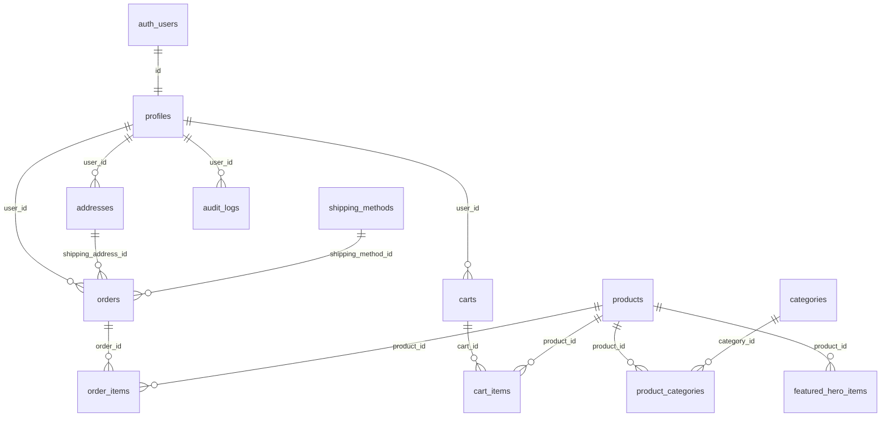
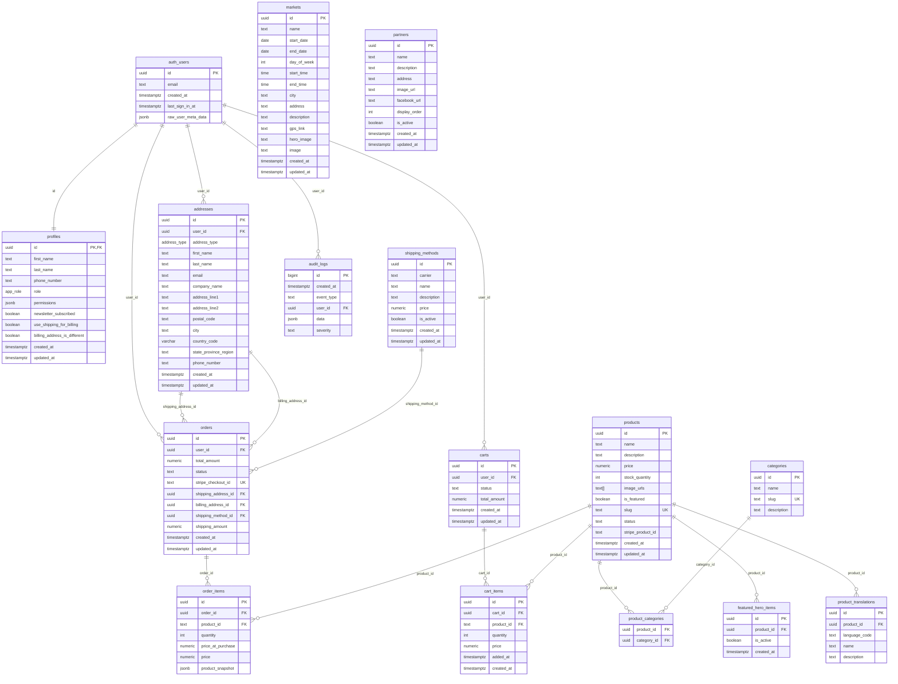

# Documentation Technique : Évolution du Schéma de Base de Données Supabase

## Table des Matières

1. [Résumé Exécutif](#résumé-exécutif)
2. [Évolution Chronologique du Schéma](#évolution-chronologique-du-schéma)
3. [Architecture des Tables Principales](#architecture-des-tables-principales)
4. [Système de Sécurité et Politiques RLS](#système-de-sécurité-et-politiques-rls)
5. [Fonctions Stockées et RPC](#fonctions-stockées-et-rpc)
6. [Triggers et Automatisations](#triggers-et-automatisations)
7. [Système de Permissions et de Rôles](#système-de-permissions-et-de-rôles)
8. [Tables d'Audit et de Logging](#tables-daudit-et-de-logging)
9. [Analyse des Migrations Correctives](#analyse-des-migrations-correctives)
10. [Diagramme de Relations](#diagramme-de-relations)
11. [Recommandations Techniques](#recommandations-techniques)

---

## Résumé Exécutif

Le schéma de base de données Herbis Veritas a évolué de janvier 2025 à juillet 2025 à travers 35 migrations, transformant une structure initiale simple en un système e-commerce robuste avec gestion complète des utilisateurs, produits, commandes et sécurité.

### Points Clés de l'Architecture

- **Base de données** : PostgreSQL avec Supabase
- **Sécurité** : Row Level Security (RLS) activé sur toutes les tables
- **Authentification** : Intégration complète avec auth.users de Supabase
- **Audit** : Logging complet des actions critiques
- **Rôles** : Système hiérarchique (user, editor, admin, dev)
- **Commerce** : Gestion complète panier → commande → expédition

---

## Évolution Chronologique du Schéma

### Phase 1 : Infrastructure de Base (Janvier 2025)

#### Migration 20250108120000 - Création des Marchés
```sql
CREATE TABLE markets (
  id UUID DEFAULT gen_random_uuid() PRIMARY KEY,
  name TEXT NOT NULL,
  start_date DATE NOT NULL,
  end_date DATE NOT NULL,
  day_of_week INTEGER NOT NULL CHECK (day_of_week >= 0 AND day_of_week <= 6),
  start_time TIME NOT NULL,
  end_time TIME NOT NULL,
  city TEXT NOT NULL,
  address TEXT,
  description TEXT,
  gps_link TEXT,
  hero_image TEXT,
  image TEXT,
  created_at TIMESTAMPTZ DEFAULT NOW(),
  updated_at TIMESTAMPTZ DEFAULT NOW()
);
```

**Analyse** : Introduction du concept de marchés récurrents avec contraintes temporelles robustes et géolocalisation.

#### Migration 20250108130000 - Création des Partenaires
```sql
CREATE TABLE partners (
  id UUID DEFAULT gen_random_uuid() PRIMARY KEY,
  name TEXT NOT NULL,
  description TEXT NOT NULL,
  address TEXT NOT NULL,
  image_url TEXT NOT NULL,
  facebook_url TEXT,
  display_order INTEGER DEFAULT 0,
  is_active BOOLEAN DEFAULT true,
  created_at TIMESTAMPTZ DEFAULT NOW(),
  updated_at TIMESTAMPTZ DEFAULT NOW()
);
```

**Analyse** : Système de partenaires avec gestion de l'ordre d'affichage et activation/désactivation.

#### Migration 20250108140000 - Triggers de Mise à Jour
```sql
CREATE OR REPLACE FUNCTION update_updated_at_column()
RETURNS TRIGGER AS $$
BEGIN
  NEW.updated_at = NOW();
  RETURN NEW;
END;
$$ language 'plpgsql';
```

**Analyse** : Automatisation de la mise à jour des timestamps, première automatisation du système.

### Phase 2 : Système d'Administration (Janvier 2025)

#### Migration 20250119120000 - Système de Rôles Basé sur la Base de Données
```sql
ALTER TABLE profiles 
ADD COLUMN IF NOT EXISTS role TEXT DEFAULT 'user' CHECK (role IN ('user', 'editor', 'admin')),
ADD COLUMN IF NOT EXISTS permissions JSONB DEFAULT '[]';

CREATE OR REPLACE FUNCTION is_admin(user_id UUID DEFAULT auth.uid())
RETURNS BOOLEAN AS $$
BEGIN
  RETURN (
    SELECT role FROM profiles WHERE id = user_id
  ) = 'admin';
END;
$$ LANGUAGE plpgsql SECURITY DEFINER;
```

**Analyse** : Transition majeure vers un système de permissions flexible avec audit intégré.

#### Migration 20250125000000 - Gestion des Utilisateurs Anonymes
```sql
CREATE OR REPLACE FUNCTION public.handle_new_user()
RETURNS TRIGGER AS $$
BEGIN
  -- Ignorer les utilisateurs anonymes (sans email)
  IF NEW.email IS NULL THEN
    RAISE LOG 'Utilisateur anonyme créé, pas de profil nécessaire: id=%', NEW.id;
    RETURN NEW;
  END IF;
  -- Créer un profil seulement pour les utilisateurs avec email
  INSERT INTO public.profiles (id, full_name, avatar_url, app_role)
  VALUES (NEW.id, ...);
END;
$$ LANGUAGE plpgsql SECURITY DEFINER;
```

**Analyse** : Robustesse ajoutée pour gérer les sessions anonymes sans créer de profils inutiles.

### Phase 3 : Système E-Commerce Complet (Juin 2025)

#### Migration 20250623170000 - Schéma Initial des Profils
```sql
CREATE TYPE public.app_role AS ENUM ('user', 'editor', 'admin', 'dev');

CREATE TABLE public.profiles (
    id UUID PRIMARY KEY NOT NULL,
    first_name TEXT CHECK (char_length(first_name) < 256),
    last_name TEXT CHECK (char_length(last_name) < 256),
    created_at TIMESTAMPTZ NOT NULL DEFAULT timezone('utc'::text, now()),
    updated_at TIMESTAMPTZ NOT NULL DEFAULT timezone('utc'::text, now()),
    phone_number TEXT,
    role app_role NOT NULL DEFAULT 'user',
    newsletter_subscribed BOOLEAN DEFAULT false,
    use_shipping_for_billing BOOLEAN DEFAULT true,
    billing_address_is_different BOOLEAN DEFAULT false
);
```

**Analyse** : Refactorisation complète du système de profils avec validation stricte et gestion des préférences utilisateur.

#### Migration 20250623180000 - Catalogue Produits
```sql
CREATE TABLE public.products (
    id UUID PRIMARY KEY DEFAULT gen_random_uuid(),
    name TEXT NOT NULL,
    description TEXT,
    price NUMERIC NOT NULL CHECK (price >= 0),
    stock_quantity INT NOT NULL DEFAULT 0 CHECK (stock_quantity >= 0),
    image_urls TEXT[],
    created_at TIMESTAMPTZ NOT NULL DEFAULT timezone('utc'::text, now()),
    updated_at TIMESTAMPTZ NOT NULL DEFAULT timezone('utc'::text, now()),
    is_featured BOOLEAN DEFAULT false,
    slug TEXT NOT NULL UNIQUE,
    status TEXT DEFAULT 'draft',
    stripe_product_id TEXT
);

CREATE TABLE public.categories (
    id UUID PRIMARY KEY DEFAULT gen_random_uuid(),
    name TEXT NOT NULL,
    slug TEXT NOT NULL UNIQUE,
    description TEXT
);

CREATE TABLE public.product_categories (
    product_id UUID NOT NULL REFERENCES public.products(id) ON DELETE CASCADE,
    category_id UUID NOT NULL REFERENCES public.categories(id) ON DELETE CASCADE,
    PRIMARY KEY (product_id, category_id)
);
```

**Analyse** : Architecture e-commerce robuste avec gestion multi-catégories, internationalisation et intégration Stripe.

#### Migration 20250623190000 - Système de Panier
```sql
CREATE TABLE public.carts (
    id UUID PRIMARY KEY DEFAULT gen_random_uuid(),
    user_id UUID REFERENCES auth.users(id) ON DELETE CASCADE,
    created_at TIMESTAMPTZ NOT NULL DEFAULT timezone('utc'::text, now()),
    updated_at TIMESTAMPTZ NOT NULL DEFAULT timezone('utc'::text, now()),
    status TEXT NOT NULL DEFAULT 'active',
    total_amount NUMERIC
);

CREATE TABLE public.cart_items (
    id UUID PRIMARY KEY DEFAULT gen_random_uuid(),
    cart_id UUID NOT NULL REFERENCES public.carts(id) ON DELETE CASCADE,
    product_id TEXT NOT NULL,
    quantity INT NOT NULL CHECK (quantity > 0),
    added_at TIMESTAMPTZ NOT NULL DEFAULT timezone('utc'::text, now()),
    created_at TIMESTAMPTZ NOT NULL DEFAULT timezone('utc'::text, now()),
    price NUMERIC,
    UNIQUE (cart_id, product_id)
);
```

**Analyse** : Panier persistant avec gestion d'état et contraintes d'intégrité pour éviter les doublons.

#### Migration 20250623191500 - Système de Commandes
```sql
CREATE TABLE public.orders (
    id UUID PRIMARY KEY DEFAULT gen_random_uuid(),
    user_id UUID NOT NULL REFERENCES auth.users(id),
    total_amount NUMERIC NOT NULL,
    status TEXT NOT NULL DEFAULT 'pending',
    created_at TIMESTAMPTZ NOT NULL DEFAULT timezone('utc'::text, now()),
    updated_at TIMESTAMPTZ NOT NULL DEFAULT timezone('utc'::text, now()),
    stripe_checkout_id TEXT UNIQUE,
    shipping_address_id UUID,
    billing_address_id UUID
);

CREATE TABLE public.order_items (
    id UUID PRIMARY KEY DEFAULT gen_random_uuid(),
    order_id UUID NOT NULL REFERENCES public.orders(id) ON DELETE CASCADE,
    product_id TEXT NOT NULL,
    quantity INT NOT NULL CHECK (quantity > 0),
    price_at_purchase NUMERIC NOT NULL,
    product_snapshot JSONB
);
```

**Analyse** : Système de commandes avec historique des prix et snapshot des produits pour l'audit.

### Phase 4 : Debugging et Optimisations (Juin 2025)

#### Migrations 20250623230000 à 20250624030000 - Cycle de Debug Intensif

Cette série de 15 migrations consécutives révèle un processus de debugging méthodique pour résoudre des problèmes de permissions RLS :

1. **20250623230000** : Tentative de politiques RLS pour les webhooks
2. **20250623231000** : Correction pour SECURITY DEFINER vs service_role
3. **20250624001000** : Ajout de politiques pour les produits
4. **20250624002000** : Suppression des politiques déficientes
5. **20250624004000** : Test canari pour l'insertion de commandes
6. **20250624005000** : Désactivation temporaire des FK
7. **20250624010000** : Suppression de politiques défaillantes
8. **20250624011000** : Permissions sur auth.users
9. **20250624012000** : Test ultra-minimaliste
10. **20250624013000** : Restauration après diagnostics
11. **20250624020000** : Permissions permanentes
12. **20250624030000** : Ajout colonne price manquante

**Analyse** : Cette séquence illustre l'importance des tests en production et la complexité des permissions Supabase.

### Phase 5 : Intégrations et Améliorations (Juillet 2025)

#### Migration 20250704101700 - Fonction Admin Sécurisée
```sql
CREATE OR REPLACE FUNCTION public.is_current_user_admin()
RETURNS boolean
LANGUAGE plpgsql
SECURITY DEFINER
SET search_path = ''
AS $$
DECLARE
  is_admin boolean;
BEGIN
  SELECT p.role = 'admin'
  INTO is_admin
  FROM public.profiles p
  WHERE p.id = auth.uid();

  RETURN COALESCE(is_admin, false);
END;
$$;
```

**Analyse** : Sécurisation renforcée avec search_path vide pour éviter les attaques par injection de schéma.

#### Migration 20250708102000 - Système d'Adresses
```sql
CREATE TYPE public.address_type AS ENUM ('shipping', 'billing');

create table public.addresses (
  id uuid primary key default gen_random_uuid(),
  user_id uuid references auth.users(id) on delete cascade not null,
  address_type address_type not null,
  is_default boolean not null default false,
  first_name text not null,
  last_name text not null,
  email text,
  company_name text,
  address_line1 text not null,
  address_line2 text,
  postal_code text not null,
  city text not null,
  country_code varchar(2) not null,
  state_province_region text,
  phone_number text,
  created_at timestamptz not null default now(),
  updated_at timestamptz not null default now()
);
```

**Analyse** : Gestion complète des adresses avec séparation billing/shipping et validation internationale.

#### Migration 20250710110201 - Système d'Expédition
```sql
CREATE TABLE public.shipping_methods (
    id uuid DEFAULT uuid_generate_v4() PRIMARY KEY,
    carrier TEXT NOT NULL CHECK (carrier <> ''),
    name TEXT NOT NULL CHECK (name <> ''),
    description TEXT,
    price NUMERIC(10, 2) NOT NULL CHECK (price >= 0),
    is_active BOOLEAN DEFAULT true NOT NULL
);

INSERT INTO public.shipping_methods (carrier, name, description, price, is_active)
VALUES
    ('Colissimo', 'Domicile - Sans signature', 'Livraison à domicile standard sans signature.', 5.95, true),
    ('Colissimo', 'Point Retrait', 'Livraison en point de retrait (bureau de poste, relais Pickup).', 4.50, true),
    ('Chronopost', 'Express 24h', 'Livraison express le lendemain avant 13h.', 12.50, true);
```

**Analyse** : Intégration complète avec les transporteurs français et gestion dynamique des prix.

---

## Architecture des Tables Principales

### Schéma Relationnel Actuel



### Tables Core Business

#### 1. Profiles (Table Centrale)
```sql
CREATE TABLE public.profiles (
    id UUID PRIMARY KEY NOT NULL,                    -- Lié à auth.users(id)
    first_name TEXT CHECK (char_length(first_name) < 256),
    last_name TEXT CHECK (char_length(last_name) < 256),
    phone_number TEXT,
    role app_role NOT NULL DEFAULT 'user',          -- Enum: user, editor, admin, dev
    newsletter_subscribed BOOLEAN DEFAULT false,
    use_shipping_for_billing BOOLEAN DEFAULT true,
    billing_address_is_different BOOLEAN DEFAULT false,
    created_at TIMESTAMPTZ NOT NULL DEFAULT timezone('utc'::text, now()),
    updated_at TIMESTAMPTZ NOT NULL DEFAULT timezone('utc'::text, now())
);
```

**Relations** : Hub central connecté à toutes les autres entités utilisateur.

#### 2. Products (Catalogue E-Commerce)
```sql
CREATE TABLE public.products (
    id UUID PRIMARY KEY DEFAULT gen_random_uuid(),
    name TEXT NOT NULL,
    description TEXT,
    price NUMERIC NOT NULL CHECK (price >= 0),
    stock_quantity INT NOT NULL DEFAULT 0 CHECK (stock_quantity >= 0),
    image_urls TEXT[],                              -- Array d'URLs d'images
    is_featured BOOLEAN DEFAULT false,
    slug TEXT NOT NULL UNIQUE,                      -- Pour SEO
    status TEXT DEFAULT 'draft',                    -- Gestion workflow
    stripe_product_id TEXT,                         -- Intégration paiement
    created_at TIMESTAMPTZ NOT NULL DEFAULT timezone('utc'::text, now()),
    updated_at TIMESTAMPTZ NOT NULL DEFAULT timezone('utc'::text, now())
);
```

**Relations** : Junction table avec categories, référencé par cart_items et order_items.

#### 3. Orders (Commandes)
```sql
CREATE TABLE public.orders (
    id UUID PRIMARY KEY DEFAULT gen_random_uuid(),
    user_id UUID NOT NULL REFERENCES auth.users(id),
    total_amount NUMERIC NOT NULL,
    status TEXT NOT NULL DEFAULT 'pending',
    stripe_checkout_id TEXT UNIQUE,
    shipping_address_id UUID REFERENCES public.addresses(id) ON DELETE SET NULL,
    billing_address_id UUID,
    shipping_method_id UUID REFERENCES public.shipping_methods(id) ON DELETE SET NULL,
    shipping_amount NUMERIC(10, 2),
    created_at TIMESTAMPTZ NOT NULL DEFAULT timezone('utc'::text, now()),
    updated_at TIMESTAMPTZ NOT NULL DEFAULT timezone('utc'::text, now())
);
```

**Relations** : Point de convergence du processus e-commerce avec liens vers adresses et méthodes d'expédition.

### Tables Support

#### 1. Addresses (Gestion Multi-Adresses)
```sql
create table public.addresses (
  id uuid primary key default gen_random_uuid(),
  user_id uuid references auth.users(id) on delete cascade not null,
  address_type address_type not null,              -- ENUM: 'shipping', 'billing'
  first_name text not null,
  last_name text not null,
  email text,
  company_name text,
  address_line1 text not null,
  address_line2 text,
  postal_code text not null,
  city text not null,
  country_code varchar(2) not null,               -- ISO 3166-1 alpha-2
  state_province_region text,
  phone_number text,
  created_at timestamptz not null default now(),
  updated_at timestamptz not null default now(),
  CONSTRAINT addresses_user_id_address_type_key UNIQUE (user_id, address_type)
);
```

**Contraintes** : Une seule adresse par type par utilisateur depuis la migration 20250709080000.

#### 2. Shipping_Methods (Transporteurs)
```sql
CREATE TABLE public.shipping_methods (
    id uuid DEFAULT uuid_generate_v4() PRIMARY KEY,
    carrier TEXT NOT NULL CHECK (carrier <> ''),
    name TEXT NOT NULL CHECK (name <> ''),
    description TEXT,
    price NUMERIC(10, 2) NOT NULL CHECK (price >= 0),
    is_active BOOLEAN DEFAULT true NOT NULL,
    created_at TIMESTAMPTZ DEFAULT timezone('utc'::text, now()) NOT NULL,
    updated_at TIMESTAMPTZ DEFAULT timezone('utc'::text, now()) NOT NULL
);
```

**Données** : Pré-remplie avec Colissimo et Chronopost pour le marché français.

---

## Système de Sécurité et Politiques RLS

### Architecture de Sécurité

Le système utilise Row Level Security (RLS) de PostgreSQL activé sur **toutes les tables**. Trois niveaux de permissions :

1. **Public (Lecture seule)** : Produits, méthodes d'expédition, marchés actifs
2. **Utilisateur Authentifié** : Ses propres données (profil, panier, commandes, adresses)
3. **Administrateur** : Accès complet avec audit automatique

### Politiques RLS Détaillées

#### 1. Tables Publiques (Lecture Seule)
```sql
-- Produits
CREATE POLICY "Allow public read access to products" ON public.products
FOR SELECT USING (true);

-- Méthodes d'expédition actives
CREATE POLICY "Allow public read access to active shipping methods" 
ON public.shipping_methods FOR SELECT 
USING (is_active = true);

-- Marchés
CREATE POLICY "Markets are viewable by everyone" 
ON markets FOR SELECT 
USING (true);
```

#### 2. Tables Utilisateur (Propriété)
```sql
-- Profils : lecture par le propriétaire ou admin
CREATE POLICY "Users can manage their own profile" ON public.profiles
FOR ALL
USING (auth.uid() = id)
WITH CHECK (auth.uid() = id);

-- Extension admin
CREATE POLICY "Admins can read all profiles" 
ON profiles 
FOR SELECT 
USING (
  auth.uid() = id OR 
  (SELECT role FROM profiles WHERE id = auth.uid()) = 'admin'
);

-- Paniers
CREATE POLICY "Users can view and manage their own carts"
ON public.carts
FOR ALL
USING (auth.uid() = user_id)
WITH CHECK (auth.uid() = user_id);

-- Articles du panier (sécurité par jointure)
CREATE POLICY "Users can view and manage their own cart items"
ON public.cart_items
FOR ALL
USING ((EXISTS ( SELECT 1 FROM carts WHERE ((carts.id = cart_items.cart_id) AND (carts.user_id = auth.uid())))))
WITH CHECK ((EXISTS ( SELECT 1 FROM carts WHERE ((carts.id = cart_items.cart_id) AND (carts.user_id = auth.uid())))));
```

#### 3. Tables Admin (Contrôle Total)
```sql
-- Utilisation de la fonction check_admin_role() (évoluée vers is_current_user_admin())
CREATE POLICY "Only admins can insert markets" 
ON markets FOR INSERT 
WITH CHECK (check_admin_role());

CREATE POLICY "Only admins can update markets" 
ON markets FOR UPDATE 
USING (check_admin_role());

CREATE POLICY "Only admins can delete markets" 
ON markets FOR DELETE 
USING (check_admin_role());
```

### Évolution des Fonctions de Sécurité

#### Version Initiale (Janvier 2025)
```sql
CREATE OR REPLACE FUNCTION is_admin(user_id UUID DEFAULT auth.uid())
RETURNS BOOLEAN AS $$
BEGIN
  RETURN (
    SELECT role FROM profiles WHERE id = user_id
  ) = 'admin';
END;
$$ LANGUAGE plpgsql SECURITY DEFINER;
```

#### Version Sécurisée (Juillet 2025)
```sql
CREATE OR REPLACE FUNCTION public.is_current_user_admin()
RETURNS boolean
LANGUAGE plpgsql
SECURITY DEFINER
SET search_path = ''  -- Protection contre les attaques par injection de schéma
AS $$
DECLARE
  is_admin boolean;
BEGIN
  SELECT p.role = 'admin'
  INTO is_admin
  FROM public.profiles p
  WHERE p.id = auth.uid();

  RETURN COALESCE(is_admin, false);
END;
$$;
```

**Améliorations** : 
- `SET search_path = ''` empêche les attaques par substitution de schéma
- `COALESCE(is_admin, false)` gère les cas NULL de manière sécurisée
- Qualification complète des tables (`public.profiles`)

---

## Fonctions Stockées et RPC

### 1. create_order_from_cart - Fonction Critique E-Commerce

Cette fonction a subi plusieurs itérations pour résoudre des problèmes de permissions complexes.

#### Version Finale Optimisée
```sql
CREATE OR REPLACE FUNCTION public.create_order_from_cart(
    p_cart_id UUID,
    p_stripe_checkout_id TEXT
)
RETURNS TEXT
LANGUAGE plpgsql
SECURITY DEFINER SET search_path = ''
AS $$
DECLARE
    v_user_id UUID;
    v_order_id UUID;
    v_total_amount NUMERIC;
    v_cart_status TEXT;
    v_error_message TEXT;
BEGIN
    BEGIN
        -- Vérification et récupération des données du panier
        SELECT user_id, status INTO v_user_id, v_cart_status
        FROM public.carts
        WHERE id = p_cart_id;

        -- Prévention du double traitement
        IF v_cart_status = 'processed' THEN
            RETURN 'ERROR: Cart is already processed.';
        END IF;

        -- Calcul du montant total
        SELECT SUM(ci.quantity * p.price) INTO v_total_amount
        FROM public.cart_items ci
        JOIN public.products p ON ci.product_id = p.id
        WHERE ci.cart_id = p_cart_id;

        -- Création de la commande
        INSERT INTO public.orders (user_id, total_amount, status, stripe_checkout_id)
        VALUES (v_user_id, v_total_amount, 'processing', p_stripe_checkout_id)
        RETURNING id INTO v_order_id;

        -- Transfert des articles du panier vers la commande
        INSERT INTO public.order_items (order_id, product_id, quantity, price_at_purchase)
        SELECT v_order_id, ci.product_id, ci.quantity, p.price
        FROM public.cart_items ci
        JOIN public.products p ON ci.product_id = p.id
        WHERE ci.cart_id = p_cart_id;

        -- Marquage du panier comme traité
        UPDATE public.carts
        SET status = 'processed'
        WHERE id = p_cart_id;

    EXCEPTION
        WHEN OTHERS THEN
            GET STACKED DIAGNOSTICS v_error_message = MESSAGE_TEXT;
            RAISE WARNING '[RPC create_order_from_cart] EXCEPTION: %', v_error_message;
            RETURN 'ERROR: ' || v_error_message;
    END;

    RETURN 'SUCCESS: Order ' || v_order_id || ' created successfully.';
END;
$$;
```

**Caractéristiques** :
- **SECURITY DEFINER** : Exécution avec privilèges élevés
- **Transaction atomique** : Tout ou rien
- **Gestion d'erreurs robuste** : Messages détaillés
- **Audit trail** : Logs automatiques
- **Prévention doublons** : Vérification statut panier

### 2. increment_product_stock - Gestion du Stock

```sql
CREATE OR REPLACE FUNCTION increment_product_stock(
  product_id UUID,
  quantity_to_add INTEGER
)
RETURNS VOID
LANGUAGE plpgsql
SECURITY DEFINER
AS $$
BEGIN
  -- Mise à jour du stock produit
  UPDATE products 
  SET 
    stock = stock + quantity_to_add,
    updated_at = NOW()
  WHERE id = product_id;
  
  -- Vérification que le produit existe
  IF NOT FOUND THEN
    RAISE EXCEPTION 'Product with ID % not found', product_id;
  END IF;
  
  -- Logging pour audit
  INSERT INTO audit_logs (
    event_type,
    data,
    severity
  ) VALUES (
    'stock_increment',
    jsonb_build_object(
      'product_id', product_id,
      'quantity_added', quantity_to_add,
      'operation', 'order_cancellation'
    ),
    'INFO'
  );
END;
$$;
```

**Usage** : Restauration du stock lors d'annulations de commandes avec audit automatique.

### 3. Fonctions de Sécurité et Permissions

#### has_permission - Vérification Granulaire
```sql
CREATE OR REPLACE FUNCTION has_permission(permission_name TEXT, user_id UUID DEFAULT auth.uid())
RETURNS BOOLEAN AS $$
DECLARE
  user_permissions JSONB;
  user_role TEXT;
BEGIN
  SELECT role, permissions INTO user_role, user_permissions
  FROM profiles 
  WHERE id = user_id;
  
  -- Admins avec permission wildcard
  IF user_role = 'admin' AND user_permissions ? '*' THEN
    RETURN TRUE;
  END IF;
  
  -- Vérification permission spécifique
  RETURN user_permissions ? permission_name;
END;
$$ LANGUAGE plpgsql SECURITY DEFINER;
```

**Utilisation** : Système de permissions granulaires avec wildcard admin.

---

## Triggers et Automatisations

### 1. Mise à Jour Automatique des Timestamps

#### Fonction Générique
```sql
CREATE OR REPLACE FUNCTION update_updated_at_column()
RETURNS TRIGGER AS $$
BEGIN
  NEW.updated_at = NOW();
  RETURN NEW;
END;
$$ language 'plpgsql';
```

#### Application sur les Tables
```sql
-- Markets
CREATE TRIGGER update_markets_updated_at 
  BEFORE UPDATE ON markets
  FOR EACH ROW 
  EXECUTE FUNCTION update_updated_at_column();

-- Partners
CREATE TRIGGER update_partners_updated_at 
  BEFORE UPDATE ON partners
  FOR EACH ROW 
  EXECUTE FUNCTION update_updated_at_column();

-- Shipping Methods
CREATE TRIGGER handle_shipping_methods_updated_at
BEFORE UPDATE ON public.shipping_methods
FOR EACH ROW
EXECUTE FUNCTION public.set_updated_at();
```

**Évolution** : Migration de `update_updated_at_column()` vers `set_updated_at()` pour plus de cohérence.

### 2. Création Automatique de Profils

#### Gestion des Utilisateurs Authentifiés
```sql
CREATE OR REPLACE FUNCTION public.handle_new_user()
RETURNS TRIGGER AS $$
BEGIN
  -- Ignorer les utilisateurs anonymes (sans email)
  IF NEW.email IS NULL THEN
    RAISE LOG 'Utilisateur anonyme créé, pas de profil nécessaire: id=%', NEW.id;
    RETURN NEW;
  END IF;

  -- Créer un profil pour les utilisateurs avec email
  INSERT INTO public.profiles (
    id, 
    first_name, 
    last_name, 
    billing_address_is_different
  )
  VALUES (
    NEW.id, 
    COALESCE(NEW.raw_user_meta_data->>'first_name', NULL), 
    COALESCE(NEW.raw_user_meta_data->>'last_name', NULL),
    false
  );
  
  RAISE LOG 'Profil créé pour utilisateur authentifié: id=%, email=%', NEW.id, NEW.email;
  RETURN NEW;
EXCEPTION
  WHEN OTHERS THEN
    RAISE LOG 'Erreur lors de la création du profil pour %: %', NEW.id, SQLERRM;
    -- Ne pas faire échouer la création de l'utilisateur
    RETURN NEW;
END;
$$ LANGUAGE plpgsql SECURITY DEFINER;

-- Trigger d'activation
CREATE TRIGGER on_auth_user_created
  AFTER INSERT ON auth.users
  FOR EACH ROW EXECUTE FUNCTION public.handle_new_user();
```

**Évolution** : 
- Migration 20250125000000 : Gestion des utilisateurs anonymes
- Migration 20250724000001 : Correction des colonnes et gestion d'erreurs robuste

### 3. Problèmes de Doublons et Résolutions

#### Migration 20250724000000 - Fix des Doublons
```sql
DO $$
DECLARE
    duplicate_count INTEGER;
    user_id UUID := '527c0b3b-20b5-4a2b-bd24-b04640a5bf41';
BEGIN
    SELECT COUNT(*) INTO duplicate_count
    FROM public.profiles 
    WHERE id = user_id;
    
    IF duplicate_count > 1 THEN
        DELETE FROM public.profiles 
        WHERE id = user_id 
        AND created_at NOT IN (
            SELECT MIN(created_at) 
            FROM public.profiles 
            WHERE id = user_id
        );
    END IF;
END $$;
```

**Solution** : 
- Détection et suppression des doublons
- Contrainte `ON CONFLICT DO NOTHING` dans les triggers
- Contrainte unique `profiles_id_unique`

---

## Système de Permissions et de Rôles

### Architecture Hiérarchique

#### Énumération des Rôles
```sql
CREATE TYPE public.app_role AS ENUM ('user', 'editor', 'admin', 'dev');
```

#### Niveau de Permissions par Rôle

| Rôle | Permissions | Cas d'Usage |
|------|------------|------------|
| **user** | - Lecture : ses propres données<br>- Écriture : profil, panier, commandes | Client standard |
| **editor** | - Permissions user<br>- Gestion contenu (articles, produits en draft) | Gestionnaire contenu |
| **admin** | - Toutes permissions<br>- Gestion utilisateurs<br>- Accès logs audit<br>- Configuration système | Administrateur |
| **dev** | - Permissions admin<br>- Accès développement<br>- Fonctions système | Développeur |

### Système de Permissions Granulaires

#### Structure JSONB
```sql
-- Exemples de permissions
permissions = '["products:create", "products:update", "users:read"]'::JSONB
permissions = '["*"]'::JSONB  -- Toutes permissions (admin)
```

#### Fonction de Vérification
```sql
SELECT has_permission('products:create', auth.uid());
-- Retourne TRUE si l'utilisateur a cette permission
```

### Gestion Dynamique des Rôles

#### Attribution par Migration
```sql
-- Migration 20250119120000 - Setup admin initial
DO $$
DECLARE
  admin_uuid TEXT;
BEGIN
  admin_uuid := COALESCE(
    current_setting('app.admin_principal_id', true),
    '245eba22-0041-44d1-94ee-9ca71d3d561d'
  );
  
  UPDATE profiles 
  SET 
    role = 'admin',
    permissions = '["*"]'::JSONB
  WHERE id = admin_uuid::UUID;
END $$;
```

#### Politiques RLS pour Modifications
```sql
CREATE POLICY "Only admins can modify roles and permissions"
ON profiles
FOR UPDATE
USING (
  (SELECT role FROM profiles WHERE id = auth.uid()) = 'admin'
)
WITH CHECK (
  -- Utilisateur normal : peut modifier son profil sauf rôle/permissions
  (auth.uid() = id AND OLD.role = NEW.role AND OLD.permissions = NEW.permissions) OR
  -- Admin : peut tout modifier
  (SELECT role FROM profiles WHERE id = auth.uid()) = 'admin'
);
```

---

## Tables d'Audit et de Logging

### Architecture du Système d'Audit

#### Table audit_logs
```sql
CREATE TABLE public.audit_logs (
    id BIGINT GENERATED BY DEFAULT AS IDENTITY PRIMARY KEY,
    created_at TIMESTAMPTZ DEFAULT NOW() NOT NULL,
    event_type TEXT NOT NULL,
    user_id UUID REFERENCES auth.users(id) ON DELETE SET NULL,
    data JSONB,
    severity TEXT DEFAULT 'INFO',
    CONSTRAINT event_type_check CHECK (char_length(event_type) > 0)
);
```

#### Index de Performance
```sql
CREATE INDEX IF NOT EXISTS idx_audit_logs_user_id ON audit_logs(user_id);
CREATE INDEX IF NOT EXISTS idx_audit_logs_event_type ON audit_logs(event_type);
CREATE INDEX IF NOT EXISTS idx_audit_logs_created_at ON audit_logs(created_at);
```

### Types d'Événements Audités

#### 1. Événements de Sécurité
```sql
INSERT INTO audit_logs (event_type, user_id, data) VALUES (
  'unauthorized_admin_access',
  auth.uid(),
  jsonb_build_object(
    'attempted_action', 'user_role_change',
    'target_user_id', target_user_id,
    'ip_address', request_ip,
    'user_agent', user_agent
  )
);
```

#### 2. Changements de Rôles
```sql
INSERT INTO audit_logs (event_type, user_id, data) VALUES (
  'role_change',
  auth.uid(),
  jsonb_build_object(
    'target_user_id', target_user_id,
    'old_role', old_role,
    'new_role', new_role,
    'reason', reason
  )
);
```

#### 3. Gestion du Stock
```sql
INSERT INTO audit_logs (event_type, data, severity) VALUES (
  'stock_increment',
  jsonb_build_object(
    'product_id', product_id,
    'quantity_added', quantity_to_add,
    'operation', 'order_cancellation'
  ),
  'INFO'
);
```

### Politiques de Sécurité pour l'Audit

#### Lecture (Admin Seulement)
```sql
CREATE POLICY "Only admins can read audit logs"
ON audit_logs
FOR SELECT
USING (is_current_user_admin());
```

#### Insertion (Authentifiés et Service)
```sql
CREATE POLICY "Admins can insert audit logs"
ON public.audit_logs
FOR INSERT
TO authenticated
WITH CHECK (is_current_user_admin());

-- Pour les Edge Functions
GRANT INSERT ON public.audit_logs TO service_role;
```

#### Immutabilité des Logs
```sql
CREATE POLICY "Logs are immutable" 
ON public.audit_logs 
FOR UPDATE 
USING (false);

CREATE POLICY "Logs cannot be deleted" 
ON public.audit_logs 
FOR DELETE 
USING (false);
```

### Vue d'Administration

#### admin_user_overview
```sql
CREATE OR REPLACE VIEW admin_user_overview AS
SELECT 
  p.id,
  p.email,
  p.role,
  p.permissions,
  p.created_at,
  p.updated_at,
  au.email_confirmed_at,
  au.last_sign_in_at
FROM profiles p
LEFT JOIN auth.users au ON p.id = au.id
WHERE is_admin();
```

**Usage** : Dashboard administrateur avec informations d'authentification croisées.

---

## Analyse des Migrations Correctives

### Cycle de Debug RLS (23-24 Juin 2025)

La période du 23-24 juin 2025 révèle un processus de debugging intensif illustrant la complexité des permissions Supabase.

#### Problématique Initiale
- Échec silencieux de la fonction `create_order_from_cart`
- Transactions qui semblent réussir mais n'insèrent rien
- Problèmes de permissions RLS avec SECURITY DEFINER

#### Approche Méthodique

1. **Hypothèse Webhook** (20250623230000)
   - Tentative de politiques spécifiques au service_role
   - Échec : SECURITY DEFINER s'exécute en tant que postgres, pas service_role

2. **Correction DEFINER** (20250623231000)
   - Redirection des politiques vers le rôle postgres
   - Échec : Les superusers bypassent RLS par défaut

3. **Test Canari** (20250624004000)
   - Fonction minimale pour isoler le problème
   - Révèle que l'insertion basique fonctionne

4. **Diagnostic FK** (20250624005000)
   - Suppression temporaire des contraintes FK
   - Test si le problème vient des relations auth.users

5. **Permissions auth.users** (20250624011000)
   - **Solution trouvée** : `GRANT SELECT ON TABLE auth.users TO postgres;`
   - SECURITY DEFINER nécessite accès aux tables référencées

6. **Problème Schéma** (20250624030000)
   - Découverte d'une colonne `price` manquante
   - Cause des échecs d'insertion dans order_items

#### Leçons Apprises

1. **SECURITY DEFINER et RLS** : Les fonctions SECURITY DEFINER s'exécutent avec les privilèges du propriétaire, mais nécessitent des permissions explicites sur les tables référencées
2. **Tests en Production** : Importance des tests canari pour isoler les problèmes
3. **Audit des Schémas** : Vérification systématique de la cohérence colonnes/code
4. **Debugging Méthodique** : Approche par élimination avec restauration systématique

---

## Diagramme de Relations

### Schéma Entité-Relation Complet



### Points d'Intégration Critiques

1. **auth.users ↔ profiles** : Relation 1:1 avec trigger automatique
2. **carts → orders** : Transformation via RPC `create_order_from_cart`
3. **products** : Hub central pour catalogue et transactions
4. **addresses** : Séparation billing/shipping avec contrainte unique
5. **audit_logs** : Logging transversal pour sécurité et compliance

---

## Recommandations Techniques

### 1. Sécurité et Performance

#### Optimisations RLS
```sql
-- Index pour accélérer les vérifications de rôle admin
CREATE INDEX IF NOT EXISTS idx_profiles_role_admin ON profiles(role) WHERE role = 'admin';

-- Index composé pour les requêtes d'audit fréquentes
CREATE INDEX IF NOT EXISTS idx_audit_logs_user_event_time ON audit_logs(user_id, event_type, created_at);
```

#### Durcissement Sécuritaire
```sql
-- Fonction admin avec protection renforcée
CREATE OR REPLACE FUNCTION public.is_current_user_admin()
RETURNS boolean
LANGUAGE plpgsql
SECURITY DEFINER
SET search_path = ''
STABLE  -- Marquer comme stable pour mise en cache
AS $$
DECLARE
  is_admin boolean;
BEGIN
  -- Vérification session valide
  IF auth.uid() IS NULL THEN
    RETURN false;
  END IF;
  
  SELECT p.role = 'admin'
  INTO is_admin
  FROM public.profiles p
  WHERE p.id = auth.uid();

  RETURN COALESCE(is_admin, false);
END;
$$;
```

### 2. Intégrité Données

#### Contraintes Métier Manquantes
```sql
-- Vérifier que le stock ne devient pas négatif lors des commandes
ALTER TABLE products ADD CONSTRAINT products_stock_non_negative 
CHECK (stock_quantity >= 0);

-- Vérifier cohérence prix commande
ALTER TABLE orders ADD CONSTRAINT orders_amounts_positive 
CHECK (total_amount >= 0 AND (shipping_amount IS NULL OR shipping_amount >= 0));

-- Empêcher les prix négatifs dans les snapshots
ALTER TABLE order_items ADD CONSTRAINT order_items_prices_positive 
CHECK (price_at_purchase >= 0 AND (price IS NULL OR price >= 0));
```

#### Validation Adresses
```sql
-- Validation format code pays ISO
ALTER TABLE addresses ADD CONSTRAINT addresses_valid_country_code 
CHECK (length(country_code) = 2 AND country_code = upper(country_code));

-- Validation code postal français (si applicable)
ALTER TABLE addresses ADD CONSTRAINT addresses_valid_postal_code_fr 
CHECK (country_code != 'FR' OR postal_code ~ '^[0-9]{5}$');
```

### 3. Monitoring et Observabilité

#### Vue Métriques Business
```sql
CREATE OR REPLACE VIEW business_metrics AS
SELECT 
  -- Utilisateurs
  (SELECT COUNT(*) FROM profiles) as total_users,
  (SELECT COUNT(*) FROM profiles WHERE role = 'admin') as admin_users,
  (SELECT COUNT(*) FROM profiles WHERE newsletter_subscribed = true) as newsletter_subscribers,
  
  -- Commerce
  (SELECT COUNT(*) FROM orders WHERE status = 'pending') as pending_orders,
  (SELECT SUM(total_amount) FROM orders WHERE created_at >= CURRENT_DATE) as daily_revenue,
  (SELECT COUNT(DISTINCT user_id) FROM orders WHERE created_at >= CURRENT_DATE - INTERVAL '30 days') as monthly_active_customers,
  
  -- Inventory
  (SELECT COUNT(*) FROM products WHERE stock_quantity = 0) as out_of_stock_products,
  (SELECT COUNT(*) FROM products WHERE stock_quantity < 10) as low_stock_products,
  
  -- Security
  (SELECT COUNT(*) FROM audit_logs WHERE event_type LIKE '%unauthorized%' AND created_at >= CURRENT_DATE) as daily_security_events;
```

#### Alertes Automatiques
```sql
-- Fonction de monitoring stock critique
CREATE OR REPLACE FUNCTION check_critical_stock()
RETURNS TABLE(product_id UUID, product_name TEXT, current_stock INT)
LANGUAGE sql
STABLE
AS $$
  SELECT id, name, stock_quantity
  FROM products 
  WHERE stock_quantity <= 5 AND status = 'active'
  ORDER BY stock_quantity ASC;
$$;
```

### 4. Évolutivité

#### Partitioning pour audit_logs
```sql
-- Préparation pour le partitioning par date (volumes élevés)
CREATE TABLE audit_logs_template (
    LIKE audit_logs INCLUDING ALL
) PARTITION BY RANGE (created_at);

-- Exemple partition mensuelle
CREATE TABLE audit_logs_2025_08 PARTITION OF audit_logs_template
FOR VALUES FROM ('2025-08-01') TO ('2025-09-01');
```

#### Cache Redis Integration
```sql
-- Vue matérialisée pour données fréquemment accédées
CREATE MATERIALIZED VIEW active_products_cache AS
SELECT id, name, price, stock_quantity, image_urls[1] as primary_image
FROM products 
WHERE status = 'active' AND stock_quantity > 0
ORDER BY is_featured DESC, created_at DESC;

-- Index sur la vue matérialisée
CREATE INDEX ON active_products_cache(is_featured, created_at);

-- Rafraîchissement automatique (via cron job)
-- REFRESH MATERIALIZED VIEW CONCURRENTLY active_products_cache;
```

### 5. Tests et Validation

#### Tests d'Intégrité Automatisés
```sql
-- Fonction de validation cohérence données
CREATE OR REPLACE FUNCTION validate_data_integrity()
RETURNS TABLE(test_name TEXT, status TEXT, details TEXT)
LANGUAGE plpgsql
AS $$
BEGIN
  -- Test 1: Tous les profils ont un utilisateur auth correspondant
  RETURN QUERY
  SELECT 
    'profiles_auth_consistency'::TEXT,
    CASE WHEN COUNT(*) = 0 THEN 'PASS' ELSE 'FAIL' END::TEXT,
    COUNT(*)::TEXT || ' orphaned profiles'::TEXT
  FROM profiles p
  LEFT JOIN auth.users au ON p.id = au.id
  WHERE au.id IS NULL;
  
  -- Test 2: Pas de commandes sans articles
  RETURN QUERY
  SELECT 
    'orders_have_items'::TEXT,
    CASE WHEN COUNT(*) = 0 THEN 'PASS' ELSE 'FAIL' END::TEXT,
    COUNT(*)::TEXT || ' orders without items'::TEXT
  FROM orders o
  LEFT JOIN order_items oi ON o.id = oi.order_id
  WHERE oi.order_id IS NULL;
  
  -- Test 3: Cohérence prix totaux
  RETURN QUERY
  SELECT 
    'order_totals_consistency'::TEXT,
    CASE WHEN COUNT(*) = 0 THEN 'PASS' ELSE 'FAIL' END::TEXT,
    COUNT(*)::TEXT || ' orders with incorrect totals'::TEXT
  FROM orders o
  WHERE ABS(o.total_amount - (
    SELECT COALESCE(SUM(oi.quantity * oi.price_at_purchase), 0)
    FROM order_items oi 
    WHERE oi.order_id = o.id
  )) > 0.01;
END;
$$;
```

---

## Conclusion

L'évolution du schéma de base de données Herbis Veritas illustre un développement méthodique d'une infrastructure e-commerce robuste. Les 35 migrations analysées révèlent :

### Points Forts
1. **Sécurité Robuste** : RLS activé partout avec politiques granulaires
2. **Audit Complet** : Traçabilité des actions critiques
3. **Intégrité Données** : Contraintes métier et validation rigoureuse
4. **Évolutivité** : Architecture modulaire et extensible

### Défis Identifiés
1. **Complexité RLS** : Debugging difficile des permissions
2. **Migrations Multiples** : 15 migrations correctives en 2 jours
3. **Tests Production** : Nécessité de debugging en environnement réel

### Recommandations Prioritaires
1. Mise en place de tests d'intégrité automatisés
2. Monitoring proactif des métriques business
3. Documentation des patterns RLS pour les développeurs
4. Stratégie de partitioning pour les logs d'audit

Cette architecture constitue une base solide pour le développement futur de la plateforme e-commerce Herbis Veritas.