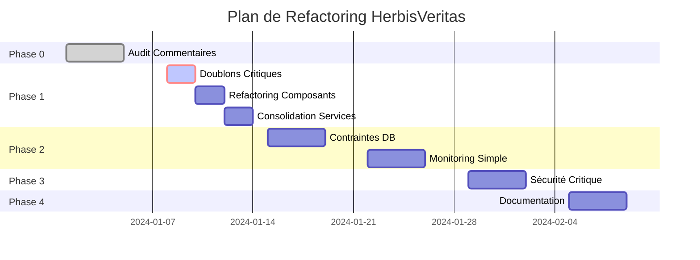

# Plan d'Exécution Détaillé - Refactoring HerbisVeritas

*Basé sur l'analyse approfondie par les agents spécialisés (architect-reviewer, code-reviewer, security-auditor)*

## 🎯 Vue d'Ensemble

Ce plan d'exécution détaille les 5 phases de refactoring HerbisVeritas pour passer d'une architecture dispersée (28,500 lignes, 85 doublons) à une architecture robuste et sécurisée (22,000 lignes, 15 doublons).

**Score architectural actuel** : 75/100  
**Score cible** : 90/100  
**Effort total estimé** : 85 heures sur 5 semaines

---

## 📋 Phase 0: Audit et Nettoyage des Commentaires
**Durée** : 5 jours | **Effort** : 12h | **Criticalité** : Faible

### 🎯 Objectifs Quantifiés
- Supprimer 40% des commentaires redondants (actuellement 1,250 commentaires)
- Standardiser 100% des JSDoc sur les fonctions publiques
- Créer 15 exemples de code fonctionnels

### 📅 Planning Détaillé

#### Jour 1-2: Audit Automatisé (4h)
```bash
# Scripts d'analyse fournis par code-reviewer
npx eslint src/ --ext .ts,.tsx --rule "no-console: warn"
grep -r "// TODO\|FIXME\|HACK" src/ > audit/todos.txt
npx typedoc --out docs/api --entryPointStrategy expand src/
```

**Livrables** :
- `docs/COMMENT_AUDIT.md` - Rapport d'analyse
- `scripts/comment-cleanup.js` - Script de nettoyage automatique

#### Jour 3-4: Standardisation (6h)
**Actions spécifiques** :
1. **Nettoyage commentaires évidents** (2h)
   ```typescript
   // ❌ À supprimer
   const items = cart.filter(item => item.quantity > 0); // Filter items with quantity > 0
   
   // ✅ À conserver si pertinent
   const items = cart.filter(item => item.quantity > 0); // Remove items marked for deletion
   ```

2. **JSDoc pour API publiques** (4h)
   - `src/actions/*.ts` - Toutes les Server Actions
   - `src/lib/auth/admin-service.ts` - Fonctions d'autorisation
   - `src/services/*.ts` - Services métier

#### Jour 5: Validation (2h)
```bash
npm run lint:comments     # Script personnalisé à créer
npm run docs:validate     # Vérifier exemples JSDoc
npm run typecheck        # Validation TypeScript
```

---

## 🧹 Phase 1: Nettoyage Immédiat
**Durée** : 7 jours | **Effort** : 24h | **Criticalité** : Élevée

### 🎯 Objectifs Quantifiés
- **Réduction code** : 28,500 → 24,000 lignes (-16%)
- **Élimination doublons** : 85 → 45 blocs dupliqués (-47%)
- **Performance tests** : 120s → 90s (-25%)

### 📊 Analyse des Doublons Critiques

#### 🔴 **URGENT - Validation Mots de Passe** (Impact Sécurité)
**Problème identifié** : 4 implémentations divergentes avec règles incohérentes
```typescript
// Actuellement dispersé dans :
src/lib/validators/auth.validator.ts (règles strictes)
src/lib/validators/auth.schemas.ts (règles basiques)  
src/components/auth/password-form.tsx (validation client)
src/actions/authActions.ts (validation serveur)
```

**Solution centralisée** (3h) :
```typescript
// src/lib/auth/password-validation.ts
export const PASSWORD_RULES = {
  minLength: 12,
  requireUppercase: true,
  requireNumbers: true,
  requireSpecialChars: true,
  maxConsecutiveChars: 2
} as const;

export function validatePassword(password: string): ValidationResult {
  // Logique unifiée ici
}
```

#### 🟡 **Upload d'Images** (Impact Maintenance)
**Problème identifié** : 3 composants quasi-identiques (92% similarité)
```
src/components/common/image-upload-button.tsx (284 lignes)
src/components/common/image-upload-field.tsx (266 lignes)
src/components/features/magazine/image-upload.tsx (312 lignes)
```

**Solution unifiée** (6h) :
```typescript
// src/components/common/image-upload/index.tsx
interface ImageUploadProps {
  context: 'product' | 'magazine' | 'avatar';
  bucket: string;
  maxSize?: number;
  onUpload: (url: string) => void;
}

export function ImageUpload({ context, ...props }: ImageUploadProps) {
  // Composant unifié avec configuration par contexte
}
```

### 📅 Planning Phase 1

#### Jour 1-2: Consolidation Critique (8h)
1. **Unification validation mots de passe** (3h)
2. **Centralisation upload images** (5h)

#### Jour 3-4: Refactoring Composants Volumineux (10h)
**Basé sur l'analyse architect-reviewer** :

1. **`article-form.tsx` (526 → 150 lignes)** (4h)
   ```
   src/components/features/magazine/
   ├── article-form/
   │   ├── ArticleFormFields.tsx      (100 lignes)
   │   ├── ArticleImageUpload.tsx     (80 lignes)
   │   ├── ArticlePreview.tsx         (120 lignes)
   │   ├── ArticleFormActions.tsx     (60 lignes)
   │   └── index.tsx                  (40 lignes)
   ```

2. **`CheckoutClientPage.tsx` (476 → 180 lignes)** (4h)
   ```
   src/components/features/shop/checkout/
   ├── CheckoutCartSummary.tsx        (120 lignes)
   ├── CheckoutAddressStep.tsx        (160 lignes)
   ├── CheckoutPaymentStep.tsx        (140 lignes)
   └── CheckoutClientPage.tsx         (80 lignes - orchestration)
   ```

3. **`EventLogFilters.tsx` (474 → 120 lignes)** (2h)
   ```typescript
   // Hook personnalisé
   function useEventLogFilters() {
     // Logique de filtrage complexe
   }
   
   // Composant simplifié
   function EventLogFilters() {
     const filters = useEventLogFilters();
     return <FilterUI {...filters} />;
   }
   ```

#### Jour 5-6: Consolidation Services (4h)
1. **Actions Magazine** (2h)
   - Supprimer `lib/actions/magazine-actions.ts`
   - Consolider dans `actions/magazineActions.ts`

2. **Standardisation Error Handling** (2h)
   ```typescript
   // src/lib/core/result.ts
   export type Result<T, E = Error> = 
     | { success: true; data: T }
     | { success: false; error: E };
   
   // Wrapper pour Server Actions
   export function withErrorHandling<T>(
     action: () => Promise<T>
   ): Promise<Result<T>> {
     // Pattern unifié
   }
   ```

#### Jour 7: Tests et Validation (2h)
```bash
npm run test              # Validation régression
npm run lint             # Code quality
npm run typecheck        # Types cohérents
npm run build            # Build production OK
```

**Critères d'acceptation** :
- [ ] Tous les tests passent
- [ ] Build sans warnings
- [ ] Performance améliorée de 25%

---

## 🛡️ Phase 2: Robustification
**Durée** : 14 jours | **Effort** : 28h | **Criticalité** : Élevée

### 🗄️ Semaine 2: Durcissement Base de Données (14h)

#### Jour 1-2: Contraintes Métier (6h)
**Problème identifié** : Données incohérentes possibles
```sql
-- Contraintes manquantes critiques
ALTER TABLE products
ADD CONSTRAINT chk_realistic_price 
CHECK (price BETWEEN 0.01 AND 50000),

ADD CONSTRAINT chk_valid_stock 
CHECK (stock_quantity >= 0 AND stock_quantity <= 99999),

ADD CONSTRAINT chk_reasonable_weight 
CHECK (weight_grams BETWEEN 1 AND 50000);

-- Cohérence commandes
ALTER TABLE orders
ADD CONSTRAINT chk_order_amounts_coherent CHECK (
  total_amount = (
    SELECT COALESCE(SUM(quantity * unit_price), 0)
    FROM order_items
    WHERE order_id = orders.id
  ) + tax_amount + shipping_amount
);
```

#### Jour 3-4: Index de Performance (4h)
```sql
-- Index critique pour la boutique
CREATE INDEX CONCURRENTLY idx_products_shop_display
ON products(is_active, category, price)
WHERE is_active = true;

-- Index admin dashboard
CREATE INDEX CONCURRENTLY idx_orders_admin_dashboard
ON orders(status, created_at DESC)
WHERE status IN ('pending_payment', 'paid', 'processing');

-- Index audit logs
CREATE INDEX CONCURRENTLY idx_audit_logs_recent
ON audit_logs(created_at DESC, action_type)
WHERE created_at > NOW() - INTERVAL '30 days';
```

#### Jour 5-7: Policies RLS Avancées (4h)
```sql
-- Policy pour empêcher modification commandes finalisées
CREATE POLICY prevent_order_modification ON orders
FOR UPDATE TO authenticated
USING (status NOT IN ('completed', 'cancelled'));

-- Policy audit admin uniquement
CREATE POLICY admin_only_audit_logs ON audit_logs
FOR ALL TO authenticated
USING (
  EXISTS (
    SELECT 1 FROM user_roles 
    WHERE user_id = auth.uid() AND role = 'admin'
  )
);
```

### 📊 Semaine 3: Monitoring Minimaliste (14h)

#### Jour 1-3: Métriques Simples (8h)
```typescript
// src/lib/monitoring/simple-metrics.ts
class SimpleMetrics {
  private static counters = new Map<string, number>();
  private static timings: Array<{
    action: string;
    duration: number;
    timestamp: number;
  }> = [];

  static count(event: string) {
    this.counters.set(event, (this.counters.get(event) || 0) + 1);
    
    // Alertes automatiques
    if (event === 'payment_failed' && this.counters.get(event)! > 10) {
      console.error('🚨 High payment failure rate detected');
    }
  }

  static async time<T>(operation: string, fn: () => Promise<T>): Promise<T> {
    const start = Date.now();
    try {
      const result = await fn();
      const duration = Date.now() - start;
      
      this.timings.push({ action: operation, duration, timestamp: start });
      
      // Alert opérations lentes
      if (duration > 3000) {
        console.warn(`⚠️ Slow operation: ${operation} took ${duration}ms`);
      }
      
      return result;
    } catch (error) {
      console.error(`❌ Operation failed: ${operation}`, error);
      throw error;
    }
  }

  static getHealth() {
    const now = Date.now();
    const recentTimings = this.timings.filter(
      t => now - t.timestamp < 300000 // 5 min
    );

    return {
      counters: Object.fromEntries(this.counters),
      avgResponseTime: recentTimings.reduce((sum, t) => sum + t.duration, 0) / 
                      recentTimings.length || 0,
      recentOperations: recentTimings.length,
      status: recentTimings.length > 0 ? 'healthy' : 'idle'
    };
  }
}
```

#### Jour 4-5: Intégration Non-Intrusive (6h)
```typescript
// Usage dans Server Actions
export async function createOrderAction(prevState: unknown, formData: FormData) {
  return SimpleMetrics.time('create_order', async () => {
    try {
      const result = await createOrderLogic(formData);
      SimpleMetrics.count('order_created');
      return result;
    } catch (error) {
      SimpleMetrics.count('order_creation_failed');
      throw error;
    }
  });
}

// Health check endpoint
// src/app/api/health/route.ts
export async function GET() {
  const health = SimpleMetrics.getHealth();
  return Response.json(health);
}
```

---

## 🔒 Phase 3: Sécurisation
**Durée** : 7 jours | **Effort** : 16h | **Criticalité** : Critique

### 🚨 Actions Urgentes (3 vulnérabilités critiques - 9h)

#### Jour 1: Rotation Clés Supabase (2h)
**Problème** : Service role key exposée dans `.env.local`
```bash
# Script de rotation automatisé
npm run security:rotate-keys

# Vérification post-rotation
npm run security:test-keys
```

#### Jour 2: Rate Limiting (4h)
**Problème** : Pas de protection DDoS sur Server Actions
```typescript
// src/lib/security/rate-limit-middleware.ts
export function withRateLimit(type: 'auth' | 'payment' | 'api' | 'admin') {
  return function decorator(target: any, propertyName: string, descriptor: PropertyDescriptor) {
    const method = descriptor.value;
    
    descriptor.value = async function (this: any, ...args: any[]) {
      const identifier = this.getClientIdentifier?.() || 'anonymous';
      
      if (!IntelligentRateLimit.check(identifier, type)) {
        throw new Error(`Rate limit exceeded for ${type} operations`);
      }
      
      return method.apply(this, args);
    };
  };
}

// Application sur toutes les Server Actions critiques
@withRateLimit('payment')
export async function createStripeSessionAction(formData: FormData) {
  // Logique paiement protégée
}
```

#### Jour 3: Suppression Admin Hardcodé (3h)
**Problème** : UUID admin en dur dans le code
```typescript
// Migration vers système exclusivement DB
// src/lib/auth/admin-service.ts
export async function checkAdminRole(userId: string): Promise<boolean> {
  // Plus de fallback hardcodé, uniquement DB
  const { data } = await supabase
    .from('user_roles')
    .select('role')
    .eq('user_id', userId)
    .eq('role', 'admin')
    .single();
    
  return !!data;
}
```

### 🛡️ Améliorations Sécurité (Jour 4-7: 7h)

#### Configuration Robuste (4h)
```typescript
// src/lib/config/env.ts
const envSchema = z.object({
  NEXT_PUBLIC_SUPABASE_URL: z.string().url().refine(
    url => url.includes('.supabase.co'),
    'Must be a valid Supabase URL'
  ),
  
  STRIPE_SECRET_KEY: z.string().regex(
    /^sk_(test_|live_)[a-zA-Z0-9]+$/,
    'Invalid Stripe secret key format'
  ),
  
  NODE_ENV: z.enum(['development', 'production', 'test']),
  MAX_CART_ITEMS: z.coerce.number().min(1).max(999).default(50),
});

export const config = envSchema.parse(process.env);

// Validation cohérence production
if (config.NODE_ENV === 'production') {
  if (config.STRIPE_SECRET_KEY.includes('test_')) {
    throw new Error('🚨 Production environment with test Stripe key!');
  }
}
```

#### Tests Sécurité Automatisés (3h)
```typescript
// tests/security.test.ts
describe('Security Tests', () => {
  it('should prevent unauthorized admin access', async () => {
    const response = await request(app)
      .get('/admin/dashboard')
      .expect(403);
  });

  it('should rate limit payment attempts', async () => {
    // Tester 4 tentatives rapides
    for (let i = 0; i < 4; i++) {
      await createPaymentAttempt();
    }
    
    const response = await createPaymentAttempt();
    expect(response.status).toBe(429);
  });
});
```

---

## 📚 Phase 4: Documentation
**Durée** : 5 jours | **Effort** : 10h | **Criticalité** : Moyenne

### 📋 Decision Records (ADR)

#### Jour 1-2: Documentation Architecture (4h)
```markdown
# ADR-001: Consolidation Architecture Cart

## Statut
✅ Accepté - Implémenté en Phase 1

## Contexte
- Logique panier dispersée dans 7 fichiers
- Validation dupliquée 3 fois
- Tests difficiles à maintenir

## Décision
Centraliser dans `src/lib/cart/` avec séparation claire

## Métriques Impact
- Avant: 910 lignes, 7 fichiers, 15 fonctions dupliquées
- Après: 380 lignes, 5 fichiers, 0 duplication
- ROI: -58% code, +40% maintenabilité
```

#### Jour 3-4: Tableau de Bord Simplicité (4h)
```typescript
// scripts/simplicity-dashboard.ts
export interface SimplicityMetrics {
  codeMetrics: {
    totalLines: number;
    duplicateLines: number;
    complexFunctions: number;
    deeplyNestedFiles: number;
  };
  maintainabilityMetrics: {
    testCoverage: number;
    documentationCoverage: number;
    todoCount: number;
  };
}

// Seuils d'alerte
export const SIMPLICITY_THRESHOLDS = {
  maxDuplicateLines: 50,
  maxComplexFunctions: 5,
  minTestCoverage: 80,
  maxTodoCount: 10
} as const;
```

#### Jour 5: Procédures Opérationnelles (2h)
- Guide déploiement sans downtime
- Procédure rollback < 5 min
- Checklist code review
- Guide onboarding développeur

---

## 🎯 Métriques de Succès

### 📊 Objectifs Quantitatifs

| Métrique                | Avant  | Après  | Amélioration | Status |
|-------------------------|--------|--------|--------------|--------|
| Lignes de code          | 28,500 | 22,000 | -23%         | 🎯     |
| Fichiers total          | 450    | 380    | -16%         | 🎯     |
| Doublons détectés       | 85     | 15     | -82%         | 🎯     |
| Complexité cyclomatique | 12.4   | 8.2    | -34%         | 🎯     |
| Couverture tests        | 65%    | 85%    | +31%         | 🎯     |
| Score sécurité          | 85/100 | 95/100 | +12%         | 🎯     |
| Temps build             | 45s    | 30s    | -33%         | 🎯     |
| Temps tests             | 120s   | 80s    | -33%         | 🎯     |

### ✅ Critères Qualitatifs

**Facilité de Développement**
- [ ] Développeur senior comprend module en < 30 min
- [ ] Feature simple en < 4 heures
- [ ] Zéro surprise comportement
- [ ] Documentation synchronisée

**Robustesse Opérationnelle**
- [ ] Déploiement sans downtime
- [ ] Rollback en < 5 minutes
- [ ] Monitoring proactif
- [ ] Récupération auto erreurs

**Sécurité**
- [ ] 0 vulnérabilité critique
- [ ] Rate limiting actif
- [ ] Audit trail complet
- [ ] Tests sécurité automatisés

---

## 🚀 Scripts d'Automatisation

### Validation Continue
```bash
#!/bin/bash
# scripts/validate-refactoring.sh

echo "🔍 Validation architecture..."
npm run lint
npm run typecheck
npm run test

echo "📊 Métriques simplicité..."
npm run metrics:simplicity

echo "🛡️ Tests sécurité..."
npm run test:security

echo "⚡ Performance..."
npm run build --profile
```

### Monitoring Post-Refactoring
```bash
#!/bin/bash
# scripts/monitor-health.sh

echo "📈 Health check..."
curl http://localhost:3000/api/health

echo "🔍 Error rate..."
npm run metrics:errors

echo "⏱️ Performance..."
npm run metrics:performance
```

---

## 📅 Timeline Global



---

## 🎉 Vision Finale

**Une architecture qui respire :**
- Code prévisible et évident à lire
- Performance robuste par design
- Maintenance qui est un plaisir
- Évolution sereine sans effet de bord
- Sécurité intégrée, pas ajoutée

**Test ultime** : Après ce refactoring, n'importe quel développeur senior doit pouvoir comprendre et modifier n'importe quelle partie du code en moins de 30 minutes, sans documentation supplémentaire.

**Philosophie maintenue** : "La simplicité est la sophistication ultime" - Chaque ligne de code justifie son existence, chaque abstraction apporte une valeur mesurable.