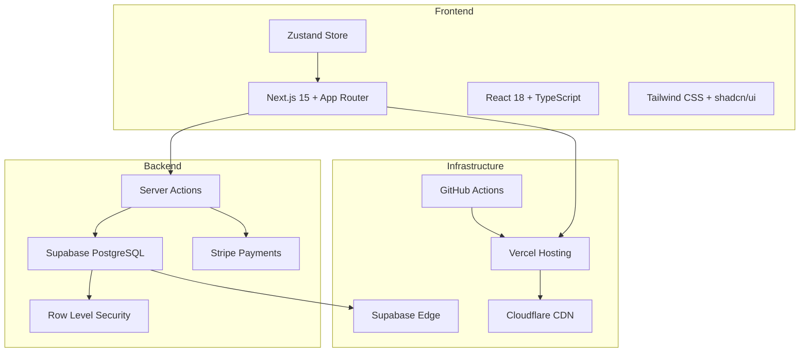

# Documentation Technique In Herbis Veritas

Documentation consolidée basée sur l'analyse complète du codebase et de la base de données en production.

---

## Navigation Rapide

### Nouveaux Développeurs

Commencez ici pour être opérationnel rapidement :

1. **[Démarrage Rapide](./getting-started/quick-start.md)** - Installation complète en 15 minutes
2. **[Architecture Overview](./architecture/overview.md)** - Comprendre l'architecture réelle
3. **[Sécurité](./architecture/security.md)** - Architecture de sécurité multicouche
4. **[Base de Données](./architecture/database.md)** - Schéma complet et politiques RLS

### Développeurs Expérimentés

Accès direct aux références techniques :

- **[Server Actions](./development/server-actions.md)** - 10 actions en production documentées
- **[Design System](./development/design-system.md)** - Composants UI, tokens et architecture complète
- **[Internationalisation](./development/i18n.md)** - Guide complet next-intl
- **[Système E-commerce](./features/e-commerce.md)** - Logique métier complète
- **[Intégration Stripe](./features/stripe-integration.md)** - Paiements sécurisés avec Clean Architecture

---

## État du Projet (Août 2025)

### Production Ready

- **Architecture** : Clean Architecture hybride stable
- **Base de Données** : PostgreSQL + RLS (15 tables actives)
- **E-commerce** : Système complet avec panier persistant
- **Sécurité** : Score 9.25/10 - Sécurité multicouche
- **Tests** : 80.8% passing (374/463 tests)

### En Amélioration Continue

- **Test Coverage** : Passage de 81.4% à 80.8% (croissance du codebase)
- **Documentation** : Consolidation terminée (21 → 16 fichiers structurés)
- **Performance** : Optimisations cache et requêtes DB

---

## Architecture Réelle

### Stack Technique en Production



### Patterns Implémentés

- **Result Pattern** - Gestion d'erreurs type-safe
- **Repository Pattern** - Abstraction d'accès aux données (partiel)
- **Server Actions** - API unifiée avec validation Zod
- **Optimistic Updates** - UX réactive avec rollback
- **Clean Architecture** - Séparation des couches (domaine Cart)

---

## Base de Données (Structure Réelle)

### 15 Tables Principales en Production (Janvier 2025)

#### Gestion Utilisateurs

- `profiles` - Profils avec système de rôles (user/editor/admin/dev)
- `addresses` - Adresses de livraison/facturation
- `audit_logs` - Journalisation sécurité et actions admin

#### E-commerce

- `products` - Catalogue produits avec multilingue
- `product_translations` - Traductions (fr/en/de/es)
- `categories` - Organisation produits
- `featured_hero_items` - Produits mis en avant

#### Commerce

- `carts` - Paniers utilisateurs (auth + invités)
- `cart_items` - Articles dans paniers
- `orders` - Commandes validées
- `order_items` - Articles des commandes
- `shipping_methods` - Méthodes de livraison

#### Contenu

- `articles` - Blog/magazine avec TipTap (17 colonnes)
- `categories` - Catégories d'articles avec couleurs
- `tags` - Tags pour classification
- `article_tags` - Liaison many-to-many articles ↔ tags

### Sécurité Database

- **RLS activé** sur toutes les tables
- **Politiques granulaires** par rôle et action
- **Audit automatique** des opérations sensibles
- **Chiffrement** données sensibles avec pgcrypto

---

## Système E-commerce Complet

### Features Opérationnelles

```typescript
interface EcommerceFeatures {
  catalog: "Catalogue multilingue avec stock temps réel";
  cart: "Panier persistant auth + invités avec optimistic updates";
  checkout: "Processus complet avec adresses et validation";
  payments: "Stripe intégré avec webhooks sécurisés";
  orders: "Gestion commandes avec tracking états";
  shipping: "Méthodes livraison configurables (Colissimo)";
  admin: "Panel complet avec gestion rôles";
  promotion: "Système promotions basique (is_on_promotion)";
  analytics: "Métriques e-commerce de base";
}
```

### Architecture Panier Hybride

- **Utilisateurs authentifiés** : Panier en base avec `user_id`
- **Utilisateurs invités** : `guest_id` + cookie persistant
- **Fusion automatique** à la connexion
- **Synchronisation temps réel** entre client/serveur
- **Validation stock** avant ajout/modification

---

## Sécurité Multicouche

### Score : 9.25/10

#### Couches de Protection

1. **Network** - WAF Cloudflare + Rate limiting
2. **Application** - Middleware Next.js + Route protection
3. **Authentication** - Supabase Auth + JWT
4. **Authorization** - RLS PostgreSQL + Role-based
5. **Data** - Chiffrement + Audit logging

#### Mesures Implémentées

- **Row Level Security** : Politiques strictes par table
- **Validation serveur** : Schémas Zod obligatoires
- **Audit complet** : Toutes actions sensibles loggées
- **Rate limiting** : Protection contre spam/bruteforce
- **CSRF Protection** : Tokens et vérification origine
- **XSS Prevention** : Sanitisation DOMPurify
- **RGPD Compliant** : Droits utilisateurs implémentés

---

## Server Actions (10 fichiers actifs)

### API Unifiée en Production

#### Actions par Domaine

```typescript
// 1. Cart Actions - Système panier complet
(addItemToCartAction, removeItemFromCartAction, updateCartItemQuantityAction, clearCartAction);

// 2. Product Actions - CRUD produits avec permissions
(createProductAction, updateProductAction, deleteProductAction, uploadProductImageAction);

// 3. Auth Actions - Authentification sécurisée
(signUpAction, signInAction, signOutAction, resetPasswordAction, confirmEmailAction);

// 4. Stripe Actions - Paiements intégrés
(createPaymentIntentAction,
  confirmPaymentAction,
  createCheckoutSessionAction,
  handleStripeWebhookAction);

// 5. Magazine Actions - Système blog complet
(createArticle,
  updateArticle,
  deleteArticle,
  changeArticleStatus,
  bulkChangeArticleStatus,
  createCategory,
  createTag,
  uploadMagazineImage);

// 6. Admin Actions - Administration avec audit
(updateUserRoleAction, exportUsersDataAction, getAdminStatsAction, getAuditLogsAction);
```

#### Patterns Techniques

- **Result Pattern** : Gestion d'erreurs type-safe unifiée
- **Validation Zod** : Schémas stricts pour tous inputs
- **Cache Management** : `revalidateTag` systématique
- **Error Handling** : Hiérarchie d'erreurs métier

---

## Tests & Qualité

### Coverage Actuel : 80.8% (374/463 tests)

#### Améliorations Récentes

- **Environnement variables** : Stripe et autres configs fixed
- **Import paths** : Migration vers absolute paths `@/`
- **Service Registry** : Jest fake timers pour health checks
- **Product Actions** : ActionResult pattern fixes
- **Event Container** : Dependency injection en cours
- **Auth Actions** : Next.js redirections en test env

#### Stratégies de Test

- **Unit Tests** : Jest + MSW pour mocking
- **Integration Tests** : Base de données réelle
- **E2E Tests** : Playwright pour workflows complets
- **Security Tests** : Validation RLS et permissions

---

## Documentation Consolidée

### Structure Simplifiée (16 fichiers principaux)

#### Architecture

- **[Overview](./architecture/overview.md)** - Vue d'ensemble et patterns
- **[Database](./architecture/database.md)** - Schéma complet avec RLS
- **[Security](./architecture/security.md)** - Architecture de sécurité

#### Développement

- **[Server Actions](./development/server-actions.md)** - API de référence complète
- **[Design System](./development/design-system.md)** - Système de design avec shadcn/ui et architecture des composants
- **[Internationalisation](./development/i18n.md)** - Guide complet i18n avec next-intl
- **[Quick Start](./getting-started/quick-start.md)** - Installation rapide

#### Features

- **[Admin System](./features/admin-system.md)** - Système RBAC 3.0 avec sécurité multicouche
- **[Authentication Flow](./features/authentication-flow.md)** - Système d'authentification sécurisé avec RBAC
- **[Cart System](./features/cart-system.md)** - Panier unifié validé par audit multi-agents (Score: 9.25/10)
- **[E-commerce](./features/e-commerce.md)** - Système commercial complet
- **[Storage System](./features/storage-system.md)** - Upload centralisé factoring 01/2025 (-70 lignes de code)
- **[Stripe Integration](./features/stripe-integration.md)** - Paiements sécurisés avec Clean Architecture
- **[Colissimo Integration](./features/colissimo-integration.md)** - Widget points de retrait et Edge Function
- **[Magazine System](./features/magazine-system.md)** - Blog complet avec éditeur TipTap

#### Tests

- **[Test Status](./development/test-status.md)** - Suivi corrections tests (80.8% passing - 374/463)

### Consolidation Documentaire Complétée

- **doc/** - 21 fichiers obsolètes archivés/supprimés
- **docs/** - 16 fichiers consolidés et enrichis (Août 2025)
- **Cohérence** - Documentation alignée sur codebase réel via analyse systématique
- **Fusions** - ACTIONS.md, DATABASE.md, SECURITY.md, ADMIN_SYSTEM.md fusionnés
- **Nouveaux** - Storage System, Cart System, Test Status créés

---

## Roadmap & Évolution

### Court Terme (Q4 2025)

- [ ] **Test Coverage** → 90%+ avec cleanup des tests flaky
- [ ] **Documentation API** → OpenAPI/Swagger pour Server Actions
- [ ] **Performance** → Optimisations cache et requêtes
- [ ] **Monitoring** → Alertes proactives production

### Moyen Terme (Q1-Q2 2026)

- [ ] **Event-Driven** → Extension architecture événementielle
- [ ] **Analytics** → Dashboard metrics e-commerce avancées
- [ ] **Multi-tenant** → Support plusieurs boutiques
- [ ] **Mobile App** → React Native avec synchronisation

### Long Terme (Q3-Q4 2026)

- [ ] **AI Integration** → Recommandations et chat support
- [ ] **Marketplace** → Plateforme multi-vendeurs
- [ ] **International** → Expansion géographique
- [ ] **Sustainability** → Tracking empreinte carbone

---

## Quick Commands

### Développement Local

```bash
# Installation & démarrage
npm install && npm run dev

# Tests
npm test                    # Tous les tests
npm run test:watch         # Mode watch
npm run test:coverage      # Avec coverage

# Base de données
npm run db:types           # Générer types TypeScript
supabase db reset          # Reset complet

# Code quality
npm run lint               # ESLint
npm run lint:fix          # Auto-fix
```

### Production

```bash
# Build optimisé
npm run build && npm start

# Déploiement
git push origin main       # Auto-deploy via GitHub Actions

# Monitoring
npm run logs:prod         # Logs production
npm run metrics           # Métriques performance
```

---

## Liens Utiles

### Documentation Externe

- **[Next.js 15](https://nextjs.org/docs)** - Framework principal
- **[Supabase](https://supabase.com/docs)** - Backend & base de données
- **[Stripe](https://stripe.com/docs)** - Paiements
- **[shadcn/ui](https://ui.shadcn.com/)** - Composants UI

### Support & Communauté

- **GitHub Issues** : [Signaler bugs](https://github.com/herbisveritas/issues)
- **Discussions** : [Questions & suggestions](https://github.com/herbisveritas/discussions)
- **Email Support** : `dev@herbisveritas.com`
- **Documentation** : Mise à jour continue

---

<div align="center">

**In Herbis Veritas - Documentation Technique**  
_Moderne • Sécurisée • Production-Ready_

**Dernière mise à jour** : 4 Août 2025  
**Version** : 2.3.0  
**Statut** : Stable en Production

[Accueil](../README.md) • [Quick Start](./getting-started/quick-start.md) • [Dev Guide](./development/server-actions.md)

</div>
