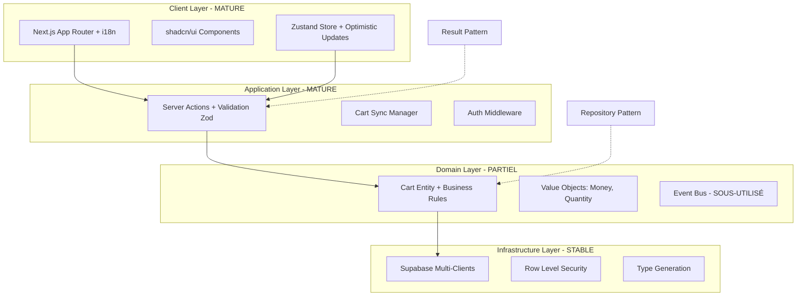

# Architecture - Vue d'Ensemble

Documentation technique de l'architecture réelle d'In Herbis Veritas, basée sur l'analyse du codebase existant.

## Stack Technique

### Framework Principal

- **Next.js 15** avec App Router et Server Components
- **TypeScript** en mode strict
- **React 18** avec Concurrent Features

### Backend et Données

- **Supabase** (PostgreSQL, Auth, Storage, RLS)
- **Row Level Security** pour la sécurité des données
- **Edge Functions** pour la logique serveur

### Gestion d'État

- **Zustand** pour l'état global côté client
- **Server Actions** pour les mutations
- **Result Pattern** pour la gestion d'erreurs type-safe

### Interface Utilisateur

- **Tailwind CSS** + **shadcn/ui**
- **Lucide React** pour les icônes
- **next-intl** pour l'internationalisation (fr, en, de, es)

### Tests et Qualité

- **Jest** + **MSW** pour les tests
- **ESLint** + **Prettier** pour la qualité du code
- **TypeScript** strict mode

## Architecture Réelle

### Patterns Implémentés



**Légende :**

- **MATURE** : Implémentation complète et robuste
- **PARTIEL** : Implémentation limitée au domaine Cart
- **SOUS-UTILISÉ** : Infrastructure présente mais usage limité

## Structure Réelle des Répertoires

```
src/
├── app/[locale]/              # Next.js 15 App Router avec i18n (FR par défaut)
├── components/                # Organisation par domaine métier
│   ├── domain/               # Composants métier (shop, auth, checkout)
│   ├── admin/                # Interface d'administration
│   ├── ui/                   # shadcn/ui (32+ composants)
│   └── shared/               # Composants réutilisables
├── actions/                   # Server Actions avec patterns unifiés
│   ├── cartActions.ts        # ✅ MATURE - Actions panier complètes
│   ├── authActions.ts        # ✅ Authentification
│   └── productActions.ts     # ✅ Gestion produits
├── lib/
│   ├── domain/               # ⚠️ PARTIEL - DDD limité au Cart
│   │   ├── entities/         # Cart Entity implémentée
│   │   ├── services/         # Services peu utilisés
│   │   └── value-objects/    # Money, Quantity fonctionnels
│   ├── infrastructure/       # ✅ STABLE
│   │   ├── repositories/     # Repository Pattern partiel
│   │   ├── events/          # Event Bus sous-utilisé
│   │   └── container/       # DI basique
│   ├── core/                # ✅ MATURE
│   │   ├── result.ts        # Result Pattern sophistiqué
│   │   ├── errors.ts        # Hiérarchie d'erreurs
│   │   └── logger.ts        # Logging structuré
│   ├── supabase/            # ✅ MATURE - Multi-clients
│   ├── validators/          # ✅ Validation Zod systématique
│   └── store-sync/          # ✅ Synchronisation client/serveur
└── stores/                  # ✅ MATURE - Zustand avec optimistic updates
```

**État d'implémentation :**

- ✅ **MATURE** : Fonctionnel et robuste
- ⚠️ **PARTIEL** : Implémentation incomplète
- ❌ **ABSENT** : Non implémenté

## État d'Implémentation par Couche

### Client Layer (MATURE)

- **Next.js App Router** : Routage i18n fonctionnel
- **Components** : Organisation claire par domaine
- **Zustand Store** : Optimistic updates avec rollback
- **Synchronisation** : Cart Sync Manager avancé

### Application Layer (MATURE)

- **Server Actions** : Pattern unifié avec validation Zod
- **Error Handling** : Result Pattern sophistiqué
- **Cache Management** : Invalidation avec `revalidateTag`
- **Middleware** : Protection routes `/admin` et `/profile`

### Domain Layer (PARTIEL)

- **Cart Domain** : Entité complète avec business rules
- **Value Objects** : Money et Quantity implémentés
- **Other Domains** : Logique CRUD classique
- **Event System** : Infrastructure présente mais sous-utilisée

### Infrastructure Layer (STABLE)

- **Supabase Clients** : Multi-clients (client/server/admin)
- **Type Generation** : Types automatiques depuis DB
- **RLS Policies** : Sécurité au niveau base de données
- **Repositories** : Interfaces définies pour Cart uniquement

## Points d'Architecture Critiques

### Forces

1. **State Management** sophistiqué avec optimistic updates
2. **Validation** systématique avec schémas Zod
3. **Type Safety** strict avec types générés
4. **Infrastructure Supabase** bien architecturée
5. **Component Organization** claire par domaines

### Faiblesses

1. **DDD Incomplet** - limité au domaine Cart
2. **Event System** sous-exploité malgré l'infrastructure
3. **Repository Pattern** non appliqué partout
4. **Test Coverage** insuffisant
5. **Documentation** obsolète vs code réel

## Documentation Détaillée

Pour plus de détails, consultez les sections spécialisées :

### Architecture

- **[Clean Architecture](./clean-architecture.md)** - Implémentation du pattern
- **[Database](./database.md)** - Structure et politiques RLS
- **[Security](./security.md)** - Architecture de sécurité

### Patterns Techniques

- **[Result Pattern](./patterns/result-pattern.md)** - Gestion d'erreurs type-safe
- **[Repository Pattern](./patterns/repository-pattern.md)** - Abstraction d'accès aux données
- **[State Management](./patterns/state-management.md)** - Zustand et synchronisation

### Infrastructure

- **[Supabase Integration](./infrastructure/supabase.md)** - Clients et configuration
- **[Event System](./infrastructure/events.md)** - Event Bus et domain events
- **[Type System](./infrastructure/types.md)** - Génération et validation

## Évolution Recommandée

### Phase 1 (Court terme)

1. **Étendre DDD** aux domaines User et Product
2. **Augmenter coverage** des tests à 80%+
3. **Unifier patterns** d'erreurs dans toute l'application

### Phase 2 (Moyen terme)

1. **Intégrer Event System** dans les workflows
2. **Implémenter Repository Pattern** pour tous les domaines
3. **Optimiser performance** avec CQRS pour les lectures

### Phase 3 (Long terme)

1. **Event Sourcing** pour audit et replay
2. **Microservices** si croissance justifiée
3. **Advanced Analytics** avec event streaming

---

**Dernière mise à jour** : 3 Août 2025  
**Version analysée** : 2.1.0  
**Statut** : Architecture hybride stable, évolution progressive recommandée
