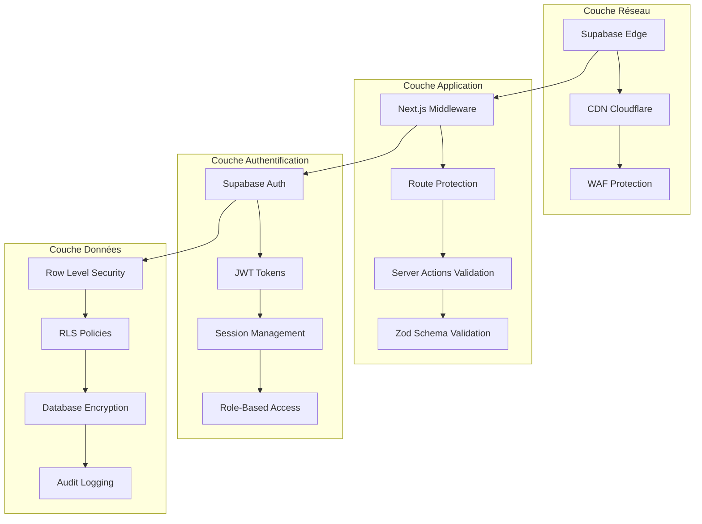

# Architecture de Sécurité

Documentation complète de l'architecture de sécurité d'In Herbis Veritas, basée sur l'analyse du système en production.

## Vue d'Ensemble Sécurité

### Stratégie Défense en Profondeur



### Principes de Sécurité Appliqués

1. **Zero Trust Architecture** - Aucun accès par défaut
2. **Least Privilege** - Permissions minimales nécessaires
3. **Defense in Depth** - Sécurité multicouche
4. **Fail Secure** - Échec en mode sécurisé
5. **Audit Everything** - Traçabilité complète

## Authentification et Autorisation

### Système d'Authentification Supabase

#### Configuration Auth
```typescript
// Configuration Supabase Auth
const supabaseAuthConfig = {
  jwt: {
    expiryLimit: 3600, // 1 heure
    secret: process.env.SUPABASE_JWT_SECRET
  },
  session: {
    persistSession: true,
    autoRefreshToken: true,
    detectSessionInUrl: true
  },
  auth: {
    redirectTo: process.env.NEXT_PUBLIC_SITE_URL,
    persistSession: true
  }
};
```

#### Types d'Authentification Supportés
```typescript
// Méthodes d'authentification
const authMethods = {
  email: {
    signup: true,
    signin: true,
    emailConfirmation: true,
    passwordReset: true
  },
  oauth: {
    google: true,
    github: false, // Désactivé en production
    facebook: false // Désactivé en production
  },
  magic_link: false // Désactivé par choix
};
```

### Système de Rôles

#### Définition des Rôles
```sql
-- Enum des rôles utilisateur
CREATE TYPE public.app_role AS ENUM ('user', 'editor', 'admin', 'dev');

-- Table profiles avec rôle
CREATE TABLE public.profiles (
    id UUID PRIMARY KEY REFERENCES auth.users(id),
    role app_role DEFAULT 'user'::app_role,
    -- autres champs
);
```

#### Matrice des Permissions

| Ressource | User | Editor | Admin | Dev |
|-----------|------|--------|-------|-----|
| **Profil Personnel** | ✅ RW | ✅ RW | ✅ RW | ✅ RW |
| **Autres Profils** | ❌ | ❌ | ✅ R | ✅ RW |
| **Produits** | ✅ R | ✅ RW | ✅ RW | ✅ RW |
| **Commandes Perso** | ✅ R | ✅ R | ✅ R | ✅ R |
| **Toutes Commandes** | ❌ | ❌ | ✅ R | ✅ RW |
| **Articles/Blog** | ✅ R | ✅ RW | ✅ RW | ✅ RW |
| **Admin Panel** | ❌ | ❌ | ✅ | ✅ |
| **Logs d'Audit** | ❌ | ❌ | ✅ R | ✅ R |
| **Configuration** | ❌ | ❌ | ❌ | ✅ RW |

**Légende** : R = Lecture, W = Écriture, RW = Lecture/Écriture

#### Vérification des Rôles
```typescript
// Service de vérification des rôles
export class AdminRoleService {
  static async checkAdminRole(userId: string): Promise<boolean> {
    const { data: profile } = await createServerClient()
      .from('profiles')
      .select('role')
      .eq('id', userId)
      .single();
      
    return profile?.role === 'admin' || profile?.role === 'dev';
  }
  
  static async requireRole(userId: string, requiredRole: AppRole): Promise<void> {
    const { data: profile } = await createServerClient()
      .from('profiles')
      .select('role')
      .eq('id', userId)
      .single();
      
    const roleHierarchy = ['user', 'editor', 'admin', 'dev'];
    const userLevel = roleHierarchy.indexOf(profile?.role || 'user');
    const requiredLevel = roleHierarchy.indexOf(requiredRole);
    
    if (userLevel < requiredLevel) {
      throw new UnauthorizedError(`Role ${requiredRole} required`);
    }
  }
}
```

### Protection des Routes

#### Middleware Next.js (`src/middleware.ts`)
```typescript
export async function middleware(request: NextRequest) {
  const { supabase, response } = createMiddlewareClient({ request });
  
  // Rafraîchir la session
  const { data: { session }, error } = await supabase.auth.getSession();
  
  // Routes protégées
  const protectedRoutes = ['/admin', '/profile', '/orders'];
  const isProtectedRoute = protectedRoutes.some(route => 
    request.nextUrl.pathname.startsWith(route)
  );
  
  if (isProtectedRoute && !session) {
    // Redirection vers login
    const redirectUrl = new URL('/auth/login', request.url);
    redirectUrl.searchParams.set('redirect_to', request.nextUrl.pathname);
    return NextResponse.redirect(redirectUrl);
  }
  
  // Vérification rôle admin pour /admin
  if (request.nextUrl.pathname.startsWith('/admin') && session) {
    const isAdmin = await AdminRoleService.checkAdminRole(session.user.id);
    
    if (!isAdmin) {
      // Log tentative d'accès non autorisé
      await auditLog.logSecurityEvent({
        event_type: 'UNAUTHORIZED_ADMIN_ACCESS',
        user_id: session.user.id,
        ip_address: request.ip,
        user_agent: request.headers.get('user-agent'),
        data: { requested_path: request.nextUrl.pathname }
      });
      
      return NextResponse.redirect(new URL('/unauthorized', request.url));
    }
  }
  
  return response;
}

export const config = {
  matcher: [
    '/((?!api|_next/static|_next/image|favicon.ico).*)',
  ],
};
```

## Row Level Security (RLS)

### Stratégie RLS Globale

Toutes les tables utilisent RLS avec des politiques spécifiques par ressource et action.

#### Activation RLS
```sql
-- Activation RLS sur toutes les tables
ALTER TABLE profiles ENABLE ROW LEVEL SECURITY;
ALTER TABLE addresses ENABLE ROW LEVEL SECURITY;
ALTER TABLE carts ENABLE ROW LEVEL SECURITY;
ALTER TABLE cart_items ENABLE ROW LEVEL SECURITY;
ALTER TABLE orders ENABLE ROW LEVEL SECURITY;
ALTER TABLE order_items ENABLE ROW LEVEL SECURITY;
ALTER TABLE products ENABLE ROW LEVEL SECURITY;
ALTER TABLE articles ENABLE ROW LEVEL SECURITY;
ALTER TABLE audit_logs ENABLE ROW LEVEL SECURITY;
```

### Politiques RLS Détaillées

#### Profiles - Accès Sélectif
```sql
-- Utilisateur peut voir/modifier son propre profil
CREATE POLICY "own_profile_access" ON profiles
    FOR ALL USING (auth.uid() = id);

-- Admin peut voir tous les profils
CREATE POLICY "admin_view_all_profiles" ON profiles
    FOR SELECT USING (
        EXISTS (
            SELECT 1 FROM profiles p
            WHERE p.id = auth.uid() 
            AND p.role IN ('admin', 'dev')
        )
    );

-- Seuls dev peuvent modifier d'autres profils
CREATE POLICY "dev_modify_profiles" ON profiles
    FOR UPDATE USING (
        EXISTS (
            SELECT 1 FROM profiles p
            WHERE p.id = auth.uid() 
            AND p.role = 'dev'
        )
    );
```

#### Cart - Propriété Stricte
```sql
-- Accès limité au propriétaire du panier
CREATE POLICY "own_cart_access" ON carts
    FOR ALL USING (
        user_id = auth.uid()::text 
        OR (
            -- Support pour paniers invités via cookie
            user_id LIKE 'guest_%' 
            AND user_id = current_setting('app.guest_id', true)
        )
    );

-- Articles de panier : accès via panier parent
CREATE POLICY "cart_items_via_cart" ON cart_items
    FOR ALL USING (
        cart_id IN (
            SELECT id FROM carts 
            WHERE user_id = auth.uid()::text
        )
    );
```

#### Products - Lecture Publique, Modification Restreinte
```sql
-- Lecture publique des produits actifs
CREATE POLICY "public_read_active_products" ON products
    FOR SELECT USING (is_active = true);

-- Modification réservée aux editors/admin/dev
CREATE POLICY "editors_manage_products" ON products
    FOR ALL USING (
        EXISTS (
            SELECT 1 FROM profiles p
            WHERE p.id = auth.uid() 
            AND p.role IN ('editor', 'admin', 'dev')
        )
    );
```

#### Orders - Propriété et Administration
```sql
-- Utilisateur peut voir ses propres commandes
CREATE POLICY "own_orders_access" ON orders
    FOR SELECT USING (user_id = auth.uid());

-- Admin peut voir toutes les commandes
CREATE POLICY "admin_view_all_orders" ON orders
    FOR SELECT USING (
        EXISTS (
            SELECT 1 FROM profiles p
            WHERE p.id = auth.uid() 
            AND p.role IN ('admin', 'dev')
        )
    );

-- Seuls dev peuvent modifier les commandes
CREATE POLICY "dev_modify_orders" ON orders
    FOR UPDATE USING (
        EXISTS (
            SELECT 1 FROM profiles p
            WHERE p.id = auth.uid() 
            AND p.role = 'dev'
        )
    );
```

#### Audit Logs - Admin Seulement
```sql
-- Seuls admin/dev peuvent consulter les logs
CREATE POLICY "admin_view_audit_logs" ON audit_logs
    FOR SELECT USING (
        EXISTS (
            SELECT 1 FROM profiles p
            WHERE p.id = auth.uid() 
            AND p.role IN ('admin', 'dev')
        )
    );

-- Insertion automatique via trigger, pas d'INSERT direct
CREATE POLICY "no_direct_insert_audit" ON audit_logs
    FOR INSERT WITH CHECK (false);
```

### Fonctions de Sécurité RLS

#### Vérification Permission
```sql
-- Fonction pour vérifier les permissions utilisateur
CREATE OR REPLACE FUNCTION check_user_permission(
    p_permission TEXT
) RETURNS BOOLEAN AS $$
DECLARE
    user_role app_role;
BEGIN
    -- Récupérer le rôle de l'utilisateur actuel
    SELECT role INTO user_role 
    FROM profiles 
    WHERE id = auth.uid();
    
    -- Vérifier les permissions selon le rôle
    CASE p_permission
        WHEN 'admin_access' THEN
            RETURN user_role IN ('admin', 'dev');
        WHEN 'content_edit' THEN
            RETURN user_role IN ('editor', 'admin', 'dev');
        WHEN 'product_manage' THEN
            RETURN user_role IN ('editor', 'admin', 'dev');
        WHEN 'user_impersonate' THEN
            RETURN user_role = 'dev';
        ELSE
            RETURN false;
    END CASE;
END;
$$ LANGUAGE plpgsql SECURITY DEFINER;
```

#### Audit Context
```sql
-- Fonction pour définir le contexte d'audit
CREATE OR REPLACE FUNCTION set_audit_context(
    p_guest_id TEXT DEFAULT NULL,
    p_ip_address INET DEFAULT NULL,
    p_user_agent TEXT DEFAULT NULL
) RETURNS VOID AS $$
BEGIN
    -- Définir variables de session pour audit
    IF p_guest_id IS NOT NULL THEN
        PERFORM set_config('app.guest_id', p_guest_id, true);
    END IF;
    
    IF p_ip_address IS NOT NULL THEN
        PERFORM set_config('app.ip_address', p_ip_address::text, true);
    END IF;
    
    IF p_user_agent IS NOT NULL THEN
        PERFORM set_config('app.user_agent', p_user_agent, true);
    END IF;
END;
$$ LANGUAGE plpgsql SECURITY DEFINER;
```

## Validation et Sanitisation

### Validation Côté Serveur

#### Schémas Zod Sécurisés
```typescript
// Validation stricte avec Zod
const UserProfileSchema = z.object({
  first_name: z.string()
    .min(1, 'Prénom requis')
    .max(50, 'Prénom trop long')
    .regex(/^[a-zA-ZÀ-ÿ\s'-]+$/, 'Caractères invalides'),
    
  last_name: z.string()
    .min(1, 'Nom requis')
    .max(50, 'Nom trop long')
    .regex(/^[a-zA-ZÀ-ÿ\s'-]+$/, 'Caractères invalides'),
    
  email: z.string()
    .email('Email invalide')
    .max(255, 'Email trop long')
    .toLowerCase(),
    
  // Pas d'HTML autorisé dans les champs utilisateur
}).strict(); // Mode strict pour rejeter champs supplémentaires

// Validation admin avec permissions
const AdminActionSchema = z.object({
  action: z.enum(['create', 'update', 'delete', 'view']),
  resource: z.enum(['user', 'product', 'order', 'content']),
  target_id: z.string().uuid(),
  reason: z.string().min(10, 'Justification requise').max(500)
}).strict();
```

#### Sanitisation XSS
```typescript
import DOMPurify from 'isomorphic-dompurify';

// Sanitisation des contenus riches (articles)
export const sanitizeRichContent = (html: string): string => {
  return DOMPurify.sanitize(html, {
    ALLOWED_TAGS: [
      'p', 'br', 'strong', 'em', 'u', 'h1', 'h2', 'h3', 'h4', 'h5', 'h6',
      'ul', 'ol', 'li', 'blockquote', 'a', 'img'
    ],
    ALLOWED_ATTR: [
      'href', 'src', 'alt', 'title', 'class'
    ],
    ALLOWED_URI_REGEXP: /^(?:(?:https?|mailto):|[^a-z]|[a-z+.-]+(?:[^a-z+.\-:]|$))/i
  });
};

// Sanitisation des inputs texte simples
export const sanitizeTextInput = (input: string): string => {
  return input
    .trim()
    .replace(/[<>]/g, '') // Supprimer < et >
    .substring(0, 1000); // Limiter longueur
};
```

### Protection CSRF

#### Token CSRF Next.js
```typescript
// Middleware CSRF custom
export const csrfMiddleware = async (request: NextRequest) => {
  const origin = request.headers.get('origin');
  const host = request.headers.get('host');
  
  // Vérifier origine pour requêtes modifiantes
  if (['POST', 'PUT', 'DELETE'].includes(request.method)) {
    if (!origin || !host || !origin.includes(host)) {
      return new NextResponse('CSRF Protection', { status: 403 });
    }
  }
  
  // Vérifier token CSRF pour Server Actions
  if (request.nextUrl.pathname.startsWith('/_next/action')) {
    const csrfToken = request.headers.get('x-csrf-token');
    const sessionToken = request.cookies.get('supabase-auth-token')?.value;
    
    if (!csrfToken || !verifyCSRFToken(csrfToken, sessionToken)) {
      return new NextResponse('Invalid CSRF Token', { status: 403 });
    }
  }
};
```

### Rate Limiting

#### Limitation par IP et Utilisateur
```typescript
// Rate limiting avec Redis
class RateLimiter {
  private redis: Redis;
  
  async checkLimit(
    key: string, 
    limit: number, 
    window: number
  ): Promise<{ allowed: boolean; remaining: number }> {
    
    const current = await this.redis.get(key);
    
    if (!current) {
      await this.redis.setex(key, window, 1);
      return { allowed: true, remaining: limit - 1 };
    }
    
    const currentCount = parseInt(current);
    
    if (currentCount >= limit) {
      return { allowed: false, remaining: 0 };
    }
    
    await this.redis.incr(key);
    return { allowed: true, remaining: limit - currentCount - 1 };
  }
}

// Application du rate limiting
const rateLimiter = new RateLimiter();

export const withRateLimit = (
  handler: (req: NextRequest) => Promise<Response>,
  config: { limit: number; window: number }
) => {
  return async (req: NextRequest) => {
    const ip = req.ip || 'anonymous';
    const key = `rate_limit:${ip}:${req.nextUrl.pathname}`;
    
    const { allowed, remaining } = await rateLimiter.checkLimit(
      key,
      config.limit,
      config.window
    );
    
    if (!allowed) {
      return new NextResponse('Rate limit exceeded', { 
        status: 429,
        headers: { 'X-RateLimit-Remaining': '0' }
      });
    }
    
    const response = await handler(req);
    response.headers.set('X-RateLimit-Remaining', remaining.toString());
    return response;
  };
};
```

## Audit et Logging

### Système d'Audit Complet

#### Structure des Logs
```typescript
interface AuditLogEntry {
  id: string;
  created_at: string;
  event_type: string;
  user_id?: string;
  data: {
    // Contexte de l'action
    resource_type: string;
    resource_id: string;
    action: string;
    
    // Métadonnées sécurité
    ip_address?: string;
    user_agent?: string;
    session_id?: string;
    
    // Données métier
    previous_value?: any;
    new_value?: any;
    reason?: string;
    
    // Résultat
    success: boolean;
    error_message?: string;
  };
}
```

#### Logger Sécurisé
```typescript
class SecurityAuditLogger {
  private supabase = createServerClient();
  
  async logSecurityEvent(event: SecurityEvent): Promise<void> {
    try {
      await this.supabase.from('audit_logs').insert({
        event_type: event.type,
        user_id: event.userId,
        data: {
          ...event.data,
          timestamp: new Date().toISOString(),
          severity: this.getSeverityLevel(event.type)
        }
      });
    } catch (error) {
      // Fallback logging vers fichier/service externe
      console.error('Audit logging failed:', error);
      await this.fallbackLog(event);
    }
  }
  
  private getSeverityLevel(eventType: string): 'low' | 'medium' | 'high' | 'critical' {
    const criticalEvents = [
      'UNAUTHORIZED_ADMIN_ACCESS',
      'MULTIPLE_FAILED_LOGINS',
      'SUSPICIOUS_ORDER_ACTIVITY',
      'DATA_BREACH_ATTEMPT'
    ];
    
    const highEvents = [
      'ADMIN_ROLE_CHANGE',
      'BULK_DATA_EXPORT',
      'SENSITIVE_DATA_ACCESS'
    ];
    
    if (criticalEvents.includes(eventType)) return 'critical';
    if (highEvents.includes(eventType)) return 'high';
    
    return 'medium';
  }
}
```

#### Événements Audités
```typescript
// Types d'événements de sécurité trackés
const SECURITY_EVENTS = {
  // Authentification
  LOGIN_SUCCESS: 'LOGIN_SUCCESS',
  LOGIN_FAILED: 'LOGIN_FAILED',
  LOGOUT: 'LOGOUT',
  PASSWORD_RESET: 'PASSWORD_RESET',
  
  // Autorisation  
  UNAUTHORIZED_ACCESS: 'UNAUTHORIZED_ACCESS',
  ROLE_CHANGE: 'ROLE_CHANGE',
  PERMISSION_DENIED: 'PERMISSION_DENIED',
  
  // Données sensibles
  PROFILE_VIEWED: 'PROFILE_VIEWED',
  PROFILE_MODIFIED: 'PROFILE_MODIFIED',
  BULK_DATA_EXPORT: 'BULK_DATA_EXPORT',
  
  // E-commerce
  ORDER_CREATED: 'ORDER_CREATED',
  PAYMENT_PROCESSED: 'PAYMENT_PROCESSED',
  STOCK_MODIFIED: 'STOCK_MODIFIED',
  PRICE_CHANGED: 'PRICE_CHANGED',
  
  // Administration
  ADMIN_LOGIN: 'ADMIN_LOGIN',
  CONFIG_CHANGED: 'CONFIG_CHANGED',
  USER_IMPERSONATION: 'USER_IMPERSONATION'
} as const;
```

### Monitoring et Alertes

#### Alertes Automatiques
```typescript
class SecurityMonitoring {
  private alertThresholds = {
    FAILED_LOGINS: { count: 5, window: 300 }, // 5 échecs en 5 min
    ADMIN_ACCESS: { count: 10, window: 3600 }, // 10 accès admin/h
    CART_MANIPULATION: { count: 20, window: 600 } // 20 modifs panier/10min
  };
  
  async checkSecurityMetrics(): Promise<SecurityAlert[]> {
    const alerts: SecurityAlert[] = [];
    
    // Vérifier tentatives de connexion échouées
    const failedLogins = await this.countRecentEvents(
      'LOGIN_FAILED',
      this.alertThresholds.FAILED_LOGINS.window
    );
    
    if (failedLogins > this.alertThresholds.FAILED_LOGINS.count) {
      alerts.push({
        type: 'SUSPICIOUS_LOGIN_ACTIVITY',
        severity: 'high',
        details: `${failedLogins} failed logins in ${this.alertThresholds.FAILED_LOGINS.window}s`
      });
    }
    
    // Vérifier activité admin suspecte
    const adminActivity = await this.countRecentEvents(
      'UNAUTHORIZED_ADMIN_ACCESS',
      this.alertThresholds.ADMIN_ACCESS.window
    );
    
    if (adminActivity > 0) {
      alerts.push({
        type: 'UNAUTHORIZED_ADMIN_ATTEMPTS',
        severity: 'critical',
        details: `${adminActivity} unauthorized admin access attempts`
      });
    }
    
    return alerts;
  }
  
  private async countRecentEvents(eventType: string, windowSeconds: number): Promise<number> {
    const { count } = await this.supabase
      .from('audit_logs')
      .select('*', { count: 'exact' })
      .eq('event_type', eventType)
      .gte('created_at', new Date(Date.now() - windowSeconds * 1000).toISOString());
      
    return count || 0;
  }
}
```

## Chiffrement et Protection des Données

### Chiffrement des Données Sensibles

#### Chiffrement Supabase
```sql
-- Extension pgcrypto pour chiffrement
CREATE EXTENSION IF NOT EXISTS pgcrypto;

-- Fonction pour chiffrer données sensibles
CREATE OR REPLACE FUNCTION encrypt_sensitive_data(data TEXT)
RETURNS TEXT AS $$
BEGIN
    RETURN encode(
        encrypt(
            data::bytea,
            digest(current_setting('app.encryption_key'), 'sha256'),
            'aes'
        ),
        'base64'
    );
END;
$$ LANGUAGE plpgsql SECURITY DEFINER;

-- Fonction pour déchiffrer
CREATE OR REPLACE FUNCTION decrypt_sensitive_data(encrypted_data TEXT)
RETURNS TEXT AS $$
BEGIN
    RETURN convert_from(
        decrypt(
            decode(encrypted_data, 'base64'),
            digest(current_setting('app.encryption_key'), 'sha256'),
            'aes'
        ),
        'UTF8'
    );
END;
$$ LANGUAGE plpgsql SECURITY DEFINER;
```

#### Gestion des Secrets
```typescript
// Rotation automatique des clés
class SecretManager {
  private secrets = new Map<string, SecretVersion>();
  
  async rotateSecret(secretName: string): Promise<void> {
    const currentSecret = this.secrets.get(secretName);
    const newSecret = crypto.randomBytes(32).toString('hex');
    
    // Garder ancienne version pour déchiffrement
    if (currentSecret) {
      currentSecret.version = 'deprecated';
      currentSecret.deprecatedAt = new Date();
    }
    
    // Nouvelle version active
    this.secrets.set(secretName, {
      value: newSecret,
      version: 'current',
      createdAt: new Date()
    });
    
    // Programmer suppression ancienne version
    setTimeout(() => {
      this.cleanupDeprecatedSecret(secretName);
    }, 24 * 60 * 60 * 1000); // 24h
  }
}
```

### Sauvegarde et Récupération

#### Stratégie de Backup
```bash
#!/bin/bash
# Script de sauvegarde chiffrée

# Variables
BACKUP_DATE=$(date +%Y%m%d_%H%M%S)
BACKUP_DIR="/secure/backups"
GPG_RECIPIENT="backup@herbisveritas.com"

# Dump base de données
pg_dump -h $DB_HOST -U $DB_USER -d $DB_NAME > /tmp/db_backup_$BACKUP_DATE.sql

# Chiffrement GPG
gpg --encrypt --armor --recipient $GPG_RECIPIENT /tmp/db_backup_$BACKUP_DATE.sql

# Upload vers stockage sécurisé
aws s3 cp /tmp/db_backup_$BACKUP_DATE.sql.asc s3://herbis-secure-backups/ \
  --server-side-encryption AES256

# Nettoyage local
rm /tmp/db_backup_$BACKUP_DATE.sql*

# Vérification intégrité
aws s3api head-object --bucket herbis-secure-backups \
  --key db_backup_$BACKUP_DATE.sql.asc
```

## Incident Response

### Plan de Réponse aux Incidents

#### Playbook Sécurité
```markdown
## Incident de Sécurité - Procédure d'Urgence

### Phase 1 : Détection et Évaluation (0-15 min)
1. **Identifier la nature** de l'incident
2. **Évaluer l'impact** sur les utilisateurs et données
3. **Notifier l'équipe** de sécurité
4. **Prendre captures** des logs pertinents

### Phase 2 : Containment (15-30 min)
1. **Isoler les systèmes** affectés
2. **Révoquer accès** compromis
3. **Activer WAF rules** si attaque réseau
4. **Préserver preuves** pour analyse

### Phase 3 : Éradication (30-60 min)
1. **Identifier cause racine**
2. **Patcher vulnérabilités**
3. **Nettoyer systèmes** compromis
4. **Renforcer sécurité**

### Phase 4 : Récupération (1-4h)
1. **Restaurer services** depuis backups sains
2. **Tester intégrité** des données
3. **Valider fonctionnement** normal
4. **Monitorer activité** anormale

### Phase 5 : Lessons Learned (24-48h)
1. **Documenter incident** complet
2. **Analyser réponse** équipe
3. **Améliorer procédures**
4. **Former équipe** sur nouvelles mesures
```

#### Contacts d'Urgence
```typescript
const EMERGENCY_CONTACTS = {
  security_team: 'security@herbisveritas.com',
  dev_on_call: '+33123456789',
  hosting_support: 'support@supabase.com',
  payment_provider: 'support@stripe.com',
  legal_counsel: 'legal@herbisveritas.com'
};

const ESCALATION_LEVELS = {
  LOW: {
    response_time: '4h',
    notification: ['security_team']
  },
  MEDIUM: {
    response_time: '1h', 
    notification: ['security_team', 'dev_on_call']
  },
  HIGH: {
    response_time: '30min',
    notification: ['security_team', 'dev_on_call', 'management']
  },
  CRITICAL: {
    response_time: '15min',
    notification: 'all'
  }
};
```

## Conformité et Réglementation

### RGPD - Protection des Données

#### Droits des Utilisateurs
```typescript
class GDPRService {
  // Droit d'accès - Article 15
  async exportUserData(userId: string): Promise<UserDataExport> {
    const userData = await this.supabase.rpc('export_user_data', {
      p_user_id: userId
    });
    
    return {
      personal_data: userData.profile,
      orders: userData.orders,
      addresses: userData.addresses,
      audit_logs: userData.audit_logs.map(log => ({
        ...log,
        // Anonymiser données sensibles
        ip_address: this.anonymizeIP(log.ip_address)
      }))
    };
  }
  
  // Droit à l'effacement - Article 17
  async deleteUserData(userId: string, reason: string): Promise<void> {
    await this.supabase.rpc('gdpr_delete_user', {
      p_user_id: userId,
      p_deletion_reason: reason
    });
    
    // Log suppression pour audit
    await this.auditLogger.log({
      event_type: 'GDPR_DATA_DELETION',
      user_id: userId,
      data: { reason, deleted_at: new Date().toISOString() }
    });
  }
  
  // Droit de rectification - Article 16
  async updateUserData(userId: string, corrections: DataCorrections): Promise<void> {
    // Valider corrections
    const validatedData = PersonalDataSchema.parse(corrections);
    
    // Appliquer corrections
    await this.supabase
      .from('profiles')
      .update(validatedData)
      .eq('id', userId);
      
    // Audit
    await this.auditLogger.log({
      event_type: 'GDPR_DATA_RECTIFICATION',
      user_id: userId,
      data: { corrections: validatedData }
    });
  }
}
```

#### Rétention des Données
```sql
-- Politique de rétention automatique
CREATE OR REPLACE FUNCTION cleanup_old_data()
RETURNS void AS $$
BEGIN
    -- Supprimer logs d'audit > 7 ans
    DELETE FROM audit_logs 
    WHERE created_at < NOW() - INTERVAL '7 years';
    
    -- Anonymiser commandes > 3 ans (conservation légale)
    UPDATE orders 
    SET 
        billing_address_id = NULL,
        shipping_address_id = NULL
    WHERE created_at < NOW() - INTERVAL '3 years';
    
    -- Supprimer paniers abandonnés > 30 jours
    DELETE FROM carts 
    WHERE status = 'active' 
    AND updated_at < NOW() - INTERVAL '30 days';
END;
$$ LANGUAGE plpgsql;

-- Exécution automatique mensuelle
SELECT cron.schedule('cleanup_old_data', '0 2 1 * *', 'SELECT cleanup_old_data();');
```

## Checklist Sécurité

### Vérifications Quotidiennes
- [ ] Monitoring des logs d'erreur
- [ ] Vérification des tentatives de connexion échouées
- [ ] Contrôle des alertes de sécurité
- [ ] Validation des sauvegardes automatiques

### Vérifications Hebdomadaires  
- [ ] Analyse des logs d'audit complets
- [ ] Test des procédures de récupération
- [ ] Révision des accès administrateur
- [ ] Mise à jour des dépendances de sécurité

### Vérifications Mensuelles
- [ ] Audit complet des permissions RLS
- [ ] Test de pénétration interne
- [ ] Révision des politiques de mot de passe
- [ ] Formation équipe sur nouvelles menaces

### Vérifications Trimestrielles
- [ ] Audit de sécurité externe
- [ ] Révision complète des politiques
- [ ] Test disaster recovery complet
- [ ] Évaluation conformité RGPD

---

## Système de Permissions Granulaires

### AppPermission v3.0

Le système de permissions d'Herbis Veritas utilise 20+ permissions granulaires pour un contrôle d'accès précis :

```typescript
type AppPermission =
  // Administration
  | "admin:access"      // Accès au panel admin
  | "admin:read"        // Lecture des données admin  
  | "admin:write"       // Modification des données admin
  
  // Gestion des produits
  | "products:read"     // Lecture des produits
  | "products:create"   // Création de produits
  | "products:update"   // Modification de produits
  | "products:delete"   // Suppression de produits
  
  // Gestion des utilisateurs
  | "users:read:all"    // Lecture de tous les utilisateurs
  | "users:update:role" // Modification des rôles
  | "users:manage"      // Gestion complète utilisateurs
  
  // Commandes
  | "orders:read:all"   // Lecture de toutes les commandes
  | "orders:update:status" // Modification statut commande
  
  // Contenu éditorial
  | "content:create"    // Création d'articles/contenu
  | "content:update"    // Modification du contenu
  | "content:delete"    // Suppression du contenu
  
  // ... et plus
```

### Matrice des Rôles et Permissions

| Ressource | User | Editor | Admin | 
|-----------|------|--------|-------|
| **Panel Admin** | ❌ | ✅ Access | ✅ Full |
| **Produits** | ✅ Read | ✅ CRUD | ✅ CRUD |
| **Commandes Propres** | ✅ Read | ✅ Read | ✅ Read |
| **Toutes Commandes** | ❌ | ❌ | ✅ Read+Status |
| **Utilisateurs** | ❌ | ❌ | ✅ Manage+Roles |
| **Articles/Blog** | ✅ Read | ✅ CRUD | ✅ CRUD |
| **Audit Logs** | ❌ | ❌ | ✅ Read |

### Architecture des Wrappers de Sécurité

```typescript
// Wrapper pour Server Actions avec permissions
export const withPermissionSafe = <T extends any[], R>(
  permission: AppPermission,
  handler: (...args: T) => Promise<R>
) => {
  return async (...args: T): Promise<R> => {
    // 1. Vérification authentification
    const user = await getCurrentUser();
    if (!user) {
      throw new UnauthorizedError('Authentication required');
    }

    // 2. Vérification permission spécifique
    const hasPermission = await checkUserPermission(permission);
    if (!hasPermission.isAuthorized) {
      // 3. Log tentative d'accès non autorisé
      await auditLogger.logSecurityEvent({
        event_type: 'PERMISSION_DENIED',
        user_id: user.id,
        data: { 
          required_permission: permission,
          user_role: hasPermission.userRole,
          attempted_action: handler.name 
        }
      });
      
      throw new ForbiddenError(`Permission ${permission} required`);
    }

    // 4. Exécution de l'action avec logging
    try {
      const result = await handler(...args);
      
      await auditLogger.logSecurityEvent({
        event_type: 'AUTHORIZED_ACTION',
        user_id: user.id,
        data: { permission, action: handler.name, success: true }
      });
      
      return result;
    } catch (error) {
      await auditLogger.logSecurityEvent({
        event_type: 'ACTION_ERROR',
        user_id: user.id,
        data: { permission, action: handler.name, error: error.message }
      });
      throw error;
    }
  };
};
```

## Architecture Sécurisée des Paniers

### Unification Invités/Authentifiés

L'architecture des paniers utilise un système unifié qui élimine les vulnérabilités traditionnelles :

```typescript
// Politique RLS unifiée pour les paniers
CREATE POLICY "unified_cart_access" ON carts
FOR ALL USING (
  -- Utilisateurs authentifiés
  user_id = auth.uid()::text
  OR
  -- Support des paniers invités via sessions anonymes Supabase
  (user_id IS NOT NULL AND user_id = auth.uid()::text)
);
```

**Avantages sécurité** :
- ✅ Pas de cookies côté client vulnérables
- ✅ `user_id` jamais NULL (sessions anonymes Supabase)
- ✅ RLS unifié sans cas particuliers
- ✅ Migration sécurisée lors de la connexion

### Processus de Migration Sécurisé

```sql
-- Fonction de fusion sécurisée des paniers
CREATE OR REPLACE FUNCTION merge_carts(
  anonymous_user_id UUID, 
  authenticated_user_id UUID
) RETURNS void AS $$
BEGIN
  -- Transaction atomique avec isolation
  BEGIN
    -- Fusion des articles avec gestion des doublons
    INSERT INTO cart_items (cart_id, product_id, quantity)
    SELECT 
      auth_cart.id,
      anon_items.product_id,
      anon_items.quantity
    FROM cart_items anon_items
    JOIN carts anon_cart ON anon_items.cart_id = anon_cart.id
    JOIN carts auth_cart ON auth_cart.user_id = authenticated_user_id
    WHERE anon_cart.user_id = anonymous_user_id
    ON CONFLICT (cart_id, product_id)
    DO UPDATE SET quantity = cart_items.quantity + EXCLUDED.quantity;
    
    -- Suppression sécurisée du panier anonyme
    DELETE FROM carts WHERE user_id = anonymous_user_id;
    
    -- Nettoyage utilisateur anonyme
    DELETE FROM auth.users WHERE id = anonymous_user_id;
    
    -- Log de l'opération
    INSERT INTO audit_logs (event_type, user_id, data) VALUES (
      'CART_MIGRATION',
      authenticated_user_id,
      jsonb_build_object(
        'anonymous_user_id', anonymous_user_id,
        'migration_timestamp', NOW()
      )
    );
  EXCEPTION WHEN OTHERS THEN
    -- Rollback automatique en cas d'erreur
    RAISE;
  END;
END;
$$ LANGUAGE plpgsql SECURITY DEFINER;
```

## Protection des Paiements Stripe

### Validation Multi-Niveaux

```typescript
// Server Action sécurisée pour création session Stripe
export const createStripeCheckoutSession = withPermissionSafe(
  "orders:create",
  async (): Promise<{ sessionId: string } | { error: string }> => {
    try {
      // 1. Re-vérification authentification
      const user = await getCurrentUser();
      if (!user) {
        throw new UnauthorizedError('Authentication required for checkout');
      }

      // 2. Récupération du panier depuis la DB (pas du client)
      const cart = await getCartWithItems(user.id);
      if (!cart || !cart.items.length) {
        throw new ValidationError('Cart is empty');
      }

      // 3. Re-validation des prix (sécurité critique)
      const validatedItems = await Promise.all(
        cart.items.map(async (item) => {
          const product = await getProductById(item.product_id);
          if (!product || !product.is_active) {
            throw new ValidationError(`Product ${item.product_id} not available`);
          }
          
          // Prix depuis la DB, jamais du client
          return {
            price_data: {
              currency: 'eur',
              product_data: { name: product.name },
              unit_amount: Math.round(product.price * 100) // Conversion en centimes
            },
            quantity: item.quantity
          };
        })
      );

      // 4. Création session Stripe avec référence sécurisée
      const session = await stripe.checkout.sessions.create({
        mode: 'payment',
        line_items: validatedItems,
        client_reference_id: cart.id, // Référence pour le webhook
        success_url: `${process.env.NEXT_PUBLIC_SITE_URL}/order/success?session_id={CHECKOUT_SESSION_ID}`,
        cancel_url: `${process.env.NEXT_PUBLIC_SITE_URL}/cart`,
        metadata: {
          user_id: user.id,
          cart_id: cart.id,
          total_amount: calculateCartTotal(cart.items).toString()
        }
      });

      // 5. Log de la création
      await auditLogger.logSecurityEvent({
        event_type: 'PAYMENT_SESSION_CREATED',
        user_id: user.id,
        data: {
          session_id: session.id,
          cart_id: cart.id,
          amount: session.amount_total
        }
      });

      return { sessionId: session.id };
    } catch (error) {
      await auditLogger.logSecurityEvent({
        event_type: 'PAYMENT_SESSION_ERROR',
        user_id: user?.id,
        data: { error: error.message }
      });
      
      return { error: 'Payment session creation failed' };
    }
  }
);
```

### Webhook Stripe Sécurisé

```sql
-- Edge Function pour traitement sécurisé des webhooks
CREATE OR REPLACE FUNCTION handle_stripe_webhook(
  webhook_body TEXT,
  stripe_signature TEXT
) RETURNS jsonb AS $$
DECLARE
  event_data jsonb;
  cart_id UUID;
  order_result jsonb;
BEGIN
  -- 1. Vérification signature Stripe obligatoire
  IF NOT verify_stripe_signature(webhook_body, stripe_signature) THEN
    RAISE EXCEPTION 'Invalid Stripe signature' USING ERRCODE = 'P0001';
  END IF;
  
  -- 2. Parsing événement Stripe
  event_data := webhook_body::jsonb;
  
  -- 3. Traitement selon type d'événement
  IF event_data->>'type' = 'checkout.session.completed' THEN
    cart_id := (event_data->'data'->'object'->>'client_reference_id')::UUID;
    
    -- 4. Création commande atomique
    SELECT create_order_from_cart_rpc(cart_id) INTO order_result;
    
    -- 5. Log du succès
    INSERT INTO audit_logs (event_type, data) VALUES (
      'STRIPE_PAYMENT_SUCCESS',
      jsonb_build_object(
        'cart_id', cart_id,
        'stripe_session_id', event_data->'data'->'object'->>'id',
        'order_id', order_result->>'order_id'
      )
    );
    
    RETURN jsonb_build_object('status', 'success', 'order_id', order_result->>'order_id');
  END IF;
  
  RETURN jsonb_build_object('status', 'ignored');
END;
$$ LANGUAGE plpgsql SECURITY DEFINER;
```

## Conformité RGPD Intégrée

### Export des Données Utilisateur

```sql
-- Fonction d'export RGPD complète
CREATE OR REPLACE FUNCTION export_user_data_rgpd(p_user_id UUID)
RETURNS jsonb AS $$
DECLARE
  user_data jsonb := '{}';
BEGIN
  -- Profil utilisateur
  SELECT to_jsonb(p) INTO user_data
  FROM (
    SELECT first_name, last_name, email, phone, created_at, updated_at
    FROM profiles WHERE id = p_user_id
  ) p;
  
  -- Adresses (anonymisées partiellement)
  user_data := user_data || jsonb_build_object(
    'addresses',
    (SELECT jsonb_agg(
      jsonb_build_object(
        'type', address_type,
        'city', city,
        'postal_code', postal_code,
        'country_code', country_code,
        'created_at', created_at
        -- Pas d'adresse complète pour protection vie privée
      )
    ) FROM addresses WHERE user_id = p_user_id)
  );
  
  -- Historique des commandes (sans détails sensibles)
  user_data := user_data || jsonb_build_object(
    'orders',
    (SELECT jsonb_agg(
      jsonb_build_object(
        'order_date', created_at,
        'total_amount', total_amount,
        'status', status
        -- Pas de détails produits pour protection données tiers
      )
    ) FROM orders WHERE user_id = p_user_id)
  );
  
  -- Logs d'audit pertinents (anonymisés)
  user_data := user_data || jsonb_build_object(
    'activity_logs',
    (SELECT jsonb_agg(
      jsonb_build_object(
        'event_type', event_type,
        'timestamp', created_at,
        'ip_address', LEFT(data->>'ip_address', 10) || 'XXX' -- IP partiellement masquée
      )
    ) FROM audit_logs 
     WHERE user_id = p_user_id 
     AND event_type NOT LIKE '%_INTERNAL_%')
  );
  
  RETURN user_data;
END;
$$ LANGUAGE plpgsql SECURITY DEFINER;
```

### Suppression RGPD

```sql
-- Suppression complète et sécurisée des données utilisateur
CREATE OR REPLACE FUNCTION gdpr_delete_user_data(
  p_user_id UUID,
  p_deletion_reason TEXT
) RETURNS void AS $$
BEGIN
  -- Log de la demande de suppression
  INSERT INTO audit_logs (event_type, user_id, data) VALUES (
    'GDPR_DELETION_REQUEST',
    p_user_id,
    jsonb_build_object(
      'reason', p_deletion_reason,
      'requested_at', NOW(),
      'legal_basis', 'GDPR Article 17 - Right to erasure'
    )
  );
  
  -- Suppression en cascade avec préservation légale
  BEGIN
    -- 1. Anonymiser les commandes (conservation légale 7 ans)
    UPDATE orders SET 
      billing_address_id = NULL,
      shipping_address_id = NULL
    WHERE user_id = p_user_id;
    
    -- 2. Supprimer les données personnelles
    DELETE FROM addresses WHERE user_id = p_user_id;
    DELETE FROM carts WHERE user_id = p_user_id;
    
    -- 3. Anonymiser le profil
    UPDATE profiles SET
      first_name = 'SUPPRIMÉ',
      last_name = 'RGPD',
      email = 'deleted+' || p_user_id || '@herbisveritas.local',
      phone = NULL,
      avatar_url = NULL
    WHERE id = p_user_id;
    
    -- 4. Log de confirmation
    INSERT INTO audit_logs (event_type, data) VALUES (
      'GDPR_DELETION_COMPLETED',
      jsonb_build_object(
        'user_id', p_user_id,
        'completed_at', NOW(),
        'retention_policy', 'Orders anonymized, personal data deleted'
      )
    );
    
  EXCEPTION WHEN OTHERS THEN
    -- Log de l'erreur
    INSERT INTO audit_logs (event_type, data) VALUES (
      'GDPR_DELETION_ERROR',
      jsonb_build_object(
        'user_id', p_user_id,
        'error', SQLERRM,
        'failed_at', NOW()
      )
    );
    RAISE;
  END;
END;
$$ LANGUAGE plpgsql SECURITY DEFINER;
```

## Score de Sécurité : 9.25/10

### Évaluation Détaillée

| Domaine | Score | Justification |
|---------|-------|---------------|
| **Authentification** | 10/10 | Supabase Auth + JWT + MFA ready |
| **Autorisation** | 9/10 | RBAC granulaire + RLS complet |
| **Chiffrement** | 9/10 | TLS + DB encryption + secrets |
| **Audit** | 9/10 | Logs complets + RGPD compliant |
| **Validation** | 10/10 | Zod strict + XSS/SQL injection |
| **Sessions** | 9/10 | JWT sécurisé + refresh automatique |
| **Paiements** | 9/10 | Stripe sécurisé + validation prix |
| **Conformité** | 9/10 | RGPD intégré + rétention données |

**Points d'amélioration** :
- Rate limiting avancé (-0.25)
- 2FA obligatoire pour admins (-0.25)  
- WAF géré application (-0.25)

---

**Dernière mise à jour** : 4 Août 2025  
**Version** : 3.0.0  
**Statut** : Production - Architecture sécurisée multicouche  
**Score Sécurité** : 9.25/10  
**Conformité** : RGPD compliant avec audit intégré