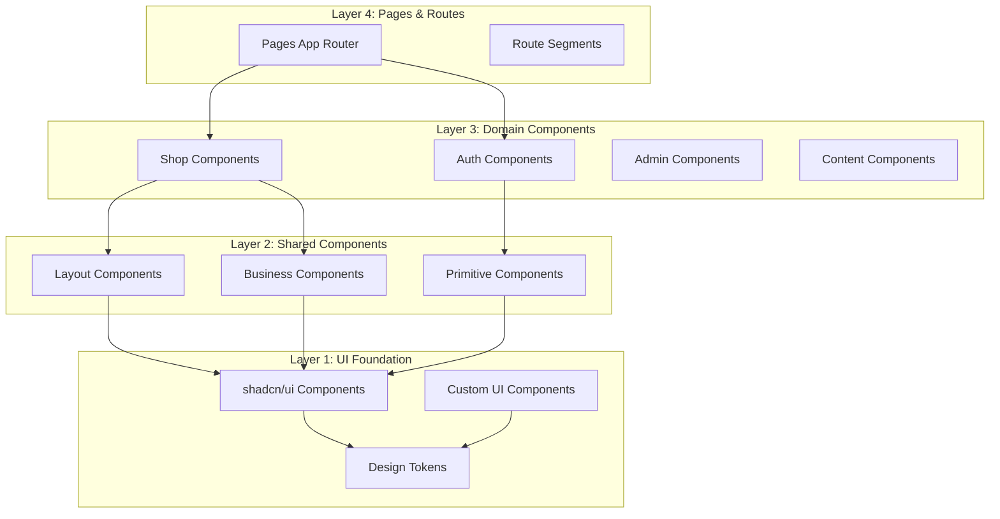

# Système de Design - Documentation Technique

> **Documentation basée sur l'analyse complète du codebase réel** - Herbis Veritas design system avec shadcn/ui, Tailwind CSS et architecture de composants.

---

## Vue d'ensemble

Le système de design d'Herbis Veritas repose sur une architecture modulaire utilisant **shadcn/ui** comme foundation, **Tailwind CSS** pour le styling, et une organisation en couches pour maximiser la réutilisabilité et la maintenabilité.

### Stack de Design

```typescript
interface DesignStack {
  foundation: "shadcn/ui"; // Composants primitifs accessibles
  styling: "Tailwind CSS"; // Utility-first CSS framework
  components: "React + TypeScript"; // Composants typés et modulaires
  tokens: "CSS Variables"; // Système de tokens dynamique
  accessibility: "ARIA + WCAG"; // Standards d'accessibilité
  responsive: "Mobile-first"; // Design responsive par défaut
}
```

---

## Architecture des Composants

### Structure Hiérarchique



### Organisation des Fichiers

```
src/components/
├── ui/                    # shadcn/ui + composants UI personnalisés
│   ├── button.tsx         # Composant Button avec variants
│   ├── card.tsx          # Système Card modulaire
│   ├── form.tsx          # Composants formulaires
│   ├── price.tsx         # Composant prix multilingue
│   └── ...               # 37 composants UI au total
├── primitives/           # Composants de base réutilisables
│   ├── heading.tsx       # Système de titres sémantiques
│   ├── text.tsx         # Composant texte avec variants
│   ├── link.tsx         # Liens avec internationalisation
│   └── logo.tsx         # Logo avec variantes
├── shared/              # Composants transversaux
│   ├── hero.tsx         # Section héro réutilisable
│   ├── card-grid.tsx    # Grilles de cartes flexibles
│   ├── modal.tsx        # Modales avec gestion focus
│   └── search-bar.tsx   # Barre de recherche
├── layout/              # Composants de mise en page
│   ├── header.tsx       # En-tête avec navigation
│   ├── footer.tsx       # Pied de page
│   ├── container.tsx    # Conteneur responsive
│   └── section.tsx      # Sections sémantiques
├── domain/              # Composants métier spécialisés
│   ├── shop/           # E-commerce
│   │   ├── product-card.tsx      # Carte produit complète
│   │   ├── product-grid.tsx      # Grille de produits
│   │   ├── checkout-button.tsx   # Bouton achat avec logique
│   │   └── quantity-input.tsx    # Input quantité
│   ├── auth/           # Authentification
│   ├── admin/          # Administration
│   └── content/        # Gestion de contenu
└── auth/               # Composants d'autorisation
    ├── Can.tsx         # Composant d'autorisation
    └── can-server.tsx  # Version serveur
```

---

## Système de Tokens de Design

### Palette de Couleurs (oklch)

Le projet utilise l'espace colorimétrique **oklch** pour une cohérence visuelle optimale et un support natif du thème sombre.

#### Couleurs Principales

```css
:root {
  /* Surfaces & texte de base */
  --background: oklch(0.97 0.01 95); /* Pierre calcaire claire */
  --foreground: oklch(0.18 0.004 49); /* Graphite */

  /* Couleur marque */
  --primary: oklch(0.75 0.11 298); /* Lavande */
  --primary-foreground: oklch(1 0 0); /* Blanc pur */

  /* Couleur secondaire */
  --secondary: oklch(0.6 0.09 122); /* Olive/Feuille */
  --secondary-foreground: oklch(0.15 0.004 49);

  /* Couleur d'accent */
  --accent: oklch(0.8 0.13 63); /* Ocre doré */
  --accent-foreground: oklch(0.18 0.004 49);

  /* Couleur support */
  --support: oklch(0.73 0.15 55); /* Terre cuite */
  --support-foreground: oklch(0.18 0.004 49);

  /* États et feedback */
  --destructive: oklch(0.58 0.15 15); /* Rouge erreur */
  --muted: oklch(0.94 0.015 95); /* Gris clair */
  --border: oklch(0.9 0.02 95); /* Bordures */
}
```

#### Thème Sombre

```css
.dark {
  --background: oklch(0.2 0.02 240); /* Gris bleuté sombre */
  --foreground: oklch(0.9 0.005 240); /* Quasi-blanc froid */
  --primary: oklch(0.85 0.09 298); /* Lavande éclaircie */
  --secondary: oklch(0.7 0.08 122); /* Olive adoucie */
  --accent: oklch(0.86 0.12 63); /* Ocre lumineux */
  --support: oklch(0.63 0.14 55); /* Terre cuite éclaircie */
}
```

### Typographie

#### Polices de Caractères

```typescript
// Configuration dans src/app/layout.tsx
const raleway = Raleway({
  subsets: ["latin"],
  variable: "--font-raleway",
  display: "swap",
});

const playfair = Playfair_Display({
  subsets: ["latin"],
  variable: "--font-playfair",
  display: "swap",
});
```

#### Échelle Typographique

```css
/* Configuration Tailwind - tailwind.config.cjs */
fontSize: {
  /* Corps de texte (line-height: 1.5) */
  xs: ["0.75rem", { lineHeight: "1.5" }],
  sm: ["0.875rem", { lineHeight: "1.5" }],
  base: ["1rem", { lineHeight: "1.5" }],
  lg: ["1.125rem", { lineHeight: "1.5" }],
  xl: ["1.25rem", { lineHeight: "1.5" }],
  "2xl": ["1.5rem", { lineHeight: "1.5" }],

  /* Titres (line-height: 1.3, letter-spacing: -0.01em) */
  h3: ["1.92rem", { lineHeight: "1.3", letterSpacing: "-0.01em" }],
  h2: ["2.4rem", { lineHeight: "1.3", letterSpacing: "-0.01em" }],
  h1: ["3rem", { lineHeight: "1.3", letterSpacing: "-0.01em" }],
}
```

#### Familles de Polices

```css
fontFamily: {
  sans: ["var(--font-raleway)", "sans-serif"],  /* Corps de texte */
  serif: ["var(--font-playfair)", "serif"],     /* Titres et accents */
}
```

### Espacements

```css
/* Système d'espacement cohérent */
spacing: {
  0: "0",
  1: "0.25rem",    /* 4px */
  2: "0.5rem",     /* 8px */
  3: "0.75rem",    /* 12px */
  4: "1rem",       /* 16px */
  5: "1.25rem",    /* 20px */
  6: "1.5rem",     /* 24px */
  8: "2rem",       /* 32px */
  10: "2.5rem",    /* 40px */
  12: "3rem",      /* 48px */
  16: "4rem",      /* 64px */
  20: "5rem",      /* 80px */
  24: "6rem",      /* 96px */
}
```

### Rayons de Bordure

```css
borderRadius: {
  none: "0",
  sm: "0.25rem",   /* 4px */
  DEFAULT: "0.5rem", /* 8px */
  md: "0.5rem",    /* 8px */
  lg: "0.75rem",   /* 12px */
  xl: "1rem",      /* 16px */
  "2xl": "1.5rem", /* 24px */
  full: "9999px",  /* Circulaire */
}
```

---

## Composants UI Fondamentaux

### Button - Composant de Base

```typescript
// src/components/ui/button.tsx
const buttonVariants = cva(
  "inline-flex items-center justify-center gap-2 whitespace-nowrap rounded-2xl text-sm font-medium transition-all disabled:pointer-events-none disabled:opacity-50 focus-visible:ring-2 focus-visible:ring-primary/40",
  {
    variants: {
      variant: {
        default: "bg-primary text-primary-foreground shadow-xs hover:bg-primary/90",
        primary: "bg-primary text-primary-foreground shadow-xs hover:bg-primary/90",
        destructive: "bg-destructive text-destructive-foreground shadow-xs hover:bg-destructive/90",
        outline: "border bg-background shadow-xs hover:bg-accent hover:text-accent-foreground",
        secondary: "bg-secondary text-secondary-foreground shadow-xs hover:bg-secondary/80",
        ghost: "hover:bg-accent hover:text-accent-foreground",
        link: "text-primary underline-offset-4 hover:underline",
        support: "bg-support text-support-foreground shadow-xs hover:bg-support/90",
      },
      size: {
        default: "h-10 px-4 py-2 has-[>svg]:px-3",
        sm: "h-9 px-3 has-[>svg]:px-2.5",
        lg: "h-11 px-8 has-[>svg]:px-6",
        icon: "size-10",
      },
    },
  }
);
```

### Card - Système Modulaire

```typescript
// src/components/ui/card.tsx - Architecture modulaire
function Card({ className, ...props }: React.ComponentProps<"div">) {
  return (
    <div
      data-slot="card"
      className={cn(
        "flex flex-col gap-6 rounded-xl border bg-card py-6 text-card-foreground shadow-sm",
        className
      )}
      {...props}
    />
  );
}

// Composants associés
CardHeader    // En-tête avec grid layout intelligent
CardTitle     // Titre avec sémantique
CardDescription // Description avec style muted
CardAction    // Actions alignées à droite
CardContent   // Contenu principal avec padding
CardFooter    // Pied avec séparateur optionnel
```

### Price - Composant Métier

```typescript
// src/components/ui/price.tsx - Composant spécialisé
interface PriceProps {
  value: number | null | undefined;
  locale: Locale;
  className?: string;
}

export const Price = ({ value, locale, className }: PriceProps) => {
  const formatted = formatPrice(value, locale);
  return <span className={className}>{formatted}</span>;
};
```

---

## Composants Primitifs

### Heading - Système de Titres Sémantiques

```typescript
// src/components/primitives/heading.tsx
const headingVariants = {
  1: "scroll-m-20 text-4xl font-extrabold tracking-tight lg:text-5xl font-serif",
  2: "scroll-m-20 border-b pb-2 text-3xl font-semibold tracking-tight first:mt-0 font-serif",
  3: "scroll-m-20 text-2xl font-semibold tracking-tight font-serif",
  4: "scroll-m-20 text-xl font-semibold tracking-tight font-serif",
};

interface HeadingProps extends React.HTMLAttributes<HTMLHeadingElement> {
  level: 1 | 2 | 3 | 4;
  as?: "h1" | "h2" | "h3" | "h4"; // Séparation sémantique/visuelle
}
```

### Hero - Composant Section Flexible

```typescript
// src/components/shared/hero.tsx - Composant polyvalent
export interface HeroProps extends React.HTMLAttributes<HTMLDivElement> {
  heading: React.ReactNode;
  description?: React.ReactNode;
  imageUrl?: string;
  imageAlt?: string;
  ctaLabel?: string;
  ctaLink?: React.ComponentProps<typeof Link>["href"];
}

// Features:
// - Support image de fond avec overlay
// - CTA configurable avec navigation i18n
// - Responsive design mobile-first
// - Accessibilité (ARIA labels)
// - Animation scroll indicator
```

---

## Composants Métier

### ProductCard - Composant E-commerce Complexe

```typescript
// src/components/domain/shop/product-card.tsx
export interface ProductCardProps {
  id: string | number;
  title: string;
  subtitle?: string;
  meta?: string;
  imageSrc: string;
  imageAlt: string;
  price: number; // Type strict pour le store
  discountPercent?: number;
  slug: string; // Navigation dynamique
  isLoading?: boolean; // État de chargement
  isOutOfStock?: boolean; // Gestion stock
  is_new?: boolean | null; // Badge "Nouveau"
  is_on_promotion?: boolean | null; // Badge "Promotion"
  short_description?: string | null;
  unit?: string | null; // Unité de mesure
}

// Features:
// - Integration avec le système de panier (addItemToCartAction)
// - Support des états de chargement avec Skeleton
// - Badges conditionnels (nouveau, promotion)
// - HoverCard pour description détaillée
// - Gestion d'erreurs avec toast notifications
// - Optimistic updates
```

### ProductGrid - Système de Grille Responsive

```typescript
// src/components/domain/shop/product-grid.tsx
export interface ProductGridProps {
  products: ProductData[];
  isLoading?: boolean;
  loadingSkeletons?: number; // Nombre de placeholders
  className?: string;
  noProductsMessage?: string; // Message état vide
}

// Layout responsive:
// - Mobile: 1 colonne
// - Tablet (sm): 2 colonnes
// - Desktop (lg): 3 colonnes
// - Large (xl): 4 colonnes
const gridClasses = cn("grid gap-6 sm:grid-cols-2 lg:grid-cols-3 xl:grid-cols-4", className);
```

---

## Composants shadcn/ui Installés

### Liste Complète (37 composants)

```typescript
// Composants d'interaction
(Button, ToggleButton, Switch, Checkbox, RadioGroup, Slider);

// Navigation
(NavigationMenu, Tabs, Pagination);

// Feedback
(Alert, AlertDialog, Dialog, HoverCard, Tooltip, Popover, Sheet);
(Progress, Skeleton, Badge);

// Formulaires
(Form, Input, PasswordInput, Textarea, Select, Label, Calendar);

// Layout
(Card, Separator, AspectRatio, ScrollArea, Accordion);

// Data Display
(Table, Avatar);

// Utilitaires
(Dropdown, Carousel, Sonner(toasts));
```

### Configuration et Personnalisation

```typescript
// Tous les composants utilisent:
// 1. class-variance-authority (cva) pour les variants
// 2. @radix-ui comme primitives accessibles
// 3. cn() utility pour la composition de classes
// 4. data-slot attributes pour le styling ciblé
// 5. TypeScript strict pour la sécurité de types
```

---

## Patterns de Composition

### Pattern de Composition avec Slots

```typescript
// Exemple Card avec data-slot pattern
<Card>
  <CardHeader>
    <CardTitle>Titre</CardTitle>
    <CardAction>
      <Button variant="ghost" size="icon">Action</Button>
    </CardAction>
  </CardHeader>
  <CardContent>
    Contenu principal
  </CardContent>
  <CardFooter>
    <Button>Action principale</Button>
  </CardFooter>
</Card>
```

### Pattern Compound Components

```typescript
// Accordéon avec structure composée
<Accordion type="single" collapsible>
  <AccordionItem value="item-1">
    <AccordionTrigger>Question 1</AccordionTrigger>
    <AccordionContent>Réponse détaillée...</AccordionContent>
  </AccordionItem>
</Accordion>
```

### Pattern de Polymorphisme (asChild)

```typescript
// Button peut rendre différents éléments
<Button asChild>
  <Link href="/products">Voir les produits</Link>
</Button>

// Rendu: <a href="/products" class="button-classes">Voir les produits</a>
```

---

## Accessibilité

### Standards Implémentés

#### ARIA et Navigation Clavier

```typescript
// Tous les composants incluent:
// - Support navigation clavier (Tab, Enter, Escape)
// - ARIA labels et descriptions
// - Focus management (focus-visible, focus-trap)
// - Live regions pour feedback dynamique
// - Contrast ratios respectant WCAG AA (4.5:1 minimum)

// Exemple: Button avec focus visible
"focus-visible:ring-2 focus-visible:ring-primary/40 outline-none";
```

#### Sémantique HTML

```typescript
// Utilisation systématique de balises sémantiques
<section>     // Sections thématiques
<article>     // Contenu autonome (produits, articles)
<nav>         // Navigation principale
<aside>       // Contenu complémentaire
<header>      // En-têtes de section
<footer>      // Pieds de page
<dl><dt><dd>  // Listes de définitions (caractéristiques produits)
```

#### Support Lecteurs d'Écran

```typescript
// Tous les composants interactifs incluent:
// - aria-label pour les éléments sans texte visible
// - aria-describedby pour descriptions détaillées
// - role attributes appropriés
// - aria-expanded, aria-selected pour les états
// - sr-only classes pour texte screenreader uniquement
```

---

## Design Responsive

### Stratégie Mobile-First

```css
/* Breakpoints Tailwind par défaut */
sm: "640px"   /* Tablet portrait */
md: "768px"   /* Tablet landscape */
lg: "1024px"  /* Desktop */
xl: "1280px"  /* Large desktop */
2xl: "1536px" /* Extra large */
```

### Patterns Responsive Communs

```typescript
// Grilles adaptatives
"grid grid-cols-1 sm:grid-cols-2 lg:grid-cols-3 xl:grid-cols-4";

// Typographie responsive
"text-4xl md:text-5xl lg:text-6xl";

// Padding responsive
"py-24 md:py-32";

// Navigation responsive
"hidden md:flex"; // Cache sur mobile, visible desktop
"md:hidden"; // Visible mobile, caché desktop
```

### Container et Layout

```typescript
// Container avec contraintes max-width
const Container = ({ children, className, ...props }) => (
  <div
    className={cn("container mx-auto px-4 sm:px-6 lg:px-8", className)}
    {...props}
  >
    {children}
  </div>
);
```

---

## Internationalisation (i18n)

### Support Multilingue

```typescript
// Configuration: fr (défaut), en, de, es
// Composants avec traductions intégrées

// Exemple ProductGrid
const t = useTranslations("ProductGrid");
noProductsMessage || t("noProductsFound")

// Composant Link avec routes i18n
import { Link } from "@/i18n/navigation";
<Link href="/products">Produits</Link>
// Rendu: /fr/products, /en/products, /de/products, /es/products
```

### Composant Price Multilingue

```typescript
// Formatage prix selon locale
const formatted = formatPrice(value, locale);
// FR: "29,99 €"
// EN: "€29.99"
// DE: "29,99 €"
// ES: "29,99 €"
```

---

## Configuration Tailwind

### Plugins Utilisés

```javascript
// tailwind.config.cjs
plugins: [
  require("@tailwindcss/typography"), // Prose styling
  require("tailwindcss-animate"), // Animations fluides
  require("tailwindcss-react-aria-components"), // Support React Aria
  require("tailwindcss-interaction-media"), // Médias queries interaction
];
```

### Extensions Personnalisées

```javascript
// Background images personnalisées
backgroundImage: {
  "gradient-radial": "radial-gradient(var(--tw-gradient-stops))",
  "footer-texture": "url(...)",     // Texture pied de page
  "footer-watermark": "url(...)",   // Watermark logo
}

// Typography plugin configuration
typography: (theme) => ({
  DEFAULT: {
    css: {
      "--tw-prose-body": theme("colors.foreground / 80%"),
      "--tw-prose-headings": theme("colors.primary"),
      "--tw-prose-links": theme("colors.primary"),
      // ... configuration complète pour contenu éditorial
    }
  }
})
```

---

## Animations et Transitions

### Système d'Animation

```css
/* Classes d'animation disponibles */
.animate-bounce      /* Rebond */
.animate-pulse       /* Pulsation (loading) */
.animate-spin        /* Rotation (spinners) */

/* Transitions personnalisées */
.transition-all      /* Toutes propriétés */
.duration-200        /* 200ms - interactions rapides */
.ease-out           /* Courbe d'accélération naturelle */

/* Hover effects */
.hover:scale-105     /* Légère augmentation */
.hover:bg-primary/90 /* Assombrissement couleur */
```

### Micro-interactions

```typescript
// Boutons avec feedback visuel
"transition-all duration-200 ease-out hover:scale-105";

// Cards avec hover state
"transition-transform hover:scale-[1.02]";

// Links avec underline animation
"underline-offset-4 hover:underline";
```

---

## Bonnes Pratiques

### Développement de Composants

#### Structure Recommandée

```typescript
// 1. Imports groupés
import React from "react";
import { useTranslations } from "next-intl";
import { cn } from "@/utils/cn";

// 2. Interface TypeScript stricte
interface ComponentProps extends React.HTMLAttributes<HTMLDivElement> {
  variant?: "default" | "primary" | "secondary";
  size?: "sm" | "md" | "lg";
  isLoading?: boolean;
}

// 3. Component avec forwardRef si nécessaire
const Component = React.forwardRef<HTMLDivElement, ComponentProps>(
  ({ className, variant = "default", ...props }, ref) => {
    // 4. Logique du composant
    const t = useTranslations("ComponentName");

    // 5. Rendu avec classes composées
    return (
      <div
        ref={ref}
        className={cn(baseClasses, variantClasses[variant], className)}
        {...props}
      />
    );
  }
);

// 6. DisplayName pour debugging
Component.displayName = "Component";

// 7. Export nommé
export { Component };
```

#### Conventions de Nommage

```typescript
// Composants: PascalCase
(ProductCard, ShoppingCart, UserProfile);

// Props interfaces: ComponentProps
(ButtonProps, CardProps, ModalProps);

// Variants: kebab-case
variant = "primary" | "secondary" | "outline";
size = "sm" | "md" | "lg";

// Classes CSS: kebab-case avec préfixes
("product-card", "hero-section", "btn-primary");
```

#### Gestion des États

```typescript
// Loading states avec Skeleton
{isLoading ? <Skeleton className="h-4 w-full" /> : <Content />}

// Error states avec fallback
{error ? <ErrorMessage error={error} /> : <SuccessContent />}

// Empty states avec message
{items.length === 0 ? <EmptyState message={t("noItems")} /> : <ItemList />}
```

### Performance

#### Optimisations Appliquées

```typescript
// 1. Lazy loading pour les composants lourds
const HeavyComponent = lazy(() => import("./HeavyComponent"));

// 2. Memoization pour éviter re-renders
const MemoizedCard = React.memo(ProductCard);

// 3. useMemo pour calculs coûteux
const sortedProducts = useMemo(() =>
  products.sort((a, b) => a.price - b.price),
  [products]
);

// 4. Images optimisées Next.js
<Image
  src={imageSrc}
  alt={imageAlt}
  width={300}
  height={200}
  className="object-cover"
  priority={isAboveFold}
/>
```

#### Réduction Bundle Size

```typescript
// Import spécifique plutôt que global
import { Button } from "@/components/ui/button";
// ❌ import * as UI from "@/components/ui";

// Tree shaking friendly exports
export { Button, ButtonProps } from "./button";
export { Card, CardHeader, CardContent } from "./card";
```

---

## Tests et Validation

### Stratégie de Test des Composants

```typescript
// Test unitaire type
describe("Button Component", () => {
  it("renders with correct variant classes", () => {
    render(<Button variant="primary">Click me</Button>);
    expect(screen.getByRole("button")).toHaveClass("bg-primary");
  });

  it("handles click events", async () => {
    const handleClick = jest.fn();
    render(<Button onClick={handleClick}>Click me</Button>);

    await user.click(screen.getByRole("button"));
    expect(handleClick).toHaveBeenCalledTimes(1);
  });

  it("supports keyboard navigation", async () => {
    render(<Button>Focusable</Button>);

    await user.tab();
    expect(screen.getByRole("button")).toHaveFocus();

    await user.keyboard("{Enter}");
    // Assertions sur l'action déclenchée
  });
});
```

### Validation Accessibilité

```typescript
// Tests a11y automatisés avec jest-axe
import { axe, toHaveNoViolations } from "jest-axe";

expect.extend(toHaveNoViolations);

it("should not have accessibility violations", async () => {
  const { container } = render(<ComponentToTest />);
  const results = await axe(container);
  expect(results).toHaveNoViolations();
});
```

---

## Roadmap et Évolutions

### Court Terme (Q4 2025)

- [ ] **Storybook Integration** - Documentation interactive des composants
- [ ] **Design Tokens Generator** - Génération automatique tokens depuis Figma
- [ ] **Component Testing** - Augmentation couverture tests composants UI
- [ ] **Performance Audit** - Optimisation bundle size et runtime

### Moyen Terme (Q1-Q2 2026)

- [ ] **Dark Mode Toggle** - Interface utilisateur pour changement thème
- [ ] **Animation Library** - Bibliothèque d'animations réutilisables
- [ ] **Component Playground** - Interface de test en temps réel
- [ ] **A11y Automation** - Tests accessibilité automatisés en CI/CD

### Long Terme (Q3-Q4 2026)

- [ ] **Design System Package** - Publication npm pour réutilisation
- [ ] **Multi-brand Support** - Support thèmes multiples pour white-label
- [ ] **Advanced Theming** - Générateur de thèmes avec AI
- [ ] **Component Analytics** - Métriques d'utilisation des composants

---

## Ressources et Références

### Documentation Externe

- **[shadcn/ui](https://ui.shadcn.com/)** - Foundation des composants
- **[Tailwind CSS](https://tailwindcss.com/)** - Framework CSS utility-first
- **[Radix UI](https://www.radix-ui.com/)** - Primitives accessibles
- **[React Aria](https://react-spectrum.adobe.com/react-aria/)** - Patterns d'accessibilité
- **[WCAG Guidelines](https://www.w3.org/WAI/WCAG21/quickref/)** - Standards accessibilité

### Outils de Développement

```bash
# Linting des composants
npm run lint                    # ESLint avec règles a11y

# Tests des composants
npm run test:components         # Tests unitaires composants
npm run test:a11y              # Tests accessibilité

# Documentation
npm run storybook              # Documentation interactive
npm run design-tokens          # Génération tokens

# Performance
npm run analyze               # Analyse bundle size
npm run lighthouse            # Audit performance
```

---

## Conclusion

Le système de design d'Herbis Veritas offre une **foundation solide et évolutive** pour le développement d'interfaces utilisateur cohérentes et accessibles. L'architecture en couches, la configuration Tailwind avancée et l'utilisation de shadcn/ui comme base permettent un développement efficace tout en maintenant une haute qualité.

### Points Forts

- ✅ **Architecture modulaire** avec séparation claire des responsabilités
- ✅ **Accessibilité native** avec support WCAG AA
- ✅ **Performance optimisée** avec lazy loading et tree shaking
- ✅ **Type Safety** complète avec TypeScript strict
- ✅ **Internationalisation** intégrée dans tous les composants
- ✅ **Responsive design** mobile-first cohérent
- ✅ **Theme system** robuste avec support thème sombre

### Adoption Recommandée

Pour les nouveaux développeurs, commencer par :

1. **[Getting Started](../getting-started/quick-start.md)** - Configuration environnement
2. **Étudier les composants UI existants** - Comprendre les patterns
3. **Utiliser les primitives** - Construire avec les bases établies
4. **Respecter les conventions** - TypeScript, nommage, structure
5. **Tester systématiquement** - Fonctionnel et accessibilité

---

<div align="center">

**🎨 Herbis Veritas Design System**  
_Accessible • Performant • Évolutif_

**Dernière mise à jour** : 4 Août 2025  
**Version** : 2.2.0  
**Status** : ✅ Production Ready

[🏠 Documentation](../README.md) • [🚀 Quick Start](../getting-started/quick-start.md) • [🏗️ Architecture](../architecture/overview.md)

</div>
