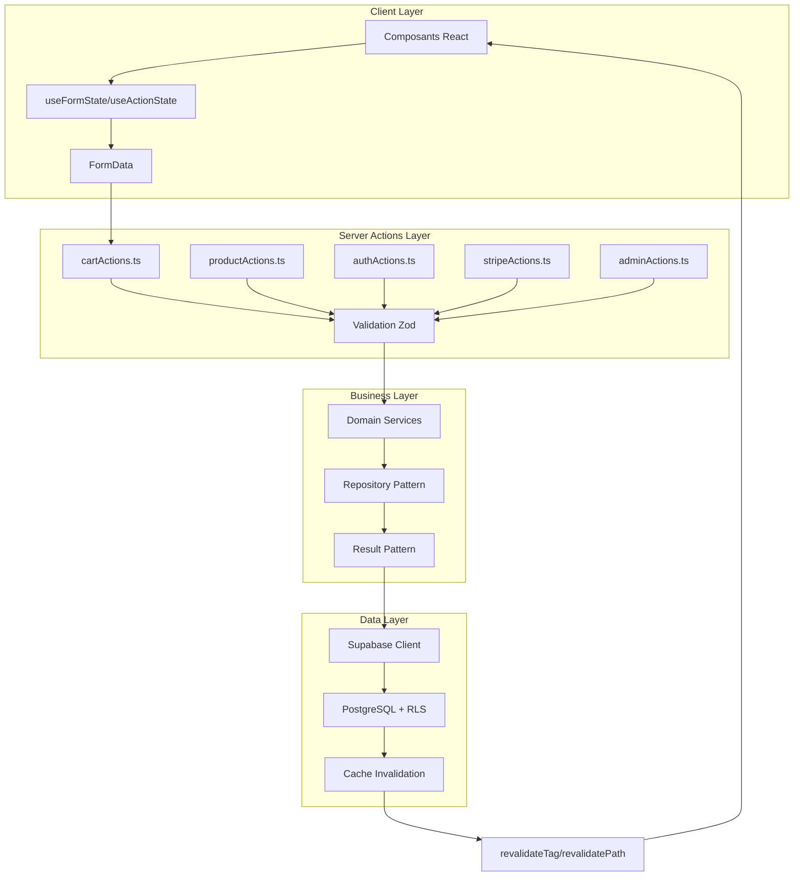

# Server Actions - Guide de Développement

Documentation complète des Server Actions de Next.js 15 implémentées dans In Herbis Veritas, basée sur l'analyse du code en production.

## Vue d'Ensemble

### Architecture Server Actions



### Patterns Implementés

- ✅ **Result Pattern** - Gestion d'erreurs type-safe
- ✅ **Validation Zod** - Validation stricte des inputs
- ✅ **Cache Invalidation** - `revalidateTag` systématique
- ✅ **Error Handling** - Hiérarchie d'erreurs unifiée
- ✅ **Type Safety** - Types TypeScript complets
- ✅ **Security** - Authentification et autorisation

## Server Actions par Domaine

### 1. Cart Actions (`src/actions/cartActions.ts`)

#### Actions Principales
```typescript
// Ajout d'article au panier
export async function addItemToCartAction(
  prevState: unknown,
  formData: FormData
): Promise<CartActionResult<CartData | null>>

// Suppression d'article
export async function removeItemFromCartAction(
  prevState: unknown,
  formData: FormData
): Promise<CartActionResult<CartData | null>>

// Mise à jour quantité
export async function updateCartItemQuantityAction(
  prevState: unknown,
  formData: FormData
): Promise<CartActionResult<CartData | null>>

// Vider le panier
export async function clearCartAction(
  prevState: unknown
): Promise<CartActionResult<CartData | null>>

// Lecture panier (réexportée)
export { getCart } from "@/lib/cartReader";
```

#### Validation et Logique Métier
```typescript
// Schéma validation ajout article
const AddToCartInputSchema = z.object({
  productId: z.string().uuid("ID produit invalide"),
  quantity: z.number().int().min(1).max(99, "Quantité limitée à 99")
});

// Exemple implémentation avec gestion erreurs
export async function addItemToCartAction(
  prevState: unknown,
  formData: FormData
): Promise<CartActionResult<CartData | null>> {
  try {
    // 1. Validation input
    const rawInput = {
      productId: formData.get("productId") as string,
      quantity: parseInt(formData.get("quantity") as string) || 1,
    };
    
    const validatedInput = AddToCartInputSchema.parse(rawInput);
    
    // 2. Authentification/identification utilisateur
    const userId = await getActiveUserId();
    if (!userId) {
      return createGeneralErrorResult("Utilisateur non identifié");
    }
    
    // 3. Vérification stock et produit
    const product = await getProductById(validatedInput.productId);
    if (!product || !product.is_active) {
      return createGeneralErrorResult("Produit non disponible");
    }
    
    if (product.stock_quantity < validatedInput.quantity) {
      return createGeneralErrorResult("Stock insuffisant");
    }
    
    // 4. Opération base de données
    const cartId = await getOrCreateCartId(userId);
    const result = await addItemToCart(cartId, validatedInput);
    
    // 5. Invalidation cache
    revalidateTag(`cart-${cartId}`);
    revalidateTag("products");
    
    // 6. Retour résultat
    return createSuccessResult(result, "Article ajouté au panier");
    
  } catch (error) {
    if (error instanceof z.ZodError) {
      return createValidationErrorResult(error);
    }
    
    console.error("Erreur ajout panier:", error);
    return createGeneralErrorResult("Erreur lors de l'ajout au panier");
  }
}
```

### 2. Product Actions (`src/actions/productActions.ts`)

#### CRUD Produits
```typescript
// Création produit (Admin/Editor)
export async function createProductAction(
  data: CreateProductInput
): Promise<ActionResult<Product>>

// Mise à jour produit
export async function updateProductAction(
  id: string,
  data: UpdateProductInput
): Promise<ActionResult<Product>>

// Suppression produit (Admin uniquement)
export async function deleteProductAction(
  id: string
): Promise<ActionResult<void>>

// Upload image produit
export async function uploadProductImageAction(
  productId: string,
  formData: FormData
): Promise<ActionResult<{ imageUrl: string }>>
```

#### Validation Produits
```typescript
const CreateProductSchema = z.object({
  name: z.string().min(1).max(255),
  slug: z.string().regex(/^[a-z0-9-]+$/),
  price: z.number().positive(),
  stock_quantity: z.number().int().min(0),
  category: z.string().min(1),
  description: z.string().max(2000),
  is_active: z.boolean().default(true),
  labels: z.array(z.string()).default([]),
  unit: z.string().default('pièce'),
  is_new: z.boolean().optional(),
  is_on_promotion: z.boolean().optional(),
  inci_list: z.array(z.string()).optional()
});

// Vérification permissions
const requireEditorRole = async (userId: string): Promise<void> => {
  const { data: profile } = await supabase
    .from('profiles')
    .select('role')
    .eq('id', userId)
    .single();
    
  if (!profile || !['editor', 'admin', 'dev'].includes(profile.role)) {
    throw new UnauthorizedError('Permission insuffisante');
  }
};
```

### 3. Auth Actions (`src/actions/authActions.ts`)

#### Authentification
```typescript
// Inscription utilisateur
export async function signUpAction(
  prevState: unknown,
  formData: FormData
): Promise<AuthActionResult>

// Connexion
export async function signInAction(
  prevState: unknown,
  formData: FormData
): Promise<AuthActionResult>

// Déconnexion
export async function signOutAction(): Promise<AuthActionResult>

// Réinitialisation mot de passe
export async function resetPasswordAction(
  email: string
): Promise<AuthActionResult>

// Confirmation email
export async function confirmEmailAction(
  token: string
): Promise<AuthActionResult>
```

#### Sécurité Auth
```typescript
// Limitation tentatives de connexion
const rateLimitLogin = async (email: string): Promise<boolean> => {
  const attempts = await redis.get(`login_attempts:${email}`);
  const count = parseInt(attempts || '0');
  
  if (count >= 5) {
    return false; // Bloqué
  }
  
  await redis.incr(`login_attempts:${email}`);
  await redis.expire(`login_attempts:${email}`, 300); // 5 minutes
  
  return true;
};

// Validation force mot de passe
const PasswordSchema = z.string()
  .min(8, "Minimum 8 caractères")
  .regex(/[A-Z]/, "Au moins une majuscule")
  .regex(/[a-z]/, "Au moins une minuscule") 
  .regex(/[0-9]/, "Au moins un chiffre")
  .regex(/[^A-Za-z0-9]/, "Au moins un caractère spécial");
```

### 4. Stripe Actions (`src/actions/stripeActions.ts`)

#### Paiements
```typescript
// Créer Payment Intent
export async function createPaymentIntentAction(
  cartId: string,
  shippingMethodId: string
): Promise<ActionResult<PaymentIntentResult>>

// Confirmer paiement
export async function confirmPaymentAction(
  paymentIntentId: string
): Promise<ActionResult<Order>>

// Créer Checkout Session
export async function createCheckoutSessionAction(
  cartId: string,
  successUrl: string,
  cancelUrl: string
): Promise<ActionResult<{ sessionId: string }>>

// Webhook Stripe
export async function handleStripeWebhookAction(
  payload: string,
  signature: string
): Promise<ActionResult<void>>
```

#### Sécurité Paiements
```typescript
// Validation montant côté serveur
const validatePaymentAmount = async (
  cartId: string,
  expectedAmount: number
): Promise<boolean> => {
  const cart = await getCartWithItems(cartId);
  const calculatedTotal = calculateCartTotal(cart.items);
  
  // Tolérance de 1 centime pour arrondis
  return Math.abs(calculatedTotal - expectedAmount) <= 0.01;
};

// Vérification signature webhook
const verifyStripeSignature = (payload: string, signature: string): boolean => {
  try {
    stripe.webhooks.constructEvent(
      payload,
      signature,
      process.env.STRIPE_WEBHOOK_SECRET!
    );
    return true;
  } catch (error) {
    return false;
  }
};
```

### 5. Admin Actions (`src/actions/adminActions.ts`)

#### Administration
```typescript
// Gestion utilisateurs
export async function updateUserRoleAction(
  userId: string,
  newRole: AppRole,
  reason: string
): Promise<ActionResult<Profile>>

// Export données
export async function exportUsersDataAction(): Promise<ActionResult<string>>

// Statistiques
export async function getAdminStatsAction(): Promise<ActionResult<AdminStats>>

// Audit logs
export async function getAuditLogsAction(
  filters: AuditLogFilters
): Promise<ActionResult<AuditLog[]>>
```

#### Sécurité Admin
```typescript
// Vérification rôle admin obligatoire
const requireAdminRole = async (userId: string): Promise<void> => {
  const hasAdminRole = await AdminRoleService.checkAdminRole(userId);
  if (!hasAdminRole) {
    // Log tentative accès non autorisé
    await auditLogger.logSecurityEvent({
      event_type: 'UNAUTHORIZED_ADMIN_ACCESS',
      user_id: userId,
      data: { attempted_action: 'admin_action_access' }
    });
    
    throw new UnauthorizedError('Accès admin requis');
  }
};

// Validation actions sensibles
const validateSensitiveAction = z.object({
  reason: z.string().min(10, "Justification requise (min 10 caractères)"),
  confirmation: z.literal(true, { 
    errorMap: () => ({ message: "Confirmation requise" })
  })
});
```

### 6. Address Actions (`src/actions/addressActions.ts`)

#### Gestion Adresses
```typescript
// Ajouter une nouvelle adresse
export async function addAddress(
  data: AddressFormData, 
  locale: string
): Promise<ActionResult<void>>

// Mettre à jour adresse existante
export async function updateAddress(
  addressId: string, 
  data: AddressFormData, 
  locale: string
): Promise<ActionResult<void>>
```

#### Validation et Logique Métier
```typescript
// Synchronisation automatique du flag de différence d'adresse
export async function syncProfileAddressFlag(
  locale: string, 
  userId?: string
): Promise<{ success: boolean; message?: string; error?: string }>

// Logique métier implémentée
const addAddress = async (data: AddressFormData, locale: string) => {
  // 1. Validation des données d'adresse
  const validatedData = AddressFormSchema.parse(data);
  
  // 2. Insertion en base avec RLS
  const { error } = await supabase
    .from('addresses')
    .insert({
      ...validatedData,
      user_id: user.id
    });
    
  // 3. Synchronisation du flag profil
  await syncProfileAddressFlag(locale);
  
  // 4. Invalidation cache
  revalidatePath('/profile/addresses');
  revalidatePath('/checkout');
};
```

### 7. Magazine Actions (`src/actions/magazineActions.ts`)

#### Gestion du Contenu Editorial
```typescript
// Articles
export async function createArticle(
  formData: ArticleFormData
): Promise<ActionResult<unknown>>

export async function updateArticle(
  id: string, 
  formData: ArticleFormData
): Promise<ActionResult<unknown>>

export async function deleteArticle(
  id: string
): Promise<ActionResult<null>>

// Workflow de publication
export async function changeArticleStatus(
  articleId: string,
  newStatus: "draft" | "published" | "archived"
): Promise<ActionResult<null>>

export async function bulkChangeArticleStatus(
  articleIds: string[],
  newStatus: "draft" | "published" | "archived"
)

// Taxonomie
export async function createCategory(
  data: Omit<CategoryInsert, "id">
): Promise<ActionResult<unknown>>

export async function createTag(
  data: Omit<TagInsert, "id">
): Promise<ActionResult<unknown>>
```

#### Architecture Magazine avec Clean Architecture
```typescript
// Pattern Result pour les actions magazine
const createArticle = async (formData: ArticleFormData) => {
  const context = LogUtils.createUserActionContext('unknown', 'create_article', 'magazine');
  
  try {
    // 1. Validation permissions
    const hasPermission = await checkUserPermission("content:create");
    if (!hasPermission) {
      throw new AuthenticationError("Permission refusée");
    }
    
    // 2. Génération et validation du slug
    const slug = formData.slug || generateSlug(formData.title);
    const existingArticle = await checkSlugUniqueness(slug);
    
    // 3. Nettoyage contenu TipTap
    const cleanedContent = sanitizeTipTapContent(formData.content);
    
    // 4. Préparation données article
    const articleData: ArticleInsert = {
      title: formData.title,
      slug,
      content: cleanedContent,
      content_html: convertTipTapToHTML(cleanedContent),
      reading_time: calcReadingTime(cleanedContent),
      // ... autres champs
    };
    
    // 5. Transaction base de données
    const article = await createArticleInDB(articleData);
    
    // 6. Gestion des tags (relation many-to-many)
    if (formData.tags?.length > 0) {
      await linkArticleTags(article.id, formData.tags);
    }
    
    // 7. Invalidation cache
    revalidatePath("/admin/magazine");
    revalidatePath("/magazine");
    
    return ActionResult.ok(article, 'Article créé avec succès');
  } catch (error) {
    LogUtils.logOperationError('create_article', error, context);
    return ActionResult.error(ErrorUtils.formatForUser(error));
  }
};
```

### 8. Système d'Upload d'Images Centralisé ⚡ **FACTORISATION 01/2025**

**Localisation :** `src/lib/storage/image-upload.ts`

#### Architecture Unifiée

Depuis la factorisation de janvier 2025, le système d'upload d'images utilise une fonction centralisée qui élimine la duplication de code entre les uploads de produits et du magazine.

```typescript
// Configuration par bucket
interface BucketConfig {
  bucket: "products" | "magazine";
  permission: AppPermission;
  usePermissionSafe?: boolean;
}

// Schéma de validation unifié
const imageUploadSchema = z.object({
  file: z
    .instanceof(File)
    .refine((file) => file.size > 0, "Le fichier ne peut pas être vide.")
    .refine(
      (file) => file.size < 4 * 1024 * 1024, // 4MB max
      "Le fichier ne doit pas dépasser 4Mo."
    )
    .refine(
      (file) => ["image/jpeg", "image/png", "image/webp", "image/gif"].includes(file.type),
      "Le format du fichier doit être JPEG, PNG, WEBP ou GIF."
    ),
  fileName: z.string().min(3, "Le nom du fichier doit contenir au moins 3 caractères."),
});
```

#### Fonction Core

```typescript
// Fonction centralisée (interne)
async function uploadImageCore(
  formData: FormData,
  config: BucketConfig
): Promise<UploadImageResult> {
  try {
    // 1. Vérification permissions
    if (!config.usePermissionSafe) {
      const permissionResult = await checkUserPermission(config.permission);
      if (!permissionResult.isAuthorized) {
        return { success: false, message: "Permission refusée pour l'upload d'images." };
      }
    }

    // 2. Validation avec Zod
    const validationResult = imageUploadSchema.safeParse({ 
      file: formData.get("file"), 
      fileName: formData.get("fileName") 
    });

    if (!validationResult.success) {
      return {
        success: false,
        message: "Validation échouée",
        errors: validationResult.error.flatten().fieldErrors,
      };
    }

    // 3. Sanitisation nom de fichier
    const fileExtension = validatedFile.name.split(".").pop();
    const sanitizedFileName = slugify(validatedFileName);
    const filePath = `${sanitizedFileName}.${fileExtension}`;

    // 4. Upload Supabase Storage
    const { error: uploadError } = await supabase.storage
      .from(config.bucket)
      .upload(filePath, validatedFile, { upsert: true });

    if (uploadError) {
      return { success: false, message: `Erreur lors de l'upload: ${uploadError.message}` };
    }

    // 5. Génération URL publique
    const { data: publicUrlData } = supabase.storage.from(config.bucket).getPublicUrl(filePath);

    return {
      success: true,
      message: "Image téléversée avec succès !",
      data: { url: publicUrlData.publicUrl },
    };
  } catch (error) {
    return { success: false, message: "Erreur lors de l'upload" };
  }
}
```

#### Exports Publics

```typescript
// Upload produits (protégé par withPermissionSafe)
export const uploadProductImageCore = withPermissionSafe(
  "products:update",
  async (formData: FormData): Promise<UploadImageResult> =>
    uploadImageCore(formData, {
      bucket: "products",
      permission: "products:update",
      usePermissionSafe: true,
    })
);

// Upload magazine (vérification manuelle)
export async function uploadMagazineImageCore(formData: FormData): Promise<UploadImageResult> {
  return uploadImageCore(formData, {
    bucket: "magazine",
    permission: "content:create",
  });
}
```

#### Avantages de la Factorisation

- ✅ **-70 lignes de code dupliqué** éliminées
- ✅ **Maintenance centralisée** des validations et contraintes
- ✅ **Cohérence garantie** entre tous les types d'upload
- ✅ **Évolutivité** facilitée pour de nouveaux buckets
- ✅ **Type safety** avec `AppPermission` strict
- ✅ **Performance** - sanitisation unifiée avec `slugify()`

#### Tests du Système Centralisé

```typescript
// Tests unitaires dans src/lib/storage/__tests__/image-upload.test.ts
describe('uploadImageCore', () => {
  it('should validate file size limit', async () => {
    const oversizedFile = new File(['x'.repeat(5 * 1024 * 1024)], 'big.jpg', { type: 'image/jpeg' });
    const formData = new FormData();
    formData.append('file', oversizedFile);
    formData.append('fileName', 'test-image');

    const result = await uploadProductImageCore(formData);
    
    expect(result.success).toBe(false);
    expect(result.message).toContain('4Mo');
  });

  it('should sanitize file names correctly', async () => {
    const file = new File(['test'], 'Mon Fichier Spécial!!.jpg', { type: 'image/jpeg' });
    // Nom sanitisé attendu: 'mon-fichier-special.jpg'
  });
});

// Tests d'intégration dans src/actions/__tests__/productActions.test.ts
describe('Product Actions Integration', () => {
  it('should upload product image through action', async () => {
    const result = await uploadProductImageAction(createFormData());
    expect(result.success).toBe(true);
    expect(result.data?.url).toMatch(/^https:\/\/.*\.supabase\.co\/storage/);
  });
});
```

## Patterns Techniques

### Result Pattern Implementation

#### Types de Résultats
```typescript
// Result générique pour toutes les actions
type ActionResult<T> = 
  | { success: true; data: T; message?: string }
  | { success: false; message: string; fieldErrors?: Record<string, string[]> }

// Spécialisé pour le panier
type CartActionResult<T> = ActionResult<T> & {
  optimisticData?: T; // Pour optimistic updates
}

// Spécialisé pour l'auth
type AuthActionResult = ActionResult<AuthData> & {
  redirectTo?: string;
}
```

#### Fonctions Helper
```typescript
// Création résultats success
export const createSuccessResult = <T>(
  data: T, 
  message?: string
): ActionResult<T> => ({
  success: true,
  data,
  message
});

// Création résultats d'erreur
export const createErrorResult = (
  message: string,
  fieldErrors?: Record<string, string[]>
): ActionResult<never> => ({
  success: false,
  message,
  fieldErrors
});

// Gestion erreurs Zod
export const createValidationErrorResult = (
  error: z.ZodError
): ActionResult<never> => ({
  success: false,
  message: "Données invalides",
  fieldErrors: error.flatten().fieldErrors
});
```

### Validation avec Zod

#### Schémas Réutilisables
```typescript
// Schémas de base
const UuidSchema = z.string().uuid();
const PositiveNumberSchema = z.number().positive();
const QuantitySchema = z.number().int().min(1).max(99);

// Schémas composés
const ProductReferenceSchema = z.object({
  productId: UuidSchema,
  quantity: QuantitySchema
});

const UserIdentificationSchema = z.object({
  email: z.string().email().toLowerCase(),
  password: z.string().min(8)
});

// Validation runtime
const validateAndParseInput = <T>(
  schema: z.ZodSchema<T>,
  data: unknown
): T => {
  try {
    return schema.parse(data);
  } catch (error) {
    if (error instanceof z.ZodError) {
      throw new ValidationError("Données invalides", error.flatten().fieldErrors);
    }
    throw error;
  }
};
```

### Cache Management

#### Stratégies d'Invalidation
```typescript
// Tags de cache par domaine
const CACHE_TAGS = {
  // Produits
  PRODUCTS: 'products',
  PRODUCT: (id: string) => `product-${id}`,
  
  // Panier
  CART: (id: string) => `cart-${id}`,
  USER_CART: (userId: string) => `user-cart-${userId}`,
  
  // Commandes
  ORDERS: 'orders',
  USER_ORDERS: (userId: string) => `user-orders-${userId}`,
  
  // Profils
  PROFILE: (id: string) => `profile-${id}`,
  PROFILES: 'profiles'
} as const;

// Invalidation granulaire
const invalidateCartCache = async (cartId: string, userId: string) => {
  revalidateTag(CACHE_TAGS.CART(cartId));
  revalidateTag(CACHE_TAGS.USER_CART(userId));
  revalidateTag(CACHE_TAGS.PRODUCTS); // Pour stock
};

// Invalidation en batch
const invalidateUserData = async (userId: string) => {
  const tags = [
    CACHE_TAGS.PROFILE(userId),
    CACHE_TAGS.USER_CART(userId),
    CACHE_TAGS.USER_ORDERS(userId)
  ];
  
  tags.forEach(tag => revalidateTag(tag));
};
```

### Error Handling

#### Hiérarchie d'Erreurs
```typescript
// Classes d'erreurs métier
export class ValidationError extends Error {
  constructor(
    message: string,
    public fieldErrors?: Record<string, string[]>
  ) {
    super(message);
    this.name = 'ValidationError';
  }
}

export class UnauthorizedError extends Error {
  constructor(message: string = 'Non autorisé') {
    super(message);
    this.name = 'UnauthorizedError';
  }
}

export class NotFoundError extends Error {
  constructor(resource: string) {
    super(`${resource} non trouvé`);
    this.name = 'NotFoundError';
  }
}

export class BusinessRuleError extends Error {
  constructor(rule: string, context?: any) {
    super(`Règle métier violée: ${rule}`);
    this.name = 'BusinessRuleError';
    this.context = context;
  }
}
```

#### Gestionnaire Global d'Erreurs
```typescript
export const handleActionError = (error: unknown): ActionResult<never> => {
  // Log de l'erreur pour debugging
  console.error('Action Error:', error);
  
  // Gestion par type d'erreur
  if (error instanceof ValidationError) {
    return createValidationErrorResult(error);
  }
  
  if (error instanceof UnauthorizedError) {
    return createErrorResult("Accès non autorisé");
  }
  
  if (error instanceof NotFoundError) {
    return createErrorResult(error.message);
  }
  
  if (error instanceof BusinessRuleError) {
    return createErrorResult(error.message);
  }
  
  // Erreur générique (ne pas exposer détails)
  return createErrorResult("Une erreur est survenue");
};
```

## Testing des Server Actions

### Stratégies de Test

#### Unit Tests
```typescript
import { createMocks } from 'node-mocks-http';
import { addItemToCartAction } from '../cartActions';

describe('Cart Actions', () => {
  beforeEach(() => {
    jest.clearAllMocks();
    mockSupabaseResponse();
  });
  
  describe('addItemToCartAction', () => {
    it('should add item to cart successfully', async () => {
      // Arrange
      const formData = new FormData();
      formData.append('productId', 'valid-uuid');
      formData.append('quantity', '2');
      
      mockGetActiveUserId.mockResolvedValue('user-123');
      mockGetProductById.mockResolvedValue({
        id: 'valid-uuid',
        stock_quantity: 10,
        is_active: true
      });
      
      // Act
      const result = await addItemToCartAction(null, formData);
      
      // Assert
      expect(result.success).toBe(true);
      expect(result.data).toBeDefined();
      expect(mockAddItemToCart).toHaveBeenCalledWith(
        expect.any(String),
        { productId: 'valid-uuid', quantity: 2 }
      );
    });
    
    it('should return validation error for invalid input', async () => {
      // Arrange
      const formData = new FormData();
      formData.append('productId', 'invalid-id');
      formData.append('quantity', '0');
      
      // Act
      const result = await addItemToCartAction(null, formData);
      
      // Assert
      expect(result.success).toBe(false);
      expect(result.fieldErrors).toBeDefined();
    });
  });
});
```

#### Integration Tests
```typescript
import { createServerClient } from '@/lib/supabase/server';

describe('Cart Actions Integration', () => {
  let supabase: ReturnType<typeof createServerClient>;
  let testUser: { id: string; email: string };
  let testProduct: { id: string; name: string };
  
  beforeAll(async () => {
    supabase = createServerClient();
    
    // Créer utilisateur de test
    testUser = await createTestUser();
    testProduct = await createTestProduct();
  });
  
  afterAll(async () => {
    await cleanupTestData();
  });
  
  it('should handle complete cart flow', async () => {
    // 1. Ajouter article
    const addResult = await addItemToCartAction(null, createFormData({
      productId: testProduct.id,
      quantity: '1'
    }));
    
    expect(addResult.success).toBe(true);
    
    // 2. Vérifier en base
    const { data: cart } = await supabase
      .from('carts')
      .select('*, cart_items(*)')
      .eq('user_id', testUser.id)
      .single();
      
    expect(cart.cart_items).toHaveLength(1);
    
    // 3. Modifier quantité
    const updateResult = await updateCartItemQuantityAction(null, createFormData({
      cartItemId: cart.cart_items[0].id,
      quantity: '3'
    }));
    
    expect(updateResult.success).toBe(true);
    
    // 4. Vider panier
    const clearResult = await clearCartAction(null);
    expect(clearResult.success).toBe(true);
  });
});
```

### Mocking et Test Utilities

#### Mock Supabase
```typescript
// Mock pour tests unitaires
export const mockSupabaseResponse = (data: any = {}, error: any = null) => {
  return jest.mocked(createServerClient).mockReturnValue({
    from: jest.fn().mockReturnValue({
      select: jest.fn().mockReturnValue({
        eq: jest.fn().mockReturnValue({
          single: jest.fn().mockResolvedValue({ data, error }),
          maybeSingle: jest.fn().mockResolvedValue({ data, error })
        }),
        filter: jest.fn().mockReturnValue({
          order: jest.fn().mockResolvedValue({ data, error })
        })
      }),
      insert: jest.fn().mockResolvedValue({ data, error }),
      update: jest.fn().mockResolvedValue({ data, error }),
      delete: jest.fn().mockResolvedValue({ data, error })
    })
  } as any);
};

// Utilitaires création FormData
export const createFormData = (fields: Record<string, string>): FormData => {
  const formData = new FormData();
  Object.entries(fields).forEach(([key, value]) => {
    formData.append(key, value);
  });
  return formData;
};
```

## Performance et Optimisations

### Optimisations Implémentées

#### Caching Intelligent
```typescript
// Cache conditionnel basé sur le contexte
const getCacheConfig = (actionType: string, userId?: string) => {
  const configs = {
    'read_products': { revalidate: 300 }, // 5 minutes
    'read_cart': { revalidate: 60 },      // 1 minute
    'read_profile': { revalidate: 600 },   // 10 minutes
    'read_orders': { revalidate: 1800 }    // 30 minutes
  };
  
  return configs[actionType] || { revalidate: 60 };
};

// Invalidation sélective
const smartInvalidation = (actionType: string, context: any) => {
  const invalidationMap = {
    'cart_modified': [
      `cart-${context.cartId}`,
      `user-cart-${context.userId}`,
      'products' // Pour mise à jour stock
    ],
    'product_updated': [
      `product-${context.productId}`,
      'products',
      'featured-products'
    ],
    'order_created': [
      `user-orders-${context.userId}`,
      `cart-${context.cartId}`,
      'products' // Stock mis à jour
    ]
  };
  
  invalidationMap[actionType]?.forEach(tag => revalidateTag(tag));
};
```

#### Batch Operations
```typescript
// Opérations groupées pour performance
export const batchUpdateCartItems = async (
  updates: CartItemUpdate[]
): Promise<ActionResult<CartData>> => {
  
  const supabase = createServerClient();
  
  // Transaction batch
  const { data, error } = await supabase.rpc('batch_update_cart_items', {
    updates: updates.map(update => ({
      cart_item_id: update.id,
      new_quantity: update.quantity
    }))
  });
  
  if (error) {
    throw new Error(error.message);
  }
  
  // Invalidation unique après toutes les updates
  revalidateTag(`cart-${data.cart_id}`);
  
  return createSuccessResult(data);
};
```

## Best Practices

### Do's ✅

1. **Toujours valider** les inputs avec Zod
2. **Utiliser le Result Pattern** pour la gestion d'erreurs
3. **Invalider le cache** après modifications
4. **Logger les erreurs** pour debugging
5. **Vérifier les permissions** avant actions sensibles
6. **Utiliser des transactions** pour opérations critiques
7. **Limiter la portée** des actions (une responsabilité)

### Don'ts ❌

1. **Jamais exposer** les erreurs système au client
2. **Pas de logique métier** complexe dans les actions
3. **Éviter les actions** trop génériques
4. **Ne pas oublier** la validation côté serveur
5. **Pas de modification directe** du state client
6. **Éviter les dépendances** entre actions
7. **Ne pas bypasser** les permissions RLS

### Code Style
```typescript
// ✅ Bon : Action spécifique et focalisée
export async function addItemToCartAction(
  prevState: unknown,
  formData: FormData
): Promise<CartActionResult<CartData | null>>

// ❌ Mauvais : Action trop générique
export async function cartAction(
  action: string,
  data: any
): Promise<any>

// ✅ Bon : Validation explicite
const input = AddToCartSchema.parse({
  productId: formData.get('productId'),
  quantity: parseInt(formData.get('quantity') as string)
});

// ❌ Mauvais : Pas de validation
const productId = formData.get('productId') as string;
const quantity = parseInt(formData.get('quantity') as string);
```

---

## Fonctions RPC PostgreSQL

### Architecture Database-First

Les Server Actions s'appuient sur plusieurs fonctions RPC (Remote Procedure Call) PostgreSQL pour effectuer des opérations complexes côté base de données, garantissant l'intégrité et les performances.

#### Fonctions de Gestion du Panier

```sql
-- Ajouter ou mettre à jour un article dans le panier
FUNCTION add_or_update_cart_item(
  p_cart_id UUID, 
  p_product_id UUID, 
  p_quantity INTEGER
) RETURNS void

-- Fusionner deux paniers lors de la connexion utilisateur
FUNCTION merge_carts(
  p_guest_cart_id UUID, 
  p_user_cart_id UUID
) RETURNS void
```

**Usage dans les actions :**
```typescript
// Dans addItemToCart
const result = await supabase.rpc('add_or_update_cart_item', {
  p_cart_id: cartId,
  p_product_id: validatedInput.productId,
  p_quantity: validatedInput.quantity
});

// Dans migrateAndGetCart (lors de la connexion)
await supabase.rpc('merge_carts', {
  p_guest_cart_id: guestCartId,
  p_user_cart_id: userCartId
});
```

#### Fonctions de Gestion des Produits

```sql
-- Créer un produit avec ses traductions
FUNCTION create_product_with_translations_v2(
  product_data JSONB,
  translations JSONB[]
) RETURNS TABLE(id UUID, ...)

-- Mettre à jour un produit et ses traductions
FUNCTION update_product_with_translations(
  product_id UUID,
  product_data JSONB,
  translations JSONB[]
) RETURNS void
```

#### Fonctions de Gestion des Commandes

```sql
-- Créer une commande à partir d'un panier
FUNCTION create_order_from_cart_rpc(
  p_cart_id UUID,
  p_shipping_address JSONB,
  p_billing_address JSONB,
  p_payment_intent_id TEXT
) RETURNS TABLE(order_id UUID, ...)
```

#### Fonctions de Sécurité et Permissions

```sql
-- Récupérer le rôle personnalisé de l'utilisateur
FUNCTION get_my_custom_role() RETURNS TEXT

-- Vérifications de permissions pour RLS
FUNCTION is_current_user_admin() RETURNS BOOLEAN
FUNCTION is_current_user_dev() RETURNS BOOLEAN
FUNCTION is_service_context() RETURNS BOOLEAN
```

#### Fonctions de Maintenance

```sql
-- Nettoyage automatique des utilisateurs anonymes
FUNCTION cleanup_old_anonymous_users() RETURNS INTEGER
FUNCTION run_weekly_anonymous_cleanup() RETURNS void

-- Logging d'événements
FUNCTION log_event(event_type TEXT, data JSONB) RETURNS void
FUNCTION log_auth_event(event_type TEXT, user_id UUID, data JSONB) RETURNS void
```

### Avantages des Fonctions RPC

- ✅ **Performance** - Opérations complexes exécutées côté base
- ✅ **Intégrité** - Transactions atomiques garanties
- ✅ **Sécurité** - Logique métier protégée en base
- ✅ **Scalabilité** - Réduction des roundtrips réseau
- ✅ **Maintenabilité** - Logique centralisée et réutilisable

**Dernière mise à jour** : 4 Août 2025  
**Version** : Next.js 15 + React 18  
**Statut** : Production - 10 fichiers d'actions actifs (incluant magazineActions.ts)