# Système d'Administration RBAC v3.0

Documentation complète du système d'administration Role-Based Access Control de HerbisVeritas, en production avec sécurité multicouche.

## Vue d'Ensemble

### Architecture Opérationnelle

Le système d'administration utilise une architecture RBAC moderne avec les composants suivants :

- **Framework** : Next.js 15 + App Router + Server Components
- **Authentification** : Supabase Auth avec RLS (Row Level Security)
- **Base de données** : PostgreSQL avec politiques RLS granulaires
- **Cache** : Système en mémoire avec TTL 5 minutes
- **Monitoring** : Détection automatique + audit immutable
- **UI** : shadcn/ui + Tailwind CSS avec i18n (next-intl)

### Fonctionnalités Actives

```mermaid
graph TB
    subgraph "Admin Panel"
        A[Dashboard] --> B[Gestion Utilisateurs]
        A --> C[Gestion Produits]
        A --> D[Surveillance Sécurité]
        A --> E[Audit Logs]
    end
    
    subgraph "Sécurité"
        F[Middleware Protection] --> G[RLS PostgreSQL]
        G --> H[Server Actions Sécurisées]
        H --> I[Cache Permissions]
    end
    
    A --> F
```



## Système de Rôles et Permissions

### Hiérarchie des Rôles

```typescript
type UserRole = "user" | "editor" | "admin" | "dev";

// 20+ permissions granulaires
type AppPermission =
  // Administration
  | "admin:access"      // Accès panel admin
  | "admin:read"        // Lecture données admin
  | "admin:write"       // Modification données admin
  
  // Gestion produits
  | "products:read"     // Lecture produits
  | "products:create"   // Création produits
  | "products:update"   // Modification produits
  | "products:delete"   // Suppression produits
  
  // Gestion utilisateurs
  | "users:read:all"    // Lecture tous utilisateurs
  | "users:update:role" // Modification rôles
  | "users:manage"      // Gestion complète
  
  // Contenu éditorial
  | "content:create"    // Création articles/contenu
  | "content:update"    // Modification contenu
  | "content:delete"    // Suppression contenu
  
  // Commandes
  | "orders:read:all"   // Lecture toutes commandes
  | "orders:update:status" // Modification statut
```

### Matrice des Permissions

| Ressource | User | Editor | Admin |
|-----------|------|--------|-------|
| **Panel Admin** | ❌ | ✅ Access | ✅ Full |
| **Produits** | ✅ Read | ✅ CRUD | ✅ CRUD |
| **Utilisateurs** | ❌ | ❌ | ✅ Manage+Roles |
| **Commandes Propres** | ✅ Read | ✅ Read | ✅ Read |
| **Toutes Commandes** | ❌ | ❌ | ✅ Read+Status |
| **Articles/Blog** | ✅ Read | ✅ CRUD | ✅ CRUD |
| **Audit Logs** | ❌ | ❌ | ✅ Read |

## Architecture Sécurisée Multicouche

### Couche 1 : Middleware Protection

```typescript
// src/middleware.ts - Protection automatique /admin/*
export async function middleware(request: NextRequest) {
  const pathToCheck = request.nextUrl.pathname;
  
  if (pathToCheck.startsWith("/admin")) {
    const { isAuthorized } = await checkUserPermission("admin:access");
    
    if (!isAuthorized) {
      // Log sécurité + redirection
      await logSecurityEvent({
        type: "UNAUTHORIZED_ADMIN_ACCESS",
        severity: "WARNING",
        data: { 
          path: pathToCheck, 
          ip: request.ip,
          userAgent: request.headers.get('user-agent')
        },
      });
      
      return NextResponse.redirect(new URL('/unauthorized', request.url));
    }
  }
  
  return response;
}
```

### Couche 2 : Layout Admin Sécurisé

```typescript
// src/app/[locale]/admin/layout.tsx
export default async function AdminLayout({ children }: AdminLayoutProps) {
  const { isAuthorized, error } = await checkUserPermission("admin:access");
  
  if (!isAuthorized) {
    return (
      <div className="flex items-center justify-center min-h-screen">
        <UnauthorizedAlert error={error} />
      </div>
    );
  }

  return (
    <div className="flex min-h-screen">
      <AdminSidebar />
      <div className="flex-1">
        <DashboardShell>{children}</DashboardShell>
      </div>
    </div>
  );
}
```

### Couche 3 : Server Actions Sécurisées

```typescript
// Pattern de sécurisation avec withPermissionSafe
export const withPermissionSafe = <T extends any[], R>(
  permission: AppPermission,
  handler: (...args: T) => Promise<R>
) => {
  return async (...args: T): Promise<ActionResult<R>> => {
    try {
      // 1. Vérification authentification
      const user = await getCurrentUser();
      if (!user) {
        throw new UnauthorizedError('Authentication required');
      }

      // 2. Vérification permission spécifique
      const hasPermission = await checkUserPermission(permission);
      if (!hasPermission.isAuthorized) {
        // 3. Log tentative non autorisée
        await auditLogger.logSecurityEvent({
          event_type: 'PERMISSION_DENIED',
          user_id: user.id,
          data: { 
            required_permission: permission,
            user_role: hasPermission.userRole,
            attempted_action: handler.name 
          }
        });
        
        throw new ForbiddenError(`Permission ${permission} required`);
      }

      // 4. Exécution sécurisée avec audit
      const result = await handler(...args);
      
      await auditLogger.logSecurityEvent({
        event_type: 'AUTHORIZED_ACTION',
        user_id: user.id,
        data: { permission, action: handler.name, success: true }
      });
      
      return { success: true, data: result };
    } catch (error) {
      await auditLogger.logSecurityEvent({
        event_type: 'ACTION_ERROR',
        user_id: user?.id,
        data: { permission, action: handler.name, error: error.message }
      });
      
      return { success: false, error: error.message };
    }
  };
};

// Exemple d'utilisation
export const deleteProduct = withPermissionSafe(
  "products:delete",
  async (productId: string) => {
    const result = await supabase
      .from('products')
      .delete()
      .eq('id', productId);
      
    revalidateTag('products');
    return result;
  }
);
```

### Couche 4 : Row Level Security (RLS)

```sql
-- Politiques PostgreSQL granulaires
-- Profiles : Accès sélectif
CREATE POLICY "own_profile_access" ON profiles
    FOR ALL USING (auth.uid() = id);

CREATE POLICY "admin_view_all_profiles" ON profiles
    FOR SELECT USING (
        EXISTS (
            SELECT 1 FROM profiles p
            WHERE p.id = auth.uid() 
            AND p.role IN ('admin', 'dev')
        )
    );

-- Products : Lecture publique, modification restreinte
CREATE POLICY "public_read_active_products" ON products
    FOR SELECT USING (is_active = true);

CREATE POLICY "editors_manage_products" ON products
    FOR ALL USING (
        EXISTS (
            SELECT 1 FROM profiles p
            WHERE p.id = auth.uid() 
            AND p.role IN ('editor', 'admin', 'dev')
        )
    );

-- Orders : Propriété stricte
CREATE POLICY "own_orders_access" ON orders
    FOR SELECT USING (user_id = auth.uid());

CREATE POLICY "admin_view_all_orders" ON orders
    FOR SELECT USING (
        EXISTS (
            SELECT 1 FROM profiles p
            WHERE p.id = auth.uid() 
            AND p.role IN ('admin', 'dev')
        )
    );

-- Audit Logs : Admin seulement
CREATE POLICY "admin_view_audit_logs" ON audit_logs
    FOR SELECT USING (
        EXISTS (
            SELECT 1 FROM profiles p
            WHERE p.id = auth.uid() 
            AND p.role IN ('admin', 'dev')
        )
    );
```

## Base de Données Admin

### Tables Principales

#### profiles - Système de Rôles
```sql
CREATE TABLE public.profiles (
    id UUID PRIMARY KEY REFERENCES auth.users(id) ON DELETE CASCADE,
    first_name TEXT CHECK (char_length(first_name) < 256),
    last_name TEXT CHECK (char_length(last_name) < 256),
    email TEXT UNIQUE,
    phone TEXT,
    avatar_url TEXT,
    role TEXT DEFAULT 'user' CHECK (role IN ('user', 'editor', 'admin', 'dev')),
    permissions JSONB DEFAULT '[]',
    billing_address_is_different BOOLEAN DEFAULT false,
    created_at TIMESTAMPTZ DEFAULT NOW(),
    updated_at TIMESTAMPTZ DEFAULT NOW()
);
```

#### audit_logs - Journal Immutable
```sql
CREATE TABLE public.audit_logs (
    id UUID DEFAULT gen_random_uuid() PRIMARY KEY,
    event_type TEXT NOT NULL,
    user_id UUID REFERENCES auth.users(id) ON DELETE SET NULL,
    data JSONB NOT NULL DEFAULT '{}',
    severity TEXT DEFAULT 'INFO' CHECK (severity IN ('INFO', 'WARNING', 'ERROR', 'CRITICAL')),
    created_at TIMESTAMPTZ DEFAULT NOW()
);

-- Politiques RLS audit logs
ALTER TABLE audit_logs ENABLE ROW LEVEL SECURITY;

-- Seuls admins lisent, insertion ouverte, modification/suppression interdites
CREATE POLICY "admin_read_audit" ON audit_logs FOR SELECT USING (
    EXISTS (SELECT 1 FROM profiles WHERE id = auth.uid() AND role IN ('admin', 'dev'))
);
CREATE POLICY "authenticated_insert_audit" ON audit_logs FOR INSERT WITH CHECK (auth.uid() IS NOT NULL);
CREATE POLICY "no_update_audit" ON audit_logs FOR UPDATE USING (false);
CREATE POLICY "no_delete_audit" ON audit_logs FOR DELETE USING (false);
```

### Fonctions Helper RLS

```sql
-- Vérification rôle admin
CREATE OR REPLACE FUNCTION is_admin()
RETURNS BOOLEAN AS $$
BEGIN
  RETURN (
    SELECT role FROM profiles 
    WHERE id = auth.uid()
  ) IN ('admin', 'dev');
END;
$$ LANGUAGE plpgsql SECURITY DEFINER;

-- Vérification permission spécifique
CREATE OR REPLACE FUNCTION has_permission(required_permission TEXT)
RETURNS BOOLEAN AS $$
DECLARE
  user_permissions JSONB;
  user_role TEXT;
BEGIN
  SELECT role, permissions INTO user_role, user_permissions
  FROM profiles WHERE id = auth.uid();

  -- Admin avec wildcard
  IF user_role IN ('admin', 'dev') OR user_permissions ? '*' THEN
    RETURN TRUE;
  END IF;

  -- Permission spécifique
  RETURN user_permissions ? required_permission;
END;
$$ LANGUAGE plpgsql SECURITY DEFINER;

-- Récupération utilisateur courant
CREATE OR REPLACE FUNCTION current_user_id()
RETURNS UUID AS $$
BEGIN
  RETURN auth.uid();
END;
$$ LANGUAGE plpgsql SECURITY DEFINER;
```

## Interface d'Administration

### Dashboard Principal (/admin)

**Composants actifs** :
- `AdminStatus` : Surveillance sécurité temps réel
- `ActivityLog` : Journal événements avec filtres avancés
- Métriques KPI (préparées pour activation)

```typescript
// AdminStatus - Détection admins non autorisés
export default function AdminStatus() {
  const [unauthorizedAdmins, setUnauthorizedAdmins] = useState<UnauthorizedAdmin[]>([]);
  const [isChecking, setIsChecking] = useState(false);

  const checkAdminStatus = async () => {
    setIsChecking(true);
    try {
      const result = await checkForUnauthorizedAdmins();
      setUnauthorizedAdmins(result);
    } catch (error) {
      console.error('Admin status check failed:', error);
    } finally {
      setIsChecking(false);
    }
  };

  return (
    <Card>
      <CardHeader>
        <CardTitle className="flex items-center gap-2">
          <Shield className="h-5 w-5" />
          Statut Sécurité Admin
        </CardTitle>
      </CardHeader>
      <CardContent>
        <div className="flex items-center justify-between">
          <div className="flex items-center gap-2">
            <div className={`h-2 w-2 rounded-full ${statusColor}`} />
            <span className="text-sm font-medium">
              {unauthorizedAdmins.length === 0
                ? "Système sécurisé"
                : `${unauthorizedAdmins.length} admin(s) non autorisé(s)`
              }
            </span>
          </div>
          <Button
            onClick={checkAdminStatus}
            disabled={isChecking}
            variant="outline"
            size="sm"
          >
            {isChecking ? "Vérification..." : "Actualiser"}
          </Button>
        </div>
      </CardContent>
    </Card>
  );
}
```

### Gestion des Produits (/admin/products)

**Fonctionnalités complètes** :
- ✅ Liste avec DataTable (tri, pagination, recherche)
- ✅ Filtres avancés (statut, stock, promotions)
- ✅ CRUD complet avec multilingue (fr, en, de, es)
- ✅ Upload d'images avec prévisualisation
- ✅ Soft delete (statut `inactive`)

```typescript
// Colonnes DataTable avec actions sécurisées
const columns: ColumnDef<ProductWithTranslations>[] = [
  {
    accessorKey: "name",
    header: ({ column }) => (
      <DataTableColumnHeader column={column} title="Nom" />
    ),
  },
  {
    accessorKey: "price",
    header: "Prix",
    cell: ({ row }) => {
      const price = parseFloat(row.getValue("price"));
      const formatted = new Intl.NumberFormat("fr-FR", {
        style: "currency",
        currency: "EUR",
      }).format(price);
      return formatted;
    },
  },
  {
    accessorKey: "stock_quantity",
    header: "Stock",
    cell: ({ row }) => {
      const stock = row.getValue("stock_quantity") as number;
      return (
        <Badge variant={stock > 10 ? "default" : stock > 0 ? "secondary" : "destructive"}>
          {stock}
        </Badge>
      );
    },
  },
  {
    accessorKey: "status",
    header: "Statut",
    cell: ({ row }) => {
      const status = row.getValue("status") as string;
      return (
        <Badge variant={status === "active" ? "default" : "secondary"}>
          {status}
        </Badge>
      );
    },
  },
  {
    id: "actions",
    cell: ({ row }) => <ProductRowActions product={row.original} />,
  },
];

// Actions sécurisées par produit
function ProductRowActions({ product }: { product: ProductWithTranslations }) {
  return (
    <DropdownMenu>
      <DropdownMenuTrigger asChild>
        <Button variant="ghost" className="h-8 w-8 p-0">
          <MoreHorizontal className="h-4 w-4" />
        </Button>
      </DropdownMenuTrigger>
      <DropdownMenuContent align="end">
        <DropdownMenuItem asChild>
          <Link href={`/admin/products/${product.id}/edit`}>
            <Edit className="mr-2 h-4 w-4" />
            Éditer
          </Link>
        </DropdownMenuItem>
        <DropdownMenuItem asChild>
          <Link href={`/products/${product.slug}`} target="_blank">
            <ExternalLink className="mr-2 h-4 w-4" />
            Voir en public
          </Link>
        </DropdownMenuItem>
        <DropdownMenuSeparator />
        <DeactivateProductDialog product={product} />
      </DropdownMenuContent>
    </DropdownMenu>
  );
}
```

### Gestion des Utilisateurs (/admin/users)

**Fonctionnalités** :
- ✅ Liste complète avec rôles
- ✅ Modification rôles avec justification obligatoire
- ✅ Audit trail complet
- ✅ Protection : impossible supprimer dernier admin

```typescript
// Dialog changement de rôle avec audit
export function UpdateRoleDialog({ user, currentRole, onRoleUpdate }: UpdateRoleDialogProps) {
  const [newRole, setNewRole] = useState<UserRole>(currentRole);
  const [reason, setReason] = useState("");
  const [isUpdating, setIsUpdating] = useState(false);

  const handleRoleUpdate = async () => {
    if (!reason.trim() || reason.length < 10) {
      toast.error("Une justification d'au moins 10 caractères est requise");
      return;
    }

    setIsUpdating(true);
    try {
      const result = await setUserRole({
        userId: user.id,
        newRole,
        reason: reason.trim(),
      });

      if (result.error) {
        toast.error(result.error);
      } else {
        toast.success(`Rôle mis à jour vers ${newRole}`);
        onRoleUpdate?.(user.id, newRole);
      }
    } catch (error) {
      toast.error("Erreur lors de la mise à jour du rôle");
    } finally {
      setIsUpdating(false);
    }
  };

  return (
    <Dialog>
      <DialogTrigger asChild>
        <DropdownMenuItem onSelect={(e) => e.preventDefault()}>
          <UserCog className="mr-2 h-4 w-4" />
          Modifier le rôle
        </DropdownMenuItem>
      </DialogTrigger>
      <DialogContent>
        <DialogHeader>
          <DialogTitle>Modifier le rôle utilisateur</DialogTitle>
          <DialogDescription>
            Changer le rôle de {user.first_name} {user.last_name} ({user.email})
          </DialogDescription>
        </DialogHeader>
        <div className="grid gap-4 py-4">
          <div className="grid gap-2">
            <Label>Nouveau rôle</Label>
            <Select value={newRole} onValueChange={(value: UserRole) => setNewRole(value)}>
              <SelectTrigger>
                <SelectValue />
              </SelectTrigger>
              <SelectContent>
                <SelectItem value="user">Utilisateur</SelectItem>
                <SelectItem value="editor">Éditeur</SelectItem>
                <SelectItem value="admin">Administrateur</SelectItem>
              </SelectContent>
            </Select>
          </div>
          <div className="grid gap-2">
            <Label>Justification (obligatoire)</Label>
            <Textarea
              placeholder="Expliquez la raison de ce changement de rôle..."
              value={reason}
              onChange={(e) => setReason(e.target.value)}
            />
          </div>
        </div>
        <DialogFooter>
          <Button
            onClick={handleRoleUpdate}
            disabled={isUpdating || !reason.trim() || reason.length < 10}
          >
            {isUpdating ? "Mise à jour..." : "Confirmer"}
          </Button>
        </DialogFooter>
      </DialogContent>
    </Dialog>
  );
}
```

## Surveillance et Monitoring

### Détection Automatique d'Admins Non Autorisés

```typescript
// Service de monitoring sécurité
export async function checkForUnauthorizedAdmins(): Promise<UnauthorizedAdmin[]> {
  const supabase = createServerClient();
  
  // Liste des admins autorisés (configuration)
  const authorizedAdminIds = [
    process.env.ADMIN_PRINCIPAL_ID,
    // Autres admins autorisés
  ].filter(Boolean);

  // Récupération tous les admins actifs
  const { data: allAdmins, error } = await supabase
    .from("profiles")
    .select("id, first_name, last_name, role, created_at, email")
    .eq("role", "admin");

  if (error) {
    throw new Error(`Erreur récupération admins: ${error.message}`);
  }

  // Filtrage admins non autorisés
  const unauthorizedAdmins = allAdmins.filter(
    (admin) => !authorizedAdminIds.includes(admin.id)
  );

  // Log si détection
  if (unauthorizedAdmins.length > 0) {
    await logSecurityEvent({
      type: "UNAUTHORIZED_ADMINS_DETECTED",
      severity: "CRITICAL",
      data: {
        count: unauthorizedAdmins.length,
        unauthorizedAdmins: unauthorizedAdmins.map(admin => ({
          id: admin.id,
          email: admin.email,
          created_at: admin.created_at
        }))
      },
    });
  }

  return unauthorizedAdmins;
}
```

### Système d'Audit Complet

```typescript
// Types d'événements tracés
export const AUDIT_EVENT_TYPES = {
  // Authentification
  ADMIN_LOGIN: 'ADMIN_LOGIN',
  ADMIN_LOGOUT: 'ADMIN_LOGOUT',
  UNAUTHORIZED_ADMIN_ACCESS: 'UNAUTHORIZED_ADMIN_ACCESS',
  
  // Gestion utilisateurs
  ROLE_CHANGE: 'ROLE_CHANGE',
  USER_PROFILE_UPDATED: 'USER_PROFILE_UPDATED',
  
  // Gestion produits
  PRODUCT_CREATED: 'PRODUCT_CREATED',
  PRODUCT_UPDATED: 'PRODUCT_UPDATED',
  PRODUCT_DELETED: 'PRODUCT_DELETED',
  
  // Sécurité
  PERMISSION_DENIED: 'PERMISSION_DENIED',
  UNAUTHORIZED_ADMINS_DETECTED: 'UNAUTHORIZED_ADMINS_DETECTED',
  
  // Système
  SYSTEM_ERROR: 'SYSTEM_ERROR',
  CACHE_CLEARED: 'CACHE_CLEARED'
} as const;

// Logger sécurisé avec fallback
export async function logSecurityEvent(event: SecurityEvent): Promise<void> {
  try {
    const supabase = createServerClient();
    
    const { error } = await supabase.from('audit_logs').insert({
      event_type: event.type,
      user_id: event.userId || null,
      data: {
        ...event.data,
        timestamp: new Date().toISOString(),
        severity: event.severity || 'INFO'
      },
      severity: event.severity || 'INFO'
    });

    if (error) {
      throw error;
    }
  } catch (error) {
    // Fallback : log console si DB indisponible
    console.error('🚨 AUDIT LOG FAILED:', {
      event,
      error: error.message,
      timestamp: new Date().toISOString()
    });
  }
}
```

## Cache et Performance

### Système de Cache Intelligent

```typescript
// Cache en mémoire avec TTL
interface CachedRoleData {
  role: UserRole;
  permissions: string[];
  timestamp: number;
  ttl: number; // Time To Live en ms
}

class AdminCacheService {
  private cache = new Map<string, CachedRoleData>();
  private readonly DEFAULT_TTL = 5 * 60 * 1000; // 5 minutes

  async getUserRole(userId: string): Promise<CachedRoleData | null> {
    // Vérifier cache
    const cached = this.cache.get(userId);
    if (cached && Date.now() - cached.timestamp < cached.ttl) {
      return cached;
    }

    // Récupérer depuis DB
    const supabase = createServerClient();
    const { data: profile } = await supabase
      .from('profiles')
      .select('role, permissions')
      .eq('id', userId)
      .single();

    if (!profile) return null;

    // Mettre en cache
    const roleData: CachedRoleData = {
      role: profile.role as UserRole,
      permissions: profile.permissions || [],
      timestamp: Date.now(),
      ttl: this.DEFAULT_TTL
    };

    this.cache.set(userId, roleData);
    return roleData;
  }

  invalidateUser(userId: string): void {
    this.cache.delete(userId);
  }

  clearExpired(): void {
    const now = Date.now();
    for (const [userId, data] of this.cache.entries()) {
      if (now - data.timestamp >= data.ttl) {
        this.cache.delete(userId);
      }
    }
  }
}

export const adminCache = new AdminCacheService();

// Nettoyage périodique
setInterval(() => {
  adminCache.clearExpired();
}, 60000); // Chaque minute
```

## Procédures d'Urgence

### Compromission Suspectée

**Procédure immédiate** :

1. **DIAGNOSTIC** : Exécuter `npm run audit-roles`
2. **ANALYSE** : Consulter `/admin/security-test` et `audit_logs`
3. **RÉVOCATION** : Via SQL ou Supabase Dashboard :
   ```sql
   UPDATE profiles SET role = 'user' WHERE id = 'uuid-utilisateur-suspect';
   ```
4. **AUDIT** : Documentation complète dans `audit_logs`

### Admin Principal Compromis

**Procédure d'urgence** :

1. **ACCÈS DIRECT** : Via Supabase Dashboard SQL Editor
2. **VÉRIFICATION** :
   ```sql
   SELECT id, first_name, last_name, role, created_at, email
   FROM profiles WHERE role = 'admin';
   ```
3. **CRÉATION NOUVEAU** :
   ```sql
   UPDATE profiles SET role = 'admin' WHERE id = 'uuid-nouvel-admin';
   ```
4. **RÉVOCATION ANCIEN** :
   ```sql
   UPDATE profiles SET role = 'user' WHERE id = 'uuid-ancien-admin';
   ```
5. **VALIDATION** : Test via `/admin/security-test`

## Configuration et Déploiement

### Variables d'Environnement

```bash
# .env.local - Configuration admin
ADMIN_PRINCIPAL_ID=uuid-admin-principal
ADMIN_EMAIL=admin@herbisveritas.com

# Supabase (requis pour RLS et auth)
NEXT_PUBLIC_SUPABASE_URL=your-supabase-url
NEXT_PUBLIC_SUPABASE_ANON_KEY=your-anon-key
SUPABASE_SERVICE_ROLE_KEY=your-service-role-key

# Edge Functions
NEXT_PUBLIC_SUPABASE_EDGE_FUNCTIONS_URL=your-edge-functions-url
```

### Commandes de Maintenance

```bash
# Audit automatisé des rôles
npm run audit-roles

# Développement avec hot reload
npm run dev

# Build production
npm run build

# Supabase local
supabase start
supabase db reset
supabase functions deploy set-user-role
```

### Tests et Validation

**Page de diagnostic** : `/admin/security-test`
- ✅ Configuration variables d'environnement
- ✅ Connexion Supabase et PostgreSQL
- ✅ Fonctions RLS et permissions
- ✅ Système de cache et TTL
- ✅ Audit logging opérationnel
- ✅ Edge Functions accessibles

## Évolutions Futures

### Prochaines Fonctionnalités

1. **Gestion complète des commandes** (`/admin/orders`)
   - Interface suivi et statuts
   - Workflow de livraison
   - Rapports de vente automatisés

2. **Analytics avancées** (Dashboard principal)
   - KPIs temps réel
   - Graphiques d'évolution
   - Exports de données

3. **Notifications temps réel**
   - Alertes admins non autorisés
   - Notifications nouvelles commandes
   - Rapports automatisés

### Améliorations Techniques

- **Cache distribué** : Migration vers Redis
- **Permissions plus granulaires** : Système encore plus fin
- **Monitoring SIEM** : Intégration sécurité avancée
- **Tests E2E** : Suite complète automatisée

---

**Dernière mise à jour** : 4 Août 2025  
**Version** : RBAC 3.0  
**Statut** : Production - Système admin sécurisé opérationnel  
**Sécurité** : Multicouche avec audit immutable  
**Performance** : Cache intelligent TTL 5min