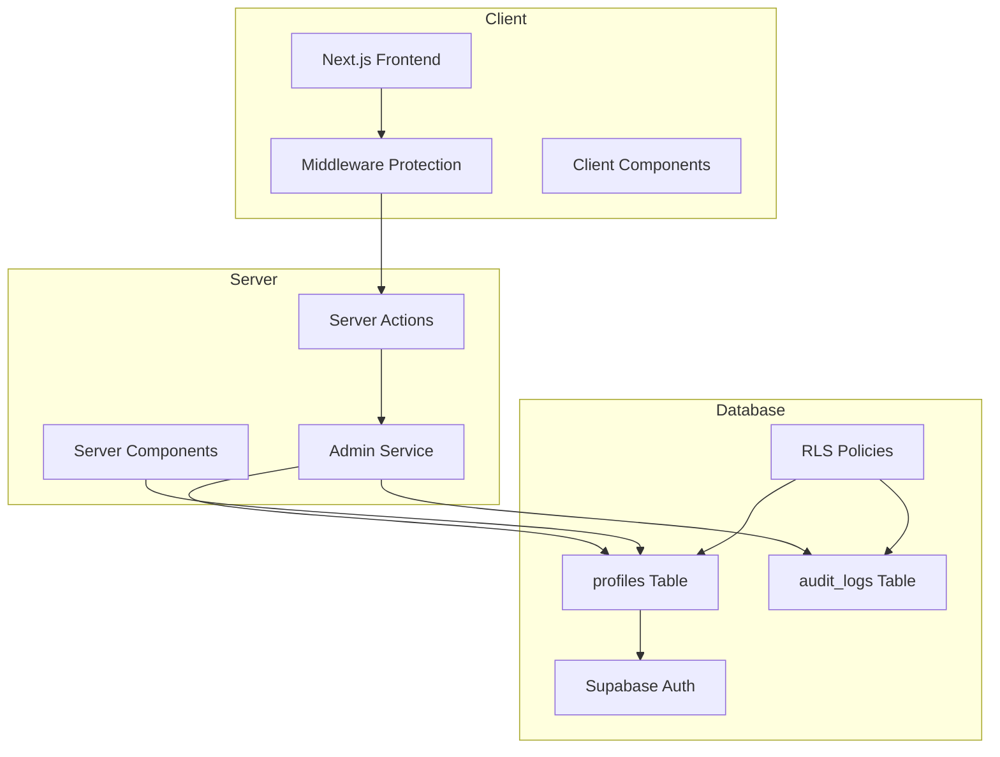

# Système d'Authentification Herbis Veritas

> **Documentation technique basée sur l'analyse du codebase réel** - Mise à jour Août 2025

## Table des Matières

1. [Vue d'Ensemble](#vue-densemble)
2. [Architecture Technique](#architecture-technique)
3. [Flux d'Authentification](#flux-dauthentification)
4. [Système RBAC](#système-rbac)
5. [Gestion des Sessions](#gestion-des-sessions)
6. [Sécurité Multi-Couches](#sécurité-multi-couches)
7. [Base de Données](#base-de-données)
8. [Composants d'Interface](#composants-dinterface)
9. [API et Intégrations](#api-et-intégrations)
10. [Audit et Monitoring](#audit-et-monitoring)
11. [Configuration et Déploiement](#configuration-et-déploiement)

---

## Vue d'Ensemble

### Architecture Générale

Le système d'authentification d'Herbis Veritas est basé sur **Supabase Auth** avec une architecture de sécurité multi-couches et un système de rôles basé sur la base de données.



### Composants Principaux

- **Source d'identité** : Supabase Auth avec JWT
- **Système de rôles** : Database-driven avec 3 rôles (`user`, `editor`, `admin`)
- **Protection des routes** : Middleware Next.js + layouts sécurisés
- **Audit complet** : Journalisation de toutes les opérations sensibles
- **Cache intelligent** : Optimisation des vérifications de rôles

---

## Architecture Technique

### Stack d'Authentification

```typescript
interface AuthStack {
  identityProvider: "Supabase Auth";
  tokenType: "JWT";
  sessionStorage: "HTTP-only cookies";
  roleManagement: "Database RBAC";
  routeProtection: "Next.js Middleware + Layout guards";
  auditLogging: "PostgreSQL audit_logs table";
  caching: "In-memory Map with basic TTL";
}
```

### Types Centralisés

**Fichier** : `src/lib/auth/types.ts`

```typescript
// Rôles utilisateur
export type UserRole = "user" | "editor" | "admin";

// Permissions granulaires (15 permissions actives)
export type AppPermission =
  | "admin:access"        // Accès dashboard admin
  | "admin:read"          // Lecture données admin
  | "admin:write"         // Écriture données admin
  | "products:read"       // Voir produits
  | "products:create"     // Créer produits
  | "products:update"     // Modifier produits
  | "products:delete"     // Supprimer produits
  | "orders:read:all"     // Voir toutes commandes
  | "orders:read:own"     // Voir ses commandes
  | "profile:read:own"    // Voir son profil
  | "profile:update:own"  // Modifier son profil
  | "content:read"        // Lire contenu
  | "content:create"      // Créer contenu
  | "users:manage"        // Gérer utilisateurs
  | "*";                  // Toutes permissions

// Mapping rôles → permissions
export const ROLE_PERMISSIONS: Record<UserRole, AppPermission[]> = {
  user: [
    "orders:read:own",
    "profile:read:own", 
    "profile:update:own",
    "content:read"
  ],
  
  editor: [
    "admin:access",
    "products:read",
    "products:create", 
    "products:update",
    "content:create",
    // ... + toutes permissions user
  ],
  
  admin: [
    "admin:read",
    "admin:write", 
    "products:delete",
    "orders:read:all",
    "users:manage",
    // ... + toutes permissions editor
  ]
};
```

---

## Flux d'Authentification

### 1. Inscription (Sign Up)

**Server Action** : `src/actions/authActions.ts`

```typescript
export async function signUpAction(
  prevState: AuthActionResult | undefined,
  formData: FormData
): Promise<FormActionResult<null>> {
  try {
    // 1. Validation Zod avec traductions
    const tPassword = await getTranslations({ locale, namespace: "PasswordPage.validation" });
    const finalSignUpSchema = createSignupSchema(tPassword, tAuth);
    
    const validatedFields = finalSignUpSchema.safeParse({
      email: formData.get("email"),
      password: formData.get("password"),
      confirmPassword: formData.get("confirmPassword"),
    });

    // 2. Création utilisateur Supabase 
    const { data, error } = await supabase.auth.signUp({
      email,
      password,
      options: {
        emailRedirectTo: `${origin}/${locale}/auth/callback?type=signup&next=/${locale}/shop`,
      },
    });

    // 3. Audit logging automatique
    if (data.user) {
      await supabase.from("audit_logs").insert({
        user_id: data.user.id,
        event_type: "USER_REGISTERED",
        data: {
          email: data.user.email,
          registration_method: "email_password",
        },
        severity: "INFO",
      });
    }

    return FormActionResult.ok(null, "Inscription réussie ! Veuillez vérifier votre email.");
  } catch (error) {
    return FormActionResult.error(ErrorUtils.formatForUser(error));
  }
}
```

### 2. Connexion (Login)

**Fonctionnalités avancées** :
- Migration automatique du panier invité vers utilisateur authentifié
- Audit des connexions avec IP et User-Agent
- Gestion d'erreurs spécialisée (email non confirmé, etc.)

```typescript
export async function loginAction(
  prevState: AuthActionResult | undefined,
  formData: FormData
): Promise<ActionResult<null>> {
  try {
    // 1. Capturer utilisateur invité actuel
    let guestUserId: string | undefined;
    const { data: { user: currentUser } } = await supabase.auth.getUser();
    if (currentUser && currentUser.is_anonymous) {
      guestUserId = currentUser.id;
    }

    // 2. Authentification
    const { error } = await supabase.auth.signInWithPassword({ email, password });
    
    if (error) {
      if (error.message === "Email not confirmed") {
        throw new AuthenticationError("Email non confirmé. Veuillez vérifier votre boîte de réception.");
      }
      throw new AuthenticationError("L'email ou le mot de passe est incorrect.");
    }

    // 3. Migration panier si utilisateur invité détecté
    if (guestUserId) {
      const migrationResult = await migrateAndGetCart([]);
      // Gestion des erreurs de migration sans bloquer la connexion
    }

    redirect("/fr/profile/account");
  } catch (error) {
    return ActionResult.error(ErrorUtils.formatForUser(error));
  }
}
```

### 3. Gestion des Mots de Passe

#### Réinitialisation Sécurisée

```typescript
export async function requestPasswordResetAction(
  prevState: AuthActionResult | undefined,
  formData: FormData
): Promise<ActionResult<null>> {
  try {
    const email = formData.get("email") as string;
    
    // Validation email
    const emailSchema = z.string().email();
    const validatedEmail = emailSchema.safeParse(email);

    // Appel Supabase (toujours succès pour éviter énumération)
    await supabase.auth.resetPasswordForEmail(validatedEmail.data, {
      redirectTo: `${origin}/${locale}/update-password`,
    });

    // Toujours message de succès (sécurité)
    return ActionResult.ok(null, "Email de réinitialisation envoyé");
  } catch (error) {
    return ActionResult.error("Une erreur inattendue est survenue");
  }
}
```

#### Mise à Jour Mot de Passe

```typescript
export async function updatePasswordAction(
  prevState: AuthActionResult | undefined,
  formData: FormData
): Promise<FormActionResult<null>> {
  try {
    // Validation avec confirmation
    const updatePasswordSchema = z
      .object({
        password: createPasswordSchema(tValidation),
        confirmPassword: z.string(),
      })
      .refine((data) => data.password === data.confirmPassword, {
        message: "Les mots de passe ne correspondent pas",
        path: ["confirmPassword"],
      });

    // Mise à jour
    const { error } = await supabase.auth.updateUser({
      password: validatedFields.data.password,
    });

    return FormActionResult.ok(null, "Mot de passe mis à jour avec succès");
  } catch (error) {
    return FormActionResult.error(ErrorUtils.formatForUser(error));
  }
}
```

---

## Système RBAC

### Architecture des Rôles

Le système utilise une approche **database-driven** avec permissions définies statiquement :

```typescript
// Hiérarchie des rôles (du plus restrictif au plus permissif)
user < editor < admin

// Vérification de permission centralisée
export function hasPermission(
  role: UserRole | null | undefined,
  permission: AppPermission,
  visitedRoles = new Set<UserRole>()
): boolean {
  if (!role || visitedRoles.has(role)) return false;
  
  const userPermissions = ROLE_PERMISSIONS[role];
  
  // 1. Permission directe
  if (userPermissions.includes(permission)) return true;
  
  // 2. Permission wildcard (products:* pour products:create)
  const permissionParts = permission.split(":");
  const wildcardPermission = `${permissionParts[0]}:*` as AppPermission;
  if (userPermissions.includes(wildcardPermission)) return true;
  
  return false;
}
```

### Service Admin avec Cache

**Fichier** : `src/lib/auth/admin-service.ts`

```typescript
// Cache en mémoire pour les rôles
const roleCache = new Map<string, CachedRoleData>();

export async function checkAdminRole(userId: string): Promise<AdminCheckResult> {
  try {
    // 1. Vérifier cache
    const cached = getCachedRoleData(userId);
    if (cached) {
      return {
        isAdmin: isAdminRole(cached.role),
        role: cached.role,
        permissions: cached.permissions,
        userId,
      };
    }

    // 2. Query base de données
    const { data: profile } = await supabase
      .from("profiles")
      .select("role")
      .eq("id", userId)
      .single();

    const role = profile.role as UserRole;
    const permissions = getPermissionsForRole(role);

    // 3. Mise en cache
    setCachedRoleData(userId, role, permissions);

    return {
      isAdmin: isAdminRole(role),
      role,
      permissions,
      userId,
    };
  } catch (error) {
    return {
      isAdmin: false,
      role: null,
      permissions: [],
      userId,
    };
  }
}
```

### Vérification de Permissions Server-Side

**Fichier** : `src/lib/auth/server-auth.ts`

```typescript
export const checkUserPermission = cache(async (permission: AppPermission): Promise<AuthResult> => {
  try {
    // 1. Vérifier authentification
    const { data: { user }, error: authError } = await supabase.auth.getUser();
    
    if (!user) {
      return { isAuthorized: false, error: "Not authenticated" };
    }

    // 2. Récupérer profil
    const { data: profile } = await supabase
      .from("profiles")
      .select("role")
      .eq("id", user.id)
      .maybeSingle();

    const userRole = profile.role as UserRole;

    // 3. Vérifier permission
    const isAuthorized = hasPermission(userRole, permission);

    if (!isAuthorized) {
      console.warn(`Permission '${permission}' denied for role '${userRole}' (User: ${user.id})`);
      return { isAuthorized: false, user, role: userRole, error: "Insufficient privileges" };
    }

    return { isAuthorized: true, user, role: userRole };
  } catch (error) {
    return { isAuthorized: false, error: "System error" };
  }
});
```

---

## Gestion des Sessions

### Sessions Authentifiées

Le système utilise les **sessions Supabase natives** avec gestion côté client via `ClientLayout` :

```typescript
// src/components/layout/client-layout.tsx
export default function ClientLayout({ children, locale, messages }: ClientLayoutProps) {
  const { clearCart } = useCartOperations();

  useEffect(() => {
    const { data: { subscription } } = supabase.auth.onAuthStateChange(
      async (event: AuthChangeEvent, session: Session | null) => {
        console.log(`Auth event [${event}]`, { sessionExists: !!session });

        switch (event) {
          case "SIGNED_OUT":
            clearCart(); // Vider panier à la déconnexion
            break;

          case "SIGNED_IN":
            // Fusion panier si nécessaire
            break;

          case "TOKEN_REFRESHED":
            if (!session) {
              clearCart(); // Session expirée
            }
            break;
        }
      }
    );

    return () => subscription?.unsubscribe();
  }, [clearCart]);

  return (
    <ThemeProvider>
      <NextIntlClientProvider locale={locale} messages={messages}>
        {children}
      </NextIntlClientProvider>
    </ThemeProvider>
  );
}
```

### Sessions Invitées

Le système utilise une approche **hybride** pour les utilisateurs non authentifiés :

- **Panier persistant** : Stockage via `guest_id` généré côté client
- **Fusion automatique** : Migration des données à la connexion
- **Pas de sessions Supabase anonymes** : Approche simplifiée avec localStorage

```typescript
// Migration du panier invité lors de la connexion
export async function migrateAndGetCart(items: CartItem[]): Promise<CartResult> {
  try {
    const supabase = await createSupabaseServerClient();
    const { data: { user } } = await supabase.auth.getUser();
    
    if (!user) {
      return { success: false, error: "User not authenticated" };
    }

    // Migration des items du panier invité vers utilisateur authentifié
    // Logique de fusion et nettoyage
    
    return { success: true, data: migratedCart };
  } catch (error) {
    return { success: false, error: "Migration failed" };
  }
}
```

---

## Sécurité Multi-Couches

### Couche 1: Protection Middleware

**Fichier** : `src/middleware.ts`

```typescript
export async function middleware(request: NextRequest) {
  // 1. Gestion i18n
  let response = handleI18n(request);

  // 2. Client Supabase avec timeout
  const supabaseCallWithTimeout = async (promise: Promise<any>, timeoutMs = 2000) => {
    const timeoutPromise = new Promise((_, reject) =>
      setTimeout(() => reject(new Error("Supabase_Timeout")), timeoutMs)
    );
    return Promise.race([promise, timeoutPromise]);
  };

  // 3. Récupération utilisateur avec gestion d'erreur
  let user = null;
  try {
    const { data, error } = await supabaseCallWithTimeout(supabase.auth.getUser());
    
    if (error && error.code === "user_not_found") {
      clearSupabaseCookies(request, response);
    } else {
      user = data.user;
    }
  } catch (e) {
    console.warn("Auth timeout in middleware, continuing without blocking");
  }

  // 4. Protection routes admin
  if (pathToCheck.startsWith("/admin")) {
    if (!user) {
      return NextResponse.redirect(`/${currentLocale}/login?redirectUrl=${encodeURIComponent(pathname)}`);
    }

    // Vérification admin via base de données
    const { checkAdminRole, logSecurityEvent } = await import("@/lib/auth/admin-service");
    const adminCheck = await checkAdminRole(user.id);

    if (!adminCheck.isAdmin) {
      // Audit tentative non autorisée
      await logSecurityEvent({
        type: "unauthorized_admin_access",
        userId: user.id,
        details: {
          message: `Tentative accès admin - Rôle: ${adminCheck.role}`,
          path: pathToCheck,
          timestamp: new Date().toISOString(),
        },
      });

      return NextResponse.redirect(`/${currentLocale}/unauthorized`);
    }
  }

  return response;
}
```

### Couche 2: Layouts Sécurisés

**Fichier** : `src/app/[locale]/admin/layout.tsx`

```typescript
export default async function AdminLayout({ children, params }: AdminLayoutProps) {
  const { locale } = await params;
  
  // Double vérification des permissions
  const { isAuthorized, error } = await checkUserPermission("admin:access");

  if (!isAuthorized) {
    return (
      <Alert variant="destructive">
        <AlertTitle>Accès Refusé</AlertTitle>
        <AlertDescription>
          {error || "Privilèges insuffisants"}
        </AlertDescription>
      </Alert>
    );
  }

  return (
    <div className="flex min-h-screen w-full bg-background">
      <AdminSidebar />
      <DashboardShell title="Dashboard Admin">
        <AdminStatus />
        {children}
      </DashboardShell>
    </div>
  );
}
```

### Couche 3: Row Level Security (RLS)

**Politiques PostgreSQL** :

```sql
-- Profils : utilisateurs voient leur profil, admins voient tout
CREATE POLICY "Admins can read all profiles" ON profiles FOR SELECT
USING (
  auth.uid() = id OR 
  (SELECT role FROM profiles WHERE id = auth.uid()) = 'admin'
);

-- Audit logs : admins uniquement
CREATE POLICY "Admins can read audit logs" ON audit_logs FOR SELECT
USING ((SELECT role FROM profiles WHERE id = auth.uid()) = 'admin');

-- Audit logs immutables (sécurité)
CREATE POLICY "Audit logs are immutable" ON audit_logs FOR UPDATE
USING (false);
```

---

## Base de Données

### Tables Principales

#### Table `profiles`

```sql
CREATE TABLE public.profiles (
    id UUID PRIMARY KEY NOT NULL,
    first_name TEXT CHECK (char_length(first_name) < 256),
    last_name TEXT CHECK (char_length(last_name) < 256),
    created_at TIMESTAMPTZ NOT NULL DEFAULT timezone('utc', now()),
    updated_at TIMESTAMPTZ NOT NULL DEFAULT timezone('utc', now()),
    phone_number TEXT,
    role app_role NOT NULL DEFAULT 'user',  -- enum('user', 'editor', 'admin', 'dev')
    newsletter_subscribed BOOLEAN DEFAULT false,
    use_shipping_for_billing BOOLEAN DEFAULT true,
    billing_address_is_different BOOLEAN DEFAULT false
);
```

#### Table `audit_logs`

```sql
CREATE TABLE public.audit_logs (
    id BIGINT GENERATED BY DEFAULT AS IDENTITY PRIMARY KEY,
    created_at TIMESTAMPTZ DEFAULT NOW() NOT NULL,
    event_type TEXT NOT NULL,
    user_id UUID REFERENCES auth.users(id) ON DELETE SET NULL,
    data JSONB -- Métadonnées flexibles
);
```

### Fonctions Helper SQL

```sql
-- Vérification admin simple
CREATE OR REPLACE FUNCTION is_admin(user_id UUID DEFAULT auth.uid())
RETURNS BOOLEAN AS $$
BEGIN
  RETURN (SELECT role FROM profiles WHERE id = user_id) = 'admin';
END;
$$ LANGUAGE plpgsql SECURITY DEFINER;

-- Trigger création profil automatique
CREATE OR REPLACE FUNCTION handle_new_user()
RETURNS trigger AS $$
BEGIN
  INSERT INTO profiles (id, role, first_name, last_name)
  VALUES (
    NEW.id,
    'user'::app_role,
    NEW.raw_user_meta_data->>'first_name',
    NEW.raw_user_meta_data->>'last_name'
  );

  -- Audit pour utilisateurs non anonymes
  IF NOT NEW.is_anonymous THEN
    INSERT INTO audit_logs (event_type, user_id)
    VALUES ('USER_REGISTERED', NEW.id);
  END IF;

  RETURN NEW;
END;
$$ LANGUAGE plpgsql SECURITY DEFINER;

CREATE TRIGGER on_auth_user_created
  AFTER INSERT ON auth.users
  FOR EACH ROW EXECUTE FUNCTION handle_new_user();
```

---

## Composants d'Interface

### Formulaires d'Authentification

#### Composant Register Form

**Fichier** : `src/components/domain/auth/register-form.tsx`

```typescript
export function RegisterForm() {
  const [state, formAction] = useFormState(signUpAction, null);
  const [password, setPassword] = useState("");

  return (
    <form action={formAction} className="space-y-4">
      <Input
        name="email"
        type="email" 
        placeholder={t("email")}
        required
      />
      
      <div>
        <Input
          name="password"
          type="password"
          placeholder={t("password")}
          value={password}
          onChange={(e) => setPassword(e.target.value)}
        />
        <PasswordStrengthIndicator 
          password={password}
          requirements={passwordRequirements}
        />
      </div>

      <Input
        name="confirmPassword"
        type="password"
        placeholder={t("confirmPassword")}
        required
      />

      <Button type="submit" disabled={state?.isLoading}>
        {state?.isLoading ? t("loading") : t("signUp")}
      </Button>

      {state?.error && (
        <Alert variant="destructive">
          <AlertDescription>{state.error}</AlertDescription>
        </Alert>
      )}
    </form>
  );
}
```

#### Indicateur Force Mot de Passe

**Fichier** : `src/components/domain/auth/password-strength.tsx`

```typescript
export const PasswordStrengthBar = ({ strength }: { strength: number }) => {
  const strengthColors = [
    "bg-destructive",    // 0 - Très faible
    "bg-orange-400",     // 1 - Faible  
    "bg-yellow-400",     // 2 - Moyen
    "bg-green-400",      // 3 - Fort
    "bg-green-500",      // 4 - Très fort
  ];
  
  const color = strengthColors[strength] || "bg-gray-200";

  return (
    <div className="mt-1">
      <div className="h-2 w-full rounded-full bg-gray-200">
        <div
          className={`h-2 rounded-full ${color} transition-all duration-300`}
          style={{ width: `${((strength + 1) / 5) * 100}%` }}
        />
      </div>
      <p className="mt-1 text-xs text-muted-foreground">
        Force : {strengthLevels[strength]}
      </p>
    </div>
  );
};
```

### Composant Protection Permissions

```typescript
// src/components/auth/Can.tsx
interface CanProps {
  permission: AppPermission;
  fallback?: ReactNode;
  children: ReactNode;
}

export function Can({ permission, fallback, children }: CanProps) {
  const { user, role } = useUser();
  const hasAccess = hasPermissionClient(role, permission);

  if (!hasAccess) {
    return fallback ? <>{fallback}</> : null;
  }

  return <>{children}</>;
}

// Usage
<Can permission="products:delete" fallback={<p>Accès refusé</p>}>
  <Button variant="destructive">Supprimer Produit</Button>
</Can>
```

---

## API et Intégrations

### Server Actions Authentication

Les Server Actions utilisent le **Result Pattern** pour une gestion d'erreurs type-safe :

```typescript
// Pattern standard pour toutes les actions auth
export async function authAction(
  prevState: any,
  formData: FormData
): Promise<ActionResult<T>> {
  const context = LogUtils.createUserActionContext('unknown', 'action_name', 'auth');
  
  try {
    // 1. Validation Zod
    const validated = schema.safeParse(rawData);
    if (!validated.success) {
      throw new ValidationError('Invalid input', undefined, {
        validationErrors: validated.error.flatten().fieldErrors
      });
    }

    // 2. Logique métier
    const result = await businessLogic(validated.data);

    // 3. Audit si nécessaire
    if (auditRequired) {
      await auditLog({
        type: "ACTION_COMPLETED",
        userId: user.id,
        data: { action: 'action_name', result }
      });
    }

    LogUtils.logOperationSuccess('action_name', context);
    return ActionResult.ok(result, "Success message");
    
  } catch (error) {
    LogUtils.logOperationError('action_name', error, context);
    
    if (error instanceof ValidationError && error.context?.validationErrors) {
      return FormActionResult.fieldValidationError(error.context.validationErrors);
    }
    
    return ActionResult.error(ErrorUtils.formatForUser(error));
  }
}
```

### API Routes Admin

**Fichier** : `src/app/api/admin/check-admins/route.ts`

```typescript
export async function GET(request: Request) {
  try {
    // Vérification admin
    const { isAuthorized } = await checkUserPermission("admin:read");
    if (!isAuthorized) {
      return NextResponse.json({ error: "Unauthorized" }, { status: 403 });
    }

    // Logique métier admin
    const adminData = await getAdminData();

    return NextResponse.json({
      success: true,
      data: adminData,
      timestamp: new Date().toISOString(),
    });
    
  } catch (error) {
    console.error("Admin API error:", error);
    return NextResponse.json(
      { error: "Internal server error" }, 
      { status: 500 }
    );
  }
}
```

---

## Audit et Monitoring

### Événements Loggés Automatiquement

```typescript
// Types d'événements dans audit_logs
type SecurityEventType =
  | "USER_REGISTERED"              // Nouvelle inscription
  | "USER_LOGIN"                   // Connexion réussie  
  | "USER_LOGOUT"                  // Déconnexion
  | "PASSWORD_RESET_REQUESTED"     // Demande reset MDP
  | "PASSWORD_RESET_COMPLETED"     // Reset confirmé
  | "UNAUTHORIZED_ADMIN_ACCESS"    // Tentative accès admin
  | "PERMISSION_DENIED"            // Permission refusée
  | "ROLE_CHANGE"                  // Modification rôle
  | "ADMIN_ACTION"                 // Action administrative
  | "SECURITY_SCAN";               // Scan sécurité

// Structure des logs
interface AuditLogEntry {
  id: number;
  created_at: string;
  event_type: SecurityEventType;
  user_id: string | null;
  data: {
    message: string;
    email?: string;
    path?: string;
    ip?: string;
    userAgent?: string;
    targetUserId?: string;
    oldRole?: string;
    newRole?: string;
    [key: string]: any;
  };
}
```

### Service de Logging

```typescript
// src/lib/auth/admin-service.ts
export async function logSecurityEvent(event: SecurityEvent): Promise<void> {
  try {
    const supabase = await createSupabaseServerClient();

    const { error } = await supabase.from("audit_logs").insert({
      user_id: event.userId,
      event_type: event.type,
      data: event.details,
      created_at: new Date().toISOString(),
    });

    if (error) {
      console.error("Failed to log security event:", error);
      // Fallback logging en console
      console.warn("Security Event (fallback):", JSON.stringify(event, null, 2));
    }
  } catch (error) {
    console.error("Unexpected error logging security event:", error);
    console.warn("Security Event (fallback):", JSON.stringify(event, null, 2));
  }
}
```

### Composant Admin Status

```typescript
// src/components/admin/AdminStatus.tsx
export function AdminStatus() {
  const [status, setStatus] = useState<'checking' | 'secure' | 'warning' | 'error'>('checking');
  const [recentEvents, setRecentEvents] = useState<AuditLogEntry[]>([]);

  const checkSecurityStatus = async () => {
    setStatus('checking');
    try {
      const response = await fetch('/api/admin/security-status');
      const { status: securityStatus, events } = await response.json();
      
      setStatus(securityStatus);
      setRecentEvents(events);
    } catch (error) {
      console.error('Security status check failed:', error);
      setStatus('error');
    }
  };

  const statusConfig = {
    checking: { color: 'bg-yellow-500', text: 'Vérification...' },
    secure: { color: 'bg-green-500', text: 'Système sécurisé' },
    warning: { color: 'bg-orange-500', text: 'Alertes détectées' },
    error: { color: 'bg-red-500', text: 'Erreur système' }
  };

  return (
    <Card>
      <CardHeader>
        <div className="flex items-center justify-between">
          <CardTitle>Statut Sécurité</CardTitle>
          <Button onClick={checkSecurityStatus} variant="outline" size="sm">
            Actualiser
          </Button>
        </div>
      </CardHeader>
      <CardContent>
        <div className="flex items-center gap-2">
          <div className={`h-3 w-3 rounded-full ${statusConfig[status].color}`} />
          <span>{statusConfig[status].text}</span>
        </div>

        {recentEvents.length > 0 && (
          <div className="mt-4">
            <h4 className="font-medium mb-2">Événements récents</h4>
            <div className="space-y-2">
              {recentEvents.slice(0, 5).map(event => (
                <div key={event.id} className="text-sm p-2 bg-muted rounded">
                  <div className="font-medium">{event.event_type}</div>
                  <div className="text-muted-foreground">
                    {format(new Date(event.created_at), "PPpp", { locale: fr })}
                  </div>
                  {event.data.message && (
                    <div className="text-xs mt-1">{event.data.message}</div>
                  )}
                </div>
              ))}
            </div>
          </div>
        )}
      </CardContent>
    </Card>
  );
}
```

---

## Configuration et Déploiement

### Variables d'Environnement

```bash
# .env.local - Configuration authentification
# Supabase
NEXT_PUBLIC_SUPABASE_URL=https://votre-projet.supabase.co
NEXT_PUBLIC_SUPABASE_ANON_KEY=votre-cle-anon-publique
SUPABASE_SERVICE_ROLE_KEY=votre-cle-service-role-privee

# Base URL pour redirections auth
NEXT_PUBLIC_BASE_URL=https://votre-domaine.com

# Admin principal (fallback d'urgence)
ADMIN_PRINCIPAL_ID=uuid-admin-principal
ADMIN_EMAIL=admin@votre-domaine.com

# Sécurité
AUTH_SECRET=secret-jwt-super-securise-production
NEXTAUTH_URL=https://votre-domaine.com
```

### Migrations Critiques

```bash
# 1. Schéma profils avec rôles
supabase migration up 20250623170000_initial_profiles_schema

# 2. Système RBAC 
supabase migration up 20250119120000_add_role_based_admin_system

# 3. Table audit logs
supabase migration up 20250704101800_create_audit_logs_table

# 4. Politiques RLS
supabase migration up 20250704135800_add_insert_policy_for_audit_logs
```

### Configuration Next.js Sécurisée

```typescript
// next.config.mjs
const nextConfig = {
  async headers() {
    return [
      {
        source: "/(.*)",
        headers: [
          { key: "X-Frame-Options", value: "DENY" },
          { key: "X-Content-Type-Options", value: "nosniff" },
          { key: "Referrer-Policy", value: "origin-when-cross-origin" },
          {
            key: "Content-Security-Policy",
            value: "default-src 'self'; script-src 'self' 'unsafe-eval'; style-src 'self' 'unsafe-inline'",
          },
        ],
      },
    ];
  },

  experimental: {
    serverActions: true,
    serverComponentsExternalPackages: ["@supabase/supabase-js"],
  },
};
```

### Tests et Validation

#### Scripts de Diagnostic

```bash
# Tests unitaires auth
npm test src/lib/auth/__tests__/

# Tests composants auth  
npm test src/components/domain/auth/__tests__/

# Tests d'intégration
npm test src/__tests__/integration/auth.test.ts

# Validation des migrations
supabase db diff --schema public

# Audit des rôles admin (si implémenté)
npm run audit-roles
```

#### Validation Manuelle Sécurité

1. **Vérifier configuration Supabase** : Variables d'environnement et RLS activé
2. **Tester protection routes** : Accès `/admin` sans permissions
3. **Valider audit logs** : Événements correctement enregistrés
4. **Contrôler cache rôles** : Performance et invalidation
5. **Vérifier gestion erreurs** : Messages utilisateur appropriés

---

## Procédures d'Urgence

### Compromission de Session

```sql
-- 1. IMMÉDIAT: Forcer déconnexion globale
SELECT auth.sign_out_all_users();

-- 2. ANALYSER: Consulter audit logs
SELECT * FROM audit_logs 
WHERE created_at > NOW() - INTERVAL '1 hour'
AND event_type IN ('UNAUTHORIZED_ADMIN_ACCESS', 'PERMISSION_DENIED')
ORDER BY created_at DESC;
```

### Perte d'Accès Admin

```sql
-- 1. FALLBACK: Promouvoir utilisateur de confiance via SQL
UPDATE profiles 
SET role = 'admin'
WHERE id = 'uuid-utilisateur-confiance';

-- 2. VÉRIFIER: Confirmer changement
SELECT id, role, created_at 
FROM profiles 
WHERE role = 'admin';
```

### Debug Cache Rôles

```typescript
// 3. INVALIDATION: Vider cache en cas de problème
import { invalidateAllCache } from '@/lib/auth/admin-service';

// En mode développement uniquement
if (process.env.NODE_ENV === 'development') {
  invalidateAllCache();
  console.log('Role cache cleared');
}
```

---

## Évolutions Futures

### Prochaines Améliorations

1. **Multi-Factor Authentication (MFA)**
   - TOTP avec applications authenticator
   - SMS de secours pour comptes critiques
   - Recovery codes uniques

2. **Social Login**
   - Google, GitHub, LinkedIn OAuth
   - Fusion automatique de comptes
   - Mapping rôles depuis providers

3. **Sessions Avancées**
   - Gestion multi-device 
   - Session timeout intelligent
   - Géolocalisation des connexions

4. **Audit Avancé**
   - Export compliance GDPR
   - Retention policies automatiques
   - Alertes temps réel par webhook

### Améliorations Techniques

1. **Performance**
   - Cache Redis distribué
   - Lazy loading des permissions
   - Optimisation requêtes RLS

2. **Sécurité**
   - Rate limiting granulaire
   - Détection d'anomalies
   - Honeypot pour tentatives d'intrusion

3. **Developer Experience**
   - CLI outils admin
   - Tests E2E automatisés
   - Documentation interactive Storybook

---

## Commandes de Référence

### Développement

```bash
# Démarrage
npm run dev

# Tests auth uniquement
npm test -- --testPathPattern=auth

# Base de données locale
supabase start
supabase db reset

# Génération types
npm run db:types
```

### Production

```bash
# Build optimisé
npm run build && npm start

# Logs auth en temps réel
npm run logs:auth

# Déploiement
git push origin main  # Auto-deploy via GitHub Actions
```

### Debug

```bash
# Logs PostgreSQL
supabase logs --db-level=info

# Debug permissions utilisateur
npm run debug:permissions

# Health check admin service
npm run admin:health-check
```

---

<div align="center">

**🔐 Système d'Authentification Herbis Veritas**  
*Sécurisé • Scalable • Production-Ready*

**Dernière analyse du codebase** : 4 Août 2025  
**Documentation version** : 1.0  
**Statut** : ✅ En production active

[📚 Documentation](../README.md) • [🏗️ Architecture](../architecture/overview.md) • [🛡️ Sécurité](../architecture/security.md)

</div>