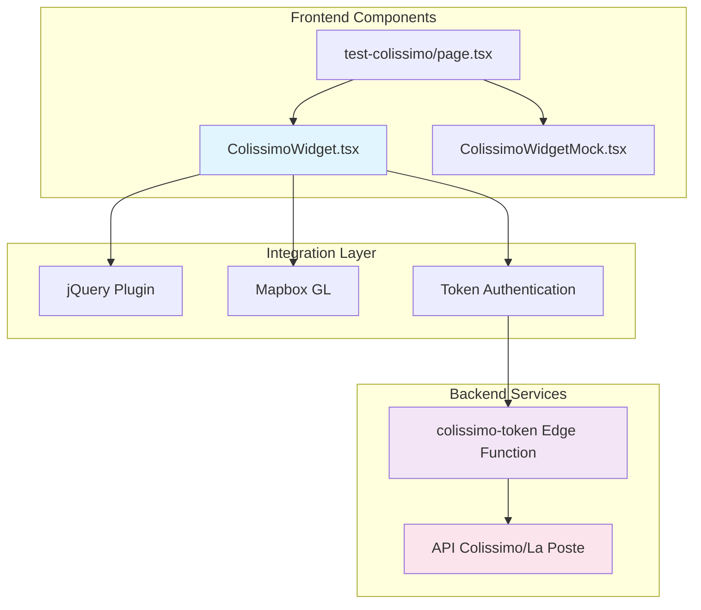
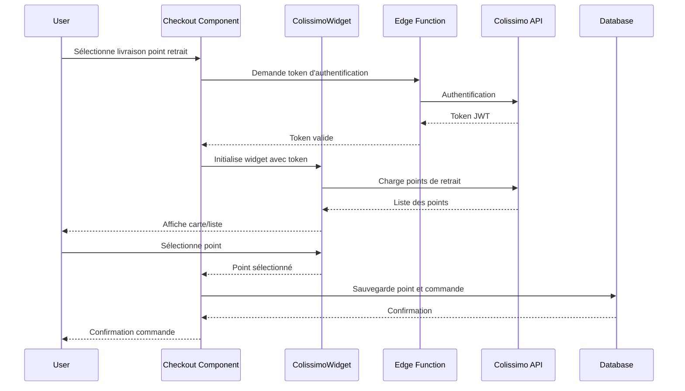

# Intégration Colissimo - Points de Retrait

> **Documentation technique mise à jour** - Basée sur l'analyse du codebase réel et de l'état d'implémentation actuel.

---

## Vue d'ensemble

L'intégration Colissimo permet aux clients de sélectionner un point de retrait pour leurs commandes via le Widget Point Retrait V2 de Colissimo. L'implémentation comprend :

- Widget de sélection de points de retrait (production et simulation)
- Edge Function pour l'authentification avec l'API Colissimo
- Système de tests complet (68 tests)
- Page de test dédiée pour validation

## Architecture

### Composants Implémentés

```
src/components/domain/colissimo/
├── ColissimoWidget.tsx          # Widget production intégrant l'API réelle
├── ColissimoWidgetMock.tsx      # Widget simulation pour développement
└── __tests__/                   # Suite de tests complète
    ├── ColissimoWidget.test.tsx
    ├── ColissimoWidgetMock.test.tsx
    ├── types.test.ts
    └── utils.test.ts
```

### Edge Function

```
supabase/functions/colissimo-token/
└── index.ts                     # Authentification JWT avec API Colissimo
```

### Interface de Test

```
src/app/[locale]/test-colissimo/
└── page.tsx                     # Page de test complète
```

### Diagramme d'Architecture



## Configuration

### Dépendances Package.json

```json
{
  "dependencies": {
    "jquery": "^3.7.1",
    "mapbox-gl": "^2.15.0"
  },
  "devDependencies": {
    "@types/jquery": "^3.5.32"
  }
}
```

### Variables d'Environnement Edge Function

```bash
# Configuration multiple supportée par l'Edge Function
# Option 1: La Poste Developer (Okapi)
COLISSIMO_API_SECRET=your_laposte_developer_key
LAPOSTE_API_BASE_URL=https://api.laposte.fr

# Option 2: Colissimo Entreprise
COLISSIMO_API_KEY=your_colissimo_api_key
COLISSIMO_LOGIN=your_login
COLISSIMO_PASSWORD=your_password
COLISSIMO_BASE_URL=https://ws.colissimo.fr

# Configuration générale
COLISSIMO_PARTNER_CLIENT_CODE=your_partner_code
COLISSIMO_TEST_MODE=true
COLISSIMO_SANDBOX_MODE=true
```

## Types TypeScript

### Interface PointRetrait

```typescript
export interface PointRetrait {
  id: string;
  name: string;
  address: string;
  zipCode: string;
  city: string;
  latitude: number;
  longitude: number;
  distance: number; // en mètres
  typeDePoint?: string; // 'POST' | 'PICKUP' | 'LOCKER' | 'RELAY'
  horairesOuverture?: string;
}
```

### Props des Composants

```typescript
interface ColissimoWidgetProps {
  token: string;
  defaultAddress?: {
    address?: string;
    zipCode?: string;
    city?: string;
  };
  onSelect: (point: PointRetrait) => void;
  onError?: (error: string) => void;
  className?: string;
}
```

## Utilisation des Composants

### ColissimoWidget (Production)

```tsx
import ColissimoWidget from "@/components/domain/colissimo/ColissimoWidget";

function CheckoutPage() {
  const [token, setToken] = useState<string>("");

  const handlePointSelection = (point: PointRetrait) => {
    console.log("Point sélectionné:", point);
    // Traitement de la sélection
  };

  const handleError = (error: string) => {
    console.error("Erreur widget Colissimo:", error);
  };

  // Génération du token via Edge Function
  useEffect(() => {
    async function generateToken() {
      try {
        const { data } = await supabase.functions.invoke('colissimo-token');
        setToken(data.token);
      } catch (error) {
        console.error("Erreur génération token:", error);
      }
    }
    generateToken();
  }, []);

  return (
    <ColissimoWidget
      token={token}
      onSelect={handlePointSelection}
      onError={handleError}
      defaultAddress={{
        address: "123 Rue Example",
        zipCode: "75001",
        city: "Paris",
      }}
      className="my-4"
    />
  );
}
```

### ColissimoWidgetMock (Développement)

```tsx
import ColissimoWidgetMock from "@/components/domain/colissimo/ColissimoWidgetMock";

function TestPage() {
  const mockPoints = [
    {
      id: "POST_75008_001",
      name: "La Poste Champs-Élysées",
      address: "52 Avenue des Champs-Élysées",
      zipCode: "75008",
      city: "Paris",
      latitude: 48.870424,
      longitude: 2.307118,
      distance: 150,
      typeDePoint: "POST",
      horairesOuverture: "Lun-Ven 9h-19h, Sam 9h-17h",
    }
    // ... autres points
  ];

  return (
    <ColissimoWidgetMock
      token="test_token"
      onSelect={handlePointSelection}
      onError={handleError}
      className="rounded-lg border"
    />
  );
}
```

## Edge Function - Génération de Token

### Authentification Multiple

L'Edge Function supporte plusieurs méthodes d'authentification :

```typescript
// Méthode 1: La Poste Developer (Okapi)
const authWithOkapi = {
  headers: {
    "X-Okapi-Key": apiSecret,
    "Authorization": `Bearer ${apiSecret}`
  },
  endpoint: "/pointsderetrait/v1/auth"
};

// Méthode 2: Colissimo Entreprise
const authWithColissimo = {
  body: {
    login: login,
    password: password,
    apikey: apiKey
  },
  endpoint: "/widget-colissimo/rest/authenticate.rest"
};
```

### Appel depuis le Frontend

```typescript
async function getColissimoToken(): Promise<string> {
  const { data, error } = await supabase.functions.invoke('colissimo-token', {
    body: {}
  });

  if (error) {
    throw new Error(error.message);
  }

  return data.token;
}
```

## État de l'Intégration Base de Données

### Tables Manquantes

**Note importante** : La documentation originale mentionne des tables `pickup_points` qui ne sont **pas présentes** dans la base de données actuelle.

**Tables existantes** :
- `shipping_methods` - Méthodes de livraison génériques
- `orders.shipping_method_id` - Référence aux méthodes de livraison

**Tables documentées mais absentes** :
- `pickup_points` - Points de retrait spécifiques
- `orders.pickup_point_id` - Référence aux points de retrait

### Recommandations pour l'Implémentation

Si l'intégration complète est nécessaire, créer la migration :

```sql
-- Table des points de retrait Colissimo
CREATE TABLE pickup_points (
    id UUID PRIMARY KEY DEFAULT gen_random_uuid(),
    colissimo_id TEXT NOT NULL UNIQUE,
    name TEXT NOT NULL,
    address TEXT NOT NULL,
    zip_code TEXT NOT NULL,
    city TEXT NOT NULL,
    latitude DOUBLE PRECISION NOT NULL,
    longitude DOUBLE PRECISION NOT NULL,
    distance INTEGER, -- en mètres
    type_de_point TEXT,
    horaires_ouverture TEXT,
    created_at TIMESTAMP WITH TIME ZONE DEFAULT NOW(),
    updated_at TIMESTAMP WITH TIME ZONE DEFAULT NOW()
);

-- Extension table orders
ALTER TABLE orders
ADD COLUMN pickup_point_id UUID REFERENCES pickup_points(id);

-- RLS Policy
CREATE POLICY "Users can view own pickup points" ON pickup_points
FOR SELECT USING (
    EXISTS (
        SELECT 1 FROM orders
        WHERE orders.pickup_point_id = pickup_points.id
        AND orders.user_id = auth.uid()
    )
);
```

## Tests

### Structure Actuelle

```
src/components/domain/colissimo/__tests__/
├── ColissimoWidget.test.tsx        # Tests widget production (mockés)
├── ColissimoWidgetMock.test.tsx    # Tests widget simulation
├── types.test.ts                   # Tests interfaces TypeScript
└── utils.test.ts                   # Tests utilitaires métier
```

### Exécution des Tests

```bash
# Tous les tests Colissimo
npm test -- --testPathPattern=colissimo

# Tests spécifiques
npm test -- --testPathPattern=ColissimoWidget.test.tsx
```

### Approche de Test

Les tests utilisent un système de mock pour éviter les appels API réels :

```typescript
// Mock complet du composant pour les tests
jest.mock("../ColissimoWidget", () => {
  return function ColissimoWidgetMock({ token, onSelect }) {
    // Simulation du comportement sans appels externes
    return <section>Widget Colissimo prêt</section>;
  };
});
```

## Page de Test

Accessible à `/test-colissimo`, la page permet de :

- Tester la génération de tokens (actuellement en mode simulation)
- Comparer le widget réel vs simulé
- Vérifier les callbacks de sélection
- Déboguer l'intégration

### Fonctionnalités de Test

```typescript
// Mode simulation pour éviter les appels API en développement
const testToken = "test_token_for_ui_testing";

// Code original pour l'Edge Function (commenté)
// const { data } = await supabase.functions.invoke('colissimo-token');
```

## Statut d'Implémentation

### Composants Opérationnels

- ✅ **ColissimoWidget.tsx** - Widget production avec intégration jQuery
- ✅ **ColissimoWidgetMock.tsx** - Widget simulation pour développement
- ✅ **Edge Function** - Authentification multi-provider
- ✅ **Tests** - Suite complète avec mocks
- ✅ **Page de test** - Interface de validation

### Composants Partiels

- 🔄 **Base de données** - Tables pickup_points non créées
- 🔄 **Intégration commandes** - Lien avec le processus de checkout
- 🔄 **Authentification réelle** - Credentials API à configurer

### Composants Non Implémentés

- ❌ **Sauvegarde des points** - Actions pour persister les sélections
- ❌ **Intégration checkout** - Workflow complet de commande
- ❌ **Gestion des erreurs utilisateur** - Interface utilisateur pour les erreurs

## Intégration dans le Checkout

### Architecture Recommandée



### Workflow d'Intégration

1. **Génération de token** via Edge Function
2. **Initialisation widget** avec token valide
3. **Sélection utilisateur** d'un point de retrait
4. **Sauvegarde en base** via Server Action
5. **Association à la commande** lors du checkout

## Dépannage

### Problèmes Courants

#### 1. Widget ne se charge pas

```javascript
// Vérifier que jQuery est disponible globalement
console.log(window.$); // Doit afficher la fonction jQuery
console.log(typeof $.fn.frameColissimoOpen); // Doit être 'function'
```

#### 2. Erreur de token

```bash
# Vérifier les variables d'environnement Edge Function
# Dans Supabase Dashboard > Edge Functions > Settings
COLISSIMO_API_SECRET=your_key
COLISSIMO_TEST_MODE=true
```

#### 3. Problèmes de script loading

```javascript
// Observer les erreurs réseau dans DevTools
// Vérifier la CSP (Content Security Policy)
// S'assurer que les domaines Colissimo sont autorisés
```

### Logs de Débogage

```javascript
// Activer les logs détaillés
localStorage.setItem("colissimo_debug", "true");

// Observer les événements personnalisés
window.addEventListener("colissimo:pointSelected", (event) => {
  console.log("Point sélectionné:", event.detail);
});
```

## Sécurité

### Bonnes Pratiques Implémentées

1. **Tokens JWT** - Expiration courte (30 minutes)
2. **Variables d'environnement** - Secrets stockés côté serveur uniquement
3. **CORS** - Headers configurés dans Edge Function
4. **Validation** - Types TypeScript stricts

### Audit de Sécurité

```bash
# Vérifier qu'aucun secret n'est exposé côté client
grep -r "COLISSIMO_API" --exclude-dir=node_modules src/

# Vérifier la configuration CORS
curl -X OPTIONS https://your-project.supabase.co/functions/v1/colissimo-token
```

## Performance

### Optimisations Implémentées

1. **Lazy loading** - Widget chargé uniquement si nécessaire
2. **Cache tokens** - Réutilisation des tokens valides (30 min)
3. **Cleanup** - Nettoyage automatique des callbacks globaux
4. **Bundle optimization** - jQuery et Mapbox chargés à la demande

### Monitoring

```javascript
// Mesurer les performances de chargement
performance.mark("colissimo-start");
// ... initialisation widget ...
performance.mark("colissimo-end");
performance.measure("colissimo-load", "colissimo-start", "colissimo-end");
```

## Roadmap

### Prochaines Étapes

1. **Création des tables** `pickup_points` via migration
2. **Server Actions** pour la sauvegarde des points sélectionnés
3. **Intégration checkout** complète avec workflow de commande
4. **Configuration credentials** API production

### Améliorations Futures

- Gestion des points favoris utilisateur
- Cache des points de retrait par zone géographique
- Intégration avec le système de tracking de colis
- Support multi-langues pour les informations de points

---

<div align="center">

**🚀 Intégration Colissimo - Points de Retrait**  
*Widget Production • Edge Function • Tests Complets*

**Statut** : 🔄 En cours d'implémentation  
**Dernière mise à jour** : 4 Août 2025

[🏠 Documentation](../README.md) • [🛒 E-commerce](./e-commerce.md) • [💳 Stripe](./stripe-integration.md)

</div>