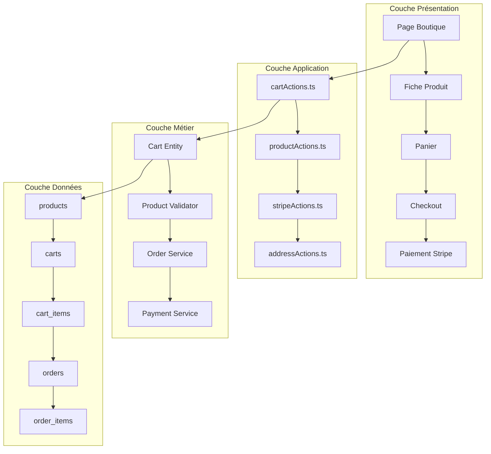
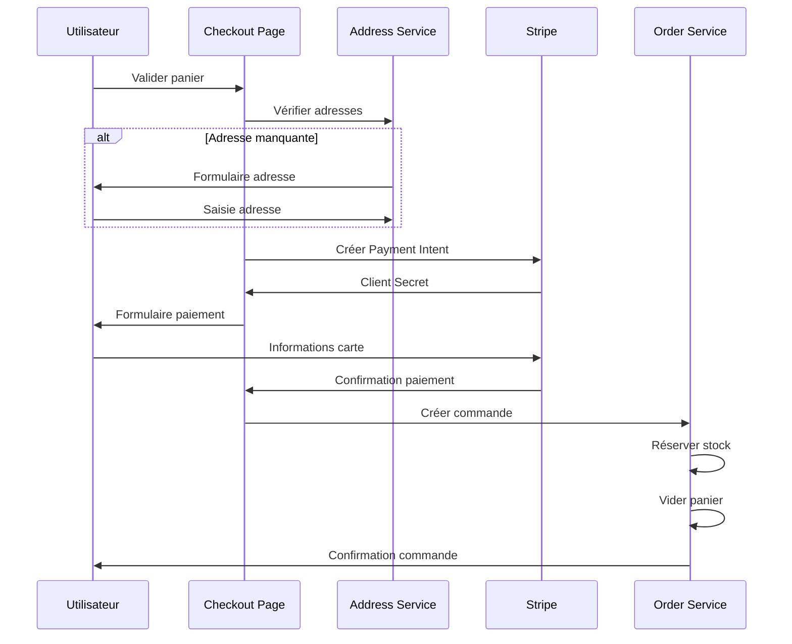

# Système E-commerce

Documentation complète du système e-commerce d'In Herbis Veritas, basée sur l'analyse du code et de la base de données actuels.

## Vue d'Ensemble

### Architecture E-commerce



### Features Implémentées

- ✅ **Catalogue produits** multilingue avec catégories
- ✅ **Panier persistant** pour utilisateurs authentifiés et invités
- ✅ **Gestion du stock** en temps réel
- ✅ **Checkout complet** avec adresses de livraison/facturation
- ✅ **Paiements Stripe** sécurisés
- ✅ **Gestion des commandes** avec statuts
- ✅ **Méthodes de livraison** configurables
- ✅ **Système de promotion** (is_on_promotion)

## Catalogue Produits

### Structure Produit

#### Modèle de Données

```typescript
interface Product {
  id: string; // UUID
  name: string; // Nom principal
  slug: string; // URL-friendly identifier
  description: string; // Description courte
  price: number; // Prix en euros
  stock_quantity: number; // Stock disponible
  category: string; // Catégorie principale
  is_active: boolean; // Visibilité publique
  image_url?: string; // Image principale
  labels: string[]; // Tags pour filtrage
  unit: string; // Unité de vente (pièce, ml, g)
  is_new?: boolean; // Badge "Nouveau"
  is_on_promotion?: boolean; // Badge "Promo"
  inci_list?: string[]; // Liste INCI (cosmétiques)
  status: string; // draft | active | archived
  stripe_product_id?: string; // Liaison Stripe
}
```

#### Traductions Multilingues

```sql
-- Support pour fr, en, de, es
SELECT pt.name, pt.description_long, pt.usage_instructions
FROM product_translations pt
WHERE pt.product_id = $1 AND pt.language_code = $2;
```

### Actions Produits

#### Server Actions (`src/actions/productActions.ts`)

```typescript
// Récupération produits avec filtres
export async function getProductsAction(filters?: ProductFilters): Promise<ActionResult<Product[]>>;

// Détail produit avec traductions
export async function getProductBySlugAction(
  slug: string,
  locale: string
): Promise<ActionResult<ProductDetail>>;

// Recherche produits
export async function searchProductsAction(query: string): Promise<ActionResult<Product[]>>;

// Gestion admin
export async function createProductAction(data: CreateProductInput): Promise<ActionResult<Product>>;
export async function updateProductAction(
  id: string,
  data: UpdateProductInput
): Promise<ActionResult<Product>>;
export async function deleteProductAction(id: string): Promise<ActionResult<void>>;
```

#### Validation Zod

```typescript
const CreateProductSchema = z.object({
  name: z.string().min(1).max(255),
  slug: z.string().regex(/^[a-z0-9-]+$/),
  price: z.number().positive(),
  stock_quantity: z.number().int().min(0),
  category: z.string().min(1),
  is_active: z.boolean().default(true),
  labels: z.array(z.string()).default([]),
  unit: z.string().default("pièce"),
});
```

### Gestion Stock

#### Vérification Disponibilité

```typescript
// Avant ajout au panier
const isStockAvailable = async (productId: string, requestedQuantity: number): Promise<boolean> => {
  const { data: product } = await supabase
    .from("products")
    .select("stock_quantity")
    .eq("id", productId)
    .eq("is_active", true)
    .single();

  return product && product.stock_quantity >= requestedQuantity;
};
```

#### Réservation Stock

```sql
-- Fonction PostgreSQL pour réservation atomique
CREATE OR REPLACE FUNCTION reserve_stock(
  p_product_id UUID,
  p_quantity INTEGER
) RETURNS BOOLEAN AS $$
BEGIN
  UPDATE products
  SET stock_quantity = stock_quantity - p_quantity
  WHERE id = p_product_id
    AND stock_quantity >= p_quantity
    AND is_active = true;

  RETURN FOUND;
END;
$$ LANGUAGE plpgsql;
```

## Système de Panier

### Architecture Hybride

Le système supporte les utilisateurs authentifiés et invités avec synchronisation temps réel.

#### Store Zustand (`src/stores/cart.store.ts`)

```typescript
interface CartState {
  items: CartItem[];
  loading: {
    add: boolean;
    remove: boolean;
    update: boolean;
    sync: boolean;
  };
  errors: {
    add?: string;
    remove?: string;
    update?: string;
    sync?: string;
  };
  lastSyncAt: number | null;

  // Actions
  addItem: (productId: string, quantity: number) => Promise<void>;
  removeItem: (cartItemId: string) => Promise<void>;
  updateQuantity: (cartItemId: string, quantity: number) => Promise<void>;
  clearCart: () => Promise<void>;
  syncWithServer: () => Promise<void>;
}
```

#### Optimistic Updates

```typescript
// Pattern d'optimistic updates avec rollback
const addItem = async (productId: string, quantity: number) => {
  // 1. Update optimiste du store
  const optimisticItem = { productId, quantity, id: "temp-" + Date.now() };
  setItems((prev) => [...prev, optimisticItem]);

  try {
    // 2. Appel serveur
    const result = await addItemToCartAction(productId, quantity);

    if (result.success) {
      // 3. Mise à jour avec données serveur
      setItems(result.data.items);
    } else {
      throw new Error(result.message);
    }
  } catch (error) {
    // 4. Rollback en cas d'erreur
    setItems((prev) => prev.filter((item) => item.id !== optimisticItem.id));
    setError("add", error.message);
  }
};
```

### Gestion Utilisateurs Invités

#### Identification Guest

```typescript
// Génération d'un guest_id unique
const generateGuestId = (): string => {
  return "guest_" + crypto.randomUUID();
};

// Stockage dans cookie sécurisé
const setGuestCart = (guestId: string) => {
  document.cookie = `herbis-cart-id=${guestId}; path=/; secure; samesite=strict; max-age=${30 * 24 * 60 * 60}`;
};
```

#### Fusion à la Connexion

```sql
-- Fonction de fusion des paniers
CREATE OR REPLACE FUNCTION merge_guest_cart(
  p_guest_id TEXT,
  p_user_id UUID
) RETURNS UUID AS $$
DECLARE
  v_guest_cart_id UUID;
  v_user_cart_id UUID;
  v_guest_item RECORD;
BEGIN
  -- Récupérer le panier invité
  SELECT id INTO v_guest_cart_id
  FROM carts
  WHERE user_id = p_guest_id AND status = 'active';

  -- Récupérer ou créer le panier utilisateur
  SELECT id INTO v_user_cart_id
  FROM carts
  WHERE user_id = p_user_id::text AND status = 'active';

  IF v_user_cart_id IS NULL THEN
    INSERT INTO carts (user_id, status)
    VALUES (p_user_id::text, 'active')
    RETURNING id INTO v_user_cart_id;
  END IF;

  -- Fusionner les articles
  FOR v_guest_item IN
    SELECT product_id, quantity
    FROM cart_items
    WHERE cart_id = v_guest_cart_id
  LOOP
    INSERT INTO cart_items (cart_id, product_id, quantity)
    VALUES (v_user_cart_id, v_guest_item.product_id, v_guest_item.quantity)
    ON CONFLICT (cart_id, product_id)
    DO UPDATE SET quantity = cart_items.quantity + v_guest_item.quantity;
  END LOOP;

  -- Supprimer le panier invité
  DELETE FROM carts WHERE id = v_guest_cart_id;

  RETURN v_user_cart_id;
END;
$$ LANGUAGE plpgsql SECURITY DEFINER;
```

## Checkout et Commandes

### Processus de Checkout



### Gestion des Adresses

#### Types d'Adresses

```typescript
type AddressType = "shipping" | "billing";

interface Address {
  id: string;
  user_id: string;
  address_type: AddressType;
  is_default: boolean;
  first_name: string;
  last_name: string;
  company_name?: string;
  street_number?: string;
  address_line1: string;
  address_line2?: string;
  postal_code: string;
  city: string;
  state_province_region?: string;
  country_code: string;
  phone_number?: string;
}
```

#### Validation Adresse

```typescript
const AddressSchema = z.object({
  first_name: z.string().min(1).max(50),
  last_name: z.string().min(1).max(50),
  address_line1: z.string().min(5).max(100),
  postal_code: z.string().regex(/^\d{5}$/), // Code postal français
  city: z.string().min(1).max(50),
  country_code: z.string().length(2).default("FR"),
  phone_number: z
    .string()
    .regex(/^(?:\+33|0)[1-9](?:[0-9]{8})$/)
    .optional(),
});
```

### Intégration Stripe

#### Configuration

```typescript
// Configuration Stripe
const stripe = new Stripe(process.env.STRIPE_SECRET_KEY!, {
  apiVersion: "2023-10-16",
  typescript: true,
});

// Webhooks endpoint
export const POST = async (request: Request) => {
  const signature = request.headers.get("stripe-signature");
  const payload = await request.text();

  try {
    const event = stripe.webhooks.constructEvent(
      payload,
      signature!,
      process.env.STRIPE_WEBHOOK_SECRET!
    );

    await handleWebhookEvent(event);
    return new Response(null, { status: 200 });
  } catch (error) {
    return new Response(error.message, { status: 400 });
  }
};
```

#### Payment Intent

```typescript
// Création Payment Intent
export async function createPaymentIntentAction(
  cartId: string,
  shippingMethodId: string
): Promise<ActionResult<{ clientSecret: string; amount: number }>> {
  // 1. Calculer montant total
  const cart = await getCartWithItems(cartId);
  const shippingMethod = await getShippingMethod(shippingMethodId);
  const totalAmount = calculateTotalAmount(cart.items, shippingMethod);

  // 2. Créer Payment Intent Stripe
  const paymentIntent = await stripe.paymentIntents.create({
    amount: Math.round(totalAmount * 100), // Centimes
    currency: "eur",
    metadata: {
      cart_id: cartId,
      shipping_method_id: shippingMethodId,
    },
  });

  return {
    success: true,
    data: {
      clientSecret: paymentIntent.client_secret!,
      amount: totalAmount,
    },
  };
}
```

#### Gestion Webhooks

```typescript
const handleWebhookEvent = async (event: Stripe.Event) => {
  switch (event.type) {
    case "payment_intent.succeeded":
      await handlePaymentSuccess(event.data.object as Stripe.PaymentIntent);
      break;

    case "payment_intent.payment_failed":
      await handlePaymentFailure(event.data.object as Stripe.PaymentIntent);
      break;

    default:
      console.log(`Unhandled event type: ${event.type}`);
  }
};

const handlePaymentSuccess = async (paymentIntent: Stripe.PaymentIntent) => {
  const cartId = paymentIntent.metadata.cart_id;
  const shippingMethodId = paymentIntent.metadata.shipping_method_id;

  // Créer la commande
  await createOrderFromCart(cartId, {
    payment_intent_id: paymentIntent.id,
    shipping_method_id: shippingMethodId,
    amount_paid: paymentIntent.amount_received / 100,
  });
};
```

### Gestion des Commandes

#### États de Commande

```typescript
type OrderStatus =
  | "pending" // En attente de paiement
  | "paid" // Payée, en préparation
  | "processing" // En cours de préparation
  | "shipped" // Expédiée
  | "delivered" // Livrée
  | "cancelled" // Annulée
  | "refunded"; // Remboursée
```

#### Création Commande

```typescript
const createOrderFromCart = async (cartId: string, paymentData: PaymentData): Promise<Order> => {
  const supabase = createServerClient();

  // Transaction atomique
  const { data: order, error } = await supabase.rpc("create_order_from_cart", {
    p_cart_id: cartId,
    p_payment_intent_id: paymentData.payment_intent_id,
    p_shipping_method_id: paymentData.shipping_method_id,
    p_amount_paid: paymentData.amount_paid,
  });

  if (error) throw new Error(error.message);

  // Invalider cache
  revalidateTag("orders");
  revalidateTag(`cart-${cartId}`);

  return order;
};
```

#### Fonction SQL Création Commande

```sql
CREATE OR REPLACE FUNCTION create_order_from_cart(
  p_cart_id UUID,
  p_payment_intent_id TEXT,
  p_shipping_method_id UUID,
  p_amount_paid NUMERIC
) RETURNS TABLE(order_id UUID) AS $$
DECLARE
  v_order_id UUID;
  v_user_id UUID;
  v_cart_item RECORD;
BEGIN
  -- Récupérer l'utilisateur du panier
  SELECT user_id::uuid INTO v_user_id
  FROM carts
  WHERE id = p_cart_id AND status = 'active';

  IF v_user_id IS NULL THEN
    RAISE EXCEPTION 'Cart not found or not active';
  END IF;

  -- Créer la commande
  INSERT INTO orders (
    user_id,
    total_amount,
    status,
    stripe_payment_intent_id,
    shipping_method_id
  ) VALUES (
    v_user_id,
    p_amount_paid,
    'paid',
    p_payment_intent_id,
    p_shipping_method_id
  ) RETURNING id INTO v_order_id;

  -- Copier les articles du panier vers la commande
  FOR v_cart_item IN
    SELECT ci.product_id, ci.quantity, p.price
    FROM cart_items ci
    JOIN products p ON p.id::text = ci.product_id
    WHERE ci.cart_id = p_cart_id
  LOOP
    INSERT INTO order_items (
      order_id,
      product_id,
      quantity,
      price_at_purchase
    ) VALUES (
      v_order_id,
      v_cart_item.product_id,
      v_cart_item.quantity,
      v_cart_item.price
    );

    -- Décrémenter le stock
    UPDATE products
    SET stock_quantity = stock_quantity - v_cart_item.quantity
    WHERE id::text = v_cart_item.product_id;
  END LOOP;

  -- Vider le panier
  UPDATE carts
  SET status = 'completed'
  WHERE id = p_cart_id;

  RETURN QUERY SELECT v_order_id;
END;
$$ LANGUAGE plpgsql SECURITY DEFINER;
```

## Méthodes de Livraison

### Configuration Transporteurs

#### Table `shipping_methods`

```sql
INSERT INTO shipping_methods (carrier, name, description, price, estimated_days_min, estimated_days_max) VALUES
('Colissimo', 'Colissimo Domicile', 'Livraison standard à domicile', 4.95, 2, 3),
('Colissimo', 'Colissimo Point Relais', 'Livraison en point relais', 3.95, 2, 4),
('Colissimo', 'Colissimo Express', 'Livraison express 24h', 9.95, 1, 1),
('Mondial Relay', 'Point Relais', 'Livraison en point relais', 3.50, 3, 5);
```

#### Calcul Frais de Port

```typescript
const calculateShippingCost = (
  cartTotal: number,
  shippingMethod: ShippingMethod,
  userLocation?: string
): number => {
  // Livraison gratuite au-dessus de 50€
  if (cartTotal >= 50) {
    return 0;
  }

  // Majoration pour zones éloignées
  const isRemoteArea = userLocation && REMOTE_AREAS.includes(userLocation);
  const basePrice = shippingMethod.price;

  return isRemoteArea ? basePrice * 1.5 : basePrice;
};
```

## Analytics et Métriques

### KPIs E-commerce Suivis

#### Métriques de Conversion

```typescript
interface EcommerceMetrics {
  // Conversion
  cartAbandonmentRate: number; // Taux d'abandon panier
  checkoutCompletionRate: number; // Taux de finalisation checkout
  conversionRate: number; // Visiteurs → Acheteurs

  // Revenue
  averageOrderValue: number; // Panier moyen
  revenuePerVisitor: number; // CA par visiteur
  monthlyRecurringRevenue: number; // CA récurrent mensuel

  // Produits
  topSellingProducts: Product[]; // Top ventes
  lowStockAlerts: Product[]; // Alertes stock
  outOfStockProducts: Product[]; // Ruptures de stock
}
```

#### Tracking Événements

```typescript
// Événements e-commerce trackés
const trackEcommerceEvent = (event: EcommerceEvent) => {
  // Google Analytics 4
  gtag("event", event.name, {
    currency: "EUR",
    value: event.value,
    items: event.items?.map((item) => ({
      item_id: item.productId,
      item_name: item.name,
      item_category: item.category,
      quantity: item.quantity,
      price: item.price,
    })),
  });

  // Audit interne
  auditLog.info("Ecommerce Event", {
    event: event.name,
    userId: event.userId,
    value: event.value,
    metadata: event.metadata,
  });
};

// Événements principaux
const events = {
  ADD_TO_CART: "add_to_cart",
  REMOVE_FROM_CART: "remove_from_cart",
  BEGIN_CHECKOUT: "begin_checkout",
  PURCHASE: "purchase",
  VIEW_ITEM: "view_item",
  VIEW_ITEM_LIST: "view_item_list",
};
```

## Sécurité E-commerce

### Validation Côté Serveur

```typescript
// Validation stricte sur tous les inputs
const validateCartOperation = async (
  operation: CartOperation,
  userId: string
): Promise<ValidationResult> => {
  // 1. Vérifier propriétaire du panier
  const cartOwnership = await verifyCartOwnership(operation.cartId, userId);
  if (!cartOwnership.valid) {
    return { valid: false, error: "Unauthorized cart access" };
  }

  // 2. Vérifier existence et stock produit
  const productValidation = await validateProductAvailability(
    operation.productId,
    operation.quantity
  );
  if (!productValidation.valid) {
    return { valid: false, error: "Product not available" };
  }

  // 3. Vérifier limites quantité
  if (operation.quantity > MAX_QUANTITY_PER_ITEM) {
    return { valid: false, error: "Quantity exceeds limit" };
  }

  return { valid: true };
};
```

### Protection Transactions

```sql
-- Isolation des transactions critiques
BEGIN ISOLATION LEVEL SERIALIZABLE;

-- Vérification stock avant réservation
SELECT stock_quantity FROM products WHERE id = $1 FOR UPDATE;

-- Réservation atomique
UPDATE products
SET stock_quantity = stock_quantity - $2
WHERE id = $1 AND stock_quantity >= $2;

-- Création article commande
INSERT INTO order_items (order_id, product_id, quantity, price_at_purchase)
VALUES ($3, $1, $2, $4);

COMMIT;
```

### Audit des Opérations

```typescript
// Logging automatique des opérations sensibles
const auditSensitiveOperation = async (
  operation: SensitiveOperation,
  userId: string,
  context: OperationContext
) => {
  await supabase.from("audit_logs").insert({
    user_id: userId,
    event_type: operation.type,
    data: {
      operation: operation.name,
      resource_id: operation.resourceId,
      previous_value: operation.previousValue,
      new_value: operation.newValue,
      ip_address: context.ipAddress,
      user_agent: context.userAgent,
    },
  });
};

// Opérations auditées
const SENSITIVE_OPERATIONS = [
  "CREATE_ORDER",
  "UPDATE_STOCK",
  "PROCESS_PAYMENT",
  "MODIFY_PRICE",
  "DELETE_PRODUCT",
];
```

## Performance et Cache

### Stratégies de Cache

#### Cache Produits

```typescript
// Cache Next.js avec revalidation
export async function getProducts() {
  const products = await fetch("/api/products", {
    next: {
      revalidate: 60, // 1 minute
      tags: ["products"],
    },
  });

  return products.json();
}

// Cache Redis pour sessions panier
const cacheCartSession = async (cartId: string, data: CartData) => {
  await redis.setex(
    `cart:${cartId}`,
    3600, // 1 heure
    JSON.stringify(data)
  );
};
```

#### Optimisation Base de Données

```sql
-- Index composé pour recherche produits
CREATE INDEX idx_products_search ON products
USING GIN(to_tsvector('french', name || ' ' || description));

-- Index partiel pour produits actifs
CREATE INDEX idx_products_active_category ON products(category)
WHERE is_active = true;

-- Matérialized view pour analytics
CREATE MATERIALIZED VIEW mv_product_stats AS
SELECT
  p.id,
  p.name,
  COUNT(oi.id) as total_orders,
  SUM(oi.quantity) as total_sold,
  AVG(oi.price_at_purchase) as avg_price
FROM products p
LEFT JOIN order_items oi ON oi.product_id = p.id::text
GROUP BY p.id, p.name;
```

## Roadmap et Évolutions

### Court Terme (Q4 2025)

- [ ] Codes promo et réductions
- [ ] Wishlist utilisateur
- [ ] Notifications stock
- [ ] Export commandes CSV

### Moyen Terme (Q1-Q2 2026)

- [ ] Recommandations produits IA
- [ ] Programme de fidélité
- [ ] Abonnements produits
- [ ] Multi-devises

### Long Terme (Q3-Q4 2026)

- [ ] Marketplace multi-vendeurs
- [ ] Réalité augmentée produits
- [ ] Personnalisation avancée
- [ ] Expansion internationale

---

**Dernière mise à jour** : 3 Août 2025  
**Version** : 2.1.0  
**Statut** : Production - Système e-commerce complet et stable
