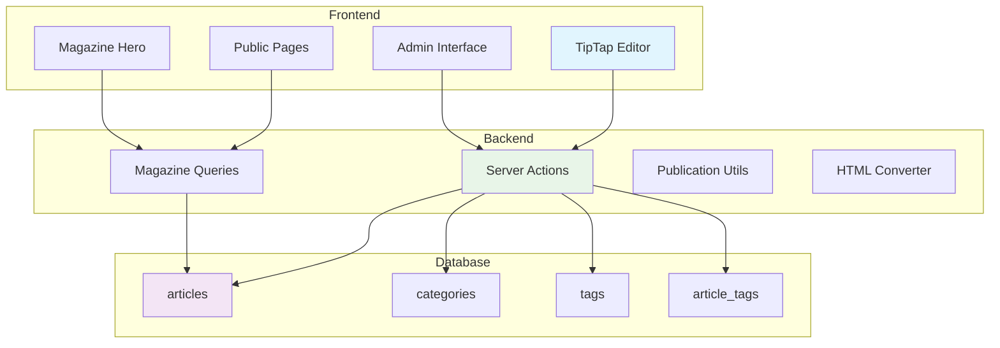

# Système Magazine - Herbis Veritas

> Documentation technique basée sur l'analyse complète du code en production (Août 2025).

Le système Magazine est une extension complète de la plateforme e-commerce qui permet la création, gestion et publication d'articles de blog avec un éditeur riche TipTap. Il s'intègre dans l'architecture Next.js 15 + Supabase existante et est **entièrement implémenté et fonctionnel**.

---

## Architecture Système

### Flux de données Magazine



### Structure Base de Données

Le système utilise 4 tables principales dans PostgreSQL avec relations optimisées :

#### Table `articles` (17 colonnes)

```sql
CREATE TABLE public.articles (
  id uuid PRIMARY KEY DEFAULT gen_random_uuid(),
  title varchar NOT NULL,
  slug varchar UNIQUE NOT NULL,
  excerpt text,
  content jsonb NOT NULL,              -- Contenu TipTap JSON
  content_html text,                   -- Version HTML générée
  featured_image varchar,
  status varchar DEFAULT 'draft' CHECK (status IN ('draft', 'published', 'archived')),
  published_at timestamptz,
  author_id uuid NOT NULL REFERENCES profiles(id),
  category_id uuid REFERENCES categories(id),
  view_count integer DEFAULT 0,
  reading_time integer,               -- Minutes calculées automatiquement
  seo_title varchar,
  seo_description varchar,
  created_at timestamptz DEFAULT now(),
  updated_at timestamptz DEFAULT now()
);
```

#### Table `categories` (7 colonnes)

```sql
CREATE TABLE public.categories (
  id uuid PRIMARY KEY DEFAULT gen_random_uuid(),
  name varchar NOT NULL,
  slug varchar UNIQUE NOT NULL,
  description text,
  color varchar DEFAULT '#6B7280',    -- Code couleur hex pour UI
  created_at timestamptz DEFAULT now(),
  updated_at timestamptz DEFAULT now()
);
```

#### Tables de taxonomie

```sql
-- Tags réutilisables
CREATE TABLE public.tags (
  id uuid PRIMARY KEY DEFAULT gen_random_uuid(),
  name varchar UNIQUE NOT NULL,
  slug varchar UNIQUE NOT NULL,
  created_at timestamptz DEFAULT now()
);

-- Relation many-to-many articles ↔ tags
CREATE TABLE public.article_tags (
  article_id uuid REFERENCES articles(id) ON DELETE CASCADE,
  tag_id uuid REFERENCES tags(id) ON DELETE CASCADE,
  PRIMARY KEY (article_id, tag_id)
);
```

### Politiques de Sécurité (RLS)

Le système s'appuie sur le système de rôles existant avec politiques granulaires :

```sql
-- Lecture publique articles publiés
CREATE POLICY "Allow public read published articles" ON articles
FOR SELECT USING (status = 'published');

-- Accès complet pour éditeurs/admins
CREATE POLICY "Allow editors full access" ON articles
FOR ALL USING (
  auth.jwt() ->> 'role' IN ('editor', 'admin', 'dev')
);
```

**Permissions système** :

- `content:create` - Création articles/catégories/tags
- `content:update` - Modification, accès brouillons
- `content:delete` - Suppression articles
- `content:publish` - Publication articles
- `content:unpublish` - Dépublication articles

---

## Server Actions - Clean Architecture

### Architecture Moderne Implémentée

**Fichier** : `src/actions/magazineActions.ts`

Le système utilise une Clean Architecture avec Result Pattern et gestion d'erreurs avancée :

```typescript
// Imports Clean Architecture
import { ActionResult } from "@/lib/core/result";
import { LogUtils } from "@/lib/core/logger";
import { ValidationError, AuthenticationError, ErrorUtils } from "@/lib/core/errors";

// Pattern type-safe pour toutes les actions
export async function createArticle(formData: ArticleFormData): Promise<ActionResult<unknown>> {
  const context = LogUtils.createUserActionContext("unknown", "create_article", "magazine");
  LogUtils.logOperationStart("create_article", context);

  try {
    // Validation permissions
    const hasPermission = await checkUserPermission("content:create");
    if (!hasPermission) {
      throw new AuthenticationError("Permission refusée");
    }

    // Business logic avec validation
    const cleanedContent = sanitizeTipTapContent(formData.content);
    const slug = formData.slug || generateSlug(formData.title);

    // Données structurées
    const articleData: ArticleInsert = {
      title: formData.title,
      slug,
      content: cleanedContent,
      content_html: convertTipTapToHTML(cleanedContent),
      reading_time: calcReadingTime(cleanedContent),
      // ... autres champs
    };

    const { data: article, error } = await supabase
      .from("articles")
      .insert(articleData)
      .select()
      .single();

    if (error) throw ErrorUtils.fromSupabaseError(error);

    LogUtils.logOperationSuccess("create_article", { ...context, articleId: article.id });
    return ActionResult.ok(article, "Article créé avec succès");
  } catch (error) {
    LogUtils.logOperationError("create_article", error, context);
    return ActionResult.error(ErrorUtils.formatForUser(error));
  }
}
```

### Fonctions Principales Disponibles

#### Gestion des Articles

- `createArticle(formData)` - Création avec validation complète
- `updateArticle(id, formData)` - Mise à jour intelligente
- `deleteArticle(id)` - Suppression sécurisée

#### Workflow de Publication

- `changeArticleStatus(articleId, newStatus)` - Changement statut unitaire
- `bulkChangeArticleStatus(articleIds, newStatus)` - Actions en lot

#### Gestion Taxonomies

- `createCategory(data)` - Création catégories
- `createTag(data)` - Création tags

#### Upload d'Images Centralisé

```typescript
// Migration vers système centralisé
export const uploadMagazineImage = uploadMagazineImageCore;
```

### Fonctionnalités Automatiques

- **Génération slugs** : Normalisation Unicode, validation unicité
- **Calcul temps lecture** : 200 mots/minute
- **Conversion HTML** : JSON TipTap → HTML automatique
- **Sanitisation contenu** : Nettoyage récursif, suppression nœuds vides
- **Validation publication** : Titre, contenu, permissions

---

## Composants Frontend

### Éditeur TipTap Complet

**Composants principaux** :

#### `TipTapEditor` (`components/magazine/tiptap-editor.tsx`)

- Éditeur riche avec toolbar complète
- Extensions : StarterKit, Image, Link, TextAlign, Highlight
- Thème personnalisé Herbis Veritas
- Upload d'images intégré

#### `TipTapViewer` (`components/magazine/tiptap-viewer.tsx`)

- Visualiseur lecture seule optimisé
- Rendu sémantique HTML
- Support complet des extensions

#### `AutoSaveEditor` (`components/magazine/auto-save-editor.tsx`)

- Sauvegarde automatique brouillons
- Récupération crash avec `useRestoreDraft`

### Composants UI Modulaires

#### `ArticleCard` - Card Réutilisable

```typescript
interface ArticleCardProps {
  article: ArticleDisplay;
  variant?: "default" | "compact" | "featured";
}

// Utilisation dans grilles
<ArticleCard article={article} variant="featured" />
```

#### `MagazineHero` - Section Hero Moderne

```typescript
interface MagazineHeroProps {
  title: string;
  description: string;
  categories?: Category[];
  currentCategory?: string;
  backgroundImage?: string;
}

// Navigation catégories intégrée style "pills"
<MagazineHero
  title="Magazine"
  description="Guides et actualités herboristerie"
  categories={categories}
  currentCategory={selectedCategory}
/>
```

#### `ArticleMetadata` - Métadonnées Cohérentes

```typescript
interface ArticleMetadataProps {
  author?: Author;
  publishedDate: string;
  readingTime?: number;
  viewCount?: number;
  variant?: "default" | "compact";
}

// Balises sémantiques <time> pour accessibilité
<ArticleMetadata
  author={article.author}
  publishedDate={article.published_at}
  readingTime={article.reading_time}
  variant="compact"
/>
```

#### `TagList` - Liste Tags Intelligente

```typescript
interface TagListProps {
  tags: Tag[];
  maxVisible?: number;
  variant?: "default" | "compact" | "badges";
  onTagClick?: (tag: Tag) => void;
}

// Gestion overflow avec compteur "+X"
<TagList
  tags={article.tags}
  maxVisible={3}
  variant="badges"
/>
```

---

## Pages et Interfaces

### Page Magazine Publique

**Fichier** : `src/app/[locale]/magazine/page.tsx`

Architecture moderne avec Next.js 15 :

```typescript
// Types stricts Next.js 15
interface MagazinePageProps {
  params: Promise<{ locale: string }>;
  searchParams: Promise<MagazineSearchParams>;
}

// Composant principal avec Suspense
export default async function MagazinePage({ params, searchParams }: MagazinePageProps) {
  const { locale } = await params;
  const resolvedSearchParams = await searchParams;

  return (
    <main className="min-h-screen bg-background">
      {/* SEO avec données structurées JSON-LD */}
      <script type="application/ld+json" dangerouslySetInnerHTML={{
        __html: JSON.stringify(generateMagazineStructuredData(baseUrl))
      }} />

      {/* Contenu avec Suspense optimisé */}
      <Suspense fallback={<MagazineContentSkeleton />}>
        <MagazineContent searchParams={resolvedSearchParams} />
      </Suspense>
    </main>
  );
}
```

**Fonctionnalités** :

- Hero section avec navigation catégories
- Grille articles responsive (MD:2, LG:3)
- Recherche full-text intégrée
- Pagination optimisée
- Skeletons de chargement adaptés

### Interface Administration

**Fichier** : `src/app/[locale]/admin/magazine/page.tsx`

Dashboard moderne avec statistiques temps réel :

```typescript
// Statistiques en cards
async function StatsCards() {
  const stats = await getArticleStats();

  return (
    <div className="grid gap-4 md:grid-cols-2 lg:grid-cols-4">
      <Card>
        <CardHeader>
          <CardTitle>Total Articles</CardTitle>
        </CardHeader>
        <CardContent>
          <div className="text-2xl font-bold">{stats.total}</div>
        </CardContent>
      </Card>
      {/* Stats : publiés, brouillons, archivés */}
    </div>
  );
}
```

**Interface** :

- Vue d'ensemble avec stats (total, publiés, brouillons, archivés)
- Filtres par statut intégrés
- Grille articles avec métadonnées
- Actions rapides (modifier, voir, statut)
- Pagination performante

### Pages Spécialisées

#### `/magazine/[slug]` - Article Détail

- Rendu `TipTapViewer` optimisé
- Métadonnées SEO automatiques
- Compteur vues incrémental
- Navigation tags/catégories

#### `/magazine/category/[slug]` - Articles par Catégorie

- Filtrage intelligent par catégorie
- Pagination dédiée
- Breadcrumb navigation

#### `/magazine/tag/[slug]` - Articles par Tag

- Relation many-to-many optimisée
- Interface cohérente

---

## Utilitaires et Services

### Convertisseur HTML

**Fichier** : `src/lib/magazine/html-converter.ts`

```typescript
// Conversion JSON TipTap → HTML sémantique
export function convertTipTapToHTML(content: TipTapContent): string {
  // Rendu avec classes Tailwind
  // Gestion extensions complètes
  // Fallback en cas d'erreur
}

// Extraction métadonnées
export function calculateReadingTime(content: TipTapContent): number {
  const wordCount = extractPlainText(content).split(/\s+/).length;
  return Math.ceil(wordCount / 200); // 200 mots/min
}

export function extractExcerpt(content: TipTapContent, maxLength = 160): string {
  // Génération automatique extraits
}
```

### Utilitaires Publication

**Fichier** : `src/lib/magazine/publication-utils.ts`

```typescript
// Validation avant publication
export function validateArticleForPublication(article: Article): ValidationResult {
  const errors: string[] = [];

  if (!article.title?.trim()) errors.push("Le titre est requis");
  if (!article.content) errors.push("Le contenu est requis");
  if (!isValidSlug(article.slug)) errors.push("Le slug est invalide");

  return { isValid: errors.length === 0, errors };
}

// Permissions workflow
export async function canPerformPublicationAction(action: PublicationAction): Promise<boolean> {
  switch (action) {
    case "publish":
      return await checkUserPermission("content:publish");
    case "unpublish":
      return await checkUserPermission("content:unpublish");
    case "archive":
      return await checkUserPermission("content:update");
    default:
      return false;
  }
}
```

### Requêtes Optimisées

**Fichier** : `src/lib/magazine/queries.ts`

```typescript
// Requête principale avec relations
export async function getArticles(
  filters: ArticleFilters,
  page = 1,
  limit = 12
): Promise<{ articles: ArticleDisplay[]; pagination: ArticlePagination }> {
  let query = supabase.from("articles").select(`
      *,
      author:profiles(id, first_name, last_name),
      category:categories(id, name, slug, color),
      tags:article_tags(tag:tags(id, name, slug))
    `);

  // Filtres avancés
  if (filters.status) query = query.eq("status", filters.status);
  if (filters.category_id) query = query.eq("category_id", filters.category_id);
  if (filters.search) {
    query = query.or(`title.ilike.%${filters.search}%,excerpt.ilike.%${filters.search}%`);
  }

  // Pagination optimisée
  const { data: articles, count } = await query
    .order("published_at", { ascending: false, nullsFirst: false })
    .order("created_at", { ascending: false })
    .range((page - 1) * limit, page * limit - 1);

  return {
    articles: articles || [],
    pagination: {
      page,
      limit,
      total: count || 0,
      totalPages: Math.ceil((count || 0) / limit),
    },
  };
}
```

---

## Intégration Système

### Authentification et Permissions

Intégration complète avec le système existant :

```typescript
// Vérification permissions dans chaque action
const hasCreatePermission = await checkUserPermission("content:create");
const hasPublishPermission = await checkUserPermission("content:publish");
const hasDeletePermission = await checkUserPermission("content:delete");
```

### Internationalisation

Compatible avec next-intl existant :

```typescript
// Messages localisés
const t = await getTranslations({ locale, namespace: "MagazinePage" });

// Routes multilingues
/{locale}/aaegimnz / { locale } / admin / magazine;
```

### Performance et SEO

Optimisations intégrées :

- **SSR** : Server Components pour SEO optimal
- **Images** : Next.js Image avec lazy loading
- **Cache** : Revalidation automatique `revalidatePath()`
- **Métadonnées** : Generation dynamique `generateMetadata()`
- **Données structurées** : JSON-LD pour moteurs recherche

---

## Statut de Production

### Implémentation Complète ✅

#### Phase 1 : Fondations

- [x] Structure base données avec RLS
- [x] Types TypeScript complets
- [x] Server Actions avec validation
- [x] Requêtes optimisées relations

#### Phase 2 : Éditeur TipTap

- [x] Configuration complète TipTap
- [x] Composant éditeur (`TipTapEditor`)
- [x] Visualiseur (`TipTapViewer`)
- [x] Upload images intégré
- [x] Sauvegarde automatique (`AutoSaveEditor`)

#### Phase 3 : Interface Administration

- [x] Dashboard avec statistiques temps réel
- [x] Liste articles avec filtres
- [x] Formulaires création/modification
- [x] Workflow publication avancé
- [x] Actions en lot

#### Phase 4 : Pages Publiques

- [x] Listing articles avec pagination
- [x] Page détail optimisée SEO
- [x] Navigation catégories et tags
- [x] Recherche full-text
- [x] Données structurées JSON-LD

#### Phase 5 : Fonctionnalités Avancées

- [x] Statistiques et analytics
- [x] SEO complet (Open Graph, Twitter)
- [x] Performance optimisée (Suspense, lazy loading)
- [x] Design responsive complet
- [x] Internationalisation

#### Phase 6 : Clean Architecture

- [x] Result Pattern avec `ActionResult<T>`
- [x] Logging structuré avec `LogUtils`
- [x] Types TypeScript stricts (élimination `any`)
- [x] Composants modulaires réutilisables
- [x] Upload système centralisé
- [x] Gestion erreurs hiérarchique

### Métriques Production

- **Performance** : Index DB optimisés, requêtes avec relations pré-chargées
- **Sécurité** : RLS sur toutes tables, permissions granulaires
- **Maintenance** : Triggers `updated_at`, contraintes validation
- **Observabilité** : Audit logs, gestion erreurs robuste

---

## Configuration et Données

### Migrations Appliquées

Tables et politiques opérationnelles :

- Tables : `articles`, `categories`, `tags`, `article_tags`
- Index : `slug`, `status`, `published_at`, `author_id`, `category_id`
- Contraintes : Validation statuts, unicité slugs
- RLS : Politiques sécurité complètes

### Types TypeScript Synchronisés

Types automatiquement générés via Supabase CLI et enrichis :

```typescript
// Types de base générés
export interface Article {
  id: string;
  title: string;
  slug: string;
  content: TipTapContent;
  status: "draft" | "published" | "archived";
  // ... autres champs
}

// Types enrichis pour UI
export interface ArticleDisplay extends Article {
  author?: Author;
  category?: Category;
  tags?: Tag[];
}
```

### Données Exemple

Catégories par défaut créées :

- Actualités, Tutoriels, Opinion, Lifestyle avec couleurs distinctes

Tags système :

- Développement, Design, Web, Mobile, Herboristerie, Bien-être

---

## Utilisation Pratique

### Création Article

```typescript
import { createArticle } from "@/actions/magazineActions";

const formData: ArticleFormData = {
  title: "Guide complet des huiles essentielles",
  slug: "guide-huiles-essentielles", // Auto-généré si omis
  excerpt: "Découvrez les propriétés et usages...",
  content: tiptapJsonContent,
  featured_image: "/images/huiles-essentielles.jpg",
  status: "draft",
  category_id: "uuid-actualites",
  tags: ["uuid-bien-etre", "uuid-naturel"],
  seo_title: "Guide huiles essentielles - Herbis Veritas",
  seo_description: "Tout savoir sur les huiles essentielles...",
};

const result = await createArticle(formData);
if (result.success) {
  console.log("Article créé:", result.data);
}
```

### Récupération Articles

```typescript
import { getArticles, getArticleBySlug } from "@/lib/magazine/queries";

// Liste paginée avec filtres
const { articles, pagination } = await getArticles(
  {
    status: "published",
    category_id: "uuid-actualites",
    search: "huiles essentielles",
  },
  1,
  10
);

// Article individuel avec relations
const article = await getArticleBySlug("guide-huiles-essentielles");
```

### Workflow Publication

```typescript
import { changeArticleStatus } from "@/actions/magazineActions";

// Publication avec validation automatique
const result = await changeArticleStatus("article-id", "published");
// Validation : titre, contenu, slug, permissions
```

---

## Prochaines Évolutions

### Améliorations Futures (Non-critiques)

- [ ] Commentaires avec modération
- [ ] Partage social avancé
- [ ] Newsletter intégrée
- [ ] Analytics détaillées (temps lecture réel)
- [ ] Système révisions articles
- [ ] Planification publication
- [ ] API REST publique

---

<div align="center">

**📰 Système Magazine - Herbis Veritas**  
_Moderne • Performant • Production-Ready_

**Dernière mise à jour** : 4 Août 2025  
**Version** : 3.1.0  
**Statut** : ✅ Entièrement Fonctionnel - Prêt Production

[🏠 Documentation](../README.md) • [🛒 E-commerce](./e-commerce.md) • [🔐 Sécurité](../architecture/security.md)

</div>
