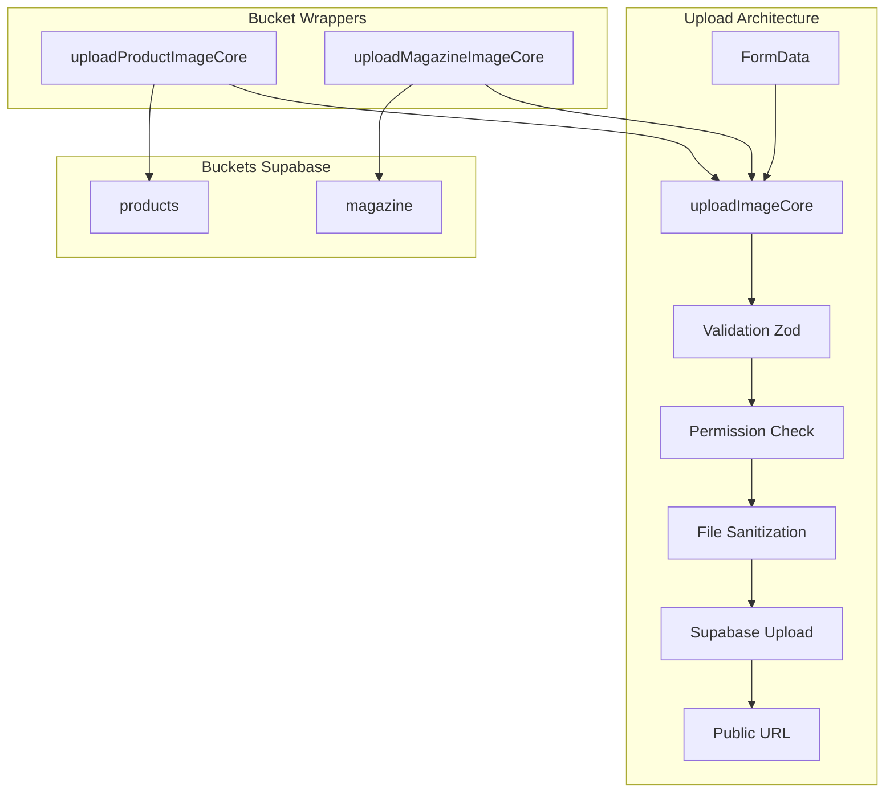

# Système de Stockage Centralisé

Documentation du système de stockage et d'upload de fichiers pour Herbis Veritas, basé sur Supabase Storage avec architecture centralisée.

## Vue d'Ensemble

### Architecture Centralisée (Factorisation 01/2025)

Le système de stockage utilise **Supabase Storage** avec une fonction centralisée implémentée en janvier 2025 pour éliminer la duplication de code et améliorer la maintenabilité.

**Gains de la factorisation** :
- ✅ **-70 lignes de code dupliqué** éliminées
- ✅ **Maintenance centralisée** des validations et contraintes
- ✅ **Cohérence garantie** entre tous les types d'upload
- ✅ **Évolutivité facilitée** pour nouveaux buckets
- ✅ **Type safety** avec `AppPermission` strict



## Architecture Technique

### Structure des Fichiers

```
src/lib/storage/
├── image-upload.ts                    # Fonction centralisée + exports publics
└── __tests__/
    └── image-upload.test.ts           # Tests unitaires du système core

src/actions/
├── productActions.ts                  # Re-export uploadProductImage
└── magazineActions.ts                 # Re-export uploadMagazineImage

Composants utilisant le système :
├── src/components/admin/image-upload-field.tsx          # Produits admin
├── src/components/admin/magazine/image-upload-field.tsx # Magazine admin  
├── src/components/magazine/image-upload.tsx             # Éditeur modal
└── src/components/magazine/tiptap-editor.tsx            # Drag & drop TipTap
```

### Fonction Core : `uploadImageCore`

```typescript
// src/lib/storage/image-upload.ts
async function uploadImageCore(
  formData: FormData,
  config: BucketConfig
): Promise<UploadImageResult> {
  try {
    const supabase = await createSupabaseServerClient();

    // 1. Vérification permissions (si pas dans wrapper)
    if (!config.usePermissionSafe) {
      const permissionResult = await checkUserPermission(config.permission);
      if (!permissionResult.isAuthorized) {
        return {
          success: false,
          message: "Permission refusée pour l'upload d'images.",
        };
      }
    }

    // 2. Extraction et validation Zod
    const file = formData.get("file") as File;
    const fileName = formData.get("fileName") as string;
    const validationResult = imageUploadSchema.safeParse({ file, fileName });

    if (!validationResult.success) {
      return {
        success: false,
        message: "Validation échouée",
        errors: validationResult.error.flatten().fieldErrors,
      };
    }

    // 3. Sanitisation du nom de fichier
    const fileExtension = validatedFile.name.split(".").pop();
    const sanitizedFileName = slugify(validatedFileName);
    const filePath = `${sanitizedFileName}-${Date.now()}.${fileExtension}`;

    // 4. Upload vers Supabase Storage
    const { error: uploadError } = await supabase.storage
      .from(config.bucket)
      .upload(filePath, validatedFile, { upsert: true });

    if (uploadError) {
      console.error("Supabase upload error:", uploadError);
      return {
        success: false,
        message: `Erreur lors de l'upload: ${uploadError.message}`,
      };
    }

    // 5. Génération URL publique
    const { data: publicUrlData } = supabase.storage
      .from(config.bucket)
      .getPublicUrl(filePath);

    return {
      success: true,
      message: "Image téléversée avec succès !",
      data: { url: publicUrlData.publicUrl },
    };
  } catch (error) {
    console.error("Upload error:", error);
    return {
      success: false,
      message: "Erreur lors de l'upload",
    };
  }
}
```

### Configuration par Bucket

```typescript
interface BucketConfig {
  bucket: "products" | "magazine";
  permission: AppPermission;
  usePermissionSafe?: boolean; // Si déjà dans un wrapper withPermissionSafe
}
```

## Validation et Sécurité

### Schéma de Validation Unifié

```typescript
const imageUploadSchema = z.object({
  file: z
    .instanceof(File)
    .refine((file) => file.size > 0, "Le fichier ne peut pas être vide.")
    .refine(
      (file) => file.size < 4 * 1024 * 1024, // 4MB max
      "Le fichier ne doit pas dépasser 4Mo."
    )
    .refine(
      (file) => ["image/jpeg", "image/png", "image/webp", "image/gif"].includes(file.type),
      "Le format du fichier doit être JPEG, PNG, WEBP ou GIF."
    ),
  fileName: z.string().min(3, "Le nom du fichier doit contenir au moins 3 caractères."),
});
```

**Fonctionnalités de sécurité** :
- ✅ Validation stricte taille (4MB max)
- ✅ Formats autorisés : JPEG, PNG, WebP, GIF
- ✅ Sanitisation des noms avec `slugify()` + timestamp
- ✅ Vérification permissions par rôle utilisateur
- ✅ Protection contre path traversal
- ✅ Génération sécurisée d'URLs publiques

### Système de Permissions

#### Bucket `products`
```typescript
export const uploadProductImageCore = withPermissionSafe(
  "products:update",
  async (formData: FormData): Promise<UploadImageResult> =>
    uploadImageCore(formData, {
      bucket: "products",
      permission: "products:update",
      usePermissionSafe: true, // Déjà dans le wrapper
    })
);
```

#### Bucket `magazine`
```typescript
export async function uploadMagazineImageCore(formData: FormData): Promise<UploadImageResult> {
  return uploadImageCore(formData, {
    bucket: "magazine",
    permission: "content:create",
    // usePermissionSafe: false (par défaut) - vérification manuelle
  });
}
```

### Politiques RLS Supabase

```sql
-- Bucket products : Lecture publique, écriture restreinte
CREATE POLICY "Public read products bucket" ON storage.objects 
FOR SELECT USING (bucket_id = 'products');

CREATE POLICY "Editors upload products" ON storage.objects 
FOR INSERT WITH CHECK (
  bucket_id = 'products' AND
  EXISTS (
    SELECT 1 FROM profiles 
    WHERE id = auth.uid() 
    AND role IN ('editor', 'admin', 'dev')
  )
);

-- Bucket magazine : Lecture publique, écriture créateurs contenu
CREATE POLICY "Public read magazine bucket" ON storage.objects 
FOR SELECT USING (bucket_id = 'magazine');

CREATE POLICY "Content creators upload magazine" ON storage.objects 
FOR INSERT WITH CHECK (
  bucket_id = 'magazine' AND
  EXISTS (
    SELECT 1 FROM profiles 
    WHERE id = auth.uid() 
    AND role IN ('editor', 'admin', 'dev')
  )
);
```

## Types TypeScript

### Type de Retour Unifié

```typescript
export type UploadImageResult =
  | {
      success: true;
      data: { url: string };
      message: string;
    }
  | {
      success: false;
      message: string;
      errors?: {
        file?: string[];
        fileName?: string[];
      };
    };
```

### Intégration AppPermission

Le système utilise les types stricts du système de permissions :

```typescript
import type { AppPermission } from "@/lib/auth/types";

// Permissions utilisées
type StoragePermissions = 
  | "products:update"    // Upload images produits
  | "content:create";    // Upload images magazine/blog
```

## Utilisation Pratique

### Upload d'Images Produits

```typescript
// Dans un Server Action ou API Route
import { uploadProductImage } from "@/actions/productActions";

export async function handleProductImageUpload(formData: FormData) {
  const result = await uploadProductImage(formData);
  
  if (result.success) {
    console.log("Image uploadée :", result.data.url);
    return result.data.url;
  } else {
    console.error("Erreur upload :", result.message);
    if (result.errors) {
      console.error("Erreurs détaillées :", result.errors);
    }
    throw new Error(result.message);
  }
}
```

### Upload d'Images Magazine

```typescript
// Dans magazineActions.ts
import { uploadMagazineImage } from "@/actions/magazineActions";

export async function handleArticleImageUpload(formData: FormData) {
  const result = await uploadMagazineImage(formData);
  
  if (result.success) {
    // Utilisation de l'URL dans l'article
    return {
      success: true,
      imageUrl: result.data.url,
      message: "Image ajoutée à l'article"
    };
  } else {
    return {
      success: false,
      error: result.message
    };
  }
}
```

### Utilisation dans les Composants

```typescript
// Composant d'upload avec prévisualisation
'use client';

import { useState } from 'react';
import { uploadProductImage } from '@/actions/productActions';

export function ImageUploadField({ onImageUploaded }: { onImageUploaded: (url: string) => void }) {
  const [isUploading, setIsUploading] = useState(false);
  const [previewUrl, setPreviewUrl] = useState<string | null>(null);

  const handleFileChange = async (event: React.ChangeEvent<HTMLInputElement>) => {
    const file = event.target.files?.[0];
    if (!file) return;

    // Prévisualisation immédiate
    const objectUrl = URL.createObjectURL(file);
    setPreviewUrl(objectUrl);

    setIsUploading(true);
    try {
      const formData = new FormData();
      formData.append('file', file);
      formData.append('fileName', file.name.split('.')[0]);

      const result = await uploadProductImage(formData);
      
      if (result.success) {
        onImageUploaded(result.data.url);
        toast.success(result.message);
      } else {
        toast.error(result.message);
        setPreviewUrl(null);
      }
    } catch (error) {
      toast.error('Erreur lors de l\'upload');
      setPreviewUrl(null);
    } finally {
      setIsUploading(false);
      URL.revokeObjectURL(objectUrl);
    }
  };

  return (
    <div className="upload-field">
      <input
        type="file"
        accept="image/jpeg,image/png,image/webp,image/gif"
        onChange={handleFileChange}
        disabled={isUploading}
      />
      {previewUrl && (
        
      )}
      {isUploading && <div>Upload en cours...</div>}
    </div>
  );
}
```

## Tests et Validation

### Tests Unitaires

```typescript
// src/lib/storage/__tests__/image-upload.test.ts
describe('uploadImageCore', () => {
  beforeEach(() => {
    jest.clearAllMocks();
  });

  it('should validate file size limit', async () => {
    const oversizedFile = new File(['x'.repeat(5 * 1024 * 1024)], 'big.jpg', { 
      type: 'image/jpeg' 
    });
    const formData = new FormData();
    formData.append('file', oversizedFile);
    formData.append('fileName', 'test-image');

    const result = await uploadProductImageCore(formData);
    
    expect(result.success).toBe(false);
    expect(result.message).toContain('4Mo');
  });

  it('should sanitize file names correctly', async () => {
    const file = new File(['test content'], 'Mon Fichier Spécial!!.jpg', { 
      type: 'image/jpeg' 
    });
    const formData = new FormData();
    formData.append('file', file);
    formData.append('fileName', 'Mon Fichier Spécial!!');

    // Mock Supabase
    mockSupabaseUpload.mockResolvedValue({ error: null });
    mockSupabaseGetPublicUrl.mockReturnValue({
      data: { publicUrl: 'https://example.com/mon-fichier-special-1234567890.jpg' }
    });

    const result = await uploadProductImageCore(formData);
    
    expect(result.success).toBe(true);
    expect(mockSupabaseUpload).toHaveBeenCalledWith(
      expect.stringMatching(/^mon-fichier-special-\d+\.jpg$/),
      expect.any(File),
      { upsert: true }
    );
  });

  it('should handle permission errors', async () => {
    mockCheckUserPermission.mockResolvedValue({
      isAuthorized: false,
      userRole: 'user'
    });

    const formData = createValidFormData();
    const result = await uploadMagazineImageCore(formData);
    
    expect(result.success).toBe(false);
    expect(result.message).toContain('Permission refusée');
  });
});
```

### Tests d'Intégration

```typescript
// src/actions/__tests__/productActions.test.ts
describe('Product Actions Integration', () => {
  it('should upload product image through action', async () => {
    const file = new File(['test'], 'product.jpg', { type: 'image/jpeg' });
    const formData = new FormData();
    formData.append('file', file);
    formData.append('fileName', 'product-test');

    const result = await uploadProductImageAction(formData);
    
    expect(result.success).toBe(true);
    expect(result.data?.url).toMatch(/^https:\/\/.*\.supabase\.co\/storage/);
  });

  it('should handle upload errors gracefully', async () => {
    mockSupabaseUpload.mockResolvedValue({
      error: { message: 'Storage quota exceeded' }
    });

    const formData = createValidFormData();
    const result = await uploadProductImageAction(formData);
    
    expect(result.success).toBe(false);
    expect(result.message).toContain('Storage quota exceeded');
  });
});
```

## Évolutivité et Maintenance

### Ajouter un Nouveau Bucket

**Exemple : Bucket `avatars` pour les photos de profil**

1. **Étendre la configuration** :
```typescript
interface BucketConfig {
  bucket: "products" | "magazine" | "avatars";
  permission: AppPermission;
  usePermissionSafe?: boolean;
}
```

2. **Créer la fonction wrapper** :
```typescript
export async function uploadAvatarImageCore(formData: FormData): Promise<UploadImageResult> {
  return uploadImageCore(formData, {
    bucket: "avatars",
    permission: "profile:update:own",
  });
}
```

3. **Configurer les politiques RLS** :
```sql
-- Bucket avatars : Utilisateurs peuvent uploader leur propre avatar
CREATE POLICY "Users upload own avatar" ON storage.objects 
FOR INSERT WITH CHECK (
  bucket_id = 'avatars' AND
  auth.uid() IS NOT NULL
);

CREATE POLICY "Public read avatars" ON storage.objects 
FOR SELECT USING (bucket_id = 'avatars');
```

4. **Ajouter les tests** :
```typescript
describe('uploadAvatarImageCore', () => {
  it('should upload avatar for authenticated user', async () => {
    // Tests spécifiques aux avatars
  });
});
```

### Support d'Autres Types de Fichiers

```typescript
// Exemple : Support des documents PDF
const documentUploadSchema = z.object({
  file: z
    .instanceof(File)
    .refine((file) => file.size < 10 * 1024 * 1024, "Document max 10MB")
    .refine(
      (file) => ["application/pdf", "application/msword"].includes(file.type),
      "Formats supportés : PDF, DOC"
    ),
  fileName: z.string().min(3),
});

export async function uploadDocumentCore(
  formData: FormData,
  config: BucketConfig
): Promise<UploadDocumentResult> {
  // Logique similaire avec schéma adapté
}
```

### Optimisations Futures

#### Redimensionnement Automatique
```typescript
// Fonction de redimensionnement côté serveur
async function resizeImage(file: File, maxWidth: number): Promise<File> {
  // Utilisation de sharp ou canvas pour redimensionner
  // Génération de plusieurs tailles (thumbnail, medium, full)
}
```

#### CDN et Cache
```typescript
// Configuration CDN Cloudflare pour Supabase Storage
const cdnUrl = `https://cdn.herbisveritas.com/storage/${bucket}/${filePath}`;

// Headers de cache optimisés
const cacheHeaders = {
  'Cache-Control': 'public, max-age=31536000, immutable',
  'CDN-Cache-Control': 'max-age=31536000'
};
```

#### Compression Intelligente
```typescript
// Compression adaptative selon le contexte
const compressionConfig = {
  thumbnail: { quality: 70, format: 'webp' },
  preview: { quality: 85, format: 'webp' },
  full: { quality: 95, format: 'original' }
};
```

## Métriques et Performance

### Limites Actuelles

- **Taille maximum** : 4MB par fichier
- **Formats supportés** : JPEG, PNG, WebP, GIF
- **Temps d'upload moyen** : 1-3s selon taille et connexion
- **URL publique** : Disponible immédiatement après upload

### Optimisations Implémentées

- ✅ Validation côté client et serveur (feedback rapide)
- ✅ Upload direct vers Supabase Storage (pas de proxy)
- ✅ Génération d'URLs publiques en une requête
- ✅ Sanitisation efficace des noms de fichiers
- ✅ Mise en cache des vérifications de permissions

### Points de Surveillance

- **Quotas Supabase** : Taille totale des buckets
- **Performances réseau** : Temps d'upload moyen
- **Erreurs d'upload** : Taux d'échec et causes
- **Fichiers orphelins** : Images uploadées mais non utilisées

---

**Dernière mise à jour** : 4 Août 2025  
**Version** : Système centralisé v2.0  
**Statut** : Production - Architecture unifiée opérationnelle  
**Factorisation** : Janvier 2025 (-70 lignes de code dupliqué)  
**Buckets actifs** : `products`, `magazine`