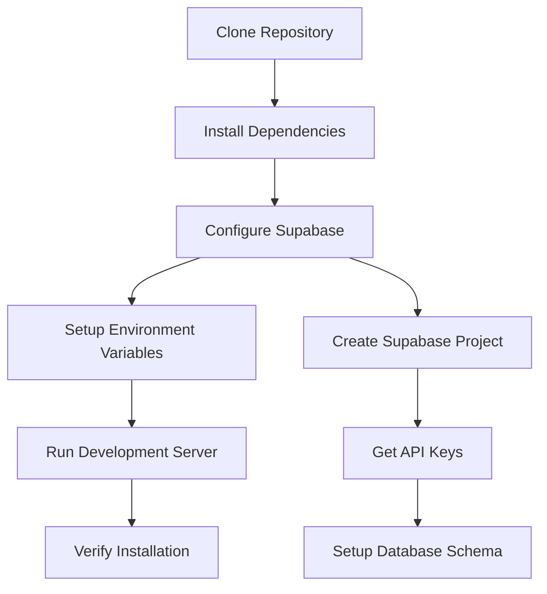

# Guide d'Installation

Configuration d'In Herbis Veritas en environnement de développement.

---

## Prérequis

### Outils Requis

| Outil | Version | Description | Installation |
|-------|---------|-------------|--------------|
| **Node.js** | 18+ | Runtime JavaScript | [nodejs.org](https://nodejs.org/) |
| **npm** | 9+ | Gestionnaire de paquets | Inclus avec Node.js |
| **Git** | Latest | Contrôle de version | [git-scm.com](https://git-scm.com/) |

### Services Externes

| Service | Status | Utilisation | Lien |
|---------|--------|-------------|------|
| **Supabase** | Obligatoire | Base de données, Auth, Storage | [supabase.com](https://supabase.com/) |
| **Stripe** | Optionnel | Paiements (mode test) | [stripe.com](https://stripe.com/) |
| **Vercel** | Optionnel | Déploiement | [vercel.com](https://vercel.com/) |

---

## Installation Pas à Pas

### Processus d'Installation



### Étape 1 : Cloner le Projet

```bash
# Cloner le repository
git clone https://github.com/votre-username/herbisveritas.git
cd herbisveritas

# Vérifier la branche principale
git checkout main
```

### Étape 2 : Installation des Dépendances

```bash
# Installer toutes les dépendances
npm install

# Vérifier l'installation
npm run --version
```

Temps estimé : 2-3 minutes

### Étape 3 : Configuration Supabase

#### 3.1. Créer un Projet Supabase

1. **Aller sur [supabase.com](https://supabase.com/)**
2. **Créer un compte** ou se connecter
3. **"New Project"** → Choisir un nom (ex: `herbisveritas-dev`)
4. **Attendre** la création du projet (~2 minutes)

#### 3.2. Récupérer les Clés API

Dans votre projet Supabase :

1. **Settings** → **API**
2. **Copier** :
   - `Project URL`
   - `anon public` key

#### 3.3. Configuration Schéma Base de Données

```bash
# Aller dans le SQL Editor de Supabase
# Coller et exécuter le script de création des tables
```

**📄 [Script SQL complet disponible ici](../architecture/database.md#setup)**

### Étape 4 : Variables d'Environnement

```bash
# Copier le fichier d'exemple
cp .env.example .env.local

# Éditer .env.local
```

#### Configuration .env.local

```bash
# === SUPABASE (OBLIGATOIRE) ===
NEXT_PUBLIC_SUPABASE_URL=https://votre-projet.supabase.co
NEXT_PUBLIC_SUPABASE_ANON_KEY=votre-cle-anon

# === STRIPE (OPTIONNEL POUR DÉVELOPPEMENT) ===
STRIPE_SECRET_KEY=sk_test_...
NEXT_PUBLIC_STRIPE_PUBLISHABLE_KEY=pk_test_...

# === CONFIGURATION APP ===
NEXTAUTH_SECRET=votre-secret-random-32-chars
NEXTAUTH_URL=http://localhost:3000

# === DÉVELOPPEMENT (OPTIONNEL) ===
NODE_ENV=development
NEXT_PUBLIC_APP_URL=http://localhost:3000
```

### Étape 5 : Premier Démarrage

```bash
# Lancer le serveur de développement
npm run dev
```

L'application est accessible sur [http://localhost:3000](http://localhost:3000)

---

## Vérification de l'Installation

### Tests de Base

```bash
# Vérifier que le build fonctionne
npm run build

# Lancer les tests
npm run test

# Vérifier le linting
npm run lint
```

### Checklist Fonctionnelle

- [ ] Page d'accueil se charge correctement
- [ ] Navigation fonctionne entre les pages
- [ ] Authentification : possibilité de créer un compte
- [ ] Produits : liste des produits s'affiche
- [ ] Panier : ajout/suppression d'articles
- [ ] i18n : changement de langue fonctionne

### Tests de Connexion

#### Test Supabase
```bash
# Dans la console navigateur (F12)
console.log(process.env.NEXT_PUBLIC_SUPABASE_URL)
# Doit afficher votre URL Supabase
```

#### Test Base de Données
1. **Aller sur votre dashboard Supabase**
2. **Table Editor** → Vérifier les tables :
   - `profiles`
   - `products` 
   - `cart_items`
   - `orders`

---

## Configuration Avancée

### Stripe (Paiements)

#### Clés de Test
```bash
# Dans votre dashboard Stripe → Developers → API Keys
STRIPE_SECRET_KEY=sk_test_51...
NEXT_PUBLIC_STRIPE_PUBLISHABLE_KEY=pk_test_51...
```

#### Webhooks (Optionnel)
```bash
# Installer Stripe CLI
npm install -g stripe-cli

# Connecter à votre compte
stripe login

# Rediriger les webhooks vers localhost
stripe listen --forward-to localhost:3000/api/webhooks/stripe
```

### Base de Données Avancée

#### RLS (Row Level Security)
```sql
-- Les politiques RLS sont incluses dans le script de setup
-- Vérifier dans Supabase → Authentication → Policies
```

#### Fonctions Personnalisées
```sql
-- Les fonctions SQL sont dans /supabase/migrations/
-- Appliquer avec : supabase db push
```

---

## Dépannage

### Problème : "Module not found"
```bash
# Supprimer node_modules et réinstaller
rm -rf node_modules package-lock.json
npm install
```

### Problème : "Supabase connection failed"
```bash
# Vérifier les variables d'environnement
echo $NEXT_PUBLIC_SUPABASE_URL
echo $NEXT_PUBLIC_SUPABASE_ANON_KEY

# Redémarrer le serveur
npm run dev
```

### Problème : "Database access denied"
```bash
# Vérifier les politiques RLS dans Supabase
# Aller dans Authentication → Policies
# S'assurer qu'un utilisateur est créé et authentifié
```

### Problème : "Stripe keys invalid"
```bash
# Vérifier que vous utilisez les clés de TEST
# Les clés doivent commencer par sk_test_ et pk_test_
```

---

## Prochaines Étapes

### 1. Comprendre l'Architecture
[Vue d'Ensemble de l'Architecture](../architecture/overview.md)

### 2. Environnement de Développement
[Configuration de Développement](./development.md)

### 3. Standards de Code
[Conventions et Bonnes Pratiques](../development/coding-standards.md)

### 4. Premier Développement
[Guide de Contribution](../development/contributing.md)

---

## Support

### Ressources d'Aide

1. [Troubleshooting Complet](../development/troubleshooting.md)
2. [Discussions GitHub](https://github.com/votre-repo/discussions)
3. [Signaler un Problème](https://github.com/votre-repo/issues/new)

### Documentation Externe

- [Supabase Docs](https://supabase.com/docs) - Documentation officielle
- [Next.js Docs](https://nextjs.org/docs) - Framework documentation
- [Stripe Docs](https://stripe.com/docs) - Intégration paiements

---

**Installation Terminée**

[← Retour Documentation](../README.md) • [→ Environnement de Développement](./development.md)